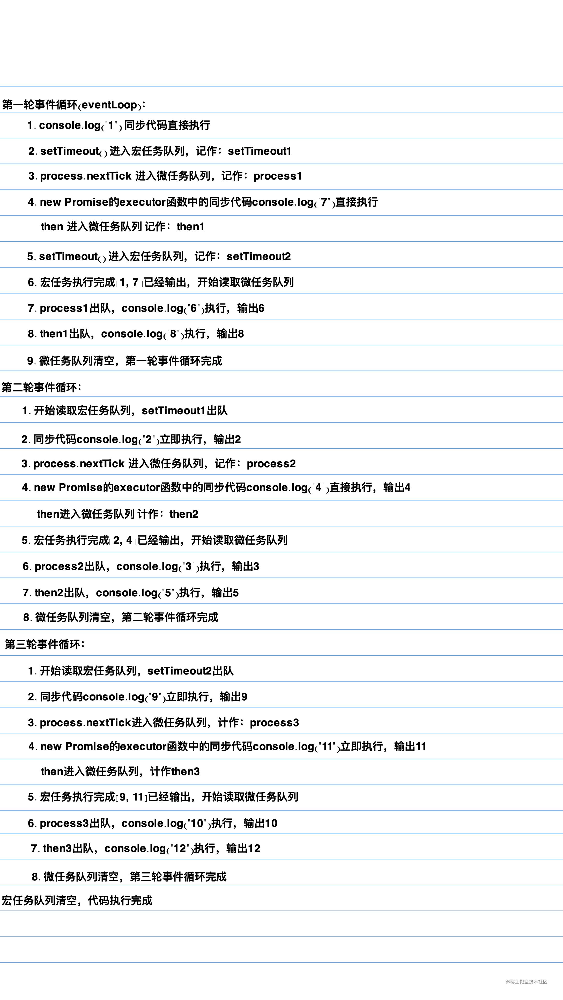
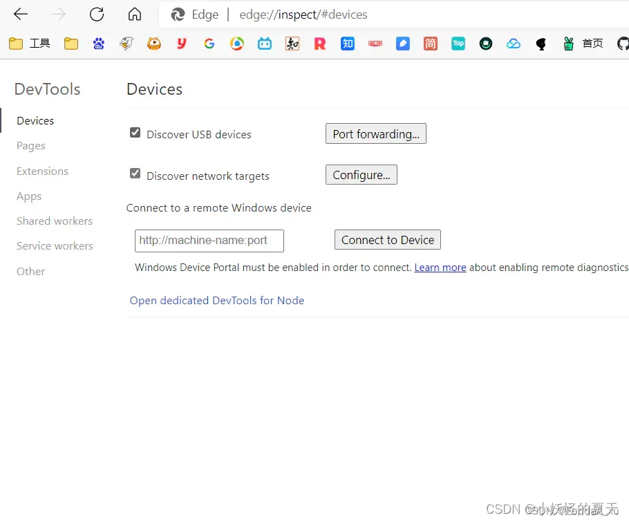

# 浏览器
## Cookie、sessionStorage 和 localStorage 的区别

在Web开发中，`Cookie`、`sessionStorage` 和 `localStorage` 是三种常见的客户端存储机制，它们各自有不同的用途和特点。以下是它们的区别和应用场景的详细解析：

::: details 展开查看

##### **一、基本概念**

1. **Cookie**：
    - **定义**：Cookie 是一种小型文本文件，由服务器生成并存储在客户端（浏览器）中。
    - **作用**：主要用于保存用户的会话信息（如登录状态、购物车内容等），并在每次请求时自动发送到服务器。
    - **大小限制**：每个 Cookie 的大小通常限制为 **4KB**。
    - **生命周期**：可以通过设置过期时间（`Expires` 或 `Max-Age`）来控制其有效期。如果未设置过期时间，则默认为会话级别的 Cookie，在浏览器关闭后会被清除。

2. **sessionStorage**：
    - **定义**：`sessionStorage` 是 HTML5 提供的一种客户端存储机制，数据仅在当前浏览器窗口或标签页中有效。
    - **作用**：用于临时保存数据，适合需要在页面刷新期间保留的状态信息。
    - **大小限制**：通常为 **5MB**（具体取决于浏览器）。
    - **生命周期**：数据在当前会话期间有效，当浏览器窗口或标签页关闭时，数据会被清除。

3. **localStorage**：
    - **定义**：`localStorage` 是 HTML5 提供的一种持久化存储机制，数据在客户端长期保存。
    - **作用**：用于保存用户偏好设置、缓存数据等需要长期存储的信息。
    - **大小限制**：通常为 **5MB**（具体取决于浏览器）。
    - **生命周期**：数据不会因为浏览器关闭而丢失，除非手动清除或通过代码删除。

---

##### **二、区别对比**

| 特性                  | **Cookie**                         | **sessionStorage**               | **localStorage**                 |
|-----------------------|-------------------------------------|-----------------------------------|----------------------------------|
| **存储位置**          | 客户端（浏览器）                   | 客户端（浏览器）                 | 客户端（浏览器）                |
| **存储大小**          | 4KB                                | 5MB                              | 5MB                             |
| **生命周期**          | 可设置过期时间，或随会话结束清除   | 随浏览器窗口或标签页关闭而清除   | 永久保存，直到手动清除或删除    |
| **是否自动发送到服务器** | 是（每次 HTTP 请求都会携带）        | 否                                | 否                               |
| **访问方式**          | 通过 JavaScript 或 HTTP 头部访问    | 仅限于当前窗口或标签页           | 跨窗口或标签页共享              |
| **安全性**            | 可能被篡改，需注意安全（如使用 HTTPS） | 相对安全                         | 相对安全                        |
| **典型应用场景**      | 用户会话管理、身份验证             | 页面刷新后的状态保持             | 用户偏好设置、离线缓存          |

---

##### **三、优缺点分析**


###### **1. Cookie**
- **优点**：
    - 支持跨域共享（通过 `Domain` 和 `Path` 属性）。
    - 可以设置过期时间，灵活性高。
    - 自动随 HTTP 请求发送到服务器，方便实现会话管理。
- **缺点**：
    - 存储容量小（仅 4KB）。
    - 每次请求都会携带 Cookie，增加网络开销。
    - 安全性较低，易受 XSS（跨站脚本攻击）和 CSRF（跨站请求伪造）攻击。

###### **2. sessionStorage**
- **优点**：
    - 数据仅在当前窗口或标签页中有效，避免了跨窗口干扰。
    - 存储容量较大（5MB）。
    - 不会随 HTTP 请求发送到服务器，减少网络开销。
- **缺点**：
    - 数据无法跨窗口共享。
    - 浏览器关闭后数据即被清除，不适合长期存储。

###### **3. localStorage**
- **优点**：
    - 数据永久保存，适合长期存储。
    - 存储容量较大（5MB）。
    - 不会随 HTTP 请求发送到服务器，减少网络开销。
    - 跨窗口或标签页共享数据。
- **缺点**：
    - 数据不会自动过期，可能导致存储冗余。
    - 安全性较低，易受 XSS 攻击。

---

##### **四、典型应用场景**

1. **Cookie**：
    - 用户登录状态的管理（如保存认证令牌）。
    - 个性化设置（如语言偏好）。
    - 购物车内容的临时存储。

2. **sessionStorage**：
    - 表单数据的临时存储（防止用户刷新页面时数据丢失）。
    - 单个页面内的状态管理（如分步表单的状态）。

3. **localStorage**：
    - 用户偏好设置（如主题颜色、字体大小）。
    - 离线应用的数据缓存（如文章内容、图片资源）。
    - 跨页面共享的数据存储（如全局配置信息）。

---

##### **五、代码示例**

###### **1. 使用 Cookie**
```javascript
// 设置 Cookie
document.cookie = "username=JohnDoe; expires=Fri, 31 Dec 2023 23:59:59 GMT; path=/";

// 获取 Cookie
console.log(document.cookie); // 输出所有 Cookie

// 删除 Cookie（设置过期时间为过去）
document.cookie = "username=; expires=Thu, 01 Jan 1970 00:00:00 GMT; path=/";
```

###### **2. 使用 sessionStorage**
```javascript
// 设置数据
sessionStorage.setItem("key", "value");

// 获取数据
console.log(sessionStorage.getItem("key")); // 输出 "value"

// 删除数据
sessionStorage.removeItem("key");

// 清空所有数据
sessionStorage.clear();
```

###### **3. 使用 localStorage**
```javascript
// 设置数据
localStorage.setItem("key", "value");

// 获取数据
console.log(localStorage.getItem("key")); // 输出 "value"

// 删除数据
localStorage.removeItem("key");

// 清空所有数据
localStorage.clear();
```

---

##### **六、总结**

- 如果需要存储少量数据并与服务器交互，选择 **Cookie**。
- 如果需要在当前窗口或标签页内临时存储数据，选择 **sessionStorage**。
- 如果需要长期存储数据且跨窗口共享，选择 **localStorage**。


:::


## 说下事件循环(Event Loop)

::: details 展开查看

1. 事件循环的理解

   因为 js 是单线程运行的，在代码执行时，通过将不同函数的执行上下文压入执行栈中来保证代码的有序执行。在执行同步代码时，如果遇到异步事件，js 引擎并不会一直等待其返回结果，而是会将这个事件挂起，继续执行执行栈中的其他任务。当异步事件执行完毕后，再将异步事件对应的回调加入到一个任务队列中等待执行。任务队列可以分为宏任务队列和微任务队列，当当前执行栈中的事件执行完毕后，js 引擎首先会判断微任务队列中是否有任务可以执行，如果有就将微任务队首的事件压入栈中执行。当微任务队列中的任务都执行完成后再去执行宏任务队列中的任务。

2. 单线程

   为什么javascript不设计成多线程的? 我们做个假设，如果javascript是多线程的，因为javascript有DOM API可以操作DOM，此时如果有两个线程在操作同一个DOM，线程1删除了这个DOM节点，线程2要操作这个DOM，就会产生矛盾，到底以哪个线程为主。

   为了避免这种情况的出现，javascript就被设计成了单线程 。

3. 宏任务和微任务

   宏任务有：

    - `script`整体代码
    - `setTimeout`、`setInterval`
    - I/O
    - UI渲染
    - `postMessage`
    - `MessageChannel`
    - `requestAnimationFrame`
    - `setImmediate`(Node 环境)

   微任务有：

    - `new Promise.then()`
    - `MutaionObserver`(监视对DOM树所做更改的能力)
    - `process.nextTick`(Node 环境)

4. 执行规则

   Event Loop的执行规则：

    - 所有代码作为宏任务进入主线程执行栈，开始执行
    - 执行过程中，同步代码会立即执行，宏任务进入宏任务队列，微任务进入微任务队列
    - 当前宏任务执行完成出队，读取微任务队列，有则执行，直至全部执行完毕
    - 执行浏览器UI进程渲染
    - 检查是否有web worker任务，有则执行
    - 本轮宏任务执行完成，回到第2步，继续执行，直至宏任务与微任务队列全部清空

5. 代码例子

    ```javascript
    console.log("1"); // 1 同步代码：立即执行 [1]
    
    setTimeout(function() {
      console.log("2"); // 3 同步代码执行执行 输出2
      process.nextTick(function() {
        console.log("3"); // 4 进入微任务队列 [3]
      });
      new Promise(function(resolve) {
        console.log("4"); // 3 同步代码执行执行 输出4
        resolve();
      }).then(function() {
        console.log("5"); // 4 进入微任务队列 [3, 5]
      });
    });
    
    process.nextTick(function() {
      console.log("6"); // 2 进入微任务队列 [6]
    });
    
    new Promise(function(resolve) {
      console.log("7"); // 1 宏任务：立即执行 [1, 7]
      resolve();
    }).then(function() {
      console.log("8"); // 2 进入微任务队列 [6, 8]
    });
    
    setTimeout(function() {
      console.log("9"); // 5 宏任务：立即执行 [9]
      process.nextTick(function() {
        console.log("10"); // 6 进入微任务队列 [10]
      });
      new Promise(function(resolve) {
        console.log("11"); // 5 宏任务：立即执行 [9, 11]
        resolve();
      }).then(function() {
        console.log("12"); // 6 进入微任务队列 [10, 12]
      });
    });
    
    // 执行顺序：1 7 6 8 2 4 3 5 9 11 10 12
    ```

   我们来分析下上述代码的执行顺序，如下图所示：

   


:::


参考资料

- [如何解释Event Loop面试官才满意？](https://zhuanlan.zhihu.com/p/72507900)


## 开发一个无限下拉加载图片的页面，如何给每个图片绑定 click 事件？

参考答案

::: details

使用 **事件委托** 实现，避免重复绑定事件，性能高，适合动态加载的场景。

代码示例

```html
<div id="image-container" style="height: 400px; overflow-y: scroll; border: 1px solid #ccc;">
  <!-- 加载图片 -->
</div>

<script>
  const container = document.getElementById('image-container')

  // 模拟 API 请求加载图片
  let page = 1 // 当前加载的页码
  const loadImages = () => {
    for (let i = 1; i <= 10; i++) {
      const img = document.createElement('img')
      img.src = `https://via.placeholder.com/150?text=Image+${(page - 1) * 10 + i}`
      img.style.margin = '10px'
      img.alt = `Image ${(page - 1) * 10 + i}`
      img.className = 'image-item' // 添加统一的类名
      container.appendChild(img)
    }
    page++
  }

  // 绑定父容器的 click 事件
  container.addEventListener('click', (event) => {
    if (event.target.tagName === 'IMG') {
      alert(`You clicked on ${event.target.alt}`)
    }
  })

  // 监听滚动事件，实现无限加载
  container.addEventListener('scroll', () => {
    if (container.scrollTop + container.clientHeight >= container.scrollHeight) {
      loadImages() // 加载更多图片
    }
  })

  // 初次加载图片
  loadImages()
</script>
```

以上代码中，我们把 `click` 事件统一绑定在 `container` 容器中，然后判断 `event.target.tagName === 'IMG'` 即触发事件。

:::


## 如何使用edge浏览器或chrome谷歌浏览器调试手机端网页（微信网页、浏览器皆可）


1、打开开发者选项中的USB调试功能（狂点“关于手机”中的版本号，然后返回到系统设置中就能看到开发者选项了，一定要打开USB调试功能！）

2、使用USB线连接电脑和手机，选择“传输文件”选项

3、打开edge浏览器或，输入网址：`edge://inspect/#devices`（若使用chrome谷歌浏览器，则输入网址：`chrome://inspect/#devices`）

4、进入到这个界面先不要慌，先等个5-10秒，下面就会出现各个浏览器中的网页



5、然后点击各个网页左下角的inspect就能进入调试页面了，注意：这里滚动鼠标滑轮进行上下翻页，手机端的页面也会跟着上下翻页，但是仅支持翻页，鼠标点击链接是没有任何反应的，调试仅支持单个页面


## **如何判断移动端设备**

### 🧠 方法详解与代码示例

#### 方法一：通过 User-Agent 判断（推荐基础方法）

```js
function isMobileDevice() {
  return /(phone|pad|pod|iPhone|iPod|ios|iPad|Android|Mobile|BlackBerry|IEMobile|MQQBrowser|JUC|Fennec|wOSBrowser|BrowserNG|WebOS|Symbian|Windows Phone)/i.test(navigator.userAgent);
}

console.log(isMobileDevice() ? '移动端' : '非移动端');
```

##### ✅ 优点：

- 实现简单，兼容性好；
- 可用于服务端渲染（SSR）判断；

##### ⚠️ 缺点：

- `userAgent` 可伪造；
- 无法区分平板和桌面设备（如 iPad Pro 和 Mac）；

---

#### 方法二：检测 `window.orientation` 是否存在

```js
function isMobileByOrientation() {
  return typeof window.orientation !== "undefined";
}

console.log(isMobileByOrientation() ? '可能是移动设备' : '可能不是移动设备');
```

##### ✅ 优点：

- 移动设备一般都支持屏幕旋转；
- 可作为辅助判断依据；

##### ⚠️ 缺点：

- 平板也可能有 orientation；
- 部分 PC 浏览器也模拟了 orientation；

---

#### 方法三：监听触摸事件（适用于交互逻辑）

```js
function isTouchDevice() {
  return 'ontouchstart' in window || navigator.maxTouchPoints > 0;
}

console.log(isTouchDevice() ? '支持触摸' : '不支持触摸');
```

##### ✅ 优点：

- 判断设备是否支持触摸；
- 可用于 UI 交互优化；

##### ⚠️ 缺点：

- 有些 Windows 笔记本也支持触摸；
- 不足以单独作为“移动端”判断标准；

---

#### 方法四：通过视口宽度判断（可用于响应式逻辑）

```js
function isMobileByWidth() {
  return window.innerWidth <= 768;
}

console.log(isMobileByWidth() ? '小屏幕设备' : '大屏幕设备');
```

##### ✅ 优点：

- 与响应式设计一致；
- 可结合 CSS 媒体查询统一处理；

##### ⚠️ 缺点：

- 宽度不能完全代表设备类型（如小屏笔记本）；
- 不适合用于功能判断，仅适合 UI 层面；

---

#### 方法五：综合判断（推荐做法）

你可以将多种方式结合，提高判断准确率：

```js
function isMobile() {
  const ua = navigator.userAgent || navigator.vendor || window.opera;

  return /Android|webOS|iPhone|iPad|iPod|BlackBerry|IEMobile|Opera Mini/i.test(ua) ||
         (typeof window.orientation !== "undefined") ||
         (navigator.maxTouchPoints && navigator.maxTouchPoints > 1);
}
```

---

### 📱 更细粒度判断（判断具体设备类型）

你可以进一步判断用户使用的具体设备平台：

```js
function getDeviceType() {
  const ua = navigator.userAgent;

  if (/iPhone|iPad|iPod/i.test(ua)) {
    return 'iOS';
  } else if (/Android/i.test(ua)) {
    return 'Android';
  } else if (/Windows/i.test(ua)) {
    return 'Windows';
  } else if (/Mac/i.test(ua)) {
    return 'Mac';
  } else if (/Linux/i.test(ua)) {
    return 'Linux';
  } else {
    return 'Unknown';
  }
}

console.log('当前设备平台:', getDeviceType());
```

---

### 📐 结合 CSS 媒体查询判断（适用于响应式）

你也可以通过 JS 获取 CSS 中定义的断点值来判断设备类型：

```html
<!-- HTML -->
<span id="mobile-check" style="display: none">mobile</span>
```

```css
@media only screen and (max-width: 768px) {
  #mobile-check {
    display: inline !important;
  }
}
```

```js
function isMobileByMediaQuery() {
  const el = document.getElementById('mobile-check');
  return window.getComputedStyle(el).display === 'inline';
}
```

---

### 🔍 进阶：使用第三方库（如 platform.js）

[platform.js](https://github.com/bestiejs/platform.js) 是一个轻量级库，可以解析完整的设备信息：

```bash
npm install platform
```

```js
import platform from 'platform';

console.log(platform.name);      // Chrome, Safari, Firefox...
console.log(platform.version);   // 120.0.0.0
console.log(platform.os);        // iOS 16.0.0
console.log(platform.product);   // iPhone
```

---


## **浏览器渲染流程详解**


好的，没问题。整合我们前面讨论的所有关键点，我将为您提供一份全面、结构清晰且深度足够的最终版回答。这份回答包含了从基础到精细的所有阶段，非常适合在面试中展现您对浏览器工作原理的系统性理解。

---

### 面试回答模板：浏览器渲染流程的完整解析（终极版）

关于浏览器的渲染流程，从宏观到微观，将其分解为一个包含 **6 个核心阶段**的完整链路。这个过程也被称为**关键渲染路径 (Critical Rendering Path, CRP)**，它描述了浏览器如何将我们编写的 HTML、CSS 和 JavaScript 代码最终转换为屏幕上可见的像素。

这六个核心阶段分别是：

1.  **解析 (Parsing)**：构建数据结构
2.  **样式计算 (Style)**：确定元素样式
3.  **布局 (Layout)**：计算元素几何信息
4.  **分层 (Layering)**：构建图层树
5.  **绘制 (Paint)**：生成绘制指令
6.  **合成 (Compositing)**：显示最终画面

下面我将逐一详细解读每个阶段，并阐明它们之间的联系。

---
### 渲染流程全景图

```
     HTML/CSS/JS     
          │
          ▼
[主线程 Main Thread]
 1. 解析 (Parse) ──────────> DOM 树 & CSSOM 树
          │
          ▼
 2. 样式计算 (Style) ─────> 每个节点获得最终样式
          │
          ▼
 3. 布局 (Layout/Reflow) ─> 生成布局树 (Layout Tree)，包含位置和大小
          │
          ▼
 4. 分层 (Layering) ──────> 生成图层树 (Layer Tree)
          │
          ▼
 5. 绘制 (Paint) ─────────> 为每个图层生成绘制指令列表 (Paint Records)
          │
          ▼ (Commit to Compositor Thread)
        
[合成线程 Compositor Thread & GPU]
 6. 合成 (Composite) 
     │   ├─ 分块 (Tiling)
     │   ├─ 光栅化 (Rasterization)
     └─  └─ 合成与显示 (Draw to Screen)
```

---

### 第一阶段：解析 (Parsing) - 构建 DOM 树 & CSSOM 树

*   **核心任务**：将代码文本转换为浏览器可操作的数据结构。
*   **输入**：HTML 文件、CSS 文件、JavaScript 文件。
*   **输出**：DOM 树 (Document Object Model) 和 CSSOM 树 (CSS Object Model)。
*   **解读**：
    1.  **DOM 树**：浏览器解析 HTML 文档，将标签、属性、文本等转换为节点（Node），并根据它们的嵌套关系构建起一棵树状结构，即 DOM 树。这个过程是渐进式的，无需等待整个文档加载完毕。
    2.  **CSSOM 树**：浏览器解析所有 CSS 来源（外部、内部、内联样式），构建一棵包含所有样式规则的树，即 CSSOM 树。它具有继承和层叠的特性。
*   **面试重点**：
    *   **CSSOM 构建会阻塞渲染**：在 CSSOM 树构建完成前，浏览器不会进入后续的布局阶段，因为样式未知，无法计算页面布局。
    *   **JS 执行会阻塞 DOM 解析**：当解析器遇到 `<script>` 标签（非 `async` 或 `defer`）时，会暂停 DOM 构建，优先执行 JS。这是因为 JS 可能会通过 `document.write()` 等 API 修改 DOM 结构。

### 第二阶段：样式计算 (Style)

*   **核心任务**：结合 DOM 树和 CSSOM 树，计算出每个 DOM 节点最终应用的具体样式。
*   **输入**：DOM 树、CSSOM 树。
*   **输出**：每个 DOM 节点都附加了其**计算样式 (Computed Style)**。
*   **解读**：浏览器遍历 DOM 树上的每个可见节点，根据 CSS 的层叠规则（优先级、继承等）和浏览器默认样式，确定每个节点最终显示出来的样式集合。例如，`color: red` 会被解析为 `color: rgb(255, 0, 0)`。

### 第三阶段：布局 (Layout)

*   **核心任务**：计算每个节点在设备视口内的精确位置和尺寸。
*   **输入**：带有计算样式的 DOM 节点。
*   **输出**：**布局树 (Layout Tree)**，也称渲染树 (Render Tree)。
*   **解读**：
    1.  浏览器会遍历 DOM 树，创建一个只包含**可见元素**的布局树。像 `<head>`、`script` 标签或 `display: none` 的元素会被忽略。
    2.  从布局树的根节点开始，浏览器递归地计算每个节点的几何信息（坐标、宽高、边距等）。这个过程也叫**回流 (Reflow)**。
*   **面试重点**：**回流**是性能开销极大的操作，任何改变元素几何属性的行为（如修改宽高、增删 DOM、移动元素位置、甚至读取 `offsetTop`）都会触发回流，可能导致整个页面的重新布局。

### 第四阶段：分层 (Layering)

*   **核心任务**：识别并创建独立的**合成层 (Compositing Layers)**，并生成一棵**图层树 (Layer Tree)**。这是现代浏览器性能优化的关键。
*   **输入**：布局树。
*   **输出**：图层树。
*   **解读**：主线程会遍历布局树，找到那些符合特定规则的节点，并将它们“提升”为独立的图层。
*   **触发条件**：
    *   具有 3D 变换（`transform: translateZ()`）或透视（`perspective`）属性。
    *   `will-change` 属性指定了将要变换的属性。
    *   视频（`<video>`）、画布（`<canvas>`）元素。
    *   `position: fixed` 定位元素。
    *   有 CSS 动画或过渡的 `opacity`、`transform`、`filter` 等。
*   **面试重点**：分层的意义在于**将变化隔离**。当某个图层的内容变化时，浏览器只需重绘这一个图层，而无需影响其他图层。特别是对于 `transform` 和 `opacity` 的变换，可以直接在 GPU 上完成，完全绕过主线程的布局和绘制，实现丝滑动画。同时需注意**避免图层爆炸**，过多的图层会消耗大量内存。

### 第五阶段：绘制 (Paint)

*   **核心任务**：为**每一个图层**生成绘制指令列表。
*   **输入**：图层树。
*   **输出**：**绘制记录 (Paint Records)**。
*   **解读**：主线程会遍历图层树，为每个图层生成一份详细的“绘画清单”。这份清单记录了如何绘制该图层的内容，比如“在(x,y)处画一个背景”、“在(x',y')处用什么字体写什么文字”等。这个阶段主线程只是在“计划”如何画，而不是真的在画。
*   **面试重点**：当只改变元素的非几何样式（如 `color`, `background-image`）时，会跳过布局阶段，直接进入绘制阶段，这个过程称为**重绘 (Repaint)**。其开销小于回流。

### 第六阶段：合成 (Compositing)

*   **核心任务**：将所有图层合成为最终的屏幕画面。这个阶段主要由**合成线程**和 **GPU** 负责，不阻塞主线程。
*   **输入**：图层树和绘制记录。
*   **输出**：屏幕上显示的像素。
*   **解读**：这一阶段可以细分为几个子步骤：
    1.  **提交 (Commit)**：主线程将图层树和绘制指令等信息提交给合成线程。
    2.  **分块 (Tiling)**：合成线程将每个图层（尤其是大图层）分割成多个小图块，以便优先处理视口内的内容。
    3.  **光栅化 (Rasterization)**：合成线程的**光栅化线程池**会将每个图块的绘制指令转换为位图（像素）。这个过程可以在 GPU 上**硬件加速**完成，效率极高。
    4.  **合成与显示**：合成线程收集所有光栅化后的图块，生成一个**合成器帧 (Compositor Frame)**，然后通过 GPU 将这些图块按照正确的位置、顺序和变换效果组合在一起，最终显示在屏幕上。

### 最终总结

整个流程是一个精心设计的协作系统：
*   **主线程**负责处理逻辑、样式和布局，产出渲染“蓝图”。
*   **合成线程与 GPU** 负责将“蓝图”高效地变为像素，并处理动画和滚动等高频交互。

理解这个流程，特别是回流、重绘、分层与合成的概念，是进行前端性能优化的理论基石。我们的优化目标就是：**减少主线程的工作，将耗时操作尽可能地交给合成线程处理**。


### 💡 实战应用场景与优化策略

### ✅ 正向案例（合理优化）

#### 1. 关键渲染路径优化
```html
<!DOCTYPE html>
<html>
<head>
  <!-- 内联关键CSS -->
  <style>
    .critical { /* 关键样式 */ }
  </style>
  <!-- 异步加载非关键CSS -->
  <link rel="stylesheet" href="non-critical.css" media="print" onload="this.media='all'">
</head>
<body>
  <!-- 关键内容 -->
  <div class="critical">首屏内容</div>
  
  <!-- 异步加载JS -->
  <script src="main.js" async></script>
</body>
</html>
```

#### 2. 避免强制同步布局
```javascript
// 反模式：读写交替
el.style.height = '200px';
console.log(el.offsetHeight); // 触发强制回流
el.style.width = '200px';
console.log(el.offsetWidth);  // 再次触发强制回流

// 正确模式：分离读写
el.style.height = '200px';
el.style.width = '200px';
// 所有样式变更后一次性读取
requestAnimationFrame(() => {
  console.log(el.offsetHeight, el.offsetWidth);
});
```

#### 3. 图层提升优化动画
```css
/* 优化前：触发重排 */
.slider {
  left: 0;
  transition: left 0.3s;
}

/* 优化后：仅触发合成 */
.slider {
  transform: translateX(0);
  transition: transform 0.3s;
  will-change: transform;
}
```

#### 4. 虚拟滚动优化长列表
```vue
<template>
  <!-- 优化前：直接渲染所有项 -->
  <div v-for="item in items" :key="item.id">{{ item.content }}</div>
  
  <!-- 优化后：虚拟滚动 -->
  <virtual-list 
    :size="80" 
    :keeps="30"
    :item-count="items.length">
    <template #default="{ index }">
      <div class="list-item" :style="{ height: getItemHeight(index) + 'px' }">
        {{ items[index].content }}
      </div>
    </template>
  </virtual-list>
</template>
```

### ❌ 反模式（常见误用）

#### 1. 频繁触发重排重绘
```javascript
// 反模式：循环中修改样式
for (let i = 0; i < items.length; i++) {
  items[i].style.width = i * 10 + 'px';
  items[i].style.height = i * 10 + 'px';
  // 每次修改都触发重排
}

// 优化：使用CSS类或requestAnimationFrame
items.forEach((item, i) => {
  item.classList.add('item-' + i);
});
```

#### 2. 过度使用!important
```css
/* 反模式：大量使用!important */
.container {
  width: 100% !important;
}

.container .item {
  margin: 10px !important;
}

/* 问题：样式计算时间增加，维护困难 */

/* 优化：使用BEM命名规范 */
.container {
  width: 100%;
}

.container__item {
  margin: 10px;
}
```

#### 3. 未考虑CSS选择器性能
```css
/* 反模式：低效选择器 */
body div ul li a span.highlight {
  /* ... */
}

/* 问题：浏览器从右向左匹配，效率低 */

/* 优化：扁平化选择器 */
.highlight {
  /* ... */
}
```

---

## 📌 模拟追问准备

### Q：重排(Reflow)和重绘(Repaint)有什么区别？如何避免？
> **A**：这是渲染性能的核心概念，需要深入理解：
> 
> **重排(Reflow)**：
> - **定义**：当DOM元素的几何属性变化时，需要重新计算元素位置和几何属性
> - **触发条件**：
>   - DOM结构变化（添加/删除元素）
>   - 元素尺寸或位置变化
>   - 内容变化（文本或图片大小）
>   - 窗口大小调整
>   - 计算`offsetTop`、`clientWidth`等布局属性
> - **影响范围**：可能影响整个文档或部分渲染树
> - **性能开销**：高（涉及布局计算）
> 
> **重绘(Repaint)**：
> - **定义**：当元素样式变化但不影响几何属性时，需要重新绘制
> - **触发条件**：
>   - 颜色变化（`color`、`background-color`）
>   - 可见性变化（`visibility`）
>   - 文本样式变化（`font-size`不影响布局时）
> - **影响范围**：仅影响被修改的元素及其子元素
> - **性能开销**：中（仅绘制阶段）
> 
> **关键区别**：
> ```
> ┌───────────────────────┬───────────────────────┐
> │        重排           │        重绘           │
> ├───────────────────────┼───────────────────────┤
> │ 影响几何属性           │ 仅影响外观属性         │
> │ 重新计算布局           │ 无需重新布局           │
> │ 通常导致重绘           │ 不会导致重排           │
> │ 性能开销高             │ 性能开销中             │
> └───────────────────────┴───────────────────────┘
> ```
> 
> **避免策略**：
> 1. **分离读写操作**：
>    ```javascript
>    // 反模式：读写交替
>    el.style.height = '200px';
>    console.log(el.offsetHeight); // 触发重排
>    
>    // 正确模式：分离读写
>    el.style.height = '200px';
>    el.style.width = '200px';
>    requestAnimationFrame(() => {
>      console.log(el.offsetHeight);
>    });
>    ```
> 
> 2. **使用transform和opacity**：
>    ```css
>    /* 触发重排 */
>    .element {
>      left: 100px;
>      top: 100px;
>    }
>    
>    /* 仅触发合成 */
>    .element {
>      transform: translate(100px, 100px);
>    }
>    ```
> 
> 3. **批量DOM操作**：
>    ```javascript
>    // 反模式：多次DOM操作
>    const container = document.getElementById('container');
>    for (let i = 0; i < 100; i++) {
>      const item = document.createElement('div');
>      container.appendChild(item);
>    }
>    
>    // 优化：使用DocumentFragment
>    const fragment = document.createDocumentFragment();
>    for (let i = 0; i < 100; i++) {
>      const item = document.createElement('div');
>      fragment.appendChild(item);
>    }
>    container.appendChild(fragment);
>    ```
> 
> 4. **使用CSS Containment**：
>    ```css
>    /* 隔离组件的布局、样式和绘制 */
>    .component {
>      contain: layout style paint;
>    }
>    ```
> 

### Q：浏览器如何处理CSS选择器的匹配？如何编写高性能CSS？
> **A**：CSS选择器匹配机制是性能优化的关键，了解它能帮助编写更高效的CSS：
> 
> **浏览器选择器匹配原理**：
> 1. **从右向左匹配**：浏览器从选择器最右边开始匹配
> 2. **匹配过程**：
>    - 从DOM树的叶子节点开始
>    - 逐级向上检查是否匹配选择器
>    - 如果匹配失败，跳过整个子树
> 
> **匹配示例**：
> ```css
> /* 选择器：div.container ul li a */
> ```
> 
> **匹配过程**：
> 1. 找到所有`a`元素（最右边）
> 2. 检查每个`a`的父元素是否是`li`
> 3. 检查`li`的父元素是否是`ul`
> 4. 检查`ul`的父元素是否是`div`且有`container`类
> 
> **高性能CSS编写原则**：
> 
> **1. 避免通用选择器**：
> ```css
> /* 反模式：低效 */
> * { box-sizing: border-box; }
> 
> /* 优化：限制范围 */
> html, body, div, span, applet, ... {
>   box-sizing: border-box;
> }
> ```
> 
> **2. 减少选择器嵌套深度**：
> ```css
> /* 反模式：嵌套过深 */
> .header .nav .menu .item a span {
>   /* ... */
> }
> 
> /* 优化：扁平化结构 */
> .menu-item-link {
>   /* ... */
> }
> ```
> 
> **3. 避免ID选择器和!important**：
> ```css
> /* 反模式：高特异性 */
> #main .content > div:first-child {
>   /* ... */
> }
> 
> /* 优化：使用类选择器 */
> .main-content-first {
>   /* ... */
> }
> ```
> 
> **4. 使用BEM命名规范**：
> ```css
> /* 传统命名：难以维护 */
> .button { /* ... */ }
> .button-primary { /* ... */ }
> 
> /* BEM命名：清晰高效 */
> .btn { /* 块 */ }
> .btn--primary { /* 元素修饰符 */ }
> .btn__icon { /* 块内元素 */ }
> ```
> 
> **5. 限制样式作用域**：
> ```css
> /* 反模式：全局影响 */
> ul li a { /* ... */ }
> 
> /* 优化：组件化作用域 */
> .product-list ul li a { /* ... */ }
> ```
> 
> **性能测试数据**：
> | 选择器类型 | 匹配时间 | 推荐使用 |
> |------------|----------|----------|
> | ID选择器 | 1x | 少用 |
> | 类选择器 | 2x | 推荐 |
> | 标签选择器 | 3x | 限制使用 |
> | 属性选择器 | 4x | 谨慎使用 |
> | 伪类选择器 | 5x | 谨慎使用 |
> | 通用选择器 | 10x | 避免 |
> 
> **最佳实践**：
> 1. 保持选择器简洁（≤3级）
> 2. 避免使用通配符选择器
> 3. 使用CSS变量减少重复
> 4. 使用`contain`属性隔离组件
> 5. 定期清理未使用的CSS

---
### ⚡ 高级优化技巧

**CSS Containment应用**：
```css
/* 隔离组件的布局、样式和绘制 */
.component {
  contain: layout style paint;
  /* 或根据需要选择 */
  /* contain: content; */
  /* contain: strict; */
}

/* 按需隔离 */
.sidebar {
  contain: layout;
}

.card {
  contain: paint;
}
```

**渲染性能监控**：
```javascript
// 监控布局抖动
let lastLayoutTime = 0;
const observer = new PerformanceObserver(list => {
  for (const entry of list.getEntries()) {
    if (entry.name === 'Layout') {
      const timeSinceLast = entry.startTime - lastLayoutTime;
      if (timeSinceLast < 16) { // 小于1帧
        console.warn('Forced synchronous layout', entry);
      }
      lastLayoutTime = entry.startTime;
    }
  }
});

observer.observe({ entryTypes: ['measure', 'layout-shift'] });
```

**渲染优先级管理**：
```javascript
// 低优先级任务
requestIdleCallback(() => {
  // 非关键渲染任务
  processAnalytics();
});

// 高优先级动画
const animate = () => {
  // 使用requestAnimationFrame确保60fps
  requestAnimationFrame(animate);
  // 动画逻辑
};
animate();
```


### 🚀 渲染优化最佳实践清单

#### ✅ 七大黄金准则

1. **优化关键渲染路径**
   ```html
   <!DOCTYPE html>
   <html>
   <head>
     <!-- 内联关键CSS -->
     <style>/* 首屏关键样式 */</style>
     <!-- 异步加载非关键CSS -->
     <link rel="stylesheet" href="main.css" media="print" onload="this.media='all'">
   </head>
   <body>
     <!-- 首屏内容 -->
     
     <!-- 异步加载JS -->
     <script src="main.js" defer></script>
   </body>
   </html>
   ```

2. **避免强制同步布局**
   ```javascript
   // 反模式：读写交替
   el.style.height = '200px';
   console.log(el.offsetHeight);
   
   // 正确模式：分离读写
   el.style.height = '200px';
   el.style.width = '200px';
   requestAnimationFrame(() => {
     console.log(el.offsetHeight);
   });
   ```

3. **使用transform和opacity**
   ```css
   /* 触发重排 */
   .element {
     left: 100px;
     top: 100px;
   }
   
   /* 仅触发合成 */
   .element {
     transform: translate(100px, 100px);
   }
   ```

4. **合理使用图层**
   ```css
   /* 提升为单独图层 */
   .animated-element {
     transform: translateZ(0);
     will-change: transform, opacity;
   }
   
   /* 避免过度创建图层 */
   .non-animated {
     will-change: auto;
   }
   ```

5. **CSS选择器优化**
   ```css
   /* 反模式：低效选择器 */
   body div ul li a span.highlight { /* ... */ }
   
   /* 优化：扁平化选择器 */
   .highlight { /* ... */ }
   
   /* 使用BEM命名 */
   .card { /* 块 */ }
   .card__title { /* 元素 */ }
   .card--featured { /* 修饰符 */ }
   ```

6. **资源加载优化**
   ```html
   <!-- DNS预解析 -->
   <link rel="dns-prefetch" href="//cdn.example.com">
   
   <!-- 连接预取 -->
   <link rel="preconnect" href="//cdn.example.com">
   
   <!-- 资源预加载 -->
   <link rel="preload" href="critical.js" as="script">
   
   <!-- 资源预取 -->
   <link rel="prefetch" href="next-page.html" as="document">
   ```

7. **性能监控与持续优化**
   ```javascript
   // Web Vitals监控
   import { getLCP, getFID, getCLS } from 'web-vitals';
   
   getLCP(console.log);
   getFID(console.log);
   getCLS(console.log);
   
   // 布局抖动检测
   let lastLayoutTime = 0;
   const observer = new PerformanceObserver(list => {
     // 处理布局性能数据
   });
   observer.observe({ entryTypes: ['layout-shift'] });
   ```


## **什么是浏览器资源提示词？有什么作用**

### 面试回答模板：

面试官您好，资源提示（Resource Hints）是 W3C 定义的一系列标准，允许我们开发者通过简单的 `link` 标签，向浏览器提供关于“未来”资源请求的“提示”，从而让浏览器能够更智能地进行预加载和预连接，显著优化页面加载性能，尤其是降低关键资源的请求延迟。

可以将这些提示理解为我们给浏览器开的“小灶”，让它提前完成一些耗时的工作。主要有以下四种：

1.  `dns-prefetch`：DNS 预解析
2.  `preconnect`：预连接
3.  `preload`：预加载（当前页面使用）
4.  `prefetch`：预拉取（未来页面使用）

下面我将逐一详细解读它们。

---

### 1. `dns-prefetch`：DNS 预解析

*   **核心作用**：提前完成对目标域名（Origin）的 DNS 查询。
*   **工作原理**：当浏览器解析到这个 `link` 标签时，它会在后台对 `href` 中指定的域名发起一次 DNS 查询，并将结果缓存起来。当后续代码（如 CSS、JS、图片）真正请求这个域名的资源时，就可以跳过耗时的 DNS 查询阶段（通常耗时 20-120ms），直接进入后续的 TCP 连接。
*   **使用场景**：适用于那些**当前页面马上不会用到，但稍后大概率会用到**的第三方域名。例如：
    *   图片、静态资源的 CDN 域名。
    *   第三方统计分析服务（如 Google Analytics）的域名。
    *   字体服务的域名。
*   **语法示例**：
    ```html
    <link rel="dns-prefetch" href="https://fonts.gstatic.com">
    <link rel="dns-prefetch" href="https://your-cdn-provider.com">
    ```
*   **面试重点**：这是开销最低的资源提示，非常“便宜”，可以放心对多个域名使用。现代浏览器可能还会自动对页面中的域名进行 DNS 预解析，但显式声明可以覆盖所有情况，确保最佳效果。

### 2. `preconnect`：预连接

*   **核心作用**：不仅完成 DNS 查询，还进一步建立 TCP 连接和进行 TLS 握手。
*   **工作原理**：它完成了 `dns-prefetch` 的所有工作，并继续和服务端建立 TCP 连接（三次握手），如果站点是 HTTPS 的，还会完成 TLS 协商。这一整套连接建立的过程可能耗费几百毫秒。`preconnect` 能将这部分时间提前。
*   **使用场景**：适用于那些**很快就会请求关键资源**的核心域名。一旦连接建立，请求就可以立即发送。
    *   Google Fonts 的 CSS 文件所在的域名（`fonts.googleapis.com`）。
    *   应用依赖的核心 API 服务器域名。
*   **语法示例**：
    ```html
    <!-- 对于跨域资源，尤其是字体、JS模块等，需要加上 crossorigin 属性 -->
    <link rel="preconnect" href="https://fonts.googleapis.com" crossorigin>
    <link rel="preconnect" href="https://api.your-app.com" crossorigin>
    ```
*   **面试重点**：`preconnect` 的开销比 `dns-prefetch` 大得多，因为它会占用服务器和客户端的资源来维持一个打开的连接。**请谨慎使用，只对 1-2 个最关键的域名使用**。如果预连接后 10 秒内未使用，浏览器会关闭它，造成资源浪费。

### 3. `preload`：预加载（当前页面）

*   **核心作用**：以**高优先级**提前获取一个**明确的、当前页面一定会用到**的资源，并将其放入内存缓存。
*   **工作原理**：它告诉浏览器：“这个资源对当前页面的初次渲染至关重要，请立即以高优先级下载它，不要等解析器发现它。”浏览器会立即发起请求，下载后不执行，只是缓存。当解析器后续需要这个资源时，可以直接从缓存中读取，实现“零延迟”。
*   **使用场景**：用于加载那些被“隐藏”得比较深，但对首屏渲染很重要的资源。
    *   由 CSS 文件 `@font-face` 定义的字体文件（`.woff2`）。
    *   由 CSS `background-image` 定义的首屏背景图。
    *   异步加载的 JavaScript 脚本（如 Webpack 分割出的核心业务代码）。
*   **语法示例**：
    ```html
    <!-- `as` 属性是必须的，它告诉浏览器资源的类型，以便正确设置优先级和内容安全策略 -->
    <link rel="preload" href="style.css" as="style">
    <link rel="preload" href="main.js" as="script">
    <link rel="preload" href="font.woff2" as="font" type="font/woff2" crossorigin>
    ```
*   **面试重点**：
    *   **必须使用 `as` 属性**，否则浏览器可能无法正确处理。
    *   这是“强制性”的提示，浏览器**必须**加载。如果预加载了资源但页面最终未使用，控制台会报警告，并造成带宽浪费。
    *   滥用 `preload` 可能会挤占其他关键资源的带宽，反而降低性能。**务必只对影响 LCP (Largest Contentful Paint) 或 FCP (First Contentful Paint) 的资源使用**。

### 4. `prefetch`：预拉取（未来页面）

*   **核心作用**：以**低优先级**在浏览器空闲时，提前获取**未来导航可能会用到**的资源。
*   **工作原理**：它告诉浏览器：“我猜用户下一步可能会访问某个页面，那个页面会用到这个资源。如果你现在不忙，可以顺便把它下载下来。”浏览器会在核心资源加载完毕后，利用空闲带宽去下载这些资源。
*   **使用场景**：优化后续页面的加载体验。
    *   用户在商品列表页，预拉取商品详情页需要的核心 JS 或 CSS。
    *   分页列表的第二页数据。
    *   用户将鼠标悬停在某个链接上时，动态插入 `prefetch` 标签。
*   **语法示例**：
    ```html
    <link rel="prefetch" href="next-page.js" as="script">
    ```
*   **面试重点**：`prefetch` 是“提示性”的，浏览器**不一定**会执行。它的优先级非常低，绝不会与当前页面的关键资源抢占带宽。它非常适合优化多页面应用（MPA）的跳转体验。

---
### 总结与对比

| `rel` 属性 | 作用范围 | 优先级 | 作用对象 | 面试金句 |
| :--- | :--- | :--- | :--- | :--- |
| `dns-prefetch` | **域名** | 低 | 未来请求 | **“只探路，不建桥”**，开销最小，广撒网。 |
| `preconnect` | **域名** | 高 | 即将请求 | **“探路并建好桥”**，开销较大，请精准打击核心域名。 |
| `preload` | **具体资源** | 高 | **当前页面** | **“C位出道，必须加载”**，用于提升首屏关键资源，用错会帮倒忙。 |
| `prefetch` | **具体资源** | 最低 | **未来页面** | **“佛系加载，优化后路”**，用于提升后续导航体验，不影响当前。 |

正确地运用这些资源提示，是衡量一个前端工程师是否具备深度性能优化能力的重要指标。在项目中，我会结合 Chrome DevTools 的 Network 面板和性能分析工具，来识别关键资源并决定使用哪种提示策略。


## **深度解析 `<script>` 的 `async` 与 `defer`**


### 面试回答模板：深度解析 `<script>` 的 `async` 与 `defer`

面试官您好，`async` 和 `defer` 是 `<script>` 标签的两个布尔属性，它们的核心目标是解决同一个问题：**如何加载 JavaScript 而不阻塞 HTML 文档的解析**，从而提升页面加载性能和用户体验。

为了更好地理解它们，我们首先要明确**默认行为**是什么。

#### 1. 默认行为（无属性）

当浏览器在解析 HTML 时遇到一个普通的 `<script src="..."></script>` 标签，它会：
1.  **暂停** HTML 解析。
2.  **下载**脚本文件。
3.  **执行**脚本文件。
4.  下载和执行完毕后，再**恢复** HTML 解析。

这个过程是**完全同步和阻塞的**，如果脚本很大或者网络很慢，用户将长时间看到一个白屏，体验极差。

#### 图解对比

为了更直观地理解，我们可以用一个时间线图来表示：

```
HTML Parsing:  ═══════════╗               ╔═════════════...
JS Download:              ╚═══════════════╝
JS Execute:                             ╚═══════════╝
```
*(注：`═` 代表进行中, `╗╚` 代表暂停和恢复点)*

---

### 2. `defer`：延迟执行的乖孩子

`defer` 属性告诉浏览器：“你可以继续解析 HTML，同时在后台**异步下载**这个脚本。等整个 HTML 文档解析完成后（在 `DOMContentLoaded` 事件触发之前），再**按照它们在文档中出现的顺序**来执行这些脚本。”

*   **核心特性**：
    *   **异步下载**：脚本的下载不会阻塞 HTML 解析。
    *   **延迟执行**：脚本会等到整个 HTML 文档解析完毕后才执行。
    *   **顺序保证**：`defer` 脚本会严格按照它们在 HTML 中出现的顺序来执行。

*   **图解 `defer`**：
    ```
    HTML Parsing:  ══════════════════════════════════════╗ (Parsing Done)
    JS Download:    └─────────────────┘                  ║
    JS Execute:                                          ╚═══════╝ (Before DOMContentLoaded)
    ```

*   **使用场景**：
    *   当脚本依赖于完整的 DOM 结构时（例如，需要操作页面上的所有元素）。
    *   当多个脚本之间有依赖关系，需要保证执行顺序时。
    *   **这是现代 Web 开发中加载 JavaScript 的首选和最推荐的方式。**

*   **面试金句**：“`defer` 就像让工人们（脚本）先把材料（代码）运到工地，但要求他们必须等房子主体结构（DOM）建好后，再按照进场顺序依次进行装修。”

---

### 3. `async`：独立自主的急性子

`async` 属性告诉浏览器：“你可以继续解析 HTML，同时在后台**异步下载**这个脚本。一旦下载完成，就**立即暂停 HTML 解析并执行**它，执行完毕后再恢复解析。”

*   **核心特性**：
    *   **异步下载**：脚本的下载不会阻塞 HTML 解析。
    *   **立即执行**：下载完成后会立即执行，可能会在 HTML 文档解析完成之前。
    *   **顺序不保证**：多个 `async` 脚本的执行顺序是不可预测的，哪个先下载完就哪个先执行。它们是“乱序”的。

*   **图解 `async`**：
    ```
    HTML Parsing:  ══════════════╗          ╔════════════...
    JS Download:    └────────────╝
    JS Execute:                  ╚══════════╝
    ```

*   **使用场景**：
    *   适用于那些完全**独立、无依赖**的脚本。
    *   脚本不需要访问或操作 DOM。
    *   脚本的执行时机不重要。
    *   最典型的例子：第三方分析脚本（Google Analytics）、广告脚本、网站统计脚本等。

*   **面试金句**：“`async` 就像请来的外援（第三方脚本），他们自己带材料，自己找时间干活，干完就走，不参与主体工程的流程，也不会等别人。”

---

### 终极对比表格

这张表格是您回答的精华，可以清晰地展示您的掌握程度。

| 特性 | 默认 (无属性) | `async` | `defer` |
| :--- | :--- | :--- | :--- |
| **HTML 解析** | 下载和执行时**阻塞** | 下载时不阻塞，执行时**阻塞** | 下载和执行时都**不阻塞**¹ |
| **脚本下载** | 同步 | **异步** | **异步** |
| **执行时机** | 下载后立即执行 | 下载后立即执行 | HTML 解析完毕后，`DOMContentLoaded` 前 |
| **执行顺序** | 按文档顺序 | **乱序，谁先下完谁先执行** | **按文档顺序** |
| **适用场景** | 已不推荐使用 | 独立无依赖的第三方脚本 | 依赖 DOM 或有顺序依赖的业务脚本 |
| **最佳实践** | 避免 | 谨慎用于广告、分析 | **绝大部分场景下的首选** |

¹ *严格来说，`defer`脚本的执行是在HTML解析完成之后，所以它不会阻塞解析过程本身。*

### 补充面试加分点

*   **如果一个脚本同时有 `async` 和 `defer` 属性会怎样？**
    *   根据 W3C 标准，`async` 的优先级更高。如果浏览器支持 `async`，则会忽略 `defer`。对于不支持 `async` 的旧浏览器，`defer` 会生效，起到优雅降级的作用。

*   **`type="module"` 的脚本呢？**
    *   现代浏览器中，使用 `type="module"` 的脚本默认行为就像加了 `defer` 一样：异步下载，且按顺序在文档解析后执行。这是模块化开发带来的一个便利。
*   


## **浏览器的缓存**

### 面试回答模板：深度解读浏览器缓存机制

面试官您好，浏览器缓存是前端性能优化的核心手段，它通过将资源副本存储在客户端，减少了网络请求，降低了服务器压力，并极大地提升了用户体验。

我可以将浏览器缓存机制主要分为两大类：**HTTP 缓存** 和 **其他浏览器缓存**。其中，HTTP 缓存是重点，它完全由 HTTP 协议头来控制。

我将按照浏览器发起请求时，检查缓存的优先级顺序来详细阐述。

### 一、HTTP 缓存 (HTTP Cache)

这是最主要的缓存策略，其决策逻辑都定义在 HTTP 的请求头（Request Headers）和响应头（Response Headers）中。它又分为两大类：**强缓存** 和 **协商缓存**。

#### 1. 强缓存 (Strong Cache)

**核心思想：** 在缓存有效期内，浏览器**不向服务器发送任何请求**，直接从本地缓存中读取资源。这是最快的缓存方式。

**如何控制：** 由服务器在响应头中设置，主要有两个字段：`Expires` 和 `Cache-Control`。

*   **`Expires` (HTTP/1.0)**
    *   **原理**：它是一个绝对时间的 GMT 格式字符串（如 `Expires: Wed, 22 Oct 2028 08:00:00 GMT`）。它告诉浏览器，在此时间点之前，该资源都是有效的，可以直接使用缓存。
    *   **缺点**：它的有效性依赖于客户端本地时间。如果用户本地时间不准确，可能会导致缓存提前失效或长时间不更新。

*   **`Cache-Control` (HTTP/1.1) - 优先使用**
    *   **原理**：它是一个相对时间，通过 `max-age` 字段（单位为秒）来控制。例如 `Cache-Control: max-age=3600` 表示该资源在获取后的 3600 秒（1小时）内有效。
    *   **优点**：它解决了 `Expires` 对本地时间的依赖问题，是更精确和推荐的控制方式。如果 `Cache-Control` 和 `Expires` 同时存在，**`Cache-Control` 的优先级更高**。
    *   **常用指令值**:
        *   `public`：表明响应可以被任何对象（包括浏览器、代理服务器等）缓存。
        *   `private`：只能被最终用户的浏览器缓存，不允许中间代理缓存。
        *   **`no-cache`**：**易混淆点！** 它**不是不缓存**，而是跳过强缓存，**强制进入协商缓存**阶段。即每次都必须向服务器询问资源是否过期。
        *   **`no-store`**：**这才是不做任何缓存**。浏览器不会缓存这个响应的任何内容。

#### 2. 协商缓存 (Negotiation Cache)

**核心思想：** 当强缓存失效后（或者 `Cache-Control` 设置为 `no-cache`），浏览器必须向服务器发送一个“询问”请求，由服务器来判断本地缓存的资源是否仍然可用。

**工作流程：**
1.  浏览器在请求头中携带缓存标识。
2.  服务器根据标识判断资源是否有更新。
3.  如果未更新，服务器返回 **`304 Not Modified`** 状态码，并且响应体为空。浏览器收到后直接使用本地缓存。
4.  如果已更新，服务器返回 **`200 OK`** 状态码，并附带最新的资源内容。

协商缓存由两组请求/响应头来控制：

*   **`Last-Modified` / `If-Modified-Since`**
    *   **流程**：
        1.  **首次请求**：服务器在响应头返回 `Last-Modified` 字段，表示资源的最后修改时间。
        2.  **再次请求**：浏览器将这个时间作为请求头 `If-Modified-Since` 的值发送给服务器。
        3.  **服务器对比**：服务器比较接收到的时间和资源的实际最后修改时间。如果一致，返回 `304`；如果不一致，返回 `200` 和新资源。
    *   **缺点**：
        *   时间精度只能到秒，如果在同一秒内文件被多次修改，无法检测到变化。
        *   某些服务器上，文件内容没变，但修改时间可能因为某些操作而改变，导致不必要的重新传输。

*   **`ETag` / `If-None-Match` - 优先使用**
    *   **流程**：
        1.  **首次请求**：服务器基于资源内容生成一个唯一的标识符（Entity Tag，类似指纹），通过 `ETag` 响应头返回。例如 `ETag: "abcdef123456"`。
        2.  **再次请求**：浏览器将这个 `ETag` 值作为请求头 `If-None-Match` 的值发送出去。
        3.  **服务器对比**：服务器比较接收到的 `ETag` 和当前资源的 `ETag`。如果一致，返回 `304`；如果不一致，返回 `200` 和新资源。
    *   **优点**：`ETag` 是**基于内容**的，比 `Last-Modified` 更精确，完美解决了其所有缺点。如果 `ETag` 和 `Last-Modified` 同时存在，**`ETag` 优先级更高**。

#### HTTP 缓存决策流程图

当浏览器请求一个资源时，会按以下顺序决策：


1.  检查 `Cache-Control` 是否为 `no-store`？是，则不缓存，直接请求新资源。
2.  检查强缓存：`Cache-Control` 的 `max-age` 或 `Expires` 是否过期？否，则直接使用缓存（`200 OK (from memory/disk cache)`），流程结束。
3.  检查协商缓存：
    *   向服务器发送请求，携带 `If-None-Match (ETag)` 和 `If-Modified-Since (Last-Modified)`。
    *   服务器判断资源是否更新：
        *   未更新，返回 `304 Not Modified`，浏览器使用本地缓存。
        *   已更新，返回 `200 OK` 和新资源，浏览器更新本地缓存。

---

### 二、其他浏览器缓存

除了由 HTTP 协议控制的缓存外，浏览器自身还有其他存储机制，也可广义地看作缓存。

#### 1. 内存缓存 (Memory Cache)

*   **位置**：存储在**内存**中。
*   **特性**：
    *   **读取速度最快**。
    *   **生命周期短**：当页面关闭时，内存中的缓存就会被释放。
*   **缓存内容**：浏览器会把一些体积小但使用频繁的资源（如 Base64 图片、小脚本）优先放入内存。预加载（preload）的资源也通常会放入内存缓存。

#### 2. 磁盘缓存 (Disk Cache)

*   **位置**：存储在**硬盘**上。
*   **特性**：
    *   **读取速度比内存慢，但比网络快得多**。
    *   **持久性长**：覆盖范围广，可跨站点、跨会话共享。
    *   **容量大**：可以存储各种类型和大小的文件。
*   **缓存内容**：绝大部分的 HTTP 缓存内容都存储在这里。

> **内存缓存与磁盘缓存的关系**：当浏览器访问一个资源时，会优先在内存中查找，如果命中则直接使用。如果内存中没有，再去磁盘中查找。如果磁盘中命中（且强缓存有效），则使用它并可能将其加载进内存以备下次快速访问。

#### 3. Service Worker Cache

*   **位置**：独立于浏览器，可以看作一个可编程的网络代理。
*   **特性**：
    *   **开发者完全控制**：我们可以用 JavaScript 代码来决定缓存哪些文件、定义自己的缓存策略（如 Cache-First, Network-First, Stale-While-Revalidate 等）。
    *   **可离线工作**：即使在离线状态下，Service Worker 也能拦截请求并从其管理的缓存中返回响应，这是实现 PWA（渐进式 Web 应用）的关键。
    *   **持久性**：除非手动清除或代码更新，否则会一直存在。

#### 4. Push Cache (HTTP/2)

*   **位置**：这是一个会话级别的缓存，与 Memory Cache 类似但有所不同。
*   **特性**：当一个 HTTP/2 连接关闭时，Push Cache 会被清空。它只在当前会话中有效。
*   **缓存内容**：由服务器通过 **Server Push** 主动推送过来的资源。但由于其实现复杂性和收益不确定性，目前已不被广泛推荐。

---

### 总结与最佳实践

| 缓存类型 | 控制方式 | 位置 | 优先级 | 特点 |
| :--- | :--- | :--- | :--- | :--- |
| **强缓存** | HTTP 头 (`Cache-Control`) | 内存/磁盘 | 最高 | 无需请求，最快 |
| **协商缓存** | HTTP 头 (`ETag`, `Last-Modified`) | 磁盘 | 次之 | 需一次请求确认，传输快 |
| **内存缓存** | 浏览器自动决策 | 内存 | - | 读写极快，生命周期短 |
| **Service Worker** | JavaScript 代码 | 独立存储 | 最高（在 SW 激活后） | 开发者完全控制，支持离线 |

**日常开发的缓存策略建议：**

*   **频繁变动的资源 (HTML)**：使用 `Cache-Control: no-cache`，使其进入协商缓存，保证用户总能获取到最新的页面结构入口。
*   **不常变动的资源 (带哈希的 CSS, JS, 图片)**：使用 `Cache-Control: max-age=31536000, immutable`，设置一年超长强缓存。因为内容变化会改变文件名中的哈希，所以可以放心大胆地永久缓存。
*   **可能会变动但没哈希的资源 (如头像)**：可以使用较短的强缓存时间（如 `max-age=86400`，一天），并配合协商缓存 `ETag` 来确保更新。