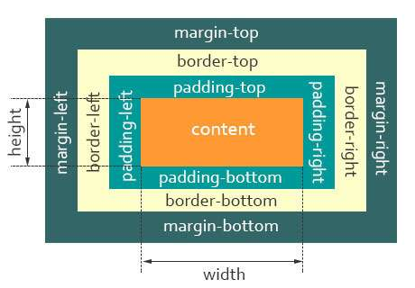

# CSS

## CSS 有哪些选择器？选择器的优先级？

参考答案

::: details 展开查看

| 选择器     | 语法               | 例子                             |
| ---------- | ------------------ | -------------------------------- |
| 通用选择器 | *                  | -                                |
| 类型选择器 | 节点名称           | `div`                            |
| 相邻选择器 | 直接相邻元素选择器 | `h1+p`                           |
|            | 普通相邻元素选择器 | `h2 ~ h2`                        |
| ID 选择器  | # + ID 名          | `#form`                          |
| 类选择器   | . + 类名           | `.btn-primary`                   |
| 属性选择器 | [属性名]           | `[self]`、`[data-type="hidden"]` |
| 伪类       | :伪类名            | `:hover`、`:focus`               |
| 伪元素     | ::伪元素名         | `::before`、`::after`            |


| 选择器类型          | 示例                               | 说明                                       |
| ------------------- | ---------------------------------- | ------------------------------------------ |
| **元素选择器**      | `p`                                | 选择所有 `<p>` 元素                        |
| **类选择器**        | `.button`                          | 选择所有 `class="button"` 的元素           |
| **ID 选择器**       | `#header`                          | 选择 `id="header"` 的元素                  |
| **通用选择器**      | `*`                                | 选择页面中的所有元素                       |
| **后代选择器**      | `div p`                            | 选择 `div` 内的所有 `<p>` 元素             |
| **子元素选择器**    | `div > p`                          | 选择 `div` 的直接子元素 `<p>`              |
| **相邻兄弟选择器**  | `h1 + p`                           | 选择紧接在 `<h1>` 后面的 `<p>` 元素        |
| **通用兄弟选择器**  | `h1 ~ p`                           | 选择所有紧跟在 `<h1>` 后面的 `<p>` 元素    |
| **属性选择器**      | `a[href]`                          | 选择具有 `href` 属性的所有 `<a>` 元素      |
| **`:hover`**        | `a:hover`                          | 选择鼠标悬停时的 `<a>` 元素                |
| **`:first-child`**  | `p:first-child`                    | 选择父元素中的第一个 `<p>` 元素            |
| **`:nth-child(n)`** | `li:nth-child(odd)`                | 选择父元素中所有奇数位置的 `<li>` 元素     |
| **`::before`**      | `p::before { content: "Note: "; }` | 在每个 `<p>` 元素的前面插入 "Note: "       |
| **`::after`**       | `p::after { content: "."; }`       | 在每个 `<p>` 元素的后面插入一个句点        |
| **`:not()`**        | `p:not(.highlight)`                | 选择所有不具有 `highlight` 类的 `<p>` 元素 |

> 注意，这里的内容比较全，面试时你也许记不住所有，但只要能说上一半儿。


选择器权重表：

| 权重 | 选择器               |
| ---- | -------------------- |
| 1000 | 内联                 |
| 0100 | ID 选择器            |
| 0010 | 类、属性、伪类选择器 |
| 0001 | 标签、伪元素         |

总的来说，就是：**优先级由高到低**   **!important** > 内联style > ID选择器 > 类选择器 > 标签选择器 > 通配符选择器>继承

**内联 > id 选择器 > 类、属性、伪类选择器 > 标签元素、伪元素**

:::

参考资料

[[ 面试系列 ] - 八：说一下 CSS 选择器优先级](https://juejin.cn/post/6844904128364150797)


## 盒模型概念，如何切换盒模型？


::: details 展开查看

CSS盒模型本质上是一个盒子，封装周围的HTML元素，它包括：`外边距（margin）`、`边框（border）`、`内边距（padding）`、`实际内容（content）`四个属性。

CSS盒模型有：**标准模型 + IE模型**

**标准盒模型**和**IE盒模型**的区别在于设置`width`和`height`时，所对应的范围不同：


- **标准盒模型的`width`和`height`属性的范围只包含了`content`**
- **IE盒模型的`width`和`height`属性的范围包含了`border`、`padding`和`content`**


**W3C盒子模型(标准盒模型)**

标准盒模型：盒子总宽度/高度 = `width/height + padding + border + margin`。（ 即 width/height 只是**内容高度**，不包含 padding 和 border 值）




**IE盒子模型(怪异盒模型)**

IE盒子模型：盒子总宽度/高度 = `width/height + margin = (内容区宽度/高度 + padding + border) + margin`。（ 即 width/height 包含了 padding 和 border 值 ）


**设置这两种模型**(`box-sizing`)

   ```
   标准：box-sizing: content-box; ( 浏览器默认设置 )
   IE： box-sizing: border-box;
   ```


:::

参考资料

[常见的面试问题：【CSS】CSS盒模型](https://zhuanlan.zhihu.com/p/74817089)

[CSS盒模型完整介绍](https://segmentfault.com/a/1190000013069516)

[对盒模型的理解](https://juejin.cn/post/6905539198107942919#heading-12)


## lineHeight 如何继承？

如下代码，`<p>` 标签的行高将会是多少？

```html
<!--如下代码，p 标签的行高将会是多少？-->
<style>
  body {
    font-size: 20px;
    line-height: 200%;
  }
  p {
    font-size: 16px;
  }
</style>

<body>
  <p>AAA</p>
</body>
```

答案

::: details 展开查看
`line-height` 不同类型的值，继承规则是不一样的

- 写具体的数值，如 `30px`，则继承该数值 —— 比较好理解
- 写百分比，如 `200%` ，则继承当前计算出来的值，如上述题目 —— 重要！！！
- 写比例，如 `2` 或 `1.5` ，则继承比例

所以，该问题的的答案是，继承 `40px` 。
:::

## margin 负值问题

参考答案

::: details 展开查看

- `margin-left` 负值，元素左移
- `margin-top` 负值，元素上移
- `margin-right` 负值，自身宽度缩小，右侧元素会跟进，但内容不受影响
- `margin-bottom` 负值，自身高度缩小，下方元素会跟进，但内容不受影响

:::


## BFC概念？作用？常用场景？

::: details 展开查看

**概念**

>  BFC 即 Block Formatting Contexts (块级格式化上下文). 具有 BFC 特性的元素可以看作是隔离了的独立容器，容器里面的元素不会在布局上影响到外面的元素，并且 BFC 具有普通容器所没有的一些特性。通俗一点来讲，可以把 BFC 理解为一个封闭的大箱子，箱子内部的元素无论如何翻江倒海，都不会影响到外部。

**触发 BFC**

只要元素满足下面任一条件即可触发 BFC 特性：[MDN创建块格式化上下文的方式](https://developer.mozilla.org/zh-CN/docs/Web/Guide/CSS/Block_formatting_context)

- HTML 就是一个 BFC
- 浮动元素：float 除`none` 以外的值
- 绝对定位元素：position (`absolute`、`fixed`)
- display 为` inline-block`、`table-cells`、`flex`
- overflow 除了` visible `以外的值 (`hidden`、`auto`、`scroll`)

**BFC 特性及应用**

- 同一个 BFC 下外边距会发生重叠
- BFC 可以包含浮动的元素（清除浮动）
- BFC 不与浮动元素重叠

:::

参考资料

[10 分钟理解 BFC 原理](https://zhuanlan.zhihu.com/p/25321647)

[面试官：请说说什么是BFC？大白话讲清楚](https://juejin.cn/post/6950082193632788493)


## 水平垂直居中？兼容性？不知道宽高情况下？

::: details 展开查看

分两大类：子元素已知宽高和子元素未知宽高

- **已知宽高**

    - 绝对定位和负margin值

      ```css
      .box {
          width: 200px;
          height: 200px;
          border: 1px solid red;
          position: relative;
      }
      .children-box {
          position: absolute;
          width: 100px;
          height: 100px;
          background: yellow;
          left: 50%;
          top: 50%;
          margin-left: -50px;
          margin-top: -50px; 
      }
      ```

    - 绝对定位 + transform(子元素未知宽高也可用)

      ```css
      .box {
          width: 200px;
          height: 200px;
          border: 1px solid red;
          position: relative;
      }
      .children-box {
          position: absolute;
          width: 100px;
          height: 100px;
          background: yellow;
          left: 50%;
          top: 50%;
          transform: translate(-50%, -50%); 
      }
      ```

    - 绝对定位 + left/right/bottom/top + margin

      ```css
      .box {
          width: 200px;
          height: 200px;
          border: 1px solid red;
          position: relative;
      }
      .children-box {
          position: absolute;
          display: inline;
          top: 0;
          left: 0;
          right: 0;
          bottom: 0px;
          background: yellow;
          margin: auto;
          height: 100px;
          width: 100px;
      }
      ```

    - flex布局(子元素未知宽高也可用, 只需设置父元素，可惜PC端兼容性不太友好)

      ```css
      .box {
          width: 200px;
          height: 200px;
          border: 1px solid red;
          display: flex;
          justify-content: center;
          align-items: center;
      }
      .children-box {
          background: yellow;
          height: 100px;
          width: 100px;
      }
      ```

    - grid布局

      ```css
      .box {
          width: 200px;
          height: 200px;
          border: 1px solid red;
          display: grid;
      }
      .children-box {
          width: 100px;
          height: 100px;
          background: yellow;
          margin: auto;
      }
      ```

    - table-cell + vertical-align + inline-block/margin: auto

      ```css
      .box {
          width: 200px;
          height: 200px;
          border: 1px solid red;
          display: table-cell;
          text-align: center;
          vertical-align: middle;
      }
      .children-box {
          width: 100px;
          height: 100px;
          background: yellow;
          display: inline-block;// 可以换成margin: auto;
      }
      ```

- **不定宽高**

    - 绝对定位 + transform

      ```css
      .box {
          width: 200px;
          height: 200px;
          border: 1px solid red;
          position: relative;
      }
      .children-box {
         position: absolute;
         background: yellow;
         left: 50%;
         top: 50%;
         transform: translate(-50%, -50%);
      }
      ```


    - table-cell

       ```css
       .box {
           width: 200px;
           height: 200px;
           border: 1px solid red;
           display: table-cell;
           text-align: center;
           vertical-align: middle;
       }
       .children-box {
          background: yellow;
          display: inline-block;
       }
       ```

       

    - flex布局

       ```css
       .box {
           width: 200px;
           height: 200px;
           border: 1px solid red;
           display: flex;
           justify-content: center;
           align-items: center;
       }
       .children-box {
           background: yellow;
       }
       ```

       

    - flex变异布局

       ```css
       .box {
           width: 200px;
           height: 200px;
           border: 1px solid red;
           display: flex;
       }
       .children-box {
           background: yellow;
           margin: auto;
       }
       ```

       

    - grid + flex布局

       ```css
       .box {
           width: 200px;
           height: 200px;
           border: 1px solid red;
           display: grid;
       }
       .children-box {
           background: yellow;
           align-self: center;
           justify-self: center;
       }
       ```


    - gird + margin布局

       ```css
       .box {
           width: 200px;
           height: 200px;
           border: 1px solid red;
           display: grid;
       }
       .children-box {
           background: yellow;
           margin: auto;
       }
        ```

:::

参考资料

[水平垂直居中的布局（定宽高和不定宽高）](https://zhuanlan.zhihu.com/p/89197310)

[如何让一个元素水平垂直居中](https://zhuanlan.zhihu.com/p/113341088)

[面试官：你能实现多少种水平垂直居中的布局（定宽高和不定宽高](https://juejin.cn/post/6844903982960214029#heading-17)


## 什么是 CSS 定位上下文？absolute 和 relative 分别依据谁来定位？

参考答案

::: details 展开查看

- `relative` 是相对于自身定位的（且不会影响其他元素的定位）
- `absolute` 是相对于上层最近的一个定位元素来定位的，如果没有就依赖于 `body` 定位。

:::

参考资料

::: details 展开查看

- https://www.ruanyifeng.com/blog/2019/11/css-position.html

:::

## CSS `overflow: hidden` `display：none` 和 `visibility: hidden` 有什么区别

参考答案

::: details 展开查看

- `overflow: hidden` 溢出内容不可见，未溢出的部分正常可见
- `display：none` 隐藏内容，不占用任何空间，内容变化不会重新渲染
- `visibility: hidden` 隐藏元素，但保留其占据的空间，内容变化会重新渲染

:::

## CSS `px` `%` `em` `rem` `vw/vh` 的区别

参考答案

::: details 展开查看

| 单位    | 基准                     | 绝对/相对 | 优点                       | 缺点                 | 适用场景                 |
| ------- | ------------------------ | --------- | -------------------------- | -------------------- | ------------------------ |
| `px`    | 固定像素                 | 绝对      | 精确，简单易用             | 缺乏响应式能力       | 固定尺寸元素             |
| `%`     | 父元素尺寸               | 相对      | 灵活，适合响应式设计       | 依赖父元素           | 响应式布局，流式设计     |
| `em`    | 当前元素字体大小         | 相对      | 动态调整，适合局部相对设计 | 嵌套复杂，计算难预测 | 动态字体、内外边距等     |
| `rem`   | 根元素字体大小（`html`） | 相对      | 全局一致，计算简单         | 需要设置根元素字体   | 全局比例调整，响应式设计 |
| `vw/vh` | 视口宽度或高度           | 相对      | 基于视口，适合全屏设计     | 小屏显示可能不理想   | 全屏布局，视口动态调整   |

使用建议:

- 响应式设计：结合使用 rem 和 %。
- 固定大小：使用 px 定义精确尺寸。
- 全屏布局：使用 vw 和 vh。
- 动态比例设计：em 和 rem 都是优秀的选择，但推荐 rem 更加简洁统一。

:::


## **你不知道的`em`细节**


### 1. 核心原理：`em` 和 `position` 各自做什么？

首先，我们必须清楚它们各自的职责：

*   **`em` 单位**：一个**相对长度单位**。它的值是根据其**父元素的 `font-size` (字体大小)** 来计算的。
    *   `font-size: 2em;` 意味着“字体大小是父元素字体大小的2倍”。
    *   `width: 10em;` 意味着“宽度是**当前元素**字体大小的10倍”。（注意这个细微差别：**当用于`font-size`属性时，`em`参考父元素**；**当用于其他属性如`width`, `margin`时，它参考当前元素自身的`font-size`）**。

*   **`position` 属性**：一个**布局属性**。它决定了元素在文档中的定位方式（即它在页面的哪个位置）。
    *   `static`：默认值，在正常的文档流中。
    *   `relative`：相对自身原始位置进行偏移，但不脱离文档流。
    *   `absolute` / `fixed`：**脱离文档流**，相对于其“定位上下文”进行定位。

从定义上看，一个管“尺寸”，一个管“位置”。它们是两个独立的系统，`position` 的值本身不会改变 `em` 的计算公式。

**简单示例（直接不影响的情况）：**

```html
<div class="parent" style="font-size: 20px;">
  <p class="child">这段文字的大小由父元素决定。</p>
</div>
```

```css
.child {
  font-size: 1.5em; /* 1.5 * 20px = 30px */
  position: static; /* 或者 relative, absolute, fixed */
}
```

在这个例子中，无论你把 `.child` 的 `position` 改成 `static`, `relative`, `absolute` 还是 `fixed`，它的 `font-size` **计算结果永远是 30px**，因为它的父元素 `.parent` 的 `font-size` 没有变。

---

### 2. 间接影响：`position` 如何改变 `em` 的计算基础？

现在，我们来看那个“间接影响”的特殊情况。这种情况发生在 `position: absolute` 或 `position: fixed` 身上。

**关键点在于：一个绝对/固定定位的元素，其继承属性（如`font-size`）不再从其DOM结构上的直接父元素继承，而是从其最近的“已定位”祖先元素 (positioned ancestor) 继承。**

*   **已定位祖先**：指 `position` 值不是 `static` 的任何祖先元素（即 `relative`, `absolute`, `fixed`, `sticky`）。
*   如果找不到这样的祖先，它最终会从根元素（通常是`<html>`或`<body>`）继承。

**让我们看一个能体现差异的例子：**

想象下面这个HTML结构：

```html
<div class="grand-parent" style="font-size: 30px; position: relative;">
  <div class="parent" style="font-size: 10px;">
    <p class="child" style="font-size: 2em;">这段文字的计算结果会变！</p>
  </div>
</div>
```

#### 场景 A：`child` 是默认的 `position: static`

1.  `.child` 的 `em` 单位寻找它的直接父元素 `.parent`。
2.  `.parent` 的 `font-size` 是 `10px`。
3.  `.child` 的计算 `font-size` 是 `2em * 10px = 20px`。

#### 场景 B：给 `child` 添加 `position: absolute`

```css
.child {
  font-size: 2em;
  position: absolute; /* 关键改变！ */
}
```

1.  `.child` 现在是绝对定位了。它会脱离文档流，并向上寻找最近的“已定位”祖先来继承 `font-size`。
2.  它的直接父元素 `.parent` 是 `position: static` (默认值)，所以被**跳过**。
3.  它继续向上找到 `.grand-parent`，发现其 `position` 是 `relative`。太好了，这就是它的定位上下文和**继承上下文**。
4.  `.grand-parent` 的 `font-size` 是 `30px`。
5.  `.child` 的计算 `font-size` 变为 `2em * 30px = 60px`。

看！仅仅因为改变了 `position`，`.child` 的字体大小就从 `20px` 变成了 `60px`。

**这就是 `position` 如何间接影响 `em` 计算结果的原理：它改变了 `em` 单位计算时所依赖的那个“父级字体大小”的来源。**

---

### 总结与最佳实践

| 属性 | 影响 `em` 吗？ | 原因 |
| :--- | :--- | :--- |
| `position: static` | **不影响** | 元素在正常文档流中，`em` 基于其DOM父元素计算。 |
| `position: relative` | **不影响** | 元素仍在文档流中，`em` 依然基于其DOM父元素计算。 |
| `position: absolute` | **可能影响** | 元素脱离文档流，`em` 计算的基准 `font-size` 会从最近的“已定位”祖先继承，可能不再是其直接父元素。 |
| `position: fixed` | **可能影响** | 和`absolute`类似，但其定位上下文通常是视口(viewport)。继承规则也遵循寻找最近“已定位”祖先。 |

#### 建议：使用 `rem` 来避免混乱

正是因为 `em` 的这种层层嵌套和依赖关系有时会变得复杂（尤其是在和 `position` 结合时），`rem` (root em) 单位应运而生。

*   **`rem`**：永远只相对于根元素 `<html>` 的 `font-size` 进行计算。

无论元素的嵌套多深，`position` 是什么，`2rem` 永远等于 `<html>` 字体大小的2倍。这让尺寸系统变得非常可预测和稳定。

**结论**：在日常开发中，如果你不希望元素的尺寸受到其父级或定位上下文的 `font-size` 影响，**优先使用 `rem` 单位**。如果你确实需要尺寸与局部父元素字体大小挂钩（比如一个按钮内的图标大小随按钮文字大小变化），`em` 才是合适的选择。
