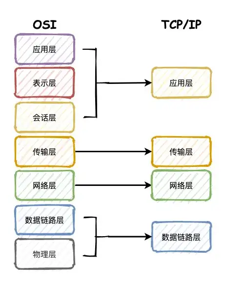
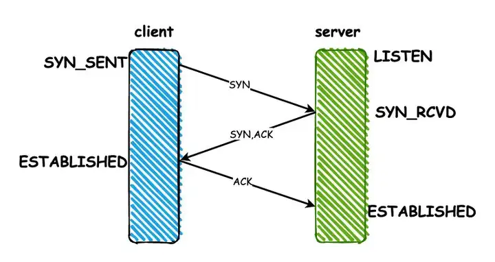
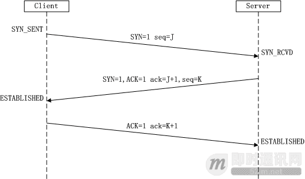
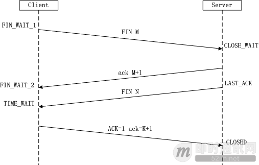

# 网络

## 谈一谈你对 TCP/IP 四层模型，OSI 七层模型的理解？

::: details 展开查看

为了增强通用性和兼容性，计算机网络都被设计成层次机构，每一层都遵守一定的规则。
因此有了OSI这样一个抽象的网络通信参考模型，按照这个标准使计算机网络系统可以互相连接。

**物理层**：通过网线、光缆等这种物理方式将电脑连接起来。传递的数据是比特流，`0101010100`。

**数据链路层**：首先，把比特流封装成数据帧的格式，对`0`、`1`进行分组。电脑连接起来之后，数据都经过网卡来传输，
而网卡上定义了全世界唯一的MAC地址。然后再通过广播的形式向局域网内所有电脑发送数据，再根据数据中MAC地址和自身对比判断是否是发给自己的。

**网络层**：广播的形式太低效，为了区分哪些MAC地址属于同一个子网，网络层定义了IP和子网掩码，
通过对IP和子网掩码进行与运算就知道是否是同一个子网，再通过路由器和交换机进行传输。**IP协议属于网络层的协议**。

**传输层**：有了网络层的MAC+IP地址之后，为了确定数据包是从哪个进程发送过来的，就需要端口号，通过端口来建立通信，
比如**TCP和UDP属于这一层的协议。**

**会话层**：负责建立和断开连接。

**表示层**：为了使得数据能够被其他的计算机理解，再次将数据转换成另外一种格式，比如文字、视频、图片等。

**应用层**：最高层，面对用户，提供计算机网络与最终呈现给用户的界面。

`TCP/IP`则是四层的结构，相当于是对OSI模型的简化。

**数据链路层**，也有称作网络访问层、网络接口层。他包含了OSI模型的物理层和数据链路层，把电脑连接起来。

**网络层**，也叫做IP层，处理IP数据包的传输、路由，建立主机间的通信。

**传输层**，就是为两台主机设备提供端到端的通信。

**应用层**，包含OSI的会话层、表示层和应用层，提供了一些常用的协议规范，比如FTP、SMPT、HTTP等。

总结下来，就是物理层通过物理手段把电脑连接起来，数据链路层则对比特流的数据进行分组，网络层来建立主机到主机的通信，
传输层建立端口到端口的通信，应用层最终负责建立连接，数据格式转换，最终呈现给用户。
:::

参考资料

- [面试题系列：网络篇夺命连环12问](https://zhuanlan.zhihu.com/p/379609476)

## 说说 TCP 3次握手的过程？为什么要3次？2次，4次不行吗？

::: details 展开查看
   建立连接前server端需要监听端口，所以初始状态是LISTEN。

   1.client端建立连接，发送一个SYN同步包，发送之后状态变成SYN_SENT

   2.server端收到SYN之后，同意建立连接，返回一个ACK响应，同时也会给client发送一个SYN包，发送完成之后状态变为SYN_RCVD

   3.client端收到server的ACK之后，状态变为ESTABLISHED，返回ACK给server端。server收到之后状态也变为ESTABLISHED，连接建立完成。

   

   因为TCP是双工传输模式，不区分客户端和服务端，连接的建立是双向的过程。

   如果只有两次，无法做到双向连接的建立，从建立连接server回复的SYN和ACK合并成一次可以看出来，他也不需要4次。

   挥手为什么要四次？因为挥手的ACK和FIN不能同时发送，因为数据发送的截止时间不同。
:::

参考资料

- [面试题系列：网络篇夺命连环12问](https://zhuanlan.zhihu.com/p/379609476)

## 讲一讲TCP协议的三次握手和四次挥手流程

::: details 展开查看
   了解几个东西：

   （1）序号：Seq序号，占32位，用来标识从TCP源端向目的端发送的字节流，发起方发送数据时对此进行标记。

   （2）确认序号：Ack序号，占32位，只有ACK标志位为1时，确认序号字段才有效，Ack=Seq+1。

   （3）标志位：共6个，即URG、ACK、PSH、RST、SYN、FIN等，具体含义如下：

   > （A）URG：紧急指针（urgent pointer）有效。
   >
   > （B）ACK：确认序号有效。
   >
   > （C）PSH：接收方应该尽快将这个报文交给应用层。
   >
   > （D）RST：重置连接。
   >
   > （E）SYN：发起一个新连接。
   >
   > （F）FIN：释放一个连接。

   **需要注意的是：**

   （A）不要将确认序号Ack与标志位中的ACK搞混了。

   （B）确认方Ack=发起方Req+1，两端配对。

   **3次握手过程详解**

   所谓三次握手（Three-Way Handshake）即建立TCP连接，就是指建立一个TCP连接时，需要客户端和服务端总共发送3个包以确认连接的建立。在socket编程中，这一过程由客户端执行connect来触发，整个流程如下图所示：

   

   **（1）第一次握手：**

   Client将标志位SYN置为1，随机产生一个值seq=J，并将该数据包发送给Server，Client进入SYN_SENT状态，等待Server确认。

   **（2）第二次握手：**

   Server收到数据包后由标志位SYN=1知道Client请求建立连接，Server将标志位SYN和ACK都置为1，ack=J+1，随机产生一个值seq=K，并将该数据包发送给Client以确认连接请求，Server进入SYN_RCVD状态。

   **（3）第三次握手：**

   Client收到确认后，检查ack是否为J+1，ACK是否为1，如果正确则将标志位ACK置为1，ack=K+1，并将该数据包发送给Server，Server检查ack是否为K+1，ACK是否为1，如果正确则连接建立成功，Client和Server进入ESTABLISHED状态，完成三次握手，随后Client与Server之间可以开始传输数据了。

   **4次挥手过程详解**

   三次握手耳熟能详，四次挥手估计就少有人知道了。所谓四次挥手（Four-Way Wavehand）即终止TCP连接，就是指断开一个TCP连接时，需要客户端和服务端总共发送4个包以确认连接的断开。在socket编程中，这一过程由客户端或服务端任一方执行close来触发，整个流程如下图所示：

   

   由于TCP连接时全双工的，因此，每个方向都必须要单独进行关闭，这一原则是当一方完成数据发送任务后，发送一个FIN来终止这一方向的连接，收到一个FIN只是意味着这一方向上没有数据流动了，即不会再收到数据了，但是在这个TCP连接上仍然能够发送数据，直到这一方向也发送了FIN。首先进行关闭的一方将执行主动关闭，而另一方则执行被动关闭，上图描述的即是如此。

   **第一次挥手：**

   Client发送一个FIN，用来关闭Client到Server的数据传送，Client进入FIN_WAIT_1状态。

   **第二次挥手：**

   Server收到FIN后，发送一个ACK给Client，确认序号为收到序号+1（与SYN相同，一个FIN占用一个序号），Server进入CLOSE_WAIT状态。

   **第三次挥手：**

   Server发送一个FIN，用来关闭Server到Client的数据传送，Server进入LAST_ACK状态。

   **第四次挥手：**

   Client收到FIN后，Client进入TIME_WAIT状态，接着发送一个ACK给Server，确认序号为收到序号+1，Server进入CLOSED状态，完成四次挥手。

:::

参考资料

- [理论经典：TCP协议的3次握手与4次挥手过程详解](https://zhuanlan.zhihu.com/p/22639051)

## 从输入url地址到页面相应都发生了什么？

::: details 展开查看
   简单版：

    1. 浏览器的地址栏输入URL并按下回车。
    2. 浏览器查找当前URL是否存在缓存，并比较缓存是否过期。
    3. DNS解析URL对应的IP。
    4. 根据IP建立TCP连接（三次握手）。
    5. HTTP发起请求。
    6. 服务器处理请求，浏览器接收HTTP响应。
    7. 渲染页面，构建DOM树。
    8. 关闭TCP连接（四次挥手）

   详细版：

   （1）**解析URL：** 首先会对 URL 进行解析，分析所需要使用的传输协议和请求的资源的路径。如果输入的 URL 中的协议或者主机名不合法，将会把地址栏中输入的内容传递给搜索引擎。如果没有问题，浏览器会检查 URL 中是否出现了非法字符，如果存在非法字符，则对非法字符进行转义后再进行下一过程。

   （2）**缓存判断：** 浏览器会判断所请求的资源是否在缓存里，如果请求的资源在缓存里并且没有失效，那么就直接使用，否则向服务器发起新的请求。

   （3）**DNS解析：** 下一步首先需要获取的是输入的 URL 中的域名的 IP 地址，首先会判断本地是否有该域名的 IP 地址的缓存，如果有则使用，如果没有则向本地 DNS 服务器发起请求。本地 DNS 服务器也会先检查是否存在缓存，如果没有就会先向根域名服务器发起请求，获得负责的顶级域名服务器的地址后，再向顶级域名服务器请求，然后获得负责的权威域名服务器的地址后，再向权威域名服务器发起请求，最终获得域名的 IP 地址后，本地 DNS 服务器再将这个 IP 地址返回给请求的用户。用户向本地 DNS 服务器发起请求属于递归请求，本地 DNS 服务器向各级域名服务器发起请求属于迭代请求。

   （4）**获取MAC地址：** 当浏览器得到 IP 地址后，数据传输还需要知道目的主机 MAC 地址，因为应用层下发数据给传输层，TCP 协议会指定源端口号和目的端口号，然后下发给网络层。网络层会将本机地址作为源地址，获取的 IP 地址作为目的地址。然后将下发给数据链路层，数据链路层的发送需要加入通信双方的 MAC 地址，本机的 MAC 地址作为源 MAC 地址，目的 MAC 地址需要分情况处理。通过将 IP 地址与本机的子网掩码相与，可以判断是否与请求主机在同一个子网里，如果在同一个子网里，可以使用 APR 协议获取到目的主机的 MAC 地址，如果不在一个子网里，那么请求应该转发给网关，由它代为转发，此时同样可以通过 ARP 协议来获取网关的 MAC 地址，此时目的主机的 MAC 地址应该为网关的地址。

   （5）**TCP三次握手：** 下面是 TCP 建立连接的三次握手的过程，首先客户端向服务器发送一个 SYN 连接请求报文段和一个随机序号，服务端接收到请求后向服务器端发送一个 SYN ACK报文段，确认连接请求，并且也向客户端发送一个随机序号。客户端接收服务器的确认应答后，进入连接建立的状态，同时向服务器也发送一个ACK 确认报文段，服务器端接收到确认后，也进入连接建立状态，此时双方的连接就建立起来了。

   （6）**HTTPS握手：** 如果使用的是 HTTPS 协议，在通信前还存在 TLS 的一个四次握手的过程。首先由客户端向服务器端发送使用的协议的版本号、一个随机数和可以使用的加密方法。服务器端收到后，确认加密的方法，也向客户端发送一个随机数和自己的数字证书。客户端收到后，首先检查数字证书是否有效，如果有效，则再生成一个随机数，并使用证书中的公钥对随机数加密，然后发送给服务器端，并且还会提供一个前面所有内容的 hash 值供服务器端检验。服务器端接收后，使用自己的私钥对数据解密，同时向客户端发送一个前面所有内容的 hash 值供客户端检验。这个时候双方都有了三个随机数，按照之前所约定的加密方法，使用这三个随机数生成一把秘钥，以后双方通信前，就使用这个秘钥对数据进行加密后再传输。

   （7）**返回数据：** 当页面请求发送到服务器端后，服务器端会返回一个 html 文件作为响应，浏览器接收到响应后，开始对 html 文件进行解析，开始页面的渲染过程。

   （8）**页面渲染：** 浏览器首先会根据 html 文件构建 DOM 树，根据解析到的 css 文件构建 CSSOM 树，如果遇到 script 标签，则判端是否含有 defer 或者 async 属性，要不然 script 的加载和执行会造成页面的渲染的阻塞。当 DOM 树和 CSSOM 树建立好后，根据它们来构建渲染树。渲染树构建好后，会根据渲染树来进行布局。布局完成后，最后使用浏览器的 UI 接口对页面进行绘制。这个时候整个页面就显示出来了。

   （9）**TCP四次挥手：** 最后一步是 TCP 断开连接的四次挥手过程。若客户端认为数据发送完成，则它需要向服务端发送连接释放请求。服务端收到连接释放请求后，会告诉应用层要释放 TCP 链接。然后会发送 ACK 包，并进入 CLOSE_WAIT 状态，此时表明客户端到服务端的连接已经释放，不再接收客户端发的数据了。但是因为 TCP 连接是双向的，所以服务端仍旧可以发送数据给客户端。服务端如果此时还有没发完的数据会继续发送，完毕后会向客户端发送连接释放请求，然后服务端便进入 LAST-ACK 状态。客户端收到释放请求后，向服务端发送确认应答，此时客户端进入 TIME-WAIT 状态。该状态会持续 2MSL（最大段生存期，指报文段在网络中生存的时间，超时会被抛弃） 时间，若该时间段内没有服务端的重发请求的话，就进入 CLOSED 状态。当服务端收到确认应答后，也便进入 CLOSED 状态。

:::

参考资料

- [当在浏览器中输入 Google.com 并且按下回车之后发生了什么？](https://juejin.cn/post/6908327746473033741#heading-12)

## TCP 怎么保证传输过程的可靠性？

::: details 展开查看
   **校验和**：发送方在发送数据之前计算校验和，接收方收到数据后同样计算，如果不一致，那么传输有误。

   **确认应答，序列号**：TCP进行传输时数据都进行了编号，每次接收方返回ACK都有确认序列号。

   **超时重传**：如果发送方发送数据一段时间后没有收到ACK，那么就重发数据。

   **连接管理**：三次握手和四次挥手的过程。

   **流量控制**：TCP协议报头包含16位的窗口大小，接收方会在返回ACK时同时把自己的即时窗口填入，发送方就根据报文中窗口的大小控制发送速度。

   **拥塞控制**：刚开始发送数据的时候，拥塞窗口是1，以后每次收到ACK，则拥塞窗口+1，然后将拥塞窗口和收到的窗口取较小值作为实际发送的窗口，如果发生超时重传，拥塞窗口重置为1。这样做的目的就是为了保证传输过程的高效性和可靠性。
  ::: 
- [理论经典：TCP协议的3次握手与4次挥手过程详解](https://zhuanlan.zhihu.com/p/22639051)

