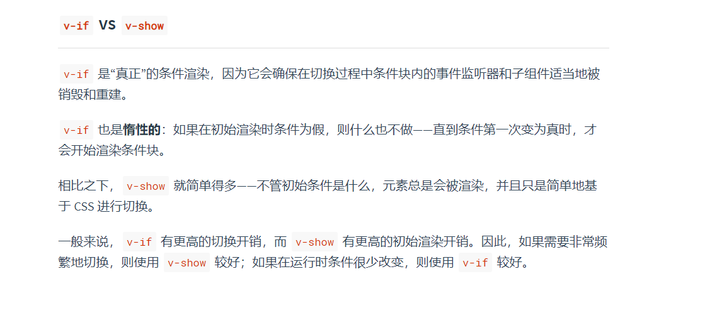

# Vue

## 什么是 Vue 生命周期？

参考答案：

::: details 展开查看

Vue 生命周期是指 Vue 实例从创建、初始化、挂载、更新到销毁的整个过程中自动触发的一系列阶段。每个阶段对应一个“生命周期钩子函数”，开发者可在这些钩子中注入代码逻辑。

##### 拓展深度
- **设计思想**：通过钩子函数解耦代码逻辑，提升可维护性。
- **响应式系统**：例如 `beforeCreate` 时数据响应式未初始化，`created` 时已完成数据观测。
- **跨框架对比**：类似概念存在于 React（`componentDidMount`）和 Angular（`ngOnInit`），但实现细节不同。

:::

## Vue 生命周期的作用是什么？

参考答案：

::: details 展开查看

生命周期钩子的核心作用包括：
1. **初始化数据**（如 `created` 中请求接口）。
2. **操作 DOM**（如 `mounted` 中访问渲染后的元素）。
3. **监听状态变化**（如 `updated` 中响应数据更新）。
4. **资源清理**（如 `beforeDestroy` 中移除定时器）。

##### 拓展广度
- **插件开发**：在 `beforeCreate` 中通过 `Vue.use()` 注入全局逻辑（如 Vue Router）。
- **性能优化**：在 `mounted` 中使用防抖控制高频 DOM 操作。
- **错误处理**：通过 `errorCaptured` 钩子实现组件级错误捕获。

:::


## 第一次页面加载会触发哪些钩子？

参考答案：

::: details 展开查看

首次加载触发的钩子（按顺序）：
1. `beforeCreate`
2. `created`
3. `beforeMount`
4. `mounted`

##### 特殊情况
- **`<keep-alive>`**：额外触发 `activated`。
- **服务端渲染（SSR）**：`beforeMount` 和 `mounted` 不会执行。

:::

## 每个周期适合哪些场景？

参考答案：

::: details 展开查看

| 生命周期钩子       | 适用场景                                                                 |
|--------------------|--------------------------------------------------------------------------|
| `beforeCreate`     | 插件初始化（如 Vuex）、定义非响应式变量                                   |
| `created`          | 数据请求、非 DOM 事件监听（如 WebSocket）                                |
| `mounted`          | 操作 DOM（初始化图表库）、依赖 DOM 的请求                                |
| `beforeUpdate`     | 保存更新前状态（如滚动位置）                                             |
| `updated`          | 数据更新后操作（重新计算布局）                                           |
| `beforeDestroy`    | 清理资源（定时器、事件监听）                                             |

##### 高级场景
- **`activated/deactivated`**：配合 `<keep-alive>` 保存/恢复组件状态（如视频播放）。
- **`errorCaptured`**：捕获子组件错误并阻止冒泡。

:::

## `created` 和 `mounted` 的区别

参考答案：

::: details 展开查看

| 对比项         | `created`                          | `mounted`                          |
|----------------|------------------------------------|-------------------------------------|
| **DOM 状态**   | 未生成，`this.$el` 不可用          | 已挂载，可访问 `this.$el`           |
| **适用场景**   | 数据初始化、不依赖 DOM 的异步请求  | 操作 DOM、初始化依赖 DOM 的库       |
| **SSR**        | 在服务端执行                       | 仅在客户端执行                      |

:::

## Vue 获取数据在哪个周期？

参考答案：

::: details 展开查看

**推荐在 `created` 中发起请求**：

- 优点：尽早加载数据，减少等待时间。
- 例外：依赖 DOM 的操作（如元素尺寸）需放在 `mounted`。

```javascript
// 示例：在 created 中异步获取数据
async created() {
  try {
    this.data = await fetchData();
  } catch (error) {
    console.error("请求失败:", error);
  }
}
```

#### Vue3 的差异

- 在 Composition API 中，数据请求通常在 `setup()` 中发起，依赖 DOM 时使用 `onMounted`。

:::

## 对 Vue 生命周期的完整理解

参考答案：

::: details 展开查看

##### 核心流程

1. 初始化阶段
    - `beforeCreate` → `created`：初始化数据响应式、事件、计算属性。
2. 挂载阶段
    - `beforeMount` → `mounted`：编译模板，生成真实 DOM。
3. 更新阶段
    - `beforeUpdate` → `updated`：响应数据变化，触发重新渲染。
4. 销毁阶段
    - `beforeDestroy` → `destroyed`：移除实例，清理依赖。

##### 高级特性

- **父子组件生命周期顺序**
  父 `beforeCreate` → 父 `created` → 父 `beforeMount` → 子 `beforeCreate` → 子 `created` → 子 `mounted` → 父 `mounted`。
- **Vue3 的变化**
    - `beforeCreate` 和 `created` 替换为 `setup()`。
    - 钩子命名添加 `on` 前缀（如 `onMounted`）。

##### 陷阱与最佳实践

- **避免在 `updated` 中修改数据**：可能导致无限循环。
- **内存泄漏**：未在 `beforeDestroy` 中清理定时器。
- **使用 `this.$nextTick`**：确保在 DOM 更新后执行操作。


:::

##  Vue 父子组件生命周期调用顺序

参考答案：

::: details 展开查看

##### Vue的父子组件生命周期调用顺序遵循**从外到内初始化，从内到外完成**的规则。

1️⃣ 创建阶段

- 父组件：`beforeCreate` ➡️ `created`

- 子组件：`beforeCreate` ➡️ `created`

- 顺序： 父组件的
  `eforeCreate`和`reated`先执行 ，子组件的`beforeCreate`和`created`后执行。

>  [!TIP]
>  原因：父组件需要先完成自身的初始化（如 data、computed 等），才能解析模板中的子组件并触发子组件的初始化。

2️⃣ 挂载阶段

- 父组件：`beforeMount`

- 子组件：`beforeMount` ➡️ `mounted`

- 父组件：`mounted`

- 顺序： 父`beforeMount`→ 子`beforeCreate`→ 子`created`→ 子`beforeMount`→ 子`mounted`→ 父`mounted`

>  [!TIP]
> 原因：父组件在挂载前（beforeMount）需要先完成子组件的渲染和挂载，因为子组件是父组件模板的一部分。只有当所有子组件挂载完成后，父组件才会触发自身的 mounted。

3️⃣ 更新阶段

- 父组件：`beforeUpdate`

- 子组件：`beforeUpdate` ➡️ `updated`

- 父组件：`updated`

- 顺序： 父`beforeUpdate`→ 子`beforeUpdate`→ 子`updated`→ 父`updated`

>  [!TIP]
> 原因：父组件的数据变化会触发自身更新流程，但子组件的更新必须在父组件更新前完成（因为子组件可能依赖父组件的数据），最终父组件的视图更新完成。

4️⃣ 销毁阶段

- 父组件：`beforeDestroy`

- 子组件：`beforeDestroy` ➡️ `destroyed`

- 父组件：`destroyed`

- 顺序： 父`beforeDestroy`→ 子`beforeDestroy`→ 子`destroyed`→ 父`destroyed`

>  [!TIP]
> 原因：父组件销毁前需要先销毁所有子组件，确保子组件的资源释放和事件解绑，避免内存泄漏。

注：vue3中，`setup()` 替代了 `beforeCreate` 和 `created`，但父子组件的生命周期顺序不变。

##### mixins对生命周期钩子的影响机制

当组件使用mixins时，生命周期钩子的执行顺序遵循以下规则：

1. **单组件与mixins的合并规则**

- **生命周期钩子**：组件和mixin的同名钩子会被合并为数组，**mixin的钩子先于组件自身的钩子执行**。
 ```javascript
    // 示例
    const myMixin = { created() { console.log('Mixin created'); } };
    new Vue({
      mixins: [myMixin],
      created() { console.log('Component created'); }
    });
    // 输出顺序：Mixin created → Component created
 ```

**其他选项（如methods、data）** ：组件选项优先级高于mixins。例如，同名方法以组件内定义为准

2. **父子组件结合mixins时的执行顺序**

   mixins的钩子**按数组顺序先执行**，再执行组件自身的钩子，父子层级顺序保持不变。


3. **复杂场景下的执行顺序（含多个mixins）**

   若组件使用多个mixins（如`mixins: [mixinA, mixinB]`），则：

    - **同层级mixins**：按数组顺序执行。例如，`mixinA`的钩子先于`mixinB`。
    - **跨父子组件**：父组件的mixins优先于子组件的mixins

:::

##  Vue中this.$nextTick的详细介绍与拓展知识

参考答案：

::: details 展开查看

##### 一、基本定义与作用

`this.$nextTick`是Vue.js提供的异步方法，用于在**DOM更新完成后执行回调函数**。由于Vue的数据更新是异步的（通过批量处理提升性能），
当数据变化后直接操作DOM可能无法获取最新状态。`$nextTick`通过将回调延迟到下一次DOM更新循环之后执行，确保操作基于最新的DOM结构。

**核心作用**：

1. **解决异步更新导致的DOM状态不一致问题**：例如在修改数据后立即获取元素尺寸或焦点。
2. **优化性能**：避免频繁的同步DOM操作，利用事件循环机制批量处理更新。

##### 二、实现原理与机制

Vue的异步更新机制基于JavaScript的事件循环（Event Loop），`$nextTick`通过微任务（micro-task）或宏任务（macro-task）实现回调队列的调度。


**内部实现步骤**：

1. **收集回调**：调用`$nextTick`时将回调函数存入`callbacks`数组。

2. 触发执行

   ：通过`timerFunc`方法（根据浏览器支持情况选择最优异步API）触发回调队列的执行。

    - **优先级**：优先使用`Promise.then`（微任务），若不支持则降级为`MutationObserver`、`setImmediate`或`setTimeout`（宏任务）。

3. **执行回调**：在DOM更新后依次执行`callbacks`中的函数。

**关键变量**：

- `callbacks`：存储待执行的回调队列。

- `pending`：标记是否已有异步任务在等待执行。

- `timerFunc`：根据环境选择的具体异步实现方法。


##### 三、典型使用场景

1. 在生命周期钩子中操作DOM：


- created钩子：此时DOM未渲染，需通过`$nextTick`等待更新完成后再操作。 


```javascript
created() {
  this.$nextTick(() => {
    this.$refs.element.focus(); // 安全操作DOM
  });
}

```

2. 数据变化后获取最新DOM状态：

    - 修改数据后立即获取元素属性（如文本内容、尺寸等）。

```javascript
methods: {
  updateData() {
    this.message = '新内容';
    this.$nextTick(() => {
      console.log(this.$el.textContent); // 输出更新后的内容
    });
  }
}
```

3. 与第三方库集成：

    - 初始化Swiper、BetterScroll等依赖DOM的库时，确保组件已渲染。

   ```javascript
   mounted() {
     this.$nextTick(() => {
       new Swiper(this.$refs.container); // 正确初始化
     });
   }
   ```

4. 表单验证与重置：

    - 清空表单数据后移除验证状态。

   ```javascript
   resetForm() {
     this.formData = {};
     this.$nextTick(() => {
       this.$refs.form.clearValidate(); // 确保DOM更新后清除验证
     });
   }
   ```

5. 处理动画或过渡效果：

    - 在元素显示/隐藏（v-if/v-show）后触发动画。

```javascript
toggleElement() {
this.isVisible = true;
this.$nextTick(() => {
  this.$refs.element.classList.add('fade-in'); // 应用动画
});
}
```

##### 四、常见错误与注意事项

1. **错误用法：**

    - 在组件销毁后调用：可能导致回调引用已销毁的实例。  
    - 依赖同步代码顺序：在同一个事件循环中多次调用`$nextTick`，仅最后一次生效。  
    - 过早操作DOM：未等待异步请求返回数据就操作DOM元素。 

```javascript
// 错误示例：数据未加载完成时操作DOM
fetchData().then(() => {
  this.data = response.data;
  this.$refs.element.focus(); // 可能失败
});
```

2. **最佳实践：**

    - 结合async/await：提升代码可读性。
      
```javascript
async handleUpdate() {
  this.data = await fetchData();
  await this.$nextTick();
  this.$refs.element.focus(); // 确保DOM更新
}
```
- 错误处理：在回调中使用try...catch捕获异常。
  
```javascript
this.$nextTick(() => {
  try {
    this.$refs.invalidElement.doSomething();
  } catch (e) {
    console.error('操作失败:', e);
  }
});
```


##### 五、面试高频问题与解析

1. **解释`$nextTick`的作用与原理**
   **答**：`$nextTick`用于在DOM更新后执行回调。Vue通过异步队列批量处理数据变更，其内部根据浏览器支持选择微任务（如Promise）或宏任务（如setTimeout）实现延迟执行，确保操作基于最新DOM。

2. **为什么在created钩子中使用`$nextTick`？**
   **答**：created阶段数据已初始化但DOM未渲染，直接操作DOM无效。`$nextTick`将回调延迟到mounted阶段后执行，此时DOM已就绪。

3. **`$nextTick`与`setTimeout(fn, 0)`的区别**
   **答**：`$nextTick`优先使用微任务，执行时机早于`setTimeout`（宏任务）。此外，`$nextTick`能自动处理Vue内部的更新队列，更高效。

4. **如何保证多个`$nextTick`回调的顺序？**
   **答**：Vue会将回调按调用顺序存入队列，在下一个事件循环中依次执行。

5. **在Vue3中`$nextTick`有何变化？**
   **答**：Vue3将`nextTick`作为独立函数导出（需导入使用），并支持返回Promise。

   ```javascript
   import { nextTick } from 'vue';
   await nextTick(); // 结合async/await使用
   ```
   

:::

参考文档：

::: details 展开查看

- [Vue中的$nextTick有什么作用？](https://zhuanlan.zhihu.com/p/508436373)

- [vue基础--this.$nextTick(function(){})](https://www.jianshu.com/p/d9a7024d9918)

- [[this.$nextTick()的使用场景](https://www.cnblogs.com/cjr001/p/15840028.html)]

- [vue之nextTick全面解析](https://www.cnblogs.com/libin-1/p/6852231.html)

- [通俗易懂了解Vue中nextTick的内部实现原理 ](https://www.cnblogs.com/momo798/p/15181421.html)

- [this.$nextTick()的用法](https://www.cnblogs.com/maogu2/p/14483800.html)

- [this.$nextTick()的使用场景](https://www.cnblogs.com/cjr001/p/15840028.html)

- [Vue报错：无法正确使用nextTick方法进行异步更新，怎样解决？](https://sharedbk.com/web/post/6998.html)

- [在使用$nextTick方法时，需要注意哪些问题？](https://developer.aliyun.com/article/1440546)

- [父组件调用子组件this.$refs.xxx报Cannot read properties of undefined (reading ‘xxx‘)“[已解决]](https://blog.csdn.net/Maxueyingying/article/details/130502695)

- [vue 异步更新队列 this.$nextTick()](https://www.cnblogs.com/dafei4/p/13932521.html)

- [如果$nextTick内部抛出错误，如何处理？](https://blog.csdn.net/qq_36538012/article/details/145479861)

- [理解 Vue.js nextTick](https://www.moon-odyssey.com/understand-vue-next-tick/)

- [高频前端面试题汇总之Vue篇 （上） ](https://www.cnblogs.com/mooz88/p/16021945.html)
:::

## vue的`created`钩子和`beforeRouteEnter`钩子哪个执行？

参考答案：

::: details 展开查看

**当进入一个路由时，步骤可能是：**

1. **触发导航，开始解析路由。**
2. **执行全局守卫`beforeEach`。**
3. **执行路由独享的`beforeEnter`。**
4. **执行组件内的`beforeRouteEnter`。**
5. **在这些守卫都调用`next()`之后，确认导航，开始创建组件实例。**
6. **在组件实例化过程中，依次触发`beforeCreate`、`created`、`beforeMount`、`mounted`。**
7. **当组件mounted之后，执行`beforeRouteEnter`的`next`回调函数。**

##### **`created`与`beforeRouteEnter`的执行顺序**

1. **`created`钩子**
    - **触发时机**：在组件实例**创建完成**后触发，此时数据观测、计算属性、方法等已初始化，但DOM尚未挂载（`$el`未生成）。
    - **作用**：常用于**数据初始化**（如API请求）、状态设置等操作。
2. **`beforeRouteEnter`钩子**
    - **触发时机**：属于路由导航守卫，在**路由确认前**触发（此时组件尚未实例化）。

    - **无法直接访问`this`**，因为组件实例未创建。

   - `next`回调的执行时机：在组件`mounted`钩子之后触发。

   - **作用**：常用于依赖路由参数的异步数据请求，并通过`next(vm => { ... })`访问组件实例。

3. **执行顺序结论**

- **整体流程**：路由守卫触发 → 组件实例化 → 生命周期钩子执行 → beforeRouteEnter回调

- 具体顺序：`beforeRouteEnter`钩子函数本身在组件创建前触发（早于`created`）。
`created`钩子在组件实例化阶段触发（晚于`beforeRouteEnter`钩子函数，但早于其`next`回调）。
`beforeRouteEnter`的`next`回调在**mounted之后执行**（晚于所有初始化生命周期钩子）

:::

参考链接:

::: details 展开查看

##### 官方文档

- [Vue2 生命周期](https://v2.vuejs.org/v2/guide/instance.html#Lifecycle-Diagram)
- [Vue3 生命周期](https://v3.vuejs.org/guide/instance.html#lifecycle-hooks)
- [Vue Router 导航守卫](https://router.vuejs.org/guide/advanced/navigation-guards.html)

##### 社区资源

- [Vue 生命周期的 8 个关键场景](https://www.digitalocean.com/community/tutorials/vuejs-lifecycle-hooks)
- [Vue3 Composition API 与生命周期](https://vuejs.org/guide/essentials/lifecycle.html)

##### 进阶阅读

- [Vue 性能优化：生命周期的应用](https://michaelnthiessen.com/optimize-vue-lifecycle-hooks/)
- [Vue 与 React 生命周期对比](https://www.toptal.com/react/react-vs-vue-for-dynamic-applications)

:::


## 说一说 v-show与v-if 区别是什么

::: details 展开查看

**手段**：v-if是动态的向DOM树内添加或者删除DOM元素；v-show是通过设置DOM元素的display样式属性控制显隐；

**编译过程**：v-if切换有一个局部编译/卸载的过程，切换过程中合适地销毁和重建内部的事件监听和子组件；v-show只是简单的基于css切换；

**编译条件**：v-if是惰性的，如果初始条件为假，则什么也不做；只有在条件第一次变为真时才开始局部编译; v-show是在任何条件下，无论首次条件是否为真，都被编译，然后被缓存，而且DOM元素保留；

**性能消耗**：v-if有更高的切换消耗；v-show有更高的初始渲染消耗；

**使用场景**：v-if适合运营条件不大可能改变；v-show适合频繁切换。



:::

参考资料

- [2021」高频前端面试题汇总之Vue篇 （上） —— v-show与v-if区别](https://juejin.cn/post/6919373017218809864#heading-19)


## `keep-alive`底层原理

::: details 展开查看

* `keep-alive` 是一个`Vue`内置组件，主要用于缓存组件实例，避免重复创建和销毁，提高性能。(不会渲染出 DOM 元素，也不会出现在父组件链中)。它的底层实现主要依靠以下几个关键部分：

  + 缓存机制：`keep-alive` 内部使用一个对象 `cache` 来存储缓存的组件实例，键是组件的唯一标识`key`，值就是对应组件的虚拟节点`vnode`。同时，使用一个数组`keys` 来维护这些实例缓存顺序
  + 而每个缓存顺序通过 `lru 算法`进行维护，当缓存的组件数量超过`max` 属性指定的上限时，会优先移除最久未使用的组件实例。
  + 另外，`keep-alive` 还会在组件声明周期中添加`activated` 和 `deactivated` 钩子，当组件被激活时触发`activated`，被缓存时触发`deactivated`，并且不会再触发`mounted` 和 `unmounted` 钩子。
  + 最后，核心代码逻辑是在`keep-alive` 的`render` 函数里面，会获取默认插槽的第一个组件节点，再根据`include` 和`exclude` 属性判断是否需要缓存该组件。
  + 若需要缓存，就检查`cache` 中是否已有该组件实例，有则直接从缓存获取，没有则添加到缓存里。
* `keep-alive` 内置组件，可以使组件在切换时保持状态，避免重新渲染。
* 可以通过 `include` 和 `exclude` 属性来指定需要缓存的组件。
* 可以缓存 、列表渲染、组件缓存等。
* 需要缓存的组件`push` 到`include` 数组中，不需要缓存的组件`push` 到`exclude` 数组中。

:::

## `Vue router`两种模式原理

::: details 展开查看

* `hash` 模式：
  + 监听`hashchange`事件，根据`hash`值，更新路由
  + 使用`location.hash = '#' + path`，更新`hash`值
* `history` 模式：
  + 监听`popstate`事件，根据`state`值，更新路由
  + 使用`history.pushState(state, title, url)`，更新`state`值
  + `pushState`，`replaceState`方法，都是改变`state`值，不会触发`popstate`事件
  + 需要手动
  + 只有用户点击浏览器的前进、后退按钮或者调用 `history.back()`、`history.forward()` 等方法时才会触发`popstate`事件
* `history` 兼容，服务器也配置了`history`模式，但是用户刷新页面，会404，需要服务器配置重定向，将所有请求重定向到`index.html`

:::

## `reactive` 和 `ref` 响应式的区别

::: details 展开查看

* `Vue3` 中的 `reactive` 是基于 `ES6` 的 `Proxy` 代理实现的响应式系统。
它专门用于处理引用类型数据（如对象或数组），通过拦截对象属性的访问和修改操作实现响应式。
具体工作原理是：当我们访问对象属性时，会触发 `Proxy` 的 `get 陷阱（trap）`，此时进行依赖收集，将当前正在执行的副作用函数（`effect`）与该属性关联起来；
当我们修改对象属性时，会触发 `Proxy` 的 `set 陷阱`，系统会通知所有依赖于该属性的副作用函数重新执行，从而实现界面的自动更新。
`reactive` 的局限性在于它只能处理对象类型，不能直接代理原始类型值。
* `ref` 是 `Vue3` 提供的另一种响应式解决方案，它可以处理任何类型的数据，包括**原始类型（如数字、字符串、布尔值等）**和**引用类型**。
当我们使用 `ref` 包装一个原始类型值时，它会创建一个带有 `value` 属性的 `RefImpl` 对象，并通过 `Object.defineProperty` 的 `get/set` 拦截器实现这个 `value` 属性的响应式。
当我们使用 `ref` 包装一个引用类型值时，它会在内部调用 `reactive` 来处理这个值，然后将其包装在 `RefImpl` 对象的 `value` 属性中。
这就是为什么使用 `ref` 时需要通过`.value` 访问或修改值的原因。在模板中使用 `ref` 时，`Vue` 会自动解包，不需要手动添加 `.value`。

:::

## vue 响应式的实现原理

* 实现一个监听器 Observer：对数据对象进行遍历，包括子属性对象的属性，利用 Object.defineProperty() 对属性都加上 setter 和 getter。这样的话，给这个对象的某个值赋值，就会触发 setter，那么就能监听到了数据变化。
* 实现一个解析器 Compile：解析 Vue 模板指令，将模板中的变量都替换成数据，然后初始化渲染页面视图，并将每个指令对应的节点绑定更新函数，添加监听数据的订阅者，一旦数据有变动，收到通知，调用更新函数进行数据更新。
* 实现一个订阅者 Watcher：Watcher 订阅者是 Observer 和 Compile 之间通信的桥梁 ，主要的任务是订阅 Observer 中的属性值变化的消息，当收到属性值变化的消息时，触发解析器 Compile 中对应的更新函数。
* 实现一个订阅器 Dep：订阅器采用 发布-订阅 设计模式，用来收集订阅者 Watcher，对监听器 Observer 和 订阅者 Watcher 进行统一管理。

## computed 和 watch 的区别

* 都是用于响应式数据变化
* computed 是计算属性，会自动追踪自身内部使用的响应式数据，并且在组件初始化是执行一次，会返回一个值。并且值会缓存，只要当依赖的响应式数据变化时，会重新计算。
* watch 是侦听器，用于监听指定数据源的变化，每次数据变化时执行回调函数，处理副作用或自定义逻辑。
* watch 可以监听单个或多个数据源，可以使用immediate 和deep 选项控制回调函数的执行时机。
* 其实如果多个数据源，使用watchEffect 就可以了。
* 使用场景：
  + computed 过滤、
  + watch 数据请求、dom操作
* watch 类似useEffect，useEffect 通过依赖数组，需要手动实现深度监听
