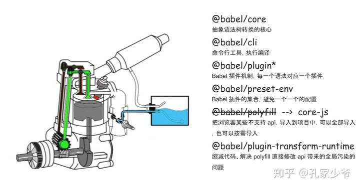

# Webpack

## `Webpack`的核心概念有哪些？

::: details 展开查看

Webpack 的核心概念是其构建和打包机制的基础，掌握这些概念能帮助你理解其工作原理并高效配置项目。以下是**Webpack 的核心概念总结**：

### **1. 入口（Entry）**
- **作用**：指示 Webpack 从哪个模块开始构建依赖图。
- **常见配置**：
  ```javascript
  module.exports = {
    entry: './src/index.js' // 单入口
    // 或多入口
    entry: {
      app: './src/app.js',
      vendor: './src/vendor.js'
    }
  };
  ```

### **2. 输出（Output）**
- **作用**：定义打包后的文件路径和名称。
- **常见配置**：
  ```javascript
  const path = require('path');
  module.exports = {
    output: {
      filename: '[name].bundle.js', // 使用占位符动态命名
      path: path.resolve(__dirname, 'dist'), // 输出目录
      publicPath: '/' // 静态资源的公共路径（常用于 CDN）
    }
  };
  ```
> [!NOTE]
> `output` 属性支持的占位符可以参看[Webpack 的Template strings](https://www.webpackjs.com/configuration/output/#template-strings)


### **3. Loader**
- **作用**：让 Webpack 能处理非 JavaScript 文件（如 CSS、图片等）。
- **核心规则**：
    - `test`：匹配文件类型（正则表达式）。
    - `use`：指定使用的 loader。
- **示例**：
  ```javascript
  module.exports = {
    module: {
      rules: [
        { 
          test: /\.css$/, 
          use: ['style-loader', 'css-loader'] // 从右到左执行
        },
        {
          test: /\.(png|jpg)$/,
          use: ['file-loader']
        }
      ]
    }
  };
  ```


### **4. 插件（Plugin）**
- **作用**：执行打包过程中的额外任务（如优化、资源管理、环境变量注入）。
- **常见插件**：
    - `HtmlWebpackPlugin`：自动生成 HTML 文件。
    - `MiniCssExtractPlugin`：提取 CSS 到单独文件。
    - `DefinePlugin`：定义全局常量（如环境变量）。
- **示例**：
  ```javascript
  const HtmlWebpackPlugin = require('html-webpack-plugin');
  module.exports = {
    plugins: [
      new HtmlWebpackPlugin({ template: './src/index.html' })
    ]
  };
  ```


### **5. 模式（Mode）**
- **作用**：通过设置 `development` 或 `production` 自动启用优化。
- **示例**：
  ```javascript
  module.exports = {
    mode: 'production' // 或 'development'、'none'
  };
  ```


### **6. 模块（Module）**
- **定义**：Webpack 中一切皆模块（JS、CSS、图片等）。
- **解析规则**：
    - 遵循 ES6 `import`、CommonJS `require()` 等语法。
    - 可通过 `resolve.alias` 配置路径别名。


### **7. Chunk（代码块）**
- **作用**：模块的集合，是 Webpack 内部分割代码的中间形态。
- **生成规则**：
    - 入口文件生成一个 Chunk。
    - 动态导入（`import()`）生成新的 Chunk。
    - 通过 `splitChunks` 配置公共代码 Chunk。


### **8. Bundle（打包结果）**
- **定义**：最终输出的文件（如 `bundle.js`），由多个 Chunk 合并生成。
- **与 Chunk 的区别**：  
  Chunk 是中间产物，Bundle 是最终输出的文件。


### **9. 依赖图（Dependency Graph）**
- **构建过程**：Webpack 从入口开始，递归解析所有依赖模块，形成依赖关系图。
- **特点**：
    - 支持循环依赖。
    - 通过静态分析（如 ES6 模块的 `import`）确定依赖。

### **10. 环境（Environment）**
- **开发环境**：注重调试（如 Source Map、热更新）。
- **生产环境**：注重性能（如代码压缩、Tree Shaking）。

:::

参考资料
- [Webpack 中文文档](https://www.webpackjs.com/concepts/)


## `Webpack`的打包流程

::: details 展开查看

关键流程图
```
初始化配置 → 读取入口 → 递归解析依赖 → Loader 转换 → 生成 Chunk → 优化 → 输出文件
```

构建过程核心完成了 **内容转换 + 资源合并** 两种功能，实现上包含三个阶段：

### 1. 初始化阶段：

1. **初始化参数**：从配置文件、 配置对象、Shell 参数中读取，与默认配置结合得出最终的参数
2. **创建编译器对象**：用上一步得到的参数创建 `Compiler` 对象
3. **初始化编译环境**：包括注入内置插件、注册各种模块工厂、初始化 RuleSet 集合、加载配置的插件等
4. **开始编译**：执行 `compiler` 对象的 `run` 方法
5. **确定入口**：根据配置中的 `entry` 找出所有的入口文件，调用 `compilition.addEntry` 将入口文件转换为 `dependence` 对象

### 2. 构建阶段：

1. **编译模块(make)**：根据 `entry` 对应的 `dependence` 创建 `module` 对象，调用 `loader` 将模块转译为标准 JS 内容，
调用 JS 解释器将内容转换为 AST 对象，从中找出该模块依赖的模块，再 递归 本步骤直到所有入口依赖的文件都经过了本步骤的处理
2. **完成模块编译**：上一步递归处理所有能触达到的模块后，得到了每个模块被翻译后的内容以及它们之间的 **依赖关系图**

### 3. 生成阶段：

1. **输出资源(seal)**：根据入口和模块之间的依赖关系，组装成一个个包含多个模块的 `Chunk`，再把每个 `Chunk` 转换成一个单
独的文件加入到输出列表，这步是可以修改输出内容的最后机会
2. **写入文件系统(emitAssets)**：在确定好输出内容后，根据配置确定输出的路径和文件名，把文件内容写入到文件系统

在以上过程中, `Webpack` 会在特定的时间点广播出特定的事件,插件在监听到感兴趣的事件后会执行特定的逻辑,并且插件可以调用 
`Webpack` 提供的 API 改变 `Webpack` 的运行结果。

:::

参考资料

- [[万字总结] 一文吃透 Webpack 核心原理](https://zhuanlan.zhihu.com/p/363928061)

- [[建议收藏] Webpack 4+ 优秀学习资料合集](https://zhuanlan.zhihu.com/p/372721645)


## `Webpack` 中的 `Loaders` 和 `Plugins` 有什么区别?

::: details 展开查看

在 Webpack 中，**Loaders（加载器）** 和 **Plugins（插件）** 是构建流程中的两大核心概念，它们的作用和职责有明显区别。

**1. 核心区别总结**
| **特性** | **Loaders** | **Plugins** |
|----------------|---------------------------------|------------------------------------|
| **主要作用** | **转换文件内容**（如转译、预处理） | **扩展构建流程**（优化、资源管理、注入环境变量等） |
| **执行时机** | 在模块加载时（文件转换为模块时） | 在整个构建生命周期（从初始化到输出）的各个阶段 |
| **配置方式** | 通过 `module.rules` 数组配置 | 通过 `plugins` 数组配置（需要 `new` 实例化） |
| **典型场景** | 处理 JS/CSS/图片等文件转译 | 生成 HTML、压缩代码、提取 CSS 等全局操作 |
| **依赖关系** | 针对特定文件类型（如 `.scss` ） | 不依赖文件类型，可干预整个构建流程 |

**2. Loaders 的作用与使用**
**核心功能**

- 将非 JavaScript 文件（如 CSS、图片、字体等）**转换为 Webpack 能处理的模块**。
- 对代码进行预处理（如 Babel 转译、Sass 编译）。

**配置示例**

```javascript
// webpack.config.js
module.exports = {
  module: {
    rules: [
      // 处理 CSS 文件
      {
        test: /\.css$/,
        use: ['style-loader', 'css-loader'],
      },
      // 处理 TypeScript 文件
      {
        test: /\.tsx?$/,
        use: 'ts-loader',
      },
      // 处理图片文件
      {
        test: /\.(png|jpg|gif)$/,
        type: 'asset/resource', // Webpack 5 内置方式（替代 file-loader）
      },
    ],
  },
}
```

**常见 Loaders**

- `babel-loader`: 将 ES6+ 代码转译为 ES5。
- `css-loader`: 解析 CSS 中的 `@import` 和 `url()`。
- `sass-loader`: 将 Sass/SCSS 编译为 CSS。
- `file-loader`: 处理文件（如图片）的导入路径。

**3. Plugins 的作用与使用**
**核心功能**

- 扩展 Webpack 的能力，干预构建流程的**任意阶段**。
- 执行更复杂的任务，如代码压缩、资源优化、环境变量注入等。

**配置示例**

```javascript
// webpack.config.js
const HtmlWebpackPlugin = require('html-webpack-plugin')
const MiniCssExtractPlugin = require('mini-css-extract-plugin')

module.exports = {
  plugins: [
    // 自动生成 HTML 文件，并注入打包后的资源
    new HtmlWebpackPlugin({
      template: './src/index.html',
    }),
    // 提取 CSS 为独立文件
    new MiniCssExtractPlugin({
      filename: '[name].[contenthash].css',
    }),
  ],
}
```

**常见 Plugins**

- `HtmlWebpackPlugin`: 生成 HTML 文件并自动引入打包后的资源。
- `MiniCssExtractPlugin`: 将 CSS 提取为独立文件（替代 `style-loader`）。
- `CleanWebpackPlugin`: 清理构建目录（Webpack 5 中可用 `output.clean: true` 替代）。
- `DefinePlugin`: 注入全局常量（如 `process.env.NODE_ENV`）。

**4. 执行流程对比**
**Loaders 的执行流程**

```plaintext
文件资源 (如 .scss) → 匹配 Loader 规则 → 按顺序应用 Loaders → 转换为 JS 模块
```

- **顺序关键**：Loaders 从右到左（或从下到上）执行。
  例如： `use: ['style-loader', 'css-loader', 'sass-loader']` 的执行顺序为：
  `sass-loader` → `css-loader` → `style-loader` 。

**Plugins 的执行流程**

```plaintext
初始化 → 读取配置 → 创建 Compiler → 挂载 Plugins → 编译模块 → 优化 → 输出
```

- **生命周期钩子**：Plugins 通过监听 Webpack 的[生命周期钩子](https://webpack.js.org/api/compiler-hooks/)（如 `emit`、`done`）干预构建流程。

**5. 协作示例**
一个同时使用 Loaders 和 Plugins 的典型场景：

```javascript
// webpack.config.js
const path = require('path')
const MiniCssExtractPlugin = require('mini-css-extract-plugin')
const HtmlWebpackPlugin = require('html-webpack-plugin')

module.exports = {
  entry: './src/index.js',
  output: {
    filename: 'bundle.js',
    path: path.resolve(__dirname, 'dist'),
    clean: true,
  },
  module: {
    rules: [
      {
        test: /\.scss$/,
        // Loaders 处理链：sass → css → MiniCssExtractPlugin
        use: [MiniCssExtractPlugin.loader, 'css-loader', 'sass-loader'],
      },
    ],
  },
  plugins: [
    // Plugin：提取 CSS 为文件
    new MiniCssExtractPlugin(),
    // Plugin：生成 HTML
    new HtmlWebpackPlugin(),
  ],
}
```

:::


## 关于 `Babel`

::: details 展开查看

`Babel` 是 `JavaScript` 的编译器. `Babel` 就是一套解决方案，用来把 ES6 的代码转化为浏览器或者其它环境支持的代码。
**注意我的用词哈，我说的不是转化为 ES5 ，因为不同类型以及不同版本的浏览器对 ES6 新特性的支持程度都不一样，
对于浏览器已经支持的部分，Babel 可以不转化，所以 Babel 会依赖浏览器的版本，后面会讲到。 
这里可以先参考 [browerslist](https://link.zhihu.com/?target=https%3A//twitter.com/browserslist) 项目。**


**babel组成**



:::

参考资料
- [关于babel](https://bbs.huaweicloud.com/blogs/100006)

- [babel 7：不仅是会用](https://zhuanlan.zhihu.com/p/131566326)

- [前端科普系列-Babel：把 ES6 送上天的通天塔](https://zhuanlan.zhihu.com/p/129089156)


## `Babel` 是什么？

::: details 展开查看

#### **1. Babel 是什么？**
- **定义**：Babel 是一个 JavaScript 编译器，主要用于将 **ES6+ 代码转换为向后兼容的 ES5 代码**，使代码能在旧版浏览器或环境中运行。
- **核心功能**：
  - **语法转换**：如箭头函数、类、解构赋值等。
  - **Polyfill**：通过 `core-js` 和 `regenerator-runtime` 实现新 API（如 `Promise`、`Array.from`）的兼容。
  - **代码压缩**：配合工具（如 UglifyJS）进行代码压缩。
  - **其他**：支持 JSX、TypeScript 等语法的转换。

#### **2. Babel 的工作流程**
Babel 的工作分为三个阶段：
1. **解析（Parse）**：
  - 将源代码解析为抽象语法树（AST）。
  - 使用 `@babel/parser`（原 Babylon）实现。
2. **转换（Transform）**：
  - 通过插件（Plugins）和预设（Presets）修改 AST。
  - 例如：将箭头函数转换为普通函数。
3. **生成（Generate）**：
  - 将修改后的 AST 重新生成目标代码。
  - 使用 `@babel/generator` 实现。


#### **3. 核心配置**
- **配置文件**：`.babelrc`、`babel.config.json` 或 `package.json` 中的 `babel` 字段。
- **常用配置项**：
  ```json
  {
    "presets": ["@babel/preset-env", "@babel/preset-react"],
    "plugins": ["@babel/plugin-transform-runtime"]
  }
  ```
- **关键概念**：
  - **Presets（预设）**：插件的集合，简化配置。
    - `@babel/preset-env`：按需转换 ES6+ 语法。
    - `@babel/preset-react`：支持 JSX。
    - `@babel/preset-typescript`：支持 TypeScript。
  - **Plugins（插件）**：实现具体转换逻辑。
    - 例如：`@babel/plugin-proposal-class-properties` 支持类属性语法。


#### **4. Polyfill 与 Runtime**
- **Polyfill**：
  - 通过 `core-js` 和 `regenerator-runtime` 实现新 API 的垫片。
  - 配置方式：在入口文件顶部引入 `core-js/stable` 和 `regenerator-runtime/runtime`。
- **@babel/plugin-transform-runtime**：
  - 避免重复注入辅助函数（如 `_classCallCheck`），减少代码体积。
  - 需配合 `@babel/runtime` 使用。


#### **5. Babel 7+ 新特性**
- **core-js 3**：更细粒度的 Polyfill 控制。
- **按需加载**：通过 `@babel/preset-env` 的 `useBuiltIns: 'usage'` 自动按需引入 Polyfill。
- **TypeScript 支持**：通过 `@babel/preset-typescript` 直接编译 TS 代码（需配合类型检查工具如 `tsc`）。


#### **6. 与构建工具集成**
- **Webpack**：通过 `babel-loader` 处理 JS 文件。
- **Rollup**：使用 `@rollup/plugin-babel`。
- **Gulp**：通过 `gulp-babel` 插件。


:::


## Webpack中, 如何实现按需加载？

参考答案

::: details

在 Webpack 中实现按需加载（代码分割/懒加载）的核心思路是 **将代码拆分为独立 chunk，在需要时动态加载**。

**一、基础方法：动态导入（Dynamic Import）**
通过 `import()` 语法实现按需加载，Webpack 会自动将其拆分为独立 chunk。

**1. 代码中使用动态导入**

```javascript
// 示例：点击按钮后加载模块
document.getElementById('btn').addEventListener('click', async () => {
  const module = await import('./module.js')
  module.doSomething()
})
```

**2. 配置 Webpack**
确保 `webpack.config.js` 的 `output` 配置中包含 `chunkFilename` ：

```javascript
module.exports = {
  output: {
    filename: '[name].bundle.js',
    chunkFilename: '[name].[contenthash].chunk.js', // 动态导入的 chunk 命名规则
    path: path.resolve(__dirname, 'dist'),
    publicPath: '/', // 确保 chunk 的公共路径正确
  },
}
```

**二、框架集成：React/Vue 路由级按需加载**
结合前端框架的路由系统实现组件级懒加载。

**React 示例**

```javascript
import React, { Suspense, lazy } from 'react'
import { BrowserRouter as Router, Route, Switch } from 'react-router-dom'

const Home = lazy(() => import('./routes/Home'))
const About = lazy(() => import('./routes/About'))

function App() {
  return (
    <Router>
      <Suspense fallback={<div> Loading... </div>}>
        {' '}
        <Switch>
          <Route exact path="/" component={Home} />{' '}
          <Route
            path="/about
        "
            component={About}
          />{' '}
        </Switch>{' '}
      </Suspense>{' '}
    </Router>
  )
}
```

**Vue 示例**

```javascript
const routes = [
  {
    path: '/',
    component: () => import('./views/Home.vue'),
  },
  {
    path: '/about',
    component: () => import('./views/About.vue'),
  },
]
```

**三、优化配置：代码分割策略**
通过 `SplitChunksPlugin` 优化公共代码提取。

**Webpack 配置**

```javascript
module.exports = {
  optimization: {
    splitChunks: {
      chunks: 'all', // 对所有模块进行分割（包括异步和非异步）
      cacheGroups: {
        vendors: {
          test: /[\\/]node_modules[\\/]/,
          name: 'vendors', // 提取 node_modules 代码为 vendors 块
          priority: 10, // 优先级
          reuseExistingChunk: true,
        },
        common: {
          minChunks: 2, // 被至少两个 chunk 引用的代码
          name: 'common',
          priority: 5,
          reuseExistingChunk: true,
        },
      },
    },
  },
}
```

**四、Babel 配置（如需支持旧浏览器）**
安装 Babel 插件解析动态导入语法：

```bash
npm install @babel/plugin-syntax-dynamic-import --save-dev
```

在 `.babelrc` 或 `babel.config.json` 中添加插件：

```json
{
  "plugins": ["@babel/plugin-syntax-dynamic-import"]
}
```

**五、预加载与预取（可选优化）**
通过注释提示浏览器提前加载资源（需结合框架使用）。

**React 示例**

```javascript
const About = lazy(
  () =>
    import(
      /* webpackPrefetch: true */ // 预取（空闲时加载）
      /* webpackPreload: true */ // 预加载（与父 chunk 并行加载）
      './routes/About'
    )
)
```

**六、验证效果**

1. **构建产物分析**：

  - 运行 `npx webpack --profile --json=stats.json` 生成构建报告。
  - 使用 [Webpack Bundle Analyzer](https://github.com/webpack-contrib/webpack-bundle-analyzer) 可视化分析 chunk 分布。

2. **网络请求验证**：
  - 打开浏览器开发者工具，观察触发动态导入时是否加载新 chunk。

:::


## 什么是 Tree Shaking？如何在 Webpack 中启用它？

参考答案

::: details

**Tree Shaking（摇树优化）** 是一种在打包过程中 **移除 JavaScript 项目中未使用代码（Dead Code）** 的优化技术。它的名字形象地比喻为“摇动树以掉落枯叶”，即通过静态代码分析，识别并删除未被引用的模块或函数，从而减小最终打包体积。

**Tree Shaking 的工作原理**

1. **基于 ES Module（ESM）的静态结构**
   ESM 的 `import/export` 是静态声明（代码执行前可确定依赖关系），而 CommonJS 的 `require` 是动态的。只有 ESM 能被 Tree Shaking 分析。
2. **标记未使用的导出**
   打包工具（如 Webpack）通过分析代码，标记未被任何模块导入的导出。
3. **压缩阶段删除**
   结合代码压缩工具（如 Terser）删除这些标记的未使用代码。

**在 Webpack 中启用 Tree Shaking 的步骤**
**1. 使用 ES Module 语法**
确保项目代码使用 `import/export` ，而非 CommonJS 的 `require` 。

```javascript
// ✅ 正确：ESM 导出
export function add(a, b) {
  return a + b
}
export function subtract(a, b) {
  return a - b
}

// ✅ 正确：ESM 导入
import { add } from './math'

// ❌ 错误：CommonJS 导出
module.exports = {
  add,
  subtract,
}
```

**2. 配置 Webpack 的 `mode` 为 `production` **
在 `webpack.config.js` 中设置 `mode: 'production'` ，这会自动启用 Tree Shaking 和代码压缩。

```javascript
module.exports = {
  mode: 'production', // 启用生产模式优化
  // ...
}
```

**3. 禁用模块转换（Babel 配置）**
确保 Babel 不会将 ESM 转换为 CommonJS。在 `.babelrc` 或 `babel.config.json` 中设置：

```json
{
  "presets": [
    ["@babel/preset-env", { "modules": false }] // 保留 ESM 语法
  ]
}
```

**4. 标记副作用文件（可选）**
在 `package.json` 中声明哪些文件有副作用（如全局 CSS、Polyfill），避免被错误删除：

```json
{
  "sideEffects": [
    "**/*.css", // CSS 文件有副作用（影响样式）
    "src/polyfill.js" // Polyfill 有副作用
  ]
}
```

若项目无副作用文件，直接设为 `false` ：

```json
{
  "sideEffects": false
}
```

**5. 显式配置 `optimization.usedExports` **
在 `webpack.config.js` 中启用 `usedExports` ，让 Webpack 标记未使用的导出：

```javascript
module.exports = {
  optimization: {
    usedExports: true, // 标记未使用的导出
    minimize: true, // 启用压缩（删除未使用代码）
  },
}
```

**验证 Tree Shaking 是否生效**
**方法 1：检查打包后的代码**
若未使用的函数（如 `subtract` ）被删除，说明 Tree Shaking 生效：

```javascript
// 打包前 math.js
export function add(a, b) {
  return a + b
}
export function subtract(a, b) {
  return a - b
}

// 打包后（仅保留 add）
function add(a, b) {
  return a + b
}
```

**方法 2：使用分析工具**
通过 [Webpack Bundle Analyzer](https://github.com/webpack-contrib/webpack-bundle-analyzer) 可视化分析打包结果：

```bash
npm install --save-dev webpack-bundle-analyzer
```

配置 `webpack.config.js` ：

```javascript
const BundleAnalyzerPlugin = require('webpack-bundle-analyzer').BundleAnalyzerPlugin

module.exports = {
  plugins: [new BundleAnalyzerPlugin()],
}
```

运行构建后，浏览器将自动打开分析页面，检查未使用的模块是否被移除。

| **步骤**             | **关键配置**                         | **作用**                     |
| -------------------- | ------------------------------------ | ---------------------------- |
| 使用 ESM 语法        | `import/export`                      | 提供静态分析基础             |
| 设置生产模式         | `mode: 'production'`                 | 自动启用 Tree Shaking 和压缩 |
| 配置 Babel           | `"modules": false`                   | 保留 ESM 结构                |
| 标记副作用文件       | `package.json` 的 `sideEffects` 字段 | 防止误删有副作用的文件       |
| 显式启用 usedExports | `optimization.usedExports: true`     | 标记未使用的导出             |

:::


## 什么是`bundle`,什么是`chunk`，什么是`module`?

::: details 展开查看
在`Webpack`中，`module`、`chunk`和`bundle`是三个核心概念，它们分别对应代码在不同阶段的形态与作用。以下是详细的解析：

### 一、`Module`（模块）
**定义** 
`Module`是`Webpack`处理的最小单元，代表项目中所有独立的功能块或资源文件。`Webpack`的“万物皆模块”理念意味着不仅`JavaScript`文件是模块，
CSS、图片、字体等资源也被视为模块。
**关键特性：**
1. 类型多样性：包括`JavaScript`模块（如`.js`、`.mjs`）、样式模块（如`.css`、`.scss`）、静态资源（如`.png`、`.svg`）等。
2. 依赖管理：模块之间通过`import`或`require`建立依赖关系，`Webpack`通过依赖图（Dependency Graph）分析这些关系。
3. 转换与封装：通过`Loader`（如`babel-loader`、`css-loader`）将非`JavaScript`模块转换为`Webpack`可处理的格式。
4. 内置模块：`Webpack`内部也会生成特殊模块（如`AsyncModuleRuntimeModule`），用于处理异步加载逻辑。

### 二、Chunk（代码块）
**定义**
`Chunk`是`Webpack`在打包过程中生成的中间产物，由多个模块组成，用于实现代码分割、动态加载等优化策略。
`Chunk`最终会被转换为浏览器可执行的`Bundle`。

**生成途径：**

1. 入口文件（`Entry`） ：每个入口点（如配置中的`entry: { main: './src/index.js' }`）会生成一个初始`Chunk`。
2. 异步加载：通过`import()`动态导入的模块会生成单独的`Chunk`（如`chunkFilename: '[name].async.js`）。
3. 代码分割：使用`SplitChunksPlugin`提取公共代码（如第三方库`node_modules`）或按需拆分代码。
4. 运行时（`Runtime`） ：`Webpack 5`支持将运行时代码（如模块加载逻辑）抽离为独立的`Chunk`。

**关键特性：**

**包含运行时代码**：`Chunk`不仅包含模块内容，还可能包含`Webpack`注入的运行时代码，用于管理模块加载与依赖关系。
灵活性：`Chunk`与`Bundle`通常是一对一关系，但在某些配置下（如生成`SourceMap`）可能一对多。
优化手段：通过`Chunk`划分，可实现按需加载、减少初始加载体积。

### 三、Bundle（包）
**定义**
`Bundle`是`Webpack`打包后的最终输出文件，由`Chunk`经过压缩、合并和优化后生成，可直接部署到生产环境并在浏览器中执行。

**关键特性：**

- 优化手段：通过工具（如`UglifyJS`、`Brotli`）压缩代码体积，提升加载性能。
- 命名规则：通常基于`Chunk`名称生成（如`[name].bundle.js`），支持哈希值用于缓存控制。
- 多文件输出：一个项目可能生成多个`Bundle`（如`main.bundle.js`、`vendor.bundle.js`），分别对应不同功能模块。
- 与`Chunk`的关系：`Bundle`是`Chunk`的最终形态，但某些配置（如`devtool: 'source-map'`）会导致一个`Chunk`生成多个`Bundle`（如`.js`文件和`.js.map`文件）。


### 四、三者的关系与流程
**转换流程：**
```
Module → Chunk → Bundle
```


`Module`是开发者编写的原始代码。
`Chunk`是`Webpack`根据入口、异步加载或代码分割策略生成的中间代码块。
`Bundle`是经过优化的最终产物。
**典型场景：**

- 单入口项目：所有模块合并为一个`Chunk`，最终生成一个`Bundle`。
- 多入口项目：每个入口生成独立`Chunk`，对应多个`Bundle`。
- 动态加载：异步模块生成额外`Chunk`，按需加载时生成对应的`Bundle`。
**优化意义：**

- 减少初始加载时间：通过代码分割将非关键代码拆分为异步`Bundle`。
- 缓存优化：将稳定代码（如第三方库）分离为独立`Bundle`，利用浏览器缓存。


### 五、总结对比

|概念 |	定义 |	生成阶段 |	典型用途 |	示例 |
|----|----|----|----|----|
|`Module` |	项目中的单个文件或功能块 |	开发阶段 |	代码组织与依赖管理 |	`app.js`、`styles.css`|
|`Chunk` |	由模块组成的代码块 |	打包过程（中间产物）|	代码分割、动态加载 |	入口`Chunk`、异步`Chunk `|
|`Bundle` |	经过优化的最终输出文件 |	打包完成（最终产物）|	部署到生产环境，供浏览器直接执行 |	`main.bundle.js` |

:::
