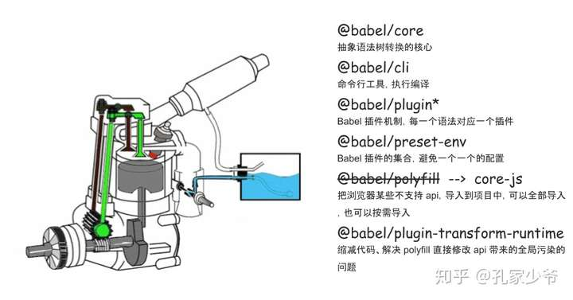

# 工程化

## 一、为什么要工程化

因为在浏览器端，开发时态、运行时态的侧重点不一样：

**开发时态：** `devtime`

1. 模块划分越细越好
2. 支持多种模块化标准
3. 不考虑兼容性，怎么方便怎么写
4. 支持 npm 或其他包管理器下载的模块

**运行时态：** `runtime`

1. 文件越少越好
2. 文件体积越小越好
3. 代码内容越乱越好（安全性）
4. 所有浏览器都要兼容
5. 能够解决其他运行时的问题，主要是执行效率问题

这种差异在小项目中表现的并不明显，可是一旦项目形成规模，就越来越明显，如果不解决这些问题，前端项目形成规模只能是空谈。

**解决方法**

既然两种时态面临的侧重点不同，那么我们需要一个工具，能够将开发时态写的代码转换为运行时态的代码。

此时开发者只用专注开发左边的代码结构就好，一切问题，都由构建工具抹平。


常见的构建工具：**webpack**、vite、grunt、gulp、browserify ...

---

## 二、webpack 基础


**webpack 是基于模块化的打包(构建)工具，它把一切视为模块。**

它通过一个开发时态的入口模块为起点，分析出所有的依赖关系，然后经过一系列的过程(压缩、合并)，最终生成运行时态的文件。

### 01｜特性

* **为前端工程化而生**：webpack 致力于解决前端工程化，特别是浏览器端工程化中遇到的问题，让开发者集中注意力编写业务代码，而把工程化过程中的问题全部交给 webpack 来处理
* **简单易用**：支持零配置，可以不用写任何一行额外的代码就使用 webpack
* **强大的生态**：非常灵活、可以扩展，webpack 本身的功能并不多，但它提供了一些可以扩展其功能的机制，使得一些第三方库可以融于到 webpack 中
* **基于nodejs**： 由于 webpack 在构建的过程中需要读取文件，因此它是运行在 node 环境中的
* **基于模块化**：webpack 在构建过程中要分析依赖关系，方式是通过模块化导入语句进行分析的，它支持各种模块化标准，包括但不限于 CommonJS、ES6 Module

### 02｜安装与使用

**步骤 1：初始化项目**

创建项目目录：

```bash
mkdir my-webpack-project
cd my-webpack-project

```

初始化项目： `npm init -y`

**步骤 2：安装 Webpack 和 Webpack CLI**

```bash
npm install --save-dev webpack webpack-cli

```

**步骤 3：创建 Webpack 配置文件**

在项目根目录下创建一个名为 `webpack.config.js` 的文件，并添加以下基本配置：

```javascript
const path = require('path');

module.exports = {
  entry: './src/index.js', // 入口文件
  output: {
    filename: 'bundle.js', // 输出文件名
    path: path.resolve(__dirname, 'dist') // 输出路径
  },
  mode: 'development' // 模式，可以是 'development' 或 'production'
};

```

**步骤 4：创建项目结构**

创建必要的目录和文件：

```bash
mkdir src
touch src/index.js

```

在 `src/index.js` 文件中添加一些示例代码：

```javascript
console.log('Hello, Webpack!');

```

**步骤 5：更新 package.json 脚本**

在 `package.json` 文件中添加一个脚本来运行 Webpack：

```json
{
  "name": "my-webpack-project",
  "version": "1.0.0",
  "description": "",
  "main": "index.js",
  "scripts": {
    "build": "webpack"
  },
  "devDependencies": {
    "webpack": "^5.0.0",
    "webpack-cli": "^4.0.0"
  }
}

```

**步骤 6：运行 Webpack**

使用以下命令运行 Webpack 构建项目：`npm run build`

运行成功后，你将在项目根目录下看到一个 dist 目录，里面包含了 bundle.js 文件。

---

## 三、市面常见面试题

### 00｜减少代码体积方案

减少代码体积是**优化前端性能**的重要步骤，主要通过以下几种方法来实现：

**1、代码压缩**

通过删除代码中的空格、注释、换行符以及缩短变量名等方式来减少代码体积。

**2、样式和脚本的合并**

将多个 CSS 文件和 JavaScript 文件合并成一个文件，以减少 HTTP 请求的数量，从而提高加载速度。

**3、移除未使用的代码（Tree Shaking）**

Tree Shaking 是一种通过静态分析模块依赖关系，移除未使用代码的技术。常用的工具包括：

* Webpack：支持 Tree Shaking 的打包工具。
* Rollup：专注于 ES6 模块的打包工具，支持 Tree Shaking。

**4、延迟加载**

指在需要时才加载某些资源，以减少初始加载的代码体积，常用的方法包括：

* 动态导入：在需要时才加载模块。
* 按需加载：将代码分割成多个小块，按需加载。

**5、图片和资源优化**

虽然这不直接减少 JavaScript 或 CSS 代码的体积，但优化图片和其他资源可以显著减少整体页面的加载时间。常用的方法包括：

* 图片压缩：使用工具如 `ImageOptim`、`TinyPNG` 等。
* 使用矢量图：如 `SVG` 格式的图像。
* 使用 `WebP` 格式：比传统的 `JPEG` 和 `PNG` 更小。

### 01｜为什么要用 Webpack

没用 webpack 之前有什么问题：

1. **全局变量污染：** 传统的 JavaScript 开发中，所有变量和函数默认都是全局的；
2. **手动管理依赖顺序麻烦：** 在`<script />`里引入外部 JS 难度随着项目体量越来越难；
3. **手动进行性能优化繁琐：** 如文件合并、压缩、减少 HTTP 请求，繁琐且易出错；
4. **要确保代码在不同浏览器中的兼容性：** 需要手动编写或引入 polyfills、babel 等第三方工具；

对于小型项目来说，这些问题不太明显。但随之项目规模逐渐增大，再去解决这些问题就很吃力，这个时候我们就**需要一种工具来帮我们把这些机械性问题，自动化的解决掉，让开发者更加专注在业务层面**。

### 02｜webpack 有哪些常见配置

有两种方式可以来控制 webpack 的行为。

* **配置文件（默认）** ： webpack 会读取 `webpack.config.js`；
* **命令行**：或者通过 cli 参数 `--config` 来指定其他配置文件；

配置文件通过 CommonJS 导出一个对象`module.exports = {}`，对象中的各种属性对应不同的 webpack 配置。当命令行参数与配置文件出现冲突时，以命令行参数为准。常见配置见下文代码：

1. **入口(entry)：** 指示 webpack 应该使用哪个模块，来作为构建其内部依赖图的开始。
2. **输出(output)：** 告诉 webpack 在哪输出它所创建的 bundles，以及如何命名这些文件。
3. **转换器(module)：** 声明 loader 用法。将某个源码字符串转换成另一个源码字符串返
  * test：正则表达式，用于标识 Loader 转换哪类文件。
  * use：字符串，标识使用哪些 Loader。调用规则从后向前，如下文处理 css 的 loader 会先使用 `css-loader` 处理，得到的结果再传给 `style-loader`。
4. **插件(plugins)：** 扩展了 webpack 的功能，并提供其编译过程中的一些事件钩子，plugin 去监听这些内容然后进行操作。
5. ...

```javascript
const path = require('path');
const HtmlWebpackPlugin = require('html-webpack-plugin');
const webpack = require('webpack');
const TerserPlugin = require('terser-webpack-plugin');

module.exports = {
  entry: './src/index.js',	// 打包的入口文件

  // 指定打包后文件的输出位置和文件名
  output: {
    path: path.resolve(__dirname, 'dist'),
    filename: 'bundle.js',
  },

  // 指定 Webpack 模式，可以是 development、production 或 none。
  mode: 'development',

  // 配置 Loader，用于处理不同类型的文件
  module: {
    rules: [
      {
        test: /.js$/,
        exclude: /node_modules/,
        use: 'babel-loader',
      },
      {
        test: /.css$/,
        use: ['style-loader', 'css-loader'],
      },
      {
        test: /.(png|svg|jpg|gif)$/,
        use: ['file-loader'],
      },
    ],
  },

  // 配置插件，用于执行各种任务，如打包优化、资源管理等
  plugins: [
    new HtmlWebpackPlugin({
      template: './src/index.html',
    }),
    // 使用 DefinePlugin 插件定义环境变量
    new webpack.DefinePlugin({
      'process.env.NODE_ENV': JSON.stringify('production'),
    }),
    new WebpackManifestPlugin({
      fileName: 'manifest.json', // 生成的 Manifest 文件名
      publicPath: '/', // 公共路径
    }),
  ],

  // 配置开发服务器，用于本地开发和热更新
  devServer: {
    contentBase: './dist',
    hot: true,
    proxy: {
      '/api': 'http://localhost:3000',
    }, // 配置代理，用于将特定 URL 路径代理到另一个服务器
  },

  // 配置模块解析选项
  resolve: {
    // 自动补全文件扩展名，这样在导入模块时，可以省略这些扩展名
    extensions: ['.js', '.jsx', '.json'],
    // 创建模块别名，以便更方便地导入模块
    alias: {
      '@components': path.resolve(__dirname, 'src/components/'),
      '@utils': path.resolve(__dirname, 'src/utils/'),
    },
  },

  // 配置优化选项，如代码分割和压缩
  optimization: {
    splitChunks: {
      chunks: 'all',
    },
    minimize: true,
    minimizer: [
      new TerserPlugin({
        terserOptions: {
          compress: {
            drop_console: true,
          },
        },
      }),
    ],
  },

  // 配置 SourceMap 选项，用于调试，默认没 SourceMap
  devtool: 'source-map',
};

```
### 03｜webpack 的构建/打包流程是什么（高频）

1. **初始化参数**：从配置文件 和 Shell 语句中读取与合并参数，得出最终的参数；
2. **开始编译**：用上一步得到的参数

  1. 初始化 Compiler 对象
  2. 加载所有配置的 Plugin 插件
  3. 执行对象的 `run` 方法开始执行编译；
3. **确定入口**：根据配置项的 `entry`，找出所有的入口文件；
4. **编译模块**：从入口文件出发，调用所有配置的 Loader 对模块进行翻译，再找出该模块依赖的模块，递归此步骤直到所有依赖的文件也都处理过；
5. **输出资源**：根据入口和模块之间的依赖关系，组装成一个包含多个模块的 Chunk。再把每个 Chunk 转换成一个单独的文件加入到输出列表，这步是可以修改输出内容的最后机会；
6. **输出完成**：在确定好输出内容后，根据`output`确定输出的路径和文件名，输出文件夹。

在以上过程中，Webpack 会在特定的时间点广播出特定的事件，插件在监听到感兴趣的事件后会执行特定的逻辑，并且插件可以调用 Webpack 提供的 API 改变 Webpack 的运行结果。

总的来说，Webpack 的模块打包原理就是通过递归解析模块之间的依赖关系，将所有的模块打包成为一个或多个文件，并通过一系列的插件和 loader 对代码进行处理和优化。

这样可以减少 HTTP 请求次数、提高页面加载速度，并大大提高了前端开发的效率和可维护性。

### 04｜webpack 如何确定依赖引用顺序

依赖图的构建过程

1. 入口点：Webpack 从配置的入口点`entry`开始，从入口文件开始解析。
2. 递归解析：递归解析每个模块的依赖，找到所有被引用的模块。
3. 构建依赖图：根据模块之间的依赖关系构建一个依赖图。
4. 确定顺序：根据依赖图确定模块的引用顺序，确保被依赖的模块先于依赖它们的模块打包。

### 05｜Module/Chunk/Bundle 是什么

* **Module**：webpack 里一个概念性内容，每个文件都可以看为一个 module。 js、css、图片等都可以看作 module。
* **Chunk**：代码块，webpack 处理代码时候的一个中间态，它表示有一组功能相关的模块的集合。一个 Chunk 可以由多个模块（module）组成
* **Bundle**：是 Webpack 构建结果的输出，由一个或多个 Chunk 的合并优化后的结果，最终以文件形式输出，用于在浏览器中加载和执行。

### 06｜Loader 和 Plugin有什么区别（高频）

`Loader` 转换器，用于转换模块的源代码。可以将不同类型的文件（如 CSS、图像、TypeScript 等）转换为 JavaScript 模块，从而使它们能够被 Webpack 处理。以下是 CSS 转换的例子：

```javascript
// css-loader 转换后的 JavaScript 模块
module.exports = {
  // CSS 内容被转换为字符串
  css: "body { background-color: lightblue; } h1 { color: navy; }"
};

// style-loader 会将这些样式注入到 DOM 中
const style = document.createElement('style');
style.textContent = module.exports.css;
document.head.appendChild(style);

```

`Plugin` 插件是 Webpack 的扩展，执行范围更广，可以在构建过程的各个阶段进行操作和自定义功能。Webpack 会提供一些 API 和 生命周期钩子方便开发者触达到除了编译之外的一些环节来执行操作。

**使用场景**

* 压缩输出的 JavaScript 文件（如使用 TerserPlugin）。
* 提取 CSS 到单独的文件（如使用 MiniCssExtractPlugin）。
* 生成 HTML 文件并自动注入打包后的资源（如使用 HtmlWebpackPlugin）。
* 清理输出目录（如使用 CleanWebpackPlugin）。

### 07｜写 Loader 的步骤和思路

Loader 本质上是一个函数，作用是将**某个源码字符串转换成另一个源码字符串返**回。接收源文件代码字符串为参数，经过处理转换，然后 `return` 目标代码字符串，构建步骤如下：

```javascript
module.exports = function(source) {
  // 对源代码进行处理
  const result = source.replace(/\b(foo)\b/g, 'bar');
  // 返回更新后的代码
  return result;
};

```

1. 新建一个 JS 文件
2. 写 Loader 函数：
  1. 接收 `source` 参数
  2. 内容转换
  3. 结果返回
3. 导出这个函数
4. 在 `webpack.config.js` 文件中配置使用
5. 如果想发布 NPM 就走发布流程，然后写份清晰的文档

`注意`：如果 Loader 有异步操作需要通过 `this.async()` 处理，不然可能会出现 Loader 函数在异步操作完成前返回，导致转换结果不正确。

`this.async()`方法返回一个回调函数，你将通过这个回调函数来返回处理结果或错误。回调接收三个参数

* 错误：Loader 执行过程中出错，则返回给这个参数。没错就传 `null/undefined`
* 结果：Loader 执行成功后的结果
* SourceMap（可选）：如果转换过程中能产生 SourceMap 可以通过这个传参帮助定位错误位置

```javascript
module.exports = function(source) {
  const callback = this.async();

  someAsyncOperation(source, (err, transformedSource, sourceMap) => {
    if (err) {
      // 如果有错误发生，传递错误对象
      callback(err);
      return;
    }
    // 成功处理，传递处理后的结果和source map（如果有的话）
    callback(null, transformedSource, sourceMap);
  });
};

```
### 08｜写 Plugin 的步骤和思路

在 Webpack 中，**Plugin 是一个具有** `apply` **方法的对象。**

`apply` 方法会被 Compiler 对象调用，并且在整个编译生命周期可以访问 Compiler 对象。所以步骤如下：

1. 编写插件类：创建一个类，实现 `apply` 方法。Webpack 在启动编译过程时，会调用每个插件实例的 `apply` 方法
2. 注册钩子回调：在 `apply` 方法中，使用编译器 **Compiler** 对象注册你需要的钩子回调。
3. 实现功能逻辑：在回调函数中实现具体的插件逻辑。

```javascript
// 通过 tap 方法注册钩子，第一个参数是插件名称，第二个参数是回调函数
module.exports = class MyPlugin {
    apply(compiler) {
        // 注册事件，类似于window.onload = function() {}
        compiler.hooks.done.tap('MyPlugin', (Compilation) => {
            console.log('MyPlugin: Compilation finished!');
        });
    }
}

```

在这个例子中，MyPlugin 类定义了一个 apply 方法，这个方法接收一个 compiler 参数。

我们在 `compiler.hooks.done` 上注册了一个回调，这个回调会在编译完成后执行，输出一条消息。

要将插件应用到 webpack，需要把插件对象配置到 webpack 的 plugins 数组中，如下：

```javascript
const MyPlugin = require('./MyPlugin');

module.exports = {
    plugins: [
        new MyPlugin(),
    ]
}

```
### 09｜用过哪些常见 Loader

在Webpack中，loader用于将各种类型的文件转换为模块。以下是一些常见的loader及其用途：

1. `babel-loader`

* **用途**：将 ES6 及以上版本的 JavaScript 代码转换为向后兼容的 JavaScript 代码。

2. `css-loader`/`style-loader` 这俩一般一起用

* css-loader 解析 CSS 文件中的`@import`和`url()`，将 CSS 转为 Webpack 可管理的模块。
* style-loader 将处理后的 CSS 注入页面，通过在`<head>`中添加`<style>`标签应用样式。

```javascript
module: {
  rules: [
    {
      test: /.css$/,
      use: [
        'style-loader', // Step 2: 将CSS注入到DOM中
        'css-loader' // Step 1: 处理CSS文件
      ]
    }
  ]
}

```

4. `sass-loader`/`less-loader`

* **用途**：将 Sass/SCSS/Less 文件编译为CSS。

```javascript
{
  test: /.s[ac]ss$/,
  use: ['style-loader', 'css-loader', 'sass-loader']
}

```

5. `file-loader`

* **用途**：处理文件导入，将文件输出到输出目录，并返回 URL。

6. `url-loader`

* **用途**：用于将文件（如图片、字体等）转换为 `base64` 编码的 `Data URL`。
* 当文件较小时，这可以减少 HTTP 请求的数量，从而提高性能。
* 文件较大时，`url-loader` 会自动回退到 `file-loader`，将文件复制到输出目录并返回文件的 URL。

7. `ts-loader`

* **用途**：将TypeScript代码编译为JavaScript代码。

> Base64 编码的 Data URL 是一种将文件数据直接嵌入到网页中的方式，而不需要单独的文件请求。
>
> 它将文件内容转换为 Base64 编码的字符串，并将其作为 URL 的一部分。这种方法可以减少 HTTP 请求的数量，特别适用于小文件（如小图片、图标等）。

#### 一、Babel 原理

Babel 是 JS 的转换器，主要用来将新 JS 语法转为向后兼容版本

原理很简单，就三部分：**解析/转换/生成**。

* 解析：通过词法分析把代码变 token、语法分析把 token 解析成抽象语法树（AST）
* 转换：接收到 AST 并遍历，对树上节点增删改实现兼容性转换
* 生成：被转换的新 AST 被生成为新 JS 代码字符串

#### 二、less-loader 的底层原理

这个问题别想太多，直接秒

就是**接收 less 代码为入参，内部转换为 css 代码，然后输出**。

一般后面会跟着执行 `style-loader/css-loader` 继续处理转换后的 css 代码。

### 10｜用过哪些常见 Plugin

1. **HtmlWebpackPlugin**：自动生成 HTML 文件，并自动引入打包后的 JS 文件。
2. MiniCssExtractPlugin：将 CSS 提取为独立的文件，支持按需加载和缓存。
3. HotModuleReplacementPlugin：模块热替换（HMR），实现页面实时预览更新。
4. **TerserWebpackPlugin**：压缩 JavaScript，Webpack 4+ 默认内置。
5. **OptimizeCSSAssetsPlugin**：优化和压缩 CSS 资产。
6. **BundleAnalyzerPlugin**：可视化 Webpack 输出文件的大小，帮助分析和优化。

### 11｜SourceMap 原理（高频）

配置 `devtool: 'source-map'`后，

在编译过程中，会生成一个 `.map` 文件，一般用于代码调试和错误监控。

* 包含了源代码、编译后的代码、以及它们之间的映射关系。
* 编译后的文件通常会在文件末尾添加一个注释，指向 SourceMap文件的位置。
  + `// # sourceMappingURL=example.js.map`
* 当在浏览器开发者工具调试时，浏览器会读取这行注释并加载对应的 SourceMap 文件

报错时，点击跳转。即使运行的是编译后的代码，也能够追溯到原始源代码的具体位置，而不是处理经过转换或压缩后的代码，从而提高了调试效率。

**跟 Mainfest 的区别**

* SourceMap 主要用于调试目的，让开发者能够在压缩或转译后的代码中**追踪到原始代码**。
* Manifest 文件用于资源管理，用于**优化资源的加载和缓存**。

### 12｜Mainfest 文件是什么，有什么用

Mainfest（更新清单），通常是一个 JSON 文件。需要配置 `WebpackManifestPlugin` 插件

在 Webpack 输出阶段生成，用于记录所有模块及其依赖关系的映射用来**管理模块加载、优化浏览器缓存。** 包含：

* **模块标识符：** 每个模块都有一个唯一标识符，这些标识符用于在运行时查找和加载模块。
* **Chunk 映射关系**：包含 chunk 与包含的模块之间的映射关系，以及 chunk 之间的依赖关系。这有助于运行时确定哪些 chunk 需要被加载。
* **Hash 值：** 每个输出文件的 hash 值。有助于浏览器判断文件是否有更新，从而决定是加载缓存中的资源还是重新请求新的资源。

```
{
  "main.js": "main.1a2b3c4d5e6f7g8h9i0j.js",
  "vendor.js": "vendor.1a2b3c4d5e6f7g8h9i0j.js"
}

```

生成的 Manifest 文件可以用于以下场景：

* 服务端渲染: 在服务端渲染时，可以使用 Manifest 文件来生成正确的脚本标签，确保引用最新的资源。
* 缓存管理: 通过记录文件的哈希值，确保在文件内容变化时，客户端能够获取到最新的文件，而不是使用缓存的旧文件。
* 动态加载: 在需要按需加载模块时，可以使用 Manifest 文件来查找模块的路径。

### 13｜Webpack 热替换 HMR 原理（高频）

没热替换之前，每次改代码之后要重新刷新页面才能看到新的页面。

热替换可以让我们不用刷新浏览器，通过增删改模块来实时更新页面。**HMR 的实现依赖于 Webpack Dev Server 启动一个 WebSocket 服务器**，跟浏览器进行全双工通信。

1. **服务器和客户端的通信**：Webpack Dev Server 在服务端**启动一个 WebSocket 服务器**，浏览器通过 WebSocket 连接此服务器。
2. **监听文件变化**： Webpack 使用 `watch` 模式监听项目中的文件变化。**一旦文件发生变化，Webpack 就会重新编译改变的模块，并生成更新后的模块代码及一个更新清单（** **Mainfest** **）** 。
3. **通知客户端**：更新清单会通过已建立的 WebSocket 连接发送给客户端（浏览器） 。
4. **热替换**：浏览器接收到更新信息后，通过 `HMR API` 获取更新的模块，并替换旧的模块。
  * 如果模块热替换失败，会触发整页刷新。

Webpack 的 HMR 功能极大地提高了开发效率，使得开发者可以即时看到代码变更的效果，而无需进行完整的页面刷新。这不仅加快了开发流程，也使得调试更加方便。

**用法**

1. 通过配置项`devServer.hot: true`，启用 HMR 功能。
2. 或者使用`HotModuleReplacementPlugin` HMR 插件。

### 14｜ Webpack 性能优化方法（高频）

性能优化方案总的来说，无非就是追求几点：减少打包体积、多线程并行打包、利用缓存提效

#### 一、减小打包体积

**1、压缩资源**

* JavaScript：使用 **TerserPlugin** 等工具压缩 JS 代码。
* CSS：使用 **cssnano** 等工具压缩 CSS 代码。
* HTML：使用 **html-webpack-plugin** 时配置压缩选项。
* 图片：使用 **image-webpack-loader** 等工具减小图片体积。

**2、引入外部库的 CDN**

* 对于 React、Vue、Lodash 这种库不会经常变化，所以就没必要打包。这种方式可以减少打包体积，并利用 CDN 的缓存优势加快页面加载速度。

```
const path = require('path');
const HtmlWebpackPlugin = require('html-webpack-plugin');

module.exports = {
  entry: './src/index.js',
  output: {
    filename: 'bundle.js',
    path: path.resolve(__dirname, 'dist'),
  },
  // 配置 externals，说明哪些模块是外部引入的，不打包到 bundle 中
  externals: {
    react: 'React',
    'react-dom': 'ReactDOM',
  },
};

```
```
<!DOCTYPE html>
<html lang="en">
  <head>
    <meta charset="UTF-8">
    <meta name="viewport" content="width=device-width, initial-scale=1.0">
    <title>React App</title>
  </head>
  <body>
    <div id="root"></div>
    <!-- 引入 React 和 ReactDOM 的 CDN -->
    <script src="https://unpkg.com/react@17/umd/react.production.min.js"></script>
    <script src="https://unpkg.com/react-dom@17/umd/react-dom.production.min.js"></script>
    <!-- Webpack 会自动注入 bundle.js -->
  </body>
</html>

```

**3、 代码分割**

* 用 `SplitChunks` 自动提取公共模块和第三方库，可以减少代码重复和减少编译时间。
* 提取公共模块：将多个 chunk 共享的模块提取到一个单独 chunk 中，减少代码重复和生成文件的大小。
* 分割大模块：将大的模块拆分成更小的块，提高加载速度和并行下载的效率。
* 按需加载：创建按需加载的代码块，提高应用的启动速度。

#### 二、多进程打包

使用 `thread-loader` 或 `parallel-webpack` 可以将打包任务分配到多个进程，提高打包速度。

#### 三、利用缓存提效

1. 使用 babel-loader 的 `cacheDirectory` 选项开启缓存，减少重复编译时间。

```
{
  loader: 'babel-loader',
  options: {
    cacheDirectory: true
  }
}

```

2. 开启持久化缓存：提高二次构建速度。

Webpack 5 引入了持久化缓存，通过配置`cache.type`属性缓存生成的 chunk

```
cache: {
  type: 'filesystem', // 使用文件系统级别的缓存
}

```
### 15｜Tree Shaking 是什么，原理是什么，如何实现

Tree Shaking 是一种用于移除 JavaScript 中未使用代码的优化技术。可以减小打包文件的体积，提高加载性能。

它依赖于 ES6 模块的静态结构特性（`import` 和 `export`），使得构建工具能够在编译时确定哪些代码是未使用的，并将其移除。

**工作原理**

* 静态分析：编译时可以确定模块之间的依赖关系，哪些被使用了。
* 标记未使用：通过分析，标记所有未被引用的代码。
* 移除未使用：在最终生成的代码中移除那些未被标记为使用的代码。

**实现步骤**

1. 使用 ES6 模块语法 (`import` 和 `export`)。
2. 在 Webpack 配置中启用生产模式和 `usedExports` 选项。

```
// webpack.config.js
const path = require('path');

module.exports = {
  mode: 'production', // Tree Shaking 仅在生产模式下启用
  entry: './src/main.js',
  output: {
    filename: 'bundle.js',
    path: path.resolve(__dirname, 'dist'),
  },
  optimization: {
    usedExports: true, // 启用 Tree Shaking
  },
};

```

3. 确保模块是纯函数，没有副作用。

```
// 副作用：在模块加载时发起网络请求
export const data = fetch('https://api.example.com/data'); // module.js

// 即使 data 在 main.js 中未被使用，构建工具也不能安全地移除它
// 因为移除它会导致网络请求不再发生，从而改变程序的行为。
import { data } from './module'; // main.js

// fetchData 是一个纯函数
// 如果未被使用，构建工具可以安全地移除它，而不会影响程序的其他部分。
export function fetchData() {
  return fetch('https://api.example.com/data');
}
import { fetchData } from './module';

```
### 16｜如何在 WebPack 中代码分割/提取一个公共模块

这里方案我们使用 **SplitChunksPlugin**，这是 Webpack 的内置插件，用于将公共的依赖模块提取到单独的 chunk 中，**减少代码重复、提高加载速度**。

在 webpack.config.js 文件中，你可以在配置 `optimization.splitChunks` 选项来指定如何提取公共模块

**基本配置**

```
module.exports = {
  // 其他配置...
  optimization: {
    splitChunks: {
      chunks: 'all', // 对所有模块进行优化
    }
  }
};

```

**高级配置：** 通过`cacheGroups`自定义分割策略

```
module.exports = {
  // 其他配置...
  optimization: {
    splitChunks: {
      chunks: 'all', // 对所有模块进行优化
      minSize: 20000, // 生成chunk的最小大小（以字节为单位）
      minChunks: 1, // 分割前必须共享模块的最小块数
      maxAsyncRequests: 30, // 按需加载时的最大并行请求数
      maxInitialRequests: 30, // 入口点的最大并行请求数
      automaticNameDelimiter: '~', // 默认情况下，webpack将使用块的来源和名称生成名称（例如vendors~main.js）

      cacheGroups: { // 缓存组可以继承或覆盖splitChunks.*的任何选项
        vendors: {
          test: /[\/]node_modules[\/]/, // 控制哪些模块被这个缓存组选中
          priority: -10 // 一个模块可以属于多个缓存组。优化将优先考虑具有更高优先级的缓存组
        },
        default: {
          minChunks: 2,
          priority: -20,
          reuseExistingChunk: true // 如果当前块包含已经从主束分离出的模块，则将重用它而不是生成新的块
        }
      }
    }
  }
};

```

* **提取第三方库为chunk：通过** `vendors` **缓存组**。

  + 可以将 `node_modules` 的模块提取到单独的文件中，这对于提取大型的第三方库（如React, Vue等）特别有用。
* **提取公共模块为chunk：通过** `default` **缓存组**。

  + Webpack 会自动提取，被多个入口共享的模块到一个或多个公共块中。

### 17｜webpack5 的新特性

1. **持久化缓存：通过将编译结果缓存到磁盘上，可以显著提高构建速度.**
  1. **配置中设置** `cache.type:'filesystem'` **，可以启用持久化缓存**
  2. webpack4 每次编译都需要重新执行构建流程，即使文件没变化也重新构建，所以导致速度慢。
  3. 社区提供 `HardSourceWebpackPlugin` 实现持久化缓存，5 代是对这功能进行官方支持与优化。

```
cache: {
  type: 'filesystem', // 使用文件系统级别的缓存
}

```

2. **长缓存优化：** 通过文件名哈希和缓存控制头来缓存静态资源，减少服务器负载和加快页面加载速度。
3. **Tree Shaking 优化**：提高了对未使用模块的检测能力，从而在打包时排除更多未使用的代码。
4. **输出文件名优化**：**ContentHash**，基于内容粒度变化来判断是否更新文件名
5. **资产模块**：是一种新的模块类型，处理字体、图标、图片等资源。
  * Webpack 4 中需通过 `file-loader`、`url-loader` 处理的文件，5 代不用额外的 Loader 就能用
6. 模块联邦：通过插件实现不同前端应用见资源共享与集成，跟微前端相关，细节没用过。

### 18｜长缓存、持久化缓存

是 webpack5 的新特性，通过确保浏览器只在文件内容变化时才下载新版本文件，来减少不必要的网络请求。减少资源的重复加载，从而提高页面加载速度和用户体验

**关键点**

1. **文件名哈希，** 每次文件内容变化时，文件名也会变化

```
module.exports = {
  output: {
    filename: '[name].[contenthash].js',
    path: __dirname + '/dist'
  },
};

```

2. **合理配置缓存头：** 设置 HTTP 缓存头（如`Cache-Control`和`Expires`），控制资源的缓存时间和策略。
3. **分离动态和静态资源：** 将动态资源和静态资源分开管理，动态资源设置较短的缓存时间，静态资源设置较长的缓存时间。

PS：**长缓存主要用于生产环境中的资源缓存，持久化缓存主要用于开发环境中的构建优化。**

> 长缓存：通过文件名哈希和缓存控制头来缓存静态资源，减少服务器负载和加快页面加载速度。
>
> 持久化缓存：通过将构建过程中生成的缓存数据存储在磁盘上，加快开发过程中的构建速度。

### 19｜Chunkhash和Contenthash区别

在问文件指纹相关内容，哈希值好理解，就是文件变了，hash值就会改变，

区别是**二者计算粒度不同**，前面的 chunk/content 就是粒度级别

* chunkhash 适用于识别 **整个 chunk 的变化**，不同的 entey 会生成不同的 chunkhash 值
* contenthash 适用于识别 **文件内容的变化**，文件内容不变，则 contenthash 不变。

### 20｜多页面打包是什么，如何实现

SPA打包：只有一个 HTML 页面和一个 JS 入口文件

MPA打包：是指在一个项目中，通过配置，构建多个独立的 HTML 页面，每个页面有自己的 JS 入口和依赖。更适合页面间相互独立。实现步骤如下：

1. **定义入口配置**：为每个页面配置一个入口文件，例如 page1 和 page2；
2. **定义出口配置**：使用 `[name].bundle.js` 模板字符串，为每个入口文件生成独立的输出文件。
3. **HTML插件配置**：`HtmlWebpackPlugin` 插件能为每个页面生成一个 HTML 文件，并将构建后的资源自动注入到这个 HTML 文件中。
4. **优化配置（可选）** ：根据需要配置代码分割、压缩等优化功能。
5. **输出结果**：dist 目录中将包含 page1.html、page2.html 以及对应的 page1.bundle.js 和 page2.bundle.js 文件。

```
const path = require('path');
const HtmlWebpackPlugin = require('html-webpack-plugin');

module.exports = {
  mode: 'production', // 或 'development'
  entry: {
    page1: './src/page1/index.js',
    page2: './src/page2/index.js',
  },
  output: {
    filename: '[name].bundle.js',
    path: path.resolve(__dirname, 'dist'),
  },
  // 为每个页面生成独立的 HTML 文件
  plugins: [
    new HtmlWebpackPlugin({
      filename: 'page1.html',
      template: './src/page1/index.html',
      chunks: ['page1'],
    }),
    new HtmlWebpackPlugin({
      filename: 'page2.html',
      template: './src/page2/index.html',
      chunks: ['page2'],
    }),
  ],
};

```
### 21｜Webpack 怎么做错误上报

细节不清楚，思路主要分两步：**错误捕获、错误上报**

* 捕获：本质还是在 webpack 生命周期的钩子函数中获取到 webpack 打包构建过程中的问题
  + 除了自己写, 也可以使用：`webpack-fail-plugin` 插件，在使构建失败时抛出错误
* 上报：单纯的数据发送，但需要注意不要用户敏感信息

### 22｜Webpack 代理怎么做

代理通常是通过 `devServer.proxy` 来实现的，这是在开发环境下常用的一种方式

用于**解决开发中的跨域请求问题，模拟生产环境中的 API 请求，并简化前端代码的配置**。

1. 安装 `webpack-dev-server`：`npm install webpack-dev-server --save-dev`
2. 配置 `devServer.proxy`

```
module.exports = {
  // 其他配置...
  devServer: {
    proxy: {
      // 需要代理的请求路径前缀。这里是'/api'
      '/api': {
          target: 'http://example.com', // 目标服务器地址
          pathRewrite: {'^/api' : ''}, // 重写路径：去掉路径中开头的'/api'
          changeOrigin: true, // 是否更改请求的源
          secure: false, // 如果是 https 接口，需要配置为false
      },
    },
  },
};

```
### 23｜按需加载如何实现，原理是什么（高频）

**按需加载是基于动态导入和代码分割实现的**，允许应用将代码分割成多个 chunk，并在运行时按需动态加载这些chunk。**按需加载可以减少应用的初始加载时间，提升用户体验**。具体实现方式如下：

1. **使用**`import()` **动态导入模块**
  * `import` 将模块内容转换为 ESM 标准的数据结构后，通过 Promise 形式返回，加载完成后获取 Module 并在 `then` 中注册回调函数。
2. **Webpack 自动代码分割**
  * 当 webpack 检测到 `import()`存在时，将会自动进行代码分割，将动态`import`的模块打到一个新 bundle 中
  * 此时这部分代码不包含在初始包中，而是在需要的时候动态加载。
3. **网络请求**
  * 当`import()`被执行时，浏览器会发起一个网络请求来加载对应的 chunk 文件。
  * 加载完成后，模块中的代码就可以被执行了。

### 24｜文件监听是什么，怎么用，原理是什么

文件监听是在源代码发生变化时，自动重新编译代码的功能。

**一、如何使用**

1. 命令行启动：`webpack --watch`
2. 或者，配置文件设置

```
module.exports = {
  watch: true,
};

```

**二、配置优化**

功能很有用，但是有些优化手段也应该了解

1. 排除不需要监听的文件：`watchOptions.ignored`
2. 设置轮训间隔：`watchOptions.poll`

```
module.exports = {
  watch: true,
  watchOptions: {
    ignored: /node_modules/,
    poll: 1000, // 每 1 秒检查一次变化
  },
};

```

**三、原理**

基于 **文件系统事件** 或 **轮询** 实现的，具体方式取决于操作系统和配置

* **文件系统事件**：在支持文件系统事件的操作系统上（Linux、macOS，Windows），Webpack 会注册这些事件来直接获取文件变化通知。
* **轮询**：在不支持文件系统事件或文件系统事件不可靠的环境中，Webpack 可能会退回到轮询模式。在轮询模式下，Webpack **定期检查文件的最后修改时间来判断文件是否发生变化**。

**四、跟热更新的区别**

* 文件监听：监视文件变化，自动重新编译代码，**会重新加载整个页面，导致应用状态丢失**。实现简单。
* 热更新（HMR）：在应用程序运行时替换、添加或删除模块，**无需重新加载整个页面，保留应用状态**。实现相对复杂，但显著提高开发效率。

### 25｜webpack 能动态加载 require 引入的模块吗？

可以，虽然动态加载模块的主要方式是使用 `import()` 语法，Webpack 会将这种动态导入转换为代码分割，从而实现按需加载模块。但`require`引入的模块也能动态加载

**动态加载单个模块**，

`require.ensure(dependencies, callback, chunkName);`

* 适用于 Webpack 2 及更高版本。
* `dependencies`：包含所有需要加载的模块的数组。通常可以传递一个空数组 `[]`。
* `callback`：在所有依赖模块加载完成后执行的函数。`require` 动态加载在这实现
* `chunkName`（可选）：一个字符串，用于指定生成的代码块的名称。这有助于调试和缓存。

**动态加载一组模块**

`const context = require.context(directory, useSubdirectories, regExp);`

* 适用于需要在运行时动态引入多个模块的场景。
* `directory`：要搜索的目录路径。
* `useSubdirectories`：一个布尔值，表示是否搜索子目录。
* `regExp`：一个正则表达式，用于匹配文件名。

```
// require.ensure()
function loadModuleA() {
  require.ensure([], function(require) {
    const moduleA = require('./moduleA');
    moduleA.greet();
  }, 'moduleA');
}

const context = require.context('./modules', false, /.js$/);
function loadModule(moduleName) {
  const module = context(`./${moduleName}.js`);
  module.greet();
}

// 在某个条件下调用 loadModuleA or loadModule
if (someCondition) {
  loadModuleA();
  loadModule('moduleA');
}

```
### 26｜为什么 Vite 速度比 Webpack 快？

**一、开发模式的差异**

* 当使用 Webpack 时，所有的模块都需要在开发前进行打包 **，** 会增加启动时间和构建时间。
* Vite 则是直接启动，它会在请求模块时再进行实时编译，这种按需动态编译的模式极大地缩短了编译时间，特别是在大型项目中，文件数量众多，Vite 的优势更为明显。

**二、底层语言的差异**

* Webpack 是基于 **Node.js 构建的，毫秒级别的**
* Vite 则是基于 esbuild 进行预构建依赖。esbuild 是采用 **Go 语言编写的，纳秒级别的**

因此，Vite 在打包速度上相比Webpack 有 `10-100` 倍的提升。

**三、热更新的处理**

* Webpack 中，当一个模块或其依赖的模块内容改变时，需要重新编译这些模块。
* Vite 中，当某个模块内容改变时，只需要让浏览器重新请求该模块即可，这大大减少了热更新的时间。

---

## 四、参考文档

[webpack官网](https://webpack.js.org/)
[深入浅出Webpack · Dive Into GitBook](https://jasonhsu9.github.io/dive-into-webpack/)
[面试常问：为什么 Vite 速度比 Webpack 快？](https://juejin.cn/post/7344916114204049445)


## `Webpack`的核心概念有哪些？

::: details 展开查看

Webpack 的核心概念是其构建和打包机制的基础，掌握这些概念能帮助你理解其工作原理并高效配置项目。以下是**Webpack 的核心概念总结**：

### **1. 入口（Entry）**
- **作用**：指示 Webpack 从哪个模块开始构建依赖图。
- **常见配置**：
  ```javascript
  module.exports = {
    entry: './src/index.js' // 单入口
    // 或多入口
    entry: {
      app: './src/app.js',
      vendor: './src/vendor.js'
    }
  };
  ```

### **2. 输出（Output）**
- **作用**：定义打包后的文件路径和名称。
- **常见配置**：
  ```javascript
  const path = require('path');
  module.exports = {
    output: {
      filename: '[name].bundle.js', // 使用占位符动态命名
      path: path.resolve(__dirname, 'dist'), // 输出目录
      publicPath: '/' // 静态资源的公共路径（常用于 CDN）
    }
  };
  ```
> [!NOTE]
> `output` 属性支持的占位符可以参看[Webpack 的Template strings](https://www.webpackjs.com/configuration/output/#template-strings)


### **3. Loader**
- **作用**：让 Webpack 能处理非 JavaScript 文件（如 CSS、图片等）。
- **核心规则**：
  - `test`：匹配文件类型（正则表达式）。
  - `use`：指定使用的 loader。
- **示例**：
  ```javascript
  module.exports = {
    module: {
      rules: [
        { 
          test: /\.css$/, 
          use: ['style-loader', 'css-loader'] // 从右到左执行
        },
        {
          test: /\.(png|jpg)$/,
          use: ['file-loader']
        }
      ]
    }
  };
  ```


### **4. 插件（Plugin）**
- **作用**：执行打包过程中的额外任务（如优化、资源管理、环境变量注入）。
- **常见插件**：
  - `HtmlWebpackPlugin`：自动生成 HTML 文件。
  - `MiniCssExtractPlugin`：提取 CSS 到单独文件。
  - `DefinePlugin`：定义全局常量（如环境变量）。
- **示例**：
  ```javascript
  const HtmlWebpackPlugin = require('html-webpack-plugin');
  module.exports = {
    plugins: [
      new HtmlWebpackPlugin({ template: './src/index.html' })
    ]
  };
  ```


### **5. 模式（Mode）**
- **作用**：通过设置 `development` 或 `production` 自动启用优化。
- **示例**：
  ```javascript
  module.exports = {
    mode: 'production' // 或 'development'、'none'
  };
  ```


### **6. 模块（Module）**
- **定义**：Webpack 中一切皆模块（JS、CSS、图片等）。
- **解析规则**：
  - 遵循 ES6 `import`、CommonJS `require()` 等语法。
  - 可通过 `resolve.alias` 配置路径别名。


### **7. Chunk（代码块）**
- **作用**：模块的集合，是 Webpack 内部分割代码的中间形态。
- **生成规则**：
  - 入口文件生成一个 Chunk。
  - 动态导入（`import()`）生成新的 Chunk。
  - 通过 `splitChunks` 配置公共代码 Chunk。


### **8. Bundle（打包结果）**
- **定义**：最终输出的文件（如 `bundle.js`），由多个 Chunk 合并生成。
- **与 Chunk 的区别**：  
  Chunk 是中间产物，Bundle 是最终输出的文件。


### **9. 依赖图（Dependency Graph）**
- **构建过程**：Webpack 从入口开始，递归解析所有依赖模块，形成依赖关系图。
- **特点**：
  - 支持循环依赖。
  - 通过静态分析（如 ES6 模块的 `import`）确定依赖。

### **10. 环境（Environment）**
- **开发环境**：注重调试（如 Source Map、热更新）。
- **生产环境**：注重性能（如代码压缩、Tree Shaking）。

:::

参考资料
- [Webpack 中文文档](https://www.webpackjs.com/concepts/)


## `Webpack`的打包流程

::: details 展开查看

关键流程图
```
初始化配置 → 读取入口 → 递归解析依赖 → Loader 转换 → 生成 Chunk → 优化 → 输出文件
```

构建过程核心完成了 **内容转换 + 资源合并** 两种功能，实现上包含三个阶段：

### 1. 初始化阶段：

1. **初始化参数**：从配置文件、 配置对象、Shell 参数中读取，与默认配置结合得出最终的参数
2. **创建编译器对象**：用上一步得到的参数创建 `Compiler` 对象
3. **初始化编译环境**：包括注入内置插件、注册各种模块工厂、初始化 RuleSet 集合、加载配置的插件等
4. **开始编译**：执行 `compiler` 对象的 `run` 方法
5. **确定入口**：根据配置中的 `entry` 找出所有的入口文件，调用 `compilition.addEntry` 将入口文件转换为 `dependence` 对象

### 2. 构建阶段：

1. **编译模块(make)**：根据 `entry` 对应的 `dependence` 创建 `module` 对象，调用 `loader` 将模块转译为标准 JS 内容，
   调用 JS 解释器将内容转换为 AST 对象，从中找出该模块依赖的模块，再 递归 本步骤直到所有入口依赖的文件都经过了本步骤的处理
2. **完成模块编译**：上一步递归处理所有能触达到的模块后，得到了每个模块被翻译后的内容以及它们之间的 **依赖关系图**

### 3. 生成阶段：

1. **输出资源(seal)**：根据入口和模块之间的依赖关系，组装成一个个包含多个模块的 `Chunk`，再把每个 `Chunk` 转换成一个单
   独的文件加入到输出列表，这步是可以修改输出内容的最后机会
2. **写入文件系统(emitAssets)**：在确定好输出内容后，根据配置确定输出的路径和文件名，把文件内容写入到文件系统

在以上过程中, `Webpack` 会在特定的时间点广播出特定的事件,插件在监听到感兴趣的事件后会执行特定的逻辑,并且插件可以调用
`Webpack` 提供的 API 改变 `Webpack` 的运行结果。

:::

参考资料

- [[万字总结] 一文吃透 Webpack 核心原理](https://zhuanlan.zhihu.com/p/363928061)

- [[建议收藏] Webpack 4+ 优秀学习资料合集](https://zhuanlan.zhihu.com/p/372721645)


## `Webpack` 中的 `Loaders` 和 `Plugins` 有什么区别?

::: details 展开查看

在 Webpack 中，**Loaders（加载器）** 和 **Plugins（插件）** 是构建流程中的两大核心概念，它们的作用和职责有明显区别。

**1. 核心区别总结**
| **特性** | **Loaders** | **Plugins** |
|----------------|---------------------------------|------------------------------------|
| **主要作用** | **转换文件内容**（如转译、预处理） | **扩展构建流程**（优化、资源管理、注入环境变量等） |
| **执行时机** | 在模块加载时（文件转换为模块时） | 在整个构建生命周期（从初始化到输出）的各个阶段 |
| **配置方式** | 通过 `module.rules` 数组配置 | 通过 `plugins` 数组配置（需要 `new` 实例化） |
| **典型场景** | 处理 JS/CSS/图片等文件转译 | 生成 HTML、压缩代码、提取 CSS 等全局操作 |
| **依赖关系** | 针对特定文件类型（如 `.scss` ） | 不依赖文件类型，可干预整个构建流程 |

**2. Loaders 的作用与使用**
**核心功能**

- 将非 JavaScript 文件（如 CSS、图片、字体等）**转换为 Webpack 能处理的模块**。
- 对代码进行预处理（如 Babel 转译、Sass 编译）。

**配置示例**

```javascript
// webpack.config.js
module.exports = {
  module: {
    rules: [
      // 处理 CSS 文件
      {
        test: /\.css$/,
        use: ['style-loader', 'css-loader'],
      },
      // 处理 TypeScript 文件
      {
        test: /\.tsx?$/,
        use: 'ts-loader',
      },
      // 处理图片文件
      {
        test: /\.(png|jpg|gif)$/,
        type: 'asset/resource', // Webpack 5 内置方式（替代 file-loader）
      },
    ],
  },
}
```

**常见 Loaders**

- `babel-loader`: 将 ES6+ 代码转译为 ES5。
- `css-loader`: 解析 CSS 中的 `@import` 和 `url()`。
- `sass-loader`: 将 Sass/SCSS 编译为 CSS。
- `file-loader`: 处理文件（如图片）的导入路径。

**3. Plugins 的作用与使用**
**核心功能**

- 扩展 Webpack 的能力，干预构建流程的**任意阶段**。
- 执行更复杂的任务，如代码压缩、资源优化、环境变量注入等。

**配置示例**

```javascript
// webpack.config.js
const HtmlWebpackPlugin = require('html-webpack-plugin')
const MiniCssExtractPlugin = require('mini-css-extract-plugin')

module.exports = {
  plugins: [
    // 自动生成 HTML 文件，并注入打包后的资源
    new HtmlWebpackPlugin({
      template: './src/index.html',
    }),
    // 提取 CSS 为独立文件
    new MiniCssExtractPlugin({
      filename: '[name].[contenthash].css',
    }),
  ],
}
```

**常见 Plugins**

- `HtmlWebpackPlugin`: 生成 HTML 文件并自动引入打包后的资源。
- `MiniCssExtractPlugin`: 将 CSS 提取为独立文件（替代 `style-loader`）。
- `CleanWebpackPlugin`: 清理构建目录（Webpack 5 中可用 `output.clean: true` 替代）。
- `DefinePlugin`: 注入全局常量（如 `process.env.NODE_ENV`）。

**4. 执行流程对比**
**Loaders 的执行流程**

```plaintext
文件资源 (如 .scss) → 匹配 Loader 规则 → 按顺序应用 Loaders → 转换为 JS 模块
```

- **顺序关键**：Loaders 从右到左（或从下到上）执行。
  例如： `use: ['style-loader', 'css-loader', 'sass-loader']` 的执行顺序为：
  `sass-loader` → `css-loader` → `style-loader` 。

**Plugins 的执行流程**

```plaintext
初始化 → 读取配置 → 创建 Compiler → 挂载 Plugins → 编译模块 → 优化 → 输出
```

- **生命周期钩子**：Plugins 通过监听 Webpack 的[生命周期钩子](https://webpack.js.org/api/compiler-hooks/)（如 `emit`、`done`）干预构建流程。

**5. 协作示例**
一个同时使用 Loaders 和 Plugins 的典型场景：

```javascript
// webpack.config.js
const path = require('path')
const MiniCssExtractPlugin = require('mini-css-extract-plugin')
const HtmlWebpackPlugin = require('html-webpack-plugin')

module.exports = {
  entry: './src/index.js',
  output: {
    filename: 'bundle.js',
    path: path.resolve(__dirname, 'dist'),
    clean: true,
  },
  module: {
    rules: [
      {
        test: /\.scss$/,
        // Loaders 处理链：sass → css → MiniCssExtractPlugin
        use: [MiniCssExtractPlugin.loader, 'css-loader', 'sass-loader'],
      },
    ],
  },
  plugins: [
    // Plugin：提取 CSS 为文件
    new MiniCssExtractPlugin(),
    // Plugin：生成 HTML
    new HtmlWebpackPlugin(),
  ],
}
```

:::


## 关于 `Babel`

::: details 展开查看

`Babel` 是 `JavaScript` 的编译器. `Babel` 就是一套解决方案，用来把 ES6 的代码转化为浏览器或者其它环境支持的代码。
**注意我的用词哈，我说的不是转化为 ES5 ，因为不同类型以及不同版本的浏览器对 ES6 新特性的支持程度都不一样，
对于浏览器已经支持的部分，Babel 可以不转化，所以 Babel 会依赖浏览器的版本，后面会讲到。
这里可以先参考 [browerslist](https://twitter.com/browserslist) 项目。**


**babel组成**



:::

参考资料
- [关于babel](https://bbs.huaweicloud.com/blogs/100006)

- [babel 7：不仅是会用](https://zhuanlan.zhihu.com/p/131566326)

- [前端科普系列-Babel：把 ES6 送上天的通天塔](https://zhuanlan.zhihu.com/p/129089156)


## `Babel` 是什么？

::: details 展开查看

#### **1. Babel 是什么？**
- **定义**：Babel 是一个 JavaScript 编译器，主要用于将 **ES6+ 代码转换为向后兼容的 ES5 代码**，使代码能在旧版浏览器或环境中运行。
- **核心功能**：
  - **语法转换**：如箭头函数、类、解构赋值等。
  - **Polyfill**：通过 `core-js` 和 `regenerator-runtime` 实现新 API（如 `Promise`、`Array.from`）的兼容。
  - **代码压缩**：配合工具（如 UglifyJS）进行代码压缩。
  - **其他**：支持 JSX、TypeScript 等语法的转换。

#### **2. Babel 的工作流程**
Babel 的工作分为三个阶段：
1. **解析（Parse）**：
- 将源代码解析为抽象语法树（AST）。
- 使用 `@babel/parser`（原 Babylon）实现。
2. **转换（Transform）**：
- 通过插件（Plugins）和预设（Presets）修改 AST。
- 例如：将箭头函数转换为普通函数。
3. **生成（Generate）**：
- 将修改后的 AST 重新生成目标代码。
- 使用 `@babel/generator` 实现。


#### **3. 核心配置**
- **配置文件**：`.babelrc`、`babel.config.json` 或 `package.json` 中的 `babel` 字段。
- **常用配置项**：
  ```json
  {
    "presets": ["@babel/preset-env", "@babel/preset-react"],
    "plugins": ["@babel/plugin-transform-runtime"]
  }
  ```
- **关键概念**：
  - **Presets（预设）**：插件的集合，简化配置。
    - `@babel/preset-env`：按需转换 ES6+ 语法。
    - `@babel/preset-react`：支持 JSX。
    - `@babel/preset-typescript`：支持 TypeScript。
  - **Plugins（插件）**：实现具体转换逻辑。
    - 例如：`@babel/plugin-proposal-class-properties` 支持类属性语法。


#### **4. Polyfill 与 Runtime**
- **Polyfill**：
  - 通过 `core-js` 和 `regenerator-runtime` 实现新 API 的垫片。
  - 配置方式：在入口文件顶部引入 `core-js/stable` 和 `regenerator-runtime/runtime`。
- **@babel/plugin-transform-runtime**：
  - 避免重复注入辅助函数（如 `_classCallCheck`），减少代码体积。
  - 需配合 `@babel/runtime` 使用。


#### **5. Babel 7+ 新特性**
- **core-js 3**：更细粒度的 Polyfill 控制。
- **按需加载**：通过 `@babel/preset-env` 的 `useBuiltIns: 'usage'` 自动按需引入 Polyfill。
- **TypeScript 支持**：通过 `@babel/preset-typescript` 直接编译 TS 代码（需配合类型检查工具如 `tsc`）。


#### **6. 与构建工具集成**
- **Webpack**：通过 `babel-loader` 处理 JS 文件。
- **Rollup**：使用 `@rollup/plugin-babel`。
- **Gulp**：通过 `gulp-babel` 插件。


:::


## Webpack中, 如何实现按需加载？

参考答案

::: details

在 Webpack 中实现按需加载（代码分割/懒加载）的核心思路是 **将代码拆分为独立 chunk，在需要时动态加载**。

**一、基础方法：动态导入（Dynamic Import）**
通过 `import()` 语法实现按需加载，Webpack 会自动将其拆分为独立 chunk。

**1. 代码中使用动态导入**

```javascript
// 示例：点击按钮后加载模块
document.getElementById('btn').addEventListener('click', async () => {
  const module = await import('./module.js')
  module.doSomething()
})
```

**2. 配置 Webpack**
确保 `webpack.config.js` 的 `output` 配置中包含 `chunkFilename` ：

```javascript
module.exports = {
  output: {
    filename: '[name].bundle.js',
    chunkFilename: '[name].[contenthash].chunk.js', // 动态导入的 chunk 命名规则
    path: path.resolve(__dirname, 'dist'),
    publicPath: '/', // 确保 chunk 的公共路径正确
  },
}
```

**二、框架集成：React/Vue 路由级按需加载**
结合前端框架的路由系统实现组件级懒加载。

**React 示例**

```javascript
import React, { Suspense, lazy } from 'react'
import { BrowserRouter as Router, Route, Switch } from 'react-router-dom'

const Home = lazy(() => import('./routes/Home'))
const About = lazy(() => import('./routes/About'))

function App() {
  return (
    <Router>
      <Suspense fallback={<div> Loading... </div>}>
        {' '}
        <Switch>
          <Route exact path="/" component={Home} />{' '}
          <Route
            path="/about
        "
            component={About}
          />{' '}
        </Switch>{' '}
      </Suspense>{' '}
    </Router>
  )
}
```

**Vue 示例**

```javascript
const routes = [
  {
    path: '/',
    component: () => import('./views/Home.vue'),
  },
  {
    path: '/about',
    component: () => import('./views/About.vue'),
  },
]
```

**三、优化配置：代码分割策略**
通过 `SplitChunksPlugin` 优化公共代码提取。

**Webpack 配置**

```javascript
module.exports = {
  optimization: {
    splitChunks: {
      chunks: 'all', // 对所有模块进行分割（包括异步和非异步）
      cacheGroups: {
        vendors: {
          test: /[\\/]node_modules[\\/]/,
          name: 'vendors', // 提取 node_modules 代码为 vendors 块
          priority: 10, // 优先级
          reuseExistingChunk: true,
        },
        common: {
          minChunks: 2, // 被至少两个 chunk 引用的代码
          name: 'common',
          priority: 5,
          reuseExistingChunk: true,
        },
      },
    },
  },
}
```

**四、Babel 配置（如需支持旧浏览器）**
安装 Babel 插件解析动态导入语法：

```bash
npm install @babel/plugin-syntax-dynamic-import --save-dev
```

在 `.babelrc` 或 `babel.config.json` 中添加插件：

```json
{
  "plugins": ["@babel/plugin-syntax-dynamic-import"]
}
```

**五、预加载与预取（可选优化）**
通过注释提示浏览器提前加载资源（需结合框架使用）。

**React 示例**

```javascript
const About = lazy(
  () =>
    import(
      /* webpackPrefetch: true */ // 预取（空闲时加载）
      /* webpackPreload: true */ // 预加载（与父 chunk 并行加载）
      './routes/About'
    )
)
```

**六、验证效果**

1. **构建产物分析**：

- 运行 `npx webpack --profile --json=stats.json` 生成构建报告。
- 使用 [Webpack Bundle Analyzer](https://github.com/webpack-contrib/webpack-bundle-analyzer) 可视化分析 chunk 分布。

2. **网络请求验证**：
- 打开浏览器开发者工具，观察触发动态导入时是否加载新 chunk。

:::


## 什么是 Tree Shaking？如何在 Webpack 中启用它？

参考答案

::: details

**Tree Shaking（摇树优化）** 是一种在打包过程中 **移除 JavaScript 项目中未使用代码（Dead Code）** 的优化技术。它的名字形象地比喻为“摇动树以掉落枯叶”，即通过静态代码分析，识别并删除未被引用的模块或函数，从而减小最终打包体积。

**Tree Shaking 的工作原理**

1. **基于 ES Module（ESM）的静态结构**
   ESM 的 `import/export` 是静态声明（代码执行前可确定依赖关系），而 CommonJS 的 `require` 是动态的。只有 ESM 能被 Tree Shaking 分析。
2. **标记未使用的导出**
   打包工具（如 Webpack）通过分析代码，标记未被任何模块导入的导出。
3. **压缩阶段删除**
   结合代码压缩工具（如 Terser）删除这些标记的未使用代码。

**在 Webpack 中启用 Tree Shaking 的步骤**
**1. 使用 ES Module 语法**
确保项目代码使用 `import/export` ，而非 CommonJS 的 `require` 。

```javascript
// ✅ 正确：ESM 导出
export function add(a, b) {
  return a + b
}
export function subtract(a, b) {
  return a - b
}

// ✅ 正确：ESM 导入
import { add } from './math'

// ❌ 错误：CommonJS 导出
module.exports = {
  add,
  subtract,
}
```

**2. 配置 Webpack 的 `mode` 为 `production` **
在 `webpack.config.js` 中设置 `mode: 'production'` ，这会自动启用 Tree Shaking 和代码压缩。

```javascript
module.exports = {
  mode: 'production', // 启用生产模式优化
  // ...
}
```

**3. 禁用模块转换（Babel 配置）**
确保 Babel 不会将 ESM 转换为 CommonJS。在 `.babelrc` 或 `babel.config.json` 中设置：

```
{
  "presets": [
    ["@babel/preset-env", { "modules": false }] // 保留 ESM 语法
  ]
}
```

**4. 标记副作用文件（可选）**
在 `package.json` 中声明哪些文件有副作用（如全局 CSS、Polyfill），避免被错误删除：

```
{
  "sideEffects": [
    "**/*.css", // CSS 文件有副作用（影响样式）
    "src/polyfill.js" // Polyfill 有副作用
  ]
}
```

若项目无副作用文件，直接设为 `false` ：

```json
{
  "sideEffects": false
}
```

**5. 显式配置 `optimization.usedExports` **
在 `webpack.config.js` 中启用 `usedExports` ，让 Webpack 标记未使用的导出：

```javascript
module.exports = {
  optimization: {
    usedExports: true, // 标记未使用的导出
    minimize: true, // 启用压缩（删除未使用代码）
  },
}
```

**验证 Tree Shaking 是否生效**
**方法 1：检查打包后的代码**
若未使用的函数（如 `subtract` ）被删除，说明 Tree Shaking 生效：

```javascript
// 打包前 math.js
export function add(a, b) {
  return a + b
}
export function subtract(a, b) {
  return a - b
}

// 打包后（仅保留 add）
function add(a, b) {
  return a + b
}
```

**方法 2：使用分析工具**
通过 [Webpack Bundle Analyzer](https://github.com/webpack-contrib/webpack-bundle-analyzer) 可视化分析打包结果：

```bash
npm install --save-dev webpack-bundle-analyzer
```

配置 `webpack.config.js` ：

```javascript
const BundleAnalyzerPlugin = require('webpack-bundle-analyzer').BundleAnalyzerPlugin

module.exports = {
  plugins: [new BundleAnalyzerPlugin()],
}
```

运行构建后，浏览器将自动打开分析页面，检查未使用的模块是否被移除。

| **步骤**             | **关键配置**                         | **作用**                     |
| -------------------- | ------------------------------------ | ---------------------------- |
| 使用 ESM 语法        | `import/export`                      | 提供静态分析基础             |
| 设置生产模式         | `mode: 'production'`                 | 自动启用 Tree Shaking 和压缩 |
| 配置 Babel           | `"modules": false`                   | 保留 ESM 结构                |
| 标记副作用文件       | `package.json` 的 `sideEffects` 字段 | 防止误删有副作用的文件       |
| 显式启用 usedExports | `optimization.usedExports: true`     | 标记未使用的导出             |

:::


## 什么是`bundle`,什么是`chunk`，什么是`module`?

::: details 展开查看
在`Webpack`中，`module`、`chunk`和`bundle`是三个核心概念，它们分别对应代码在不同阶段的形态与作用。以下是详细的解析：

### 一、`Module`（模块）
**定义**
`Module`是`Webpack`处理的最小单元，代表项目中所有独立的功能块或资源文件。`Webpack`的“万物皆模块”理念意味着不仅`JavaScript`文件是模块，
CSS、图片、字体等资源也被视为模块。
**关键特性：**
1. 类型多样性：包括`JavaScript`模块（如`.js`、`.mjs`）、样式模块（如`.css`、`.scss`）、静态资源（如`.png`、`.svg`）等。
2. 依赖管理：模块之间通过`import`或`require`建立依赖关系，`Webpack`通过依赖图（Dependency Graph）分析这些关系。
3. 转换与封装：通过`Loader`（如`babel-loader`、`css-loader`）将非`JavaScript`模块转换为`Webpack`可处理的格式。
4. 内置模块：`Webpack`内部也会生成特殊模块（如`AsyncModuleRuntimeModule`），用于处理异步加载逻辑。

### 二、Chunk（代码块）
**定义**
`Chunk`是`Webpack`在打包过程中生成的中间产物，由多个模块组成，用于实现代码分割、动态加载等优化策略。
`Chunk`最终会被转换为浏览器可执行的`Bundle`。

**生成途径：**

1. 入口文件（`Entry`） ：每个入口点（如配置中的`entry: { main: './src/index.js' }`）会生成一个初始`Chunk`。
2. 异步加载：通过`import()`动态导入的模块会生成单独的`Chunk`（如`chunkFilename: '[name].async.js`）。
3. 代码分割：使用`SplitChunksPlugin`提取公共代码（如第三方库`node_modules`）或按需拆分代码。
4. 运行时（`Runtime`） ：`Webpack 5`支持将运行时代码（如模块加载逻辑）抽离为独立的`Chunk`。

**关键特性：**

**包含运行时代码**：`Chunk`不仅包含模块内容，还可能包含`Webpack`注入的运行时代码，用于管理模块加载与依赖关系。
灵活性：`Chunk`与`Bundle`通常是一对一关系，但在某些配置下（如生成`SourceMap`）可能一对多。
优化手段：通过`Chunk`划分，可实现按需加载、减少初始加载体积。

### 三、Bundle（包）
**定义**
`Bundle`是`Webpack`打包后的最终输出文件，由`Chunk`经过压缩、合并和优化后生成，可直接部署到生产环境并在浏览器中执行。

**关键特性：**

- 优化手段：通过工具（如`UglifyJS`、`Brotli`）压缩代码体积，提升加载性能。
- 命名规则：通常基于`Chunk`名称生成（如`[name].bundle.js`），支持哈希值用于缓存控制。
- 多文件输出：一个项目可能生成多个`Bundle`（如`main.bundle.js`、`vendor.bundle.js`），分别对应不同功能模块。
- 与`Chunk`的关系：`Bundle`是`Chunk`的最终形态，但某些配置（如`devtool: 'source-map'`）会导致一个`Chunk`生成多个`Bundle`（如`.js`文件和`.js.map`文件）。


### 四、三者的关系与流程
**转换流程：**
```
Module → Chunk → Bundle
```


`Module`是开发者编写的原始代码。
`Chunk`是`Webpack`根据入口、异步加载或代码分割策略生成的中间代码块。
`Bundle`是经过优化的最终产物。
**典型场景：**

- 单入口项目：所有模块合并为一个`Chunk`，最终生成一个`Bundle`。
- 多入口项目：每个入口生成独立`Chunk`，对应多个`Bundle`。
- 动态加载：异步模块生成额外`Chunk`，按需加载时生成对应的`Bundle`。
  **优化意义：**

- 减少初始加载时间：通过代码分割将非关键代码拆分为异步`Bundle`。
- 缓存优化：将稳定代码（如第三方库）分离为独立`Bundle`，利用浏览器缓存。


### 五、总结对比

|概念 |	定义 |	生成阶段 |	典型用途 |	示例 |
|----|----|----|----|----|
|`Module` |	项目中的单个文件或功能块 |	开发阶段 |	代码组织与依赖管理 |	`app.js`、`styles.css`|
|`Chunk` |	由模块组成的代码块 |	打包过程（中间产物）|	代码分割、动态加载 |	入口`Chunk`、异步`Chunk `|
|`Bundle` |	经过优化的最终输出文件 |	打包完成（最终产物）|	部署到生产环境，供浏览器直接执行 |	`main.bundle.js` |

:::

## **为什么需要 splitChunks？**

::: details 展开查看

假设你的项目有多个页面（或组件），它们可能引用了相同的库（比如 `lodash` 或 `react`）。如果不拆分，这些库会被重复打包到每个页面的代码中，导致：
- **文件体积大**：每个页面都包含重复的代码。
- **缓存效率低**：如果 `lodash` 更新了，所有页面的代码都要重新下载。

通过 `splitChunks`，可以把公共代码（比如第三方库）单独抽离成一个文件（如 `vendors.js`），这样：
- 多个页面共享同一个文件，避免重复。
- 修改业务代码时，公共库的文件可以长期缓存，减少用户下载量。

---

### **核心配置参数**
在 `webpack.config.js` 中，`splitChunks` 的配置通常长这样：
```javascript
module.exports = {
  optimization: {
    splitChunks: {
      chunks: 'all', // 对所有类型的 chunk 生效（包括同步加载和异步加载）
      minSize: 20000, // 模块最小体积（字节），超过才会被拆分
      minChunks: 1, // 模块被引用次数 ≥1 才会被拆分
      maxAsyncRequests: 30, // 异步加载时最大并行请求数
      maxInitialRequests: 30, // 入口点最大并行请求数
      cacheGroups: { // 缓存组，决定如何分组模块
        vendors: { // 第三方库分组
          test: /[\\/]node_modules[\\/]/, // 匹配 node_modules 中的模块
          priority: -10, // 优先级（数值越大优先级越高）
          filename: 'vendors.js', // 输出文件名
        },
        default: { // 默认分组（公共代码）
          minChunks: 2, // 被引用 ≥2 次才拆分
          priority: -20,
          filename: 'commons.js',
        },
      },
    },
  },
};
```

---

### **关键参数解释**
1. **`chunks`**
  - 决定对哪些代码块生效：
    - `'all'`：同步和异步加载的代码都处理（推荐）。
    - `'async'`：只处理动态导入（`import()`）的代码。
    - `'initial'`：只处理入口点直接引用的代码。

2. **`minSize`**
  - 模块体积 ≥20KB（默认）才会被拆分。调小这个值会拆分出更多小文件，调大会减少文件数量。

3. **`minChunks`**
  - 模块被引用次数 ≥1（默认）才会被拆分。比如 `minChunks: 2` 表示被两个地方引用的模块才会被抽离。

4. **`cacheGroups`**
  - 定义如何分组模块。比如：
    - `vendors` 组：匹配 `node_modules` 的模块，单独打包成 `vendors.js`。
    - `default` 组：被多次引用的公共代码，打包成 `commons.js`。
  - **优先级**：数值越大越优先处理。比如 `vendors` 的优先级（-10）比 `default`（-20）高，所以第三方库不会被误判到 `default` 组。

---

### **常见用法场景**
1. **提取第三方库**  
   将 `node_modules` 中的代码单独打包，避免重复：
   ```javascript
   cacheGroups: {
     vendors: {
       test: /[\\/]node_modules[\\/]/,
       filename: 'vendors.js',
     },
   }
   ```

2. **提取公共代码**  
   将被多个页面引用的代码打包成 `commons.js`：
   ```javascript
   cacheGroups: {
     common: {
       minChunks: 2,
       filename: 'commons.js',
     },
   }
   ```

3. **按页面拆分**  
   如果项目是多页应用，可以按入口点拆分：
   ```javascript
   cacheGroups: {
     pageA: {
       test: /pageA/,
       filename: 'pageA.js',
     },
     pageB: {
       test: /pageB/,
       filename: 'pageB.js',
     },
   }
   ```

---

### **默认行为**
如果你不配置 `splitChunks`，Webpack 也会默认做以下优化：
- 拆分异步加载的代码（`chunks: 'async'`）。
- 提取被多次引用的模块（`minChunks: 2`）。
- 将第三方库单独打包到 `vendors.js`。

但默认配置可能不够灵活，所以需要根据项目需求调整。

---

### **总结**
- **核心目标**：减少重复代码，提升缓存效率。
- **关键配置**：通过 `cacheGroups` 分组模块，控制拆分策略。
- **灵活调整**：根据项目需求修改 `minSize`、`minChunks` 等参数。

如果还不清楚，可以记住一个最简配置：
```javascript
optimization: {
  splitChunks: {
    chunks: 'all',
  },
}
```
Webpack 会自动帮你拆分公共代码和第三方库！

:::
