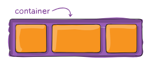

# Flexbox 布局教程

## 基础概念与术语

由于弹性盒子布局是一个完整模块而非单一属性，它包含整套属性体系。其中部分属性需设置在容器（父元素，称为"弹性容器"）上，
其余属性则作用于子元素（称为"弹性项目"）。

如果说常规布局基于块流和内联流方向，那么弹性布局则基于"弹性流方向"。请查看规范中的这张示意图，它阐释了弹性布局的核心概念。


项目将沿着**主轴**（从 `main-start` 到 `main-end` ）或**交叉轴**（从 `cross-start` 到 `cross-end` ）进行排列。

- 主轴(main axis): 弹性容器的主轴是弹性项目排列的主要轴线。注意，它不一定是水平方向，具体取决于 flex-direction 属性（见下文）
- 主轴起点(main-start) | 主轴终点(main-end): 弹性项目从主轴起点开始排列，直至主轴终点。
- 主轴尺寸(main size): 弹性项目在主轴方向上的宽度或高度即为其主轴尺寸。该尺寸由主轴方向对应的`width`或`height`属性决定。
- 交叉轴(cross axis): 与主轴垂直的轴线称为交叉轴，其方向取决于主轴方向。
- 交叉轴起点(cross-start) | 交叉轴终点(cross-end): `Flex` 项目沿交叉轴方向从容器起始端(`cross-start`)向末端(`cross-end`)依次排列填充。
- 交叉轴尺寸(cross size): `Flex` 项目在交叉轴方向上的宽度或高度即为其交叉轴尺寸。该属性由交叉轴方向决定，可能是`width`或`height`。


## 父容器属性(flex container)



### `display: flex` / `display: inline-flex`

这将定义一个弹性容器，其显示方式（行内或块级）取决于设定值。该容器会为其所有直接子元素创建弹性布局上下文。

```css {2}
.container {
    display: flex; /* or inline-flex */
}
```

### `flex-direction`

定义主轴方向，从而决定弹性项目在容器中的排列方式。

弹性布局（除可选的换行外）本质上是单向布局模型。

可以理解为弹性项目主要沿水平行或垂直列方向排列。

```css {2}
.container {
  flex-direction: row | row-reverse | column | column-reverse;
}
```

取值：
- `row`（默认）：在 `ltr` 中从左到右排列；在 `rtl` 中从右到左排列
- `row-reverse` ：在 `ltr` 中从右到左排列；在 `rtl` 中从左到右排列
- `column` ：与 `row` 相同，但方向为从上到下
- `column-reverse` : 同 `row-reverse`，但方向改为从下到上


------

### `flex-wrap`


默认情况下，弹性子项会试图挤在同一行。通过该属性可允许子项按需换行。

```css {2}
.container {
  flex-wrap: nowrap | wrap | wrap-reverse;
}
```

- `nowrap` (默认): 所有弹性项目将排列在同一行
- `wrap` : 弹性项目将从顶部到底部换行排列。
- `wrap-reverse` : 弹性项目将从底部到顶部换行排列。

------

### `flex-flow`

这是 `flex-direction` 和 `flex-wrap` 属性的简写形式，共同定义弹性容器的主轴和交叉轴，默认值为 `row nowrap` 。


------

### `justify-content`

该属性定义主轴方向的对齐方式。

当行内所有弹性项目均为固定宽度，或虽可伸缩但已达最大尺寸时，它能分配剩余的自由空间。

当项目溢出容器时，它还能提供一定的对齐控制。


```css
.container {
  justify-content: flex-start | flex-end | center | space-between | space-around | space-evenly
}
```

取值：

- `flex-start` (默认): 项目沿主轴起始端排列
- `flex-end`: 项目沿主轴末端排列
- `center`: 元素沿轴线居中对齐
- `space-between`: 元素在轴线上均匀分布，首元素对齐起始线，末元素对齐终止线
- `space-around`: 项目在行内均匀分布，周围留有等距空间。 注意视觉上间距并不相等，因为所有项目两侧的留白相同。
第一个项目与容器边缘有 1 单位间距，但与下一项目间会有 2 单位间距， 因为相邻项目自身的间距也会生效。
- `space-evenly`: 项目按等间距分布（包括与边缘的间距）。

------

### `align-items`

该属性定义了当前行中弹性项目沿交叉轴排列的默认行为。可以将其视为交叉轴（垂直于主轴）上的 `justify-content` 版本。


```css {2}
.container {
  align-items: stretch | flex-start | flex-end | center | baseline | first baseline | last baseline | start | end | self-start | self-end + ... safe | unsafe;
}
```

取值：
-  `stretch`（默认）：拉伸填满容器（仍遵循最小宽度/最大宽度限制）
-  `flex-start` ：元素沿交叉轴起始端对齐。
-  `flex-end` ：元素沿交叉轴末端对齐。
-  `center` : 项目在交叉轴上居中对齐。
-  `baseline` : 项目按基线对齐


------

### `align-content`

该属性用于在交叉轴存在剩余空间时对齐弹性容器的行，类似于 `justify-content` 在主轴上对齐单个项目的方式。

> [!TIP]
> 注意：该属性仅对多行弹性容器生效（需满足 `flex-wrap` 设置为 `wrap` 或 `wrap-reverse` ）。
> 单行弹性容器（即 `flex-wrap` 保持默认值 `no-wrap` 时）不会体现 `align-content` 效果。


```css {2}
.container {
  align-content: flex-start | flex-end | center | space-between | space-around | space-evenly | stretch | start | end | baseline | first baseline | last baseline + ... safe | unsafe;
}
```

取值：
- `normal`(默认) ：项目按初始位置排列，如同未设置任何值。
- `flex-start` : 项目沿容器起始端排列。
- `flex-end` : 项目沿容器末端排列。
- `center` : 容器内项目居中对齐。
- `space-between` : 元素均匀分布，首行对齐容器起始端，末行对齐容器末端。
- `space-around` : 元素均匀分布，每行周围留有均等间距。
- `space-evenly` : 元素均匀分布，周围留有均等间距。
- `stretch` : 拉伸以占据剩余空间


------


### `gap`, `row-gap`, `column-gap`

`gap` 属性专门控制弹性项目之间的间距，且仅作用于内部相邻项目（不包含容器边缘的项目）。


```css
.container {
  display: flex;
  /* .... */
  gap: 10px;
  gap: 10px 20px; /* row-gap column gap */
  row-gap: 10px;
  column-gap: 20px;
}
```


这种表现可以理解为最小间距值——当实际间距因某些原因（比如 `justify-content: space-between;` ）
变得更大时，只有最终间距小于该值的情况下，间隙属性才会生效。

`gap` 并非仅适用于弹性盒子布局，在网格布局和多列布局中同样有效。

## 子元素属性(flex items)


### `order`

默认情况下，弹性项目按**源码顺序排列**。但 `order` 属性可控制它们在弹性容器中的显示顺序。

```css
.item {
    order: 5; /* default is 0 */
}
```


> [!TIP]
> 相同 `order` 值的项目将恢复为源码顺序排列


------

### `flex-grow`

该属性定义弹性项目在必要时扩展的能力，接受无单位数值作为比例系数，决定项目应占据弹性容器内多少可用空间。


若所有子项都将 `flex-grow` 设为 `1` ，容器中的剩余空间将**平均分配**给所有子元素。如果其中某个子项的值为 `2` ，
则该子项将占据其他子项**两倍**的空间（至少会尝试这样做）。

> [!TIP]
> 负数无效。

```css
.item {
    flex-grow: 4; /* default 0 */
}
```

------

### `flex-shrink`

该属性定义了弹性项目在必要时进行收缩的能力

```css
.item {
   flex-shrink: 3; /* default 1 */
}
```

> [!TIP]
> 负数无效。


------

### `flex-basis`

该属性定义元素在剩余空间分配前的默认尺寸，可以是具体长度（如 `20%`、`5rem` 等）或关键字。 
`auto` 关键字表示"参照元素的 `width` 或 `height` 属性"（该功能曾由已弃用的 `main-size` 关键字临时实现）。 
`content` 关键字表示"根据内容自适应尺寸"——目前浏览器对该关键字的支持度较低，因此难以测试，
更难确定其衍生属性 `max-content` 、 `min-content` 和 `fit-content` 的具体作用。

```css
.item {
  flex-basis:  | auto; /* default auto */
}
```

设为` 0 `时，内容周围的多余空间不纳入计算；设为`auto`时，多余空间将根据其 `flex-grow` 值进行分配。

参见图示。


------

### `flex`

这是 `flex-grow` 、`flex-shrink` 和 `flex-basis` 的复合写法。

第二、三参数（ `flex-shrink` 和 `flex-basis` ）**可选**，**默认值**为 `0 1 auto` 。

若使用单数值设置（如 `flex: 5`），会将 `flex-basis`改为 `0%`，效果等同于设置 `flex-grow: 5`、 `flex-shrink: 1` 、`flex-basis: 0%`

```css
.item {
  flex: none | [ <'flex-grow'> <'flex-shrink'>? || <'flex-basis'> ]
}
```

建议使用这个复合属性而非单独设置各属性，复合属性会自动智能配置其他值。

------

### `align-self`

这允许为单个弹性项目覆盖默认对齐方式（或由 `align-items` 指定的对齐方式）


请参阅 `align-items` 说明以了解可用取值。

```css
.item {
  align-self: auto | flex-start | flex-end | center | baseline | stretch;
}
```

> [!TIP]
> 请注意设置 `float` 、 `clear` 和 `vertical-align` 的属性对弹性项目无效。
