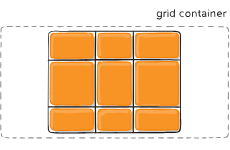

---

sidebar: false
outline: [2, 6]
next: false
prev: false
---

# CSS 网格布局指南


## 基础知识

## 重要术语

在深入探讨网格概念之前，了解术语非常重要。由于这里涉及的术语在概念上都很相似，如果你不首先记住它们由网格规范定义的含义，
很容易将它们相互混淆。但不用担心，它们的数量并不多。

### 网格容器(Grid Container)
应用 `display: grid` 的元素。它是所有网格项的直接父元素。在这个例子中， `container` 是网格容器。
```html
<div class="container">
  <div class="item item-1"> </div>
  <div class="item item-2"> </div>
  <div class="item item-3"> </div>
</div>
```

### 网格项(Grid Item)
子元素（即直接后代）。在这里， `item` 元素是网格项，但 `sub-item` 不是。
```html
<div class="container">
  <div class="item"> </div>
  <div class="item">
    <p class="sub-item"> </p>
  </div>
  <div class="item"> </div>
</div>
```

### 网格线(Grid Line)
构成网格结构的分隔线。它们可以是垂直的（“列网格线”）或水平的（“行网格线”），位于行或列的两侧。这里黄色的线是一个列网格线的例子。


### 网格单元(Grid Cell)
两条相邻行网格线和两条相邻列网格线之间的空间。它是网格的单个“单位”。这里是指行网格线 1 和 2 之间以及列网格线 2 和 3 之间的网格单元。


### 网格轨道(Grid Track)
两条相邻网格线之间的空间。你可以把它们想象成网格的列或行。这里是指第二行和第三行网格线之间的网格轨道。


### 网格区域(Grid Area)
被四条网格线包围的总空间。一个网格区域可以由任意数量的网格单元组成。这里是指行网格线 1 和 3 之间，以及列网格线 1 和 3 之间的网格区域。


## 网格属性

### 父级属性 (Grid Container Properties)

::: details 展开查看属性

- `display`


- `grid-template-columns`


- `grid-template-rows`


- `grid-template-areas`


- `grid-template`


- `grid-column-gap`


- `grid-row-gap`


- `grid-gap`


- `justify-items`


- `align-items`


- `place-items`


- `justify-content`


- `align-content`


- `place-content`


- `grid-auto-columns`


- `grid-auto-rows`


- `grid-auto-flow`


- `grid`

:::


#### `display`

定义元素为网格容器，并为其实例内容创建一个新的网格格式化上下文。

取值:
- `grid`
  生成一个块级网格
- `inline-grid`
  生成一个内联级网格

```css
.container {
    display: grid | inline-grid;
}
```

------

#### `grid-template-columns` `grid-template-rows`

使用**空格分隔**的值列表定义网格的**列和行**。这些值代表轨道大小，它们之间的空格代表网格线。

取值:
- `<track-size> <track-size> ...`
  轨道大小可以是长度单位（`px`、`em`、`rem`、`%` 等），也可以是 `fr` 单位（表示可用空间的比例）。如果没有指定单位，则默认为 `px`。

- `[ <line-name> ]? <track-size> [ <line-name> ]?`
  您选择的任意名称

> [!TIP]
> 如果您的定义包含重复的部分，可以使用 `repeat()` 符号来简化内容, 比如：`repeat(3, 20px [col-start])`

```css
.container {
  grid-template-columns: ...  ...;
  /* e.g. 
      1fr 1fr
      minmax(10px, 1fr) 3fr
      repeat(5, 1fr)
      50px auto 100px 1fr
  */
  grid-template-rows: ... ...;
  /* e.g. 
      min-content 1fr min-content
      100px 1fr max-content
  */
}
```

网格线会自动从这些分配中分配正数（-1 作为最后一行的替代）。


但您可以选择显式命名行。

> [!TIP]
> 注意行名的括号语法：

```css
.container {
  grid-template-columns: [first] 40px [line2] 50px [line3] auto [col4-start] 50px [five] 40px [end];
  grid-template-rows: [row1-start] 25% [row1-end] 100px [third-line] auto [last-line];
}
```


> [!TIP]
> 注意一行可以具有多个名称。例如，这里第二行将有两个名称：`row1-end` 和 `row2-start`：

```css
.container {
  grid-template-rows: [row1-start] 25% [row1-end row2-start] 25% [row2-end];
}
```

如果您的定义包含重复的部分，可以使用 `repeat()` 符号来简化内容：

以下代码块是等价的

```css
.container {
  grid-template-columns: repeat(3, 20px [col-start]);
}

.container {
  grid-template-columns: 20px [col-start] 20px [col-start] 20px [col-start];
}
```

如果多个行共享相同的名称，可以通过行名称和计数来引用它们。

```css
.item {
  grid-column-start: col-start 2;
}
```

 `fr`单位允许您将轨道的大小设置为网格容器的可用空间的一部分。例如，这将使每个项目的大小为网格容器宽度的三分之一：

 ```css
 .container {
  grid-template-columns: 1fr 1fr 1fr;
}
 ```

在计算可用空间后，将考虑任何非弹性项目。在这个例子中，`fr` 单位可用的总空间不包括 `50px`：

```css
.container {
  grid-template-columns: 1fr 50px 1fr 1fr;
}
```

------

#### `grid-template-areas`

通过引用网格区域的名称来定义网格模板，这些名称通过 `grid-area` 属性指定。重复网格区域的名称会导致内容跨越这些单元格。
**点号**表示**空单元格**。

语法本身提供了网格结构的可视化。

取值：

- `<grid-area-name>`  使用 grid-area 指定的网格区域名称

- `.` 表示一个空白的网格单元

- `none` 没有定义网格区域

```css
.container {
  grid-template-areas: 
    "<grid-area-name> | . | none | ..."
    "...";
}
```

示例：

```css
.item-a {
  grid-area: header;
}
.item-b {
  grid-area: main;
}
.item-c {
  grid-area: sidebar;
}
.item-d {
  grid-area: footer;
}

.container {
  display: grid;
  grid-template-columns: 50px 50px 50px 50px;
  grid-template-rows: auto;
  grid-template-areas: 
    "header header header header"
    "main main . sidebar"
    "footer footer footer footer";
}
```

这将创建一个宽度为四列、高度为三行的网格。

整个顶部行将包含标题区域。
中间行将包含两个主区域、一个空单元格和一个侧边栏区域。
最后一行全部是页脚。


你可以使用任意数量的相邻点来声明一个空单元格。只要点之间没有空格，它们就代表一个单元格。


> [!TIP]
> 你使用这种语法时并不是命名行，而是命名区域。
> 当你使用这种语法时，区域的两侧行实际上是自动命名的。
> 如果你的网格区域名为 `foo`，那么该区域的起始行线和起始列线的名称将是 `foo-start`，
> 而其最后一行线和最后一列线的名称将是 `foo-end`。这意味着某些行可能会有多个名称，例如上面示例中的最左边的行，
> 它将有三个名称：`header-start`、`main-start` 和 `footer-start`。

------

#### `grid-template`

这是一个用于一次性设置 `grid-template-rows` 、 `grid-template-columns` 和 `grid-template-areas` 的**简写**。

取值：
- `none` 将所有三个属性设置为它们的**初始值**

- `<grid-template-rows>` / `<grid-template-columns>`  分别设置 `grid-template-columns` 和 `grid-template-rows` 为指定的值，
并将 `grid-template-areas` 设置为 `none`

```css
.container {
  grid-template: none | <grid-template-rows> / <grid-template-columns>;
}
```

它也接受一种更复杂但非常实用的语法来指定所有三个。以下是一个示例：

```css
.container {
  grid-template:
    [row1-start] "header header header" 25px [row1-end]
    [row2-start] "footer footer footer" 25px [row2-end]
    / auto 50px auto;
}
```

这与以下内容等价：
```css
.container {
  grid-template-rows: [row1-start] 25px [row1-end row2-start] 25px [row2-end];
  grid-template-columns: auto 50px auto;
  grid-template-areas:
    "header header header"
    "footer footer footer";
}
```

由于 `grid-template` 不会重置隐式网格属性（ `grid-auto-columns` 、 `grid-auto-rows` 和 `grid-auto-flow` ），
这可能是大多数情况下你想要做的，因此建议使用 `grid` 属性而不是 `grid-template` 属性。

------

#### `column-gap` `row-gap` `grid-column-gap` `grid-row-gap`

指定网格线的尺寸。你可以将其想象为设置列/行之间的间距宽度。

取值：

- `<line-size>`  长度值

> [!TIP]
> 注意： `grid-` 前缀将被移除，`grid-column-gap` 和 `grid-row-gap` 将重命名为 `column-gap` 和 `row-gap` 。
> 未加前缀的属性已在 Chrome 68+、Safari 11.2 发布 50+ 和 Opera 54+ 中得到支持。

```css
.container {
  /* standard */
  column-gap: <line-size>;
  row-gap: <line-size>;

  /* old(旧的) */
  grid-column-gap: <line-size>;
  grid-row-gap: <line-size>;
}
```
示例：

```css
.container {
  grid-template-columns: 100px 50px 100px;
  grid-template-rows: 80px auto 80px; 
  column-gap: 10px;
  row-gap: 15px;
}
```


网格之间的间隙仅创建在列/行之间，而不是在外边缘。

------

#### `gap` `grid-gap`

`row-gap` 和 `column-gap` 的缩写

取值：
- `<grid-row-gap>` `<grid-column-gap>`  长度值

> [!TIP]
> 注意： `grid-` 前缀已弃用（但谁知道呢，可能永远不会从浏览器中移除）。本质上 `grid-gap` 已更名为 `gap` 。
> 无前缀的属性已在 Chrome 68+、Safari 11.2 发布 50+ 和 Opera 54+ 中得到支持。


```css
.container {
  /* standard */
  gap: <grid-row-gap> <grid-column-gap>;

  /* old(旧的) */
  grid-gap: <grid-row-gap> <grid-column-gap>;
}
```
示例：

```css
.container {
  grid-template-columns: 100px 50px 100px;
  grid-template-rows: 80px auto 80px;
  gap: 15px 10px;
}
```

如果没有指定 `row-gap` ，则将其设置为与 `column-gap` 相同的值

------

#### `justify-items`

沿着内联（行）轴对齐网格项（与 `align-items` 相对，它沿着块（列）轴对齐）。
此值适用于容器内的所有网格项。

取值：
- `start`  网格项在网格单元的起始位置对齐
- `end`  网格项在网格单元的结束位置对齐
- `center`  网格项在网格单元的中心对齐
- `stretch`  网格项在网格单元中拉伸以填充可用空间（默认值）

```css
.container {
  justify-items: start | end | center | stretch;
}
```

示例：

```css
.container {
  justify-items: start;
}
```


```css
.container {
  justify-items: end;
}
```


```css
.container {
  justify-items: center;
}
```


```css
.container {
  justify-items: stretch;
}
```


此行为也可以通过 `justify-self` 属性在**单个网格项**上设置。

------

#### `align-items`

将网格项沿块（列）轴对齐（与 `justify-items` 不同，它沿内联（行）轴对齐）。
此值适用于容器内的所有网格项。

取值：

- `stretch` 填充整个单元格的高度（这是默认值）
- `start` 将项目对齐到单元格的起始边缘
- `end` 将项目对齐到单元格的结束边缘
- `center`  将项目对齐到单元格的中心
- `baseline` 沿文本基线对齐项目。对于多行文本，有修饰符 `baseline` — `first baseline` 和 `last baseline` ，将使用第一行或最后一行的基线。

```css
.container {
  align-items: start | end | center | stretch;
}
```

```css
.container {
  align-items: start;
}
```


```css
.container {
  align-items: end;
}
```


```css
.container {
  align-items: center;
}
```


```css
.container {
  align-items: stretch;
}
```


此行为也可以通过 `align-self` 属性在单个网格项上设置。

也存在修饰符关键字 `safe` 和 `unsafe` （用法类似于 `align-items: safe end` ）。 `safe` 关键字表示“**尝试这样对齐，
但如果这样做意味着将项目对齐到无法访问的溢出区域，则不进行对齐**”，而 `unsafe` 将允许将内容移动到无法访问的区域（“数据丢失”）。

------

#### `place-items`

`place-items`  同时设置 `align-items` 和 `justify-items` 属性的单个声明。

取值：
- `<align-items>` / `<justify-items>` 第一个值设置 `align-items` ，第二个值设置 `justify-items` 。
如果省略第二个值，则第一个值分配给两个属性。

这对于非常快速的多方向居中非常有用：

```css
.center {
  display: grid;
  place-items: center;
}
```

------

#### `justify-content`

有时候，您网格的总大小可能小于其网格容器的尺寸。这可能发生在您使用非弹性单位（如 `px` ）对网格项进行尺寸设置的情况下。
在这种情况下，您可以设置网格在网格容器内的对齐方式。该属性沿行轴（与 `align-content` 相反，它沿列轴对齐）对齐网格。

取值：
- `start`  将网格对齐到网格容器的起始边缘
- `end`  将网格对齐到网格容器的结束边缘
- `center`  将网格对齐到网格容器的中心
- `stretch`  整网格项的大小，使网格能够填满网格容器的整个宽度
- `space-around`  在每个网格项之间放置相等的空间，两端的空间为半大小
- `space-between`  在每个网格项之间放置相等的空间，两端没有空间
- `space-evenly`  在每个网格项之间均匀分配空间，包括两端

```css
.container {
  justify-content: start | end | center | stretch | space-around | space-between | space-evenly;    
}
```

示例：

```css
.container {
  justify-content: start;
}
```


```css
.container {
  justify-content: end;
}
```


```css
.container {
  justify-content: center;
}
```



```css
.container {
  justify-content: stretch;
}
```


```css
.container {
  justify-content: space-around;
}
```


```css
.container {
  justify-content: space-between;
}
```


```css
.container {
  justify-content: space-evenly;
}
```


------

#### `align-content`

有时候，您的网格的总大小可能小于其网格容器的尺寸。
这可能发生在所有网格项都使用非弹性单位（如 `px` ）进行尺寸设置的情况下。
在这种情况下，您可以设置网格在网格容器内的对齐方式。该属性沿块（列）轴对齐网格（与 `justify-content` 相反，它沿内联（行）轴对齐网格）。

取值：
- `start`  将网格对齐到网格容器的起始边缘
- `end`  将网格对齐到网格容器的结束边缘
- `center`  将网格对齐到网格容器的中心
- `stretch`  整网格项的大小，使网格能够填满网格容器的整个高度
- `space-around`  在每个网格项之间放置相等的空间，两端的空间为半尺寸
- `space-between`  在每个网格项之间放置相等的空间，两端没有空间
- `space-evenly`  在每个网格项之间均匀分配空间，包括两端

```css
.container {
  align-content: start | end | center | stretch | space-around | space-between | space-evenly;    
}
```

示例：

```css
.container {
  align-content: start;
}
```


```css
.container {
  align-content: end;
}
```


```css
.container {
  align-content: center;
}
```


```css
.container {
  align-content: stretch;
}
```


```css
.container {
  align-content: space-around;
}
```


```css
.container {
  align-content: space-between;
}
```


```css
.container {
  align-content: space-evenly;
}
```


------

#### `place-content`

`place-content`  同时设置 `align-content` 和 `justify-content` 属性的单个声明。

取值：
- `<align-content>` / `<justify-content>` 第一个值设置 `align-content` ，第二个值设置 `justify-content` 。
如果省略第二个值，则第一个值分配给两个属性。

所有主流浏览器（Edge 除外）都支持  place-content 简写属性。

------

#### `grid-auto-columns` `grid-auto-rows`

指定任何自动生成的网格轨道的大小（即隐式网格轨道）。
当网格中的网格项多于单元格时，或者网格项放置在显式网格之外时，会创建隐式轨道。（参见《显式网格与隐式网格的区别》）

取值：
- `<track-size>` 可以是长度、百分比或网格中自由空间的分数（使用 `fr` 单位）

```css
.container {
  grid-auto-columns: <track-size> ...;
  grid-auto-rows: <track-size> ...;
}
```

为了说明隐式网格轨道是如何创建的，请参考以下情况：

```css
.container {
  grid-template-columns: 60px 60px;
  grid-template-rows: 90px 90px;
}
```


创建一个 2 x 2 的网格

但是，现在想象一下，您使用 `grid-column` 和 `grid-row` 来定位您的网格项，如下所示：

```css
.item-a {
  grid-column: 1 / 2;
  grid-row: 2 / 3;
}
.item-b {
  grid-column: 5 / 6;
  grid-row: 2 / 3;
}
```


我们定义 `.item-b` 从第 5 列线开始，到第 6 列线结束，但我们从未定义过第 5 列线或第 6 列线。
因为我们引用了不存在的线条，创建了宽度为 0 的隐式轨道来填充空白。
我们可以使用 `grid-auto-columns` 和 `grid-auto-rows` 来指定这些隐式轨道的宽度：

```css
.container {
  grid-auto-columns: 60px;
}
```


------

####  `grid-auto-flow`

如果您有未明确放置在网格上的网格项，则会启动自动放置算法来自动放置这些项。该属性控制自动放置算法的工作方式。

取值：
- `row`  默认值。告诉自动放置算法逐行填充，必要时添加新行
- `column`  告诉自动放置算法逐列填充，必要时添加新列
- `dense`  告诉自动放置算法如果出现更小的项目，尝试先填充网格中较早出现的空隙

```css
.container {
  grid-auto-flow: row | column | row dense | column dense;
}
```

> [!TIP]
> 注意，"dense" 只会改变项目视觉顺序，可能会导致它们出现顺序混乱，这对无障碍性不利。

示例：

参看以下HTML:

```html
<section class="container">
  <div class="item-a">item-a</div>
  <div class="item-b">item-b</div>
  <div class="item-c">item-c</div>
  <div class="item-d">item-d</div>
  <div class="item-e">item-e</div>
</section>
```

定义一个包含五列和两行的网格，并将 `grid-auto-flow` 设置为 `row` （这也是默认值）：

```css
.container {
  display: grid;
  grid-template-columns: 60px 60px 60px 60px 60px;
  grid-template-rows: 30px 30px;
  grid-auto-flow: row;
}
```

在网格上放置项目时，您只需指定其中两个的位置：

```css
.item-a {
  grid-column: 1;
  grid-row: 1 / 3;
}
.item-e {
  grid-column: 5;
  grid-row: 1 / 3;
}
```

由于我们将 `grid-auto-flow` 设置为 `row` ，我们的网格将看起来像这样。
注意我们未放置的三个项目（`item-b`、`item-c` 和 `item-d`）是如何跨越可用行的：


如果我们将 `grid-auto-flow` 设置为 `column` ，则 `item-b`、`item-c` 和 `item-d` 将沿着列向下流动：

```css
.container {
  display: grid;
  grid-template-columns: 60px 60px 60px 60px 60px;
  grid-template-rows: 30px 30px;
  grid-auto-flow: column;
}
```


------

#### `grid` 


将以下所有属性在一个声明中设置的简写： `grid-template-rows` ， `grid-template-columns` ，`grid-template-areas` ， `grid-auto-rows` ， `grid-auto-columns` ，和 `grid-auto-flow` 

> [!TIP]
> 注意：您只能在单个网格声明中指定显式或隐式网格属性。


取值：
- `none`  将所有子属性设置为它们的初始值。
- `<grid-template> <grid-template>` 与 `grid-template` 作用相同。
- `<grid-template-rows> / [ auto-flow && dense? ] <grid-auto-columns>?`  将 `grid-template-rows` 设置为指定的值。如果 `auto-flow` 关键字位于**斜杠右侧**，则将 `grid-auto-flow` 设置为 `column` 。

如果另外指定了 `dense` 关键字，则自动放置算法使用“密集”填充算法。如果省略了 `grid-auto-columns` ，则将其设置为 `auto` 。


- `[ auto-flow && dense? ] <grid-auto-rows>? / <grid-template-columns>`  将 `grid-template-columns` 设置为指定的值。

如果 `auto-flow` 关键字在斜杠左侧，则将 `grid-auto-flow` 设置为 `row` 。如果指定了 `dense` 关键字，则自动放置算法使用“密集”打包算法。

- 如果省略了 `grid-auto-rows` ，则将其设置为 `auto` 。


示例：


> [!TIP]
> 以下两个代码块的定义是等效的：


```css

.container {

  grid: 100px 300px / 3fr 1fr;

}


.container {

  grid-template-rows: 100px 300px;

  grid-template-columns: 3fr 1fr;

}


```

> [!TIP]
> 以下两个代码块的定义是等效的：

```css

.container {

  grid: auto-flow / 200px 1fr;

}


.container {

  grid-auto-flow: row;

  grid-template-columns: 200px 1fr;

}

```

> [!TIP]
> 以下两个代码块的定义是等效的：

```css

.container {

  grid: auto-flow dense 100px / 1fr 2fr;

}


.container {

  grid-auto-flow: row dense;

  grid-auto-rows: 100px;

  grid-template-columns: 1fr 2fr;

}

```

> [!TIP]
> 以下两个代码块的定义是等效的：

```css

.container {

  grid: 100px 300px / auto-flow 200px;

}


.container {

  grid-template-rows: 100px 300px;

  grid-auto-flow: column;

  grid-auto-columns: 200px;

}

```


它还接受一种更复杂但非常实用的语法，用于一次性设置所有内容。

您指定 `grid-template-areas` 、 `grid-template-rows` 和 `grid-template-columns` ，其他所有子属性都设置为它们的初始值。

您所做的是在各自的网格区域中指定行名称和轨道大小。这可以通过一个示例来最容易地描述：


```css

.container {

  grid: [row1-start] "header header header" 1fr [row1-end]

        [row2-start] "footer footer footer" 25px [row2-end]

        / auto 50px auto;

}

```


与以下内容等价


```css

.container {

  grid-template-areas: 

    "header header header"

    "footer footer footer";

  grid-template-rows: [row1-start] 1fr [row1-end row2-start] 25px [row2-end];

  grid-template-columns: auto 50px auto;    

}

```


### 子级属性 (Grid Item Properties)


::: details 展开查看属性

- `grid-column-start`

- `grid-column-end`

- `grid-row-start`

- `grid-row-end`

- `grid-column`

- `grid-row`

- `grid-area`

- `justify-self`

- `align-self`

- `place-self`

:::


> [!TIP]
>  `float` 、 `display: inline-block` 、 `display: table-cell` 、 `vertical-align` 和 `column-*` 属性对网格项没有影响。

------

#### `grid-column-start` `grid-column-end` `grid-row-start` `grid-row-end`


确定网格项在网格中的位置，通过参考特定的网格线。 `grid-column-start / grid-row-start` 是项开始的位置， `grid-column-end / grid-row-end` 是项结束的位置。


取值：

- `<line>`  可以是一个数字，用于引用编号的网格线，或者是一个名称，用于引用命名的网格线

- `span <number>`  引用当前网格项的起始线，并向前或向后跨越 `number` 条线

- `span <line>`  引用当前网格项的起始线，并向前或向后跨越到指定的线

- `auto`  默认值。表示自动放置、自动跨列或默认跨一列


```css

.item {
  grid-column-start: <number> | <name> | span <number> | span <name> | auto;
  grid-column-end: <number> | <name> | span <number> | span <name> | auto;
  grid-row-start: <number> | <name> | span <number> | span <name> | auto;
  grid-row-end: <number> | <name> | span <number> | span <name> | auto;
}

```


示例：


```css

.item-a {
  grid-column-start: 2;
  grid-column-end: five;
  grid-row-start: row1-start;
  grid-row-end: 3;
}

```


```css

.item-b {
  grid-column-start: 1;
  grid-column-end: span col4-start;
  grid-row-start: 2;
  grid-row-end: span 2;
}

```


如果没有声明 `grid-column-end / grid-row-end` ，则项目默认占用 1 个轨道。


项目可以相互重叠。您可以使用 `z-index` 来控制它们的堆叠顺序。


------

#### `grid-column` `grid-row`


简写为 `grid-column-start + grid-column-end 和 grid-row-start + grid-row-end` 的缩写。


取值：

- `<start-line> / <end-line>`  每个都接受与长格式相同的所有值，包括 `span`


```css

.item {
  grid-column: <start-line> / <end-line> | <start-line> / span <value>;
  grid-row: <start-line> / <end-line> | <start-line> / span <value>;
}

```


示例：


```css

.item-c {
  grid-column: 3 / span 2;
  grid-row: third-line / 4;
}

```


如果未声明结束行值，则项目默认占用 1 个轨道。


------

#### `grid-area`


为项目指定一个名称，以便可以通过使用 `grid-template-areas` 属性创建的模板引用它。

或者，此属性也可以用作 `grid-row-start + grid-column-start + grid-row-end + grid-column-end` 的简写。


取值：

- `<name>` 选择一个名称

- `<row-start> / <column-start> / <row-end> / <column-end>`  可以是数字或命名行


```css

.item {
  grid-area: <name> | <row-start> / <column-start> / <row-end> / <column-end>;
}

```


示例：


作为为项目命名的一种方式：


```css

.item-d {
  grid-area: header;
}

```


`grid-row-start + grid-column-start + grid-row-end + grid-column-end` 的简写形式：


```css

.item-d {
  grid-area: 1 / col4-start / last-line / 6;
}

```


------

#### `justify-self`


在单元格内沿行轴（与 `align-self` 相对，后者沿列轴对齐）对齐网格项。此值适用于单个单元格内的网格项。


取值：

- `start`  将网格项目与单元格的起始边缘对齐

- `end`  将网格项目与单元格的结束边缘对齐

- `center`  将网格项目与单元格的中心对齐

- `stretch`  填充整个单元格宽度（默认值）


```css

.item {
  justify-self: start | end | center | stretch;
}

```


示例：


```css

.item-a {
  justify-self: start;
}

```


```css

.item-a {
  justify-self: end;
}

```


```css

.item-a {
  justify-self: center;
}

```


```css

.item-a {
  justify-self: stretch;
}

```


要设置网格中所有项目的对齐方式，也可以通过 `justify-items` 属性在网格容器上设置此行为。


------

#### `align-self`


在单元格内沿块（列）轴对齐网格项（与沿行轴对齐的 `justify-self` 相反）。

此值适用于单个网格项内的内容。


取值：

- `start`  将网格项目与单元格的起始边缘对齐

- `end`  将网格项目与单元格的结束边缘对齐

- `center`  将网格项目与单元格的中心对齐

- `stretch`  填充整个单元格高度（默认值）


```css

.item {
  align-self: start | end | center | stretch;
}

```


示例：


```css

.item-a {
  align-self: start;
}

```


```css

.item-a {
  align-self: end;
}

```


```css

.item-a {
  align-self: center;
}

```


```css

.item-a {
  align-self: stretch;
}

```


要对网格中的所有项目进行对齐，这种行为也可以通过 `align-items` 属性在网格容器上设置。


------

#### `place-self`


`place-self`  同时设置 `align-self` 和 `justify-self` 属性的单个声明。


取值：

- `auto` 布局模式的“默认”对齐方式。

- `<align-self>` / `<justify-self>` 第一个值设置 `align-self` ，第二个值设置 `justify-self` 。如果省略第二个值，则第一个值分配给两个属性。


示例：

```css

.item-a {
  place-self: center;
}

```


```css

.item-a {
  place-self: center stretch;
}

```


所有主流浏览器（Edge 除外）都支持  `place-self` 简写属性。


### 特殊单位与函数

#### `fr`

你很可能会在 CSS Grid 中使用很多分数单位，比如 `1fr` 。
它们本质上意味着“剩余空间的份额”。

所以像这样的声明：
```css
grid-template-columns: 1fr 3fr;
```
大概意味着 `25% 75%` 。 只不过这些百分比值比分数单位要固定得多。

例如，如果你给基于百分比的列添加了填充，现在你已经打破了 100%的宽度（假设 content-box 盒模型）。
分数单位与其他单位的组合也更为友好，比如可以这样：
```css
grid-template-columns: 50px min-content 1fr;
```

------

#### 尺寸关键词(Size Keywords)

当调整行和列的大小时，您可以像往常一样使用所有熟悉的长度单位，如 `px 、rem、% `等，但您还可以使用关键词：

- `min-content` 内容的最小尺寸。想象一下像“E pluribus unum”这样的文本行，`min-content` 很可能是单词“pluribus”的宽度

- `max-content` 内容的最大尺寸。想象一下上面的句子， `max-content` 是整个句子的长度。

- `auto` 这个关键词与 `fr` 单位非常相似，但它们在分配剩余空间时“败给了” `fr` 单位

- `fr` 见上文

------

#### 尺寸函数(Size Functions)

-  `fit-content()` 使用可用空间，但永远不会小于 `min-content` ，也永远不会超过 `max-content`

- `minmax()` 为长度设置最小和最大值。这对于与相对单位结合使用非常有用。

例如，你可能希望列只能缩小到一定程度。这非常有用，可能是你想要的：
```css
grid-template-columns: minmax(100px, 1fr) 3fr;
```
- `min()` 函数。

- `max()` 函数。

------

#### `repeat()` 函数和关键词

`repeat()` 函数可以节省一些输入：

```css
grid-template-columns: 1fr 1fr 1fr 1fr 1fr 1fr 1fr 1fr;

/* easier: */
grid-template-columns: repeat(8, 1fr);

/* especially when: */
grid-template-columns: repeat(8, minmax(10px, 1fr));
```
但 `repeat()` 与关键词结合时可以更加复杂

- `auto-fill`  尽可能多地适应行上的列，即使它们是空的。
- `auto-fit`  适应现有的所有列到空间中。优先扩展列以填充空间，而不是空列。


这是 CSS Grid 中最著名的片段之一，也是所有 CSS 技巧中最伟大的之一

```css
grid-template-columns:  repeat(auto-fit, minmax(250px, 1fr));
```
