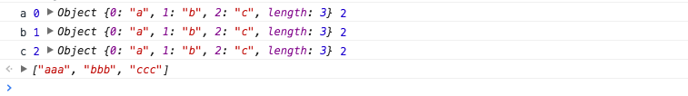

# JavaScript数组所有API全解密

数组是一种非常重要的数据类型，它语法简单、灵活、高效。 在多数编程语言中，数组都充当着至关重要的角色，以至于很难想象没有
数组的编程语言会是什么模样。特别是JavaScript，它天生的灵活性，又进一步发挥了数组的特长，丰富了数组的使用场景。
可以毫不夸张地说，不深入地了解数组，不足以写JavaScript。

截止ES7规范，数组共包含33个标准的API方法和一个非标准的API方法，使用场景和使用方案纷繁复杂，其中有不少浅坑、深坑、甚至神坑。
下面将从Array构造器及ES6新特性开始，逐步帮助你掌握数组。

声明：以下未特别标明的方法均为ES5已实现的方法。

## Array构造器
Array构造器用于创建一个新的数组。通常，我们推荐使用对象字面量创建数组，这是一个好习惯，但是总有对象字面量乏力的时候，
比如说，我想创建一个长度为8的空数组。请比较如下两种方式：

```javascript {2,4,5}
// 使用Array构造器
var a = Array(8); // [undefined × 8]
// 使用对象字面量
var b = [];
b.length = 8; // [undefined × 8]
```

Array构造器明显要简洁一些，当然你也许会说，对象字面量也不错啊，那么我保持沉默。

如上，我使用了`Array(8)`而不是`new Array(8)`，这会有影响吗？实际上，并没有影响，这得益于Array构造器内部对this指针的判断，
ELS5_HTML规范是这么说的：

> When Array is called as a function rather than as a constructor, it creates and initialises a new Array object. 
> Thus the function call Array(…) is equivalent to the object creation expression new Array(…) with the same arguments.
>
> 当 Array 作为函数而不是构造函数调用时，它会创建并初始化一个新的 Array 对象。
> 因此，函数调用 Array（...）等价于具有相同参数的对象创建表达式 new Array（...）。


从规范来看，浏览器内部大致做了如下类似的实现：

```javascript
function Array(){
  // 如果this不是Array的实例，那就重新new一个实例
  if(!(this instanceof arguments.callee)){
    return new arguments.callee();
  }
}
```

上面，我似乎跳过了对Array构造器语法的介绍，没事，接下来我补上。

Array构造器根据参数长度的不同，有如下两种不同的处理：

`new Array(arg1, arg2,…)`，参数长度为0或长度大于等于2时，传入的参数将按照顺序依次成为新数组的第0至N项（参数长度为0时，返回空数组）。
`new Array(len)`，当len不是数值时，处理同上，返回一个只包含len元素一项的数组；当len为数值时，根据如下规范，
`len`最大不能超过32位无符号整型，即需要小于2的32次方（len最大为`Math.pow(2,32) -1 ` 或 -1>>>0），否则将抛出`RangeError`。


## ES6新增的构造函数方法

鉴于数组的常用性，ES6专门扩展了数组构造器Array ，新增2个方法：`Array.of`、`Array.from`。下面展开来聊。

### `Array.of`

`Array.of`用于将参数依次转化为数组中的一项，然后返回这个新数组，而不管这个参数是数字还是其它。它基本上与Array构造器功能一致，
唯一的区别就在单个数字参数的处理上。如下：

```javascript
Array.of(8.0); // [8]
Array(8.0); // [empty × 8]
```
参数为多个，或单个参数不是数字时，`Array.of` 与 `Array构造器`等同。
```javascript
Array.of(8.0, 5); // [8, 5]
Array(8.0, 5); // [8, 5]

Array.of('8'); // ["8"]
Array('8'); // ["8"]
```
因此，若是需要使用数组包裹元素，推荐优先使用`Array.of`方法。

即使其他版本浏览器不支持也不必担心，由于`Array.of`与`Array构造器`的这种高度相似性，实现一个polyfill十分简单。如下：
```javascript
if (!Array.of){
  Array.of = function(){
    return Array.prototype.slice.call(arguments);
  };
}
```

------

### `Array.from`

`Array.from`的设计初衷是快速便捷的基于其他对象创建新数组，准确来说就是从一个类似数组的可迭代对象创建一个新的数组实例，
说人话就是，只要一个对象有迭代器，`Array.from`就能把它变成一个数组（当然，是返回新的数组，不改变原对象）。

*语法：`Array.from(arrayLike[, processingFn[, thisArg]])`*

从语法上看，`Array.from`拥有3个形参:

第一个为类似数组的对象，**必选**。

第二个为加工函数，新生成的数组会经过该函数的加工再返回。

第三个为this作用域，表示加工函数执行时this的值。后两个参数都是可选的。我们来看看用法。

```javascript
var obj = {0: 'a', 1: 'b', 2:'c', length: 3};
Array.from(obj, function(value, index){
  console.log(value, index, this, arguments.length);
  return value.repeat(3); //必须指定返回值，否则返回undefined
}, obj);
```
执行结果如下：



可以看到加工函数的`this作用域`被`obj对象`取代，也可以看到加工函数默认拥有**两个形参**，分别为**迭代器当前元素的值**和**其索引**。

注意，一旦使用加工函数，必须明确指定返回值，否则将隐式返回`undefined`，最终生成的数组也会变成一个只包含若干个`undefined`元素的空数组。

实际上，如果不需要指定`this`，加工函数完全可以是一个箭头函数。

上述代码可以简化如下：

```javascript
Array.from(obj, (value) => value.repeat(3));
```

除了上述obj对象以外，拥有迭代器的对象还包括这些：`String`，`Set`，`Map`，`arguments` 等，`Array.from`统统可以处理。
如下所示：
```javascript
// String
Array.from('abc'); // ["a", "b", "c"]
// Set
Array.from(new Set(['abc', 'def'])); // ["abc", "def"]
// Map
Array.from(new Map([[1, 'abc'], [2, 'def']])); // [[1, 'abc'], [2, 'def']]
// 天生的类数组对象arguments
function fn(){
  return Array.from(arguments);
}
fn(1, 2, 3); // [1, 2, 3]
```

到这你可能以为`Array.from`就讲完了，实际上还有一个重要的扩展场景必须提下。
比如说生成一个从 `0`到 `指定数字`的新数组，`Array.from`就可以轻易的做到。
```javascript
Array.from({length: 10}, (v, i) => i); // [0, 1, 2, 3, 4, 5, 6, 7, 8, 9]
```

后面我们将会看到，利用数组的`keys`方法实现上述功能，可能还要简单一些。

------

### `Array.isArray`

顾名思义，`Array.isArray`用来判断一个变量是否数组类型。JS的弱类型机制导致判断变量类型是初级前端开发者面试时的必考题，
一般我都会将其作为考察候选人第一题，然后基于此展开。

在ES5提供该方法之前，我们至少有如下5种方式去判断一个值是否数组：

```javascript {2,4,6,8,10}
var a = [];
// 1.基于instanceof
a instanceof Array;
// 2.基于constructor
a.constructor === Array;
// 3.基于Object.prototype.isPrototypeOf
Array.prototype.isPrototypeOf(a);
// 4.基于getPrototypeOf
Object.getPrototypeOf(a) === Array.prototype;
// 5.基于Object.prototype.toString
Object.prototype.toString.apply(a) === '[object Array]';
```

以上，除了`Object.prototype.toString`外，其它方法都不能正确判断变量的类型。

要知道，代码的运行环境十分复杂，一个变量可能使用浑身解数去迷惑它的创造者。且看：

```javascript
var a = {
  __proto__: Array.prototype
};
// 分别在控制台试运行以下代码
// 1.基于instanceof
a instanceof Array; // true
// 2.基于constructor
a.constructor === Array; // true
// 3.基于Object.prototype.isPrototypeOf
Array.prototype.isPrototypeOf(a); // true
// 4.基于getPrototypeOf
Object.getPrototypeOf(a) === Array.prototype; // true
```
以上，4种方法将全部返回`true`，为什么呢？我们只是手动指定了某个对象的`__proto__`属性为`Array.prototype`，便导致了该对象继承了`Array`对象，这种毫不负责任的继承方式，使得基于继承的判断方案瞬间土崩瓦解。

不仅如此，我们还知道，`Array`是堆数据，变量指向的只是它的引用地址，因此每个页面的`Array对象`引用的地址都是不一样的。
`iframe`中声明的数组，它的构造函数是`iframe`中的`Array对象`。如果在`iframe`声明了一个数组`x`，将其赋值给父页面的变量`y`，那么在父页面使用`y instanceof Array` ，结果一定是`false`的。
而最后一种返回的是字符串，不会存在引用问题。实际上，多页面或系统之间的交互只有字符串能够畅行无阻。

鉴于上述的两点原因，故笔者推荐使用最后一种方法去撩面试官（别提是我说的），如果你还不信，这里恰好有篇文章跟我持有相同的观点：
[Determining with absolute accuracy whether or not a JavaScript object is an array](http://web.mit.edu/jwalden/www/isArray.html)

相反，使用`Array.isArray`则非常简单，如下：
```javascript
Array.isArray([]); // true
Array.isArray({0: 'a', length: 1}); // false
```

实际上，通过`Object.prototype.toString`去判断一个值的类型，也是各大主流库的标准。因此`Array.isArray`的`polyfill`通常长这样：
```javascript
if (!Array.isArray){
  Array.isArray = function(arg){
    return Object.prototype.toString.call(arg) === '[object Array]';
  };
}
```

## 原型

继承的常识告诉我们，js中所有的数组方法均来自于`Array.prototype`，和其他构造函数一样，你可以通过扩展 `Array` 的 `prototype` 属性上的方法来给所有数组实例增加方法。

值得一说的是，`Array.prototype`本身就是一个数组。

```javascript
Array.isArray(Array.prototype); // true
console.log(Array.prototype.length);//
```

以下方法可以进一步验证：
```javascript
console.log([].__proto__.length);// 0
console.log([].__proto__);// [Symbol(Symbol.unscopables): Object]
```

## 方法
数组原型提供的方法非常之多，主要分为三种，一种是会改变自身值的，一种是不会改变自身值的，另外一种是遍历方法。

由于 `Array.prototype` 的某些属性被设置为[[DontEnum]]，因此不能用一般的方法进行遍历，我们可以通过如下方式获取 `Array.prototype` 的所有方法：

```javascript
Object.getOwnPropertyNames(Array.prototype); // ["length", "constructor", "toString", "toLocaleString", "join", "pop", "push", "reverse", "shift", "unshift", "slice", "splice", "sort", "filter", "forEach", "some", "every", "map", "indexOf", "lastIndexOf", "reduce", "reduceRight", "copyWithin", "find", "findIndex", "fill", "includes", "entries", "keys", "concat"]
```


#### **改变自身值的方法(9个)**

基于ES6，改变自身值的方法一共有**9个**，分别为`pop`、`push`、`reverse`、`shift`、`sort`、`splice`、`unshift`，以及两个ES6新增的方法`copyWithin` 和 `fill`。

> [!TIP]
> Vue2.x中，对数组的`push`、`pop`、`shift`、`unshift`、`splice`、`sort`、`reverse`等方法进行了封装，使用以上方法会触发视图更新，从而达到数据绑定的效果。

##### 1. **`pop`**

---

`pop() `方法删除一个数组中的最后的一个元素，并且返回这个元素。如果是栈的话，这个过程就是栈顶弹出。

```javascript
var array = ["cat", "dog", "cow", "chicken", "mouse"];
var item = array.pop();
console.log(array); // ["cat", "dog", "cow", "chicken"]
console.log(item); // mouse
```

由于设计上的巧妙，`pop`方法可以应用在类数组对象上，即 `鸭式辨型`. 如下：

```javascript
var o = {0:"cat", 1:"dog", 2:"cow", 3:"chicken", 4:"mouse", length:5}
var item = Array.prototype.pop.call(o);
console.log(o); // Object {0: "cat", 1: "dog", 2: "cow", 3: "chicken", length: 4}
console.log(item); // mouse
```

但如果类数组对象**不具有length属性**，那么该对象将被**创建**length属性，length值为0。如下：

```javascript
var o = {0:"cat", 1:"dog", 2:"cow", 3:"chicken", 4:"mouse"}
var item = Array.prototype.pop.call(o);
console.log(array); // Object {0: "cat", 1: "dog", 2: "cow", 3: "chicken", 4: "mouse", length: 0}
console.log(item); // undefined
```

---

##### 2. **`push`**

---

`push()`方法添加**一个或者多个元素**到**数组末尾**，并且**返回数组新的长度**。如果是栈的话，这个过程就是**栈顶压入**。

语法：**`arr.push(element1, …, elementN)`**

```javascript
var array = ["football", "basketball", "volleyball", "Table tennis", "badminton"];
var i = array.push("golfball");
console.log(array); // ["football", "basketball", "volleyball", "Table tennis", "badminton", "golfball"]
console.log(i); // 6
```

同pop方法一样，push方法也可以应用到类数组对象上，**如果length不能被转成一个数值或者不存在length属性时，则插入的元素索引为0，且length属性不存在时，将会创建它。**

```javascript
var o = {0:"football", 1:"basketball"};
var i = Array.prototype.push.call(o, "golfball");
console.log(o); // Object {0: "golfball", 1: "basketball", length: 1}
console.log(i); // 1
```

实际上，`push`方法是根据**length属性**来决定从**哪里开始插入给定的值**。

```javascript
var o = {0:"football", 1:"basketball",length:1};
var i = Array.prototype.push.call(o,"golfball");
console.log(o); // Object {0: "football", 1: "golfball", length: 2}
console.log(i); // 2
```

利用push根据length属性插入元素这个特点，可以实现数组的合并，如下：

```javascript
var array = ["football", "basketball"];
var array2 = ["volleyball", "golfball"];
var i = Array.prototype.push.apply(array,array2);
console.log(array); // ["football", "basketball", "volleyball", "golfball"]
console.log(i); // 4
```
---

##### 3. **`reverse`**

---

`reverse()`方法**颠倒数组中元素的位置，第一个会成为最后一个，最后一个会成为第一个**，该方法返回**对数组的引用**。

语法：**`arr.reverse()`**

```javascript
var array = [1,2,3,4,5];
var array2 = array.reverse();
console.log(array); // [5,4,3,2,1]
console.log(array2===array); // true
```

同上，`reverse` 也是鸭式辨型的受益者，颠倒元素的范围受**length属性**制约。如下:

```javascript
var o = {0:"a", 1:"b", 2:"c", length:2};
var o2 = Array.prototype.reverse.call(o);
console.log(o); // Object {0: "b", 1: "a", 2: "c", length: 2}
console.log(o === o2); // true
```

如果 **length 属性小于2 或者 length 属性不为数值**，那么原类数组对象将没有变化。**即使 length 属性不存在，该对象特别的是，当 length 属性较大时，类数组对象的『索引』会尽可能的向 length 看齐。**如下:

```javascript
var o = {0:"a", 1:"b", 2:"c",length:100};
var o2 = Array.prototype.reverse.call(o);
console.log(o); // Object {97: "c", 98: "b", 99: "a", length: 100}
console.log(o === o2); // true
```
---

##### 4. **`shift`**

---

`shift()`方法**删除数组的第一个元素，并返回这个元素**。如果是栈的话，这个过程就是栈底弹出。

语法：**arr.shift()**

```javascript
var array = [1,2,3,4,5];
var item = array.shift();
console.log(array); // [2,3,4,5]
console.log(item); // 1
```

同样受益于鸭式辨型，对于类数组对象，shift仍然能够处理。如下：

```javascript
var o = {0:"a", 1:"b", 2:"c", length:3};
var item = Array.prototype.shift.call(o);
console.log(o); // Object {0: "b", 1: "c", length: 2}
console.log(item); // a
```

如果类数组对象length属性不存在，将添加length属性，并初始化为0。如下：

```javascript
var o = {0:"a", 1:"b", 2:"c"};
var item = Array.prototype.shift.call(o);
console.log(o); // Object {0: "a", 1: "b", 2:"c" length: 0}
console.log(item); // undefined
```

---

##### 5. **`sort`**

---

`sort()`方法对**数组元素进行排序，并返回这个数组**。sort方法比较复杂，这里我将多花些篇幅来讲这块。

语法：**arr.sort([comparefn])**

`comparefn`是可选的，如果省略，数组元素将按照各自转换为**字符串的Unicode(万国码)位点顺序排序**，例如”Boy”将排到”apple”之前。当对数字排序的时候，25将会排到8之前，因为转换为字符串后，”25”将比”8”靠前。例如：

```javascript
var array = ["apple","Boy","Cat","dog"];
var array2 = array.sort();
console.log(array); // ["Boy", "Cat", "apple", "dog"]
console.log(array2 == array); // true

array = [10, 1, 3, 20];
var array3 = array.sort();
console.log(array3); // [1, 10, 20, 3]
```

如果指明了`comparefn`，数组将按照调用该函数的返回值来排序。若 a 和 b 是两个将要比较的元素：

- 若 comparefn(a, b) < 0，那么a 将排到 b 前面；
- 若 comparefn(a, b) = 0，那么a 和 b 相对位置不变；
- 若 comparefn(a, b) > 0，那么a , b 将调换位置；

如果数组元素为数字，则排序函数comparefn格式如下所示：

```javascript
function compare(a, b){
  return a-b;
}
```

如果数组元素为非ASCII字符的字符串(如包含类似 e、é、è、a、ä 或中文字符等非英文字符的字符串)，则需要使用**`String.localeCompare`**。下面这个函数将排到正确的顺序。

```javascript
var array = ['互','联','网','改','变','世','界'];
var array2 = array.sort();

var array = ['互','联','网','改','变','世','界']; // 重新赋值,避免干扰array2
var array3 = array.sort(function (a, b) {
  return a.localeCompare(b);
});

console.log(array2); // ["世", "互", "变", "改", "界", "网", "联"]
console.log(array3); // ["变", "改", "互", "界", "联", "世", "网"]
```

如上，『互联网改变世界』这个数组，sort函数默认**按照数组元素unicode字符串形式进行排序**，然而实际上，我们期望的是按照拼音先后顺序进行排序，显然`String.localeCompare` 帮助我们达到了这个目的。

为什么上面测试中需要重新给array赋值呢，这是因为sort每次排序时改变的是数组本身，并且返回数组引用。如果不这么做，经过连续两次排序后，array2 和 array3 将指向同一个数组，最终影响我们测试。array重新赋值后就断开了对原数组的引用。

同上，sort一样受益于鸭式辨型，比如：

```javascript
var o = {0:'互',1:'联',2:'网',3:'改',4:'变',5:'世',6:'界',length:7};
Array.prototype.sort.call(o,function(a, b){
  return a.localeCompare(b);
});
console.log(o); // Object {0: "变", 1: "改", 2: "互", 3: "界", 4: "联", 5: "世", 6: "网", length: 7}, 可见同上述排序结果一致
```
> [!TIP]
> 注意：使用sort的鸭式辨型特性时，若**类数组对象不具有length属性，它并不会进行排序，也不会为其添加length属性**。

```javascript
var o = {0:'互',1:'联',2:'网',3:'改',4:'变',5:'世',6:'界'};
Array.prototype.sort.call(o,function(a, b){
  return a.localeCompare(b);
});
console.log(o); // Object {0: "互", 1: "联", 2: "网", 3: "改", 4: "变", 5: "世", 6: "界"}, 可见并未添加length属性
```

---

##### 6. **`splice`**

---

`splice()`方法**用新元素替换旧元素的方式来修改数组**。它是一个常用的方法，复杂的数组操作场景通常都会有它的身影，特别是**需要维持原数组引用时，就地删除或者新增元素，splice是最适合的**。

语法：**`arr.splice(start,deleteCount[, item1[, item2[, …]]])`**

`start` 指定从哪一位开始修改内容。如果**超过了数组长度，则从数组末尾开始添加内容**；如果**是负值**，则其指定的索引位置等同于 `length`+ `start` (length为数组的长度)，表示从数组末尾开始的第 `-start `位。

`deleteCount` 指定要**删除的元素个数**，若**等于0，则不删除**。这种情况下，至少应该**添加一位新元素，若大于start之后的元素总和，则start及之后的元素都将被删除**。

`itemN` 指定**新增的元素**，如果**缺省，则该方法只删除数组元素**。

**返回值** 由原数组中**被删除元素组成的数组**，如果**没有删除，则返回一个空数组**。

```javascript
var array = ["apple","boy"];
var splices = array.splice(1,1);
console.log(array); // ["apple"]
console.log(splices); // ["boy"] ,可见是从数组下标为1的元素开始删除,并且删除一个元素,由于itemN缺省,故此时该方法只删除元素

array = ["apple","boy"];
splices = array.splice(2,1,"cat");
console.log(array); // ["apple", "boy", "cat"]
console.log(splices); // [], 可见由于start超过数组长度,此时从数组末尾开始添加元素,并且原数组不会发生删除行为

array = ["apple","boy"];
splices = array.splice(-2,1,"cat");
console.log(array); // ["cat", "boy"]
console.log(splices); // ["apple"], 可见当start为负值时,是从数组末尾开始的第-start位开始删除,删除一个元素,并且从此处插入了一个元素

array = ["apple","boy"];
splices = array.splice(-3,1,"cat");
console.log(array); // ["cat", "boy"]
console.log(splices); // ["apple"], 可见即使-start超出数组长度,数组默认从首位开始删除

array = ["apple","boy"];
splices = array.splice(0,3,"cat");
console.log(array); // ["cat"]
console.log(splices); // ["apple", "boy"], 可见当deleteCount大于数组start之后的元素总和时,start及之后的元素都将被删除
```

同上, `splice`一样受益于鸭式辨型, 比如:

```javascript
var o = {0:"apple",1:"boy",length:2};
var splices = Array.prototype.splice.call(o,1,1);
console.log(o); // Object {0: "apple", length: 1}, 可见对象o删除了一个属性,并且length-1
console.log(splices); // ["boy"]
```

注意：如果类数组对象没有`length`属性，splice将为该类数组对象添加length属性，并初始化为0。（此处忽略举例，如果需要请在评论里反馈）

如果需要删除数组中一个已存在的元素，可参考如下：

```javascript
var array = ['a','b','c'];
array.splice(array.indexOf('b'),1);
```

---

##### 7. **`unshift`**

---

`unshift()` 方法用于在**数组开始处插入**一些元素(就像是栈底插入)，并返回数组新的长度。

语法：`arr.unshift(element1, …, elementN)`

```javascript
var array = ["red", "green", "blue"];
var length = array.unshift("yellow");
console.log(array); // ["yellow", "red", "green", "blue"]
console.log(length); // 4
```

如果给unshift方法传入一个数组呢？

```javascript
var array = ["red", "green", "blue"];
var length = array.unshift(["yellow"]);
console.log(array); // [["yellow"], "red", "green", "blue"]
console.log(length); // 4, 可见数组也能成功插入
```

同上，unshift也受益于鸭式辨型，呈上栗子：

```javascript
var o = {0:"red", 1:"green", 2:"blue",length:3};
var length = Array.prototype.unshift.call(o,"gray");
console.log(o); // Object {0: "gray", 1: "red", 2: "green", 3: "blue", length: 4}
console.log(length); // 4
```
> [!TIP]
> 注意：如果类数组对象不指定length属性，则返回结果是这样的 `Object {0: "gray", 1: "green", 2: "blue", length: 1}`，shift会认为数组长度为0，此时将从对象下标为0的位置开始插入，相应位置属性将被替换，此时初始化类数组对象的length属性为插入元素个数。

---

##### 8. **`copyWithin`(ES6)**

---

`copyWithin()` 方法基于**ECMAScript 2015（ES6）规范**，用于**数组内元素之间的替换，即替换元素和被替换元素均是数组内的元素**。

语法：`arr.copyWithin(target, start[, end = this.length])`

`taget` 指定**被替换元素的索引**，`start `指定**替换元素起始的索引**，`end`可选，指的是**替换元素结束位置的索引**。

如果**start为负**，则其指定的**索引位置等同于length+start，length为数组的长度。end也是如此**。

注：目前只有Firefox（版本32及其以上版本）实现了该方法。

```javascript
var array = [1,2,3,4,5]; 
var array2 = array.copyWithin(0,3);
console.log(array===array2,array2); // true [4, 5, 3, 4, 5]

var array = [1,2,3,4,5]; 
console.log(array.copyWithin(0,3,4)); // [4, 2, 3, 4, 5]

var array = [1,2,3,4,5]; 
console.log(array.copyWithin(0,-2,-1)); // [4, 2, 3, 4, 5]
```

同上，copyWithin一样受益于鸭式辨型，例如：

```javascript
var o = {0:1, 1:2, 2:3, 3:4, 4:5,length:5}
var o2 = Array.prototype.copyWithin.call(o,0,3);
console.log(o===o2,o2); // true Object { 0=4,  1=5,  2=3,  更多...}
```

如需在Firefox之外的浏览器使用copyWithin方法，请参考 [Polyfill](https://developer.mozilla.org/zh-CN/docs/Web/JavaScript/Reference/Global_Objects/Array/copyWithin#Polyfill)。

---

##### 9. **`fill`(ES6)**

---

`fill() `方法基于**ECMAScript 2015（ES6）规范**，它同样用于数组元素替换，但与copyWithin略有不同，它主要用于将数组指定区间内的元素替换为某个值。

语法：`arr.fill(value, start[, end = this.length])`

value 指定被替换的值，start 指定替换元素起始的索引，end 可选，指的是替换元素结束位置的索引。

如果start为负，则其指定的索引位置等同于length+start，length为数组的长度。end也是如此。

注：目前只有Firefox（版本31及其以上版本）实现了该方法。

```javascript
var array = [1,2,3,4,5];
var array2 = array.fill(10,0,3);
console.log(array===array2,array2); // true [10, 10, 10, 4, 5], 可见数组区间[0,3]的元素全部替换为10
// 其他的举例请参考copyWithin
```

同上，fill 一样受益于鸭式辨型，例如：

```javascript
var o = {0:1, 1:2, 2:3, 3:4, 4:5,length:5}
var o2 = Array.prototype.fill.call(o,10,0,2);
console.log(o===o2,o2); // true Object { 0=10,  1=10,  2=3,  更多...}
```

如需在Firefox之外的浏览器使用fill方法,请参考 [Polyfill](https://developer.mozilla.org/zh-CN/docs/Web/JavaScript/Reference/Global_Objects/Array/fill#Compatibility)。

#### **不会改变自身的方法(9个)**

基于ES7，不会改变自身的方法一共有9个，分别为`concat`、`join`、`slice`、`toString`、`toLocateString`、`indexOf`、`lastIndexOf`、未标准的`toSource`以及ES7新增的方法`includes`。

##### 1. **`concat`**

---

`concat() `方法将传入的数组或者元素与原数组合并，组成一个新的数组并返回。

语法：`arr.concat(value1, value2, …, valueN)`

```javascript
var array = [1, 2, 3];
var array2 = array.concat(4,[5,6],[7,8,9]);
console.log(array2); // [1, 2, 3, 4, 5, 6, 7, 8, 9]
console.log(array); // [1, 2, 3], 可见原数组并未被修改
```

若`concat`方法中**不传入参数**，那么将基于**原数组浅复制生成一个一模一样的新数组**（指向新的地址空间）。

```javascript
var array = [{a: 1}];
var array3 = array.concat();
console.log(array3); // [{a: 1}]
console.log(array3 === array); // false
console.log(array[0] === array3[0]); // true，新旧数组第一个元素依旧共用一个同一个对象的引用
```

同上，`concat` 一样受益于鸭式辨型，但其效果可能达不到我们的期望，如下：

```javascript
var o = {0:"a", 1:"b", 2:"c",length:3};
var o2 = Array.prototype.concat.call(o,'d',{3:'e',4:'f',length:2},['g','h','i']);
console.log(o2); // [{0:"a", 1:"b", 2:"c", length:3}, 'd', {3:'e', 4:'f', length:2}, 'g', 'h', 'i']
```

可见，类数组对象合并后返回的是依然是数组，并不是我们期望的对象。


##### 2. **`join`**

---

`join()` 方法将数组中的所有元素连接成一个字符串。

语法：`arr.join([separator = ‘,’])`    separator可选，缺省默认为逗号。

```javascript
var array = ['We', 'are', 'Chinese'];
console.log(array.join()); // "We,are,Chinese"
console.log(array.join('+')); // "We+are+Chinese"
console.log(array.join('')); // "WeareChinese"
```

同上，join 一样受益于鸭式辨型，如下：

```javascript
var o = {0:"We", 1:"are", 2:"Chinese", length:3};
console.log(Array.prototype.join.call(o,'+')); // "We+are+Chinese"
console.log(Array.prototype.join.call('abc')); // "a,b,c"
```


##### **3. `slice`**

---

`slice()` 方法将数组中一部分元素**浅复制**存入新的数组对象，并且返回这个数组对象。

语法：`arr.slice([start[, end]])`

参数 `start` 指定**复制开始位置的索引**，`end`如果有值则表示复制**结束位置的索引（不包括此位置）**。

如果 start 的值**为负数**，假如**数组长度为 length**，则表示从 **length+start 的位置**开始复制，此时参数 end 如果有值，只能是比 start 大的负数，否则将返回空数组。

slice方法参数为空时，同concat方法一样，都是浅复制生成一个新数组。

```javascript
var array = ["one", "two", "three","four", "five"];
console.log(array.slice()); // ["one", "two", "three","four", "five"]
console.log(array.slice(2,3)); // ["three"]
```

**浅复制** 是指当对象的被复制时，只是复制了对象的引用，指向的依然是同一个对象。下面来说明slice为什么是浅复制。

```javascript
var array = [{color:"yellow"}, 2, 3];
var array2 = array.slice(0,1);
console.log(array2); // [{color:"yellow"}]
array[0]["color"] = "blue";
console.log(array2); // [{color:"bule"}]
```

由于slice是浅复制，复制到的对象只是一个引用，改变原数组array的值，array2也随之改变。

同时，稍微利用下 slice 方法第一个参数为负数时的特性，我们可以非常方便的拿到数组的最后一项元素，如下：

```javascript
console.log([1,2,3].slice(-1));//[3]
```

同上，slice 一样受益于鸭式辨型。如下：

```javascript
var o = {0:{"color":"yellow"}, 1:2, 2:3, length:3};
var o2 = Array.prototype.slice.call(o,0,1);
console.log(o2); // [{color:"yellow"}] ,毫无违和感...
```

鉴于IE9以下版本对于该方法支持性并不是很好，如需更好的支持低版本IE浏览器，请参考[polyfill](https://developer.mozilla.org/zh-CN/docs/Web/JavaScript/Reference/Global_Objects/Array/slice)。


##### 4. **`toString`**

---

toString() 方法返回数组的字符串形式，该字符串由数组中的每个元素的 `toString()` 返回值经调用 `join()` 方法连接（由逗号隔开）组成。

语法： *arr.toString()*

```javascript
var array = ['Jan', 'Feb', 'Mar', 'Apr'];
var str = array.toString();
console.log(str); // Jan,Feb,Mar,Apr
```

当数组直接和字符串作连接操作时，将会自动调用其`toString()`方法。

```javascript
var str = ['Jan', 'Feb', 'Mar', 'Apr'] + ',May';
console.log(str); // "Jan,Feb,Mar,Apr,May"
// 下面我们来试试鸭式辨型
var o = {0:'Jan', 1:'Feb', 2:'Mar', length:3};
var o2 = Array.prototype.toString.call(o);
console.log(o2); // [object Object]
console.log(o.toString()==o2); // true
```

可见，`Array.prototype.toString()`方法处理类数组对象时，跟类数组对象直接调用`Object.prototype.toString()`方法结果完全一致，说好的鸭式辨型呢？

根据ES5语义，toString() 方法是通用的，可被用于任何对象。如果对象有一个join() 方法，将会被调用，其返回值将被返回，没有则调用`Object.prototype.toString()`，为此，我们给o对象添加一个join方法。如下：

```javascript
var o = {
  0:'Jan', 
  1:'Feb', 
  2:'Mar', 
  length:3, 
  join:function(){
    return Array.prototype.join.call(this);
  }
};
console.log(Array.prototype.toString.call(o)); // "Jan,Feb,Mar"
```


##### 5. **`toLocaleString`**

---

`toLocaleString()` 类似`toString()`的变型，该字符串由数组中的每个元素的 `toLocaleString()` 返回值经调用 `join()` 方法连接（由逗号隔开）组成。

语法：*arr.toLocaleString()*

数组中的元素将调用各自的 `toLocaleString` 方法：

- Object：Object.prototype.toLocaleString()
- Number：Number.prototype.toLocaleString()
- Date：Date.prototype.toLocaleString()
```javascript
var array= [{name:'zz'}, 123, "abc", new Date()];
var str = array.toLocaleString();
console.log(str); // [object Object],123,abc,2016/1/5 下午1:06:23
```
其鸭式辨型的写法也同`toString`保持一致，如下：
```javascript
var o = {
   0:123,
   1:'abc',
   2:new Date(),
   length:3,
   join:function(){
      return Array.prototype.join.call(this);
   }
};
console.log(Array.prototype.toLocaleString.call(o)); // 123,abc,2016/1/5 下午1:16:50
```


##### 6. **`indexOf`**

---

`indexOf()` 方法用于查找元素在数组中第一次出现时的索引，如果没有，则返回-1。

语法：*arr.indexOf(element, fromIndex=0)*

`element` 为需要查找的元素。

`fromIndex` 为开始查找的位置，缺省默认为 0。如果超出数组长度，则返回 -1。
如果为负值，假设数组长度为 length，则从数组的第 length + fromIndex项开始往数组末尾查找，如果length + fromIndex<0 则整个数组都会被查找。

`indexOf` 使用严格相等（即使用 === 去匹配数组中的元素）。
```javascript
var array = ['abc', 'def', 'ghi','123'];
console.log(array.indexOf('def')); // 1
console.log(array.indexOf('def',-1)); // -1 此时表示从最后一个元素往后查找,因此查找失败返回-1
console.log(array.indexOf('def',-4)); // 1 由于4大于数组长度,此时将查找整个数组,因此返回1
console.log(array.indexOf(123)); // -1, 由于是严格匹配,因此并不会匹配到字符串'123'
```
得益于鸭式辨型，`indexOf` 可以处理类数组对象。如下：

```javascript
var o = {0:'abc', 1:'def', 2:'ghi', length:3};
console.log(Array.prototype.indexOf.call(o,'ghi',-4));//2
```

然而该方法并不支持IE9以下版本，如需更好的支持低版本IE浏览器（IE6~8）， 请参考 Polyfill。

##### 7. **`lastIndexOf`**

---

`lastIndexOf()` 方法用于查找元素在数组中最后一次出现时的索引，如果没有，则返回-1。并且它是indexOf的逆向查找，即从数组最后一个往前查找。

语法：*arr.lastIndexOf(element, fromIndex=length-1)*

`element` 为需要查找的元素。

`fromIndex` 为开始查找的位置，缺省默认为数组长度length-1。如果超出数组长度，由于是逆向查找，则查找整个数组。
如果为负值，则从数组的第 length + fromIndex 项开始往数组开头查找，如果 length + fromIndex < 0 则数组不会被查找。

同 `indexOf` 一样，`lastIndexOf` 也是严格匹配数组元素。

举例请参考 `indexOf` ，不再详述，兼容低版本IE浏览器（IE6~8），请参考 `Polyfill`。

##### 8. **`includes(ES7)`**

---

`includes()`方法基于ECMAScript 2016（ES7）规范，它用来判断当前数组是否包含某个指定的值，如果是，则返回 true，否则返回 false。

语法：*arr.includes(element, fromIndex=0)*

`element` 为需要查找的元素。

`fromIndex` 表示从该索引位置开始查找 element，缺省为0，它是正向查找，即从索引处往数组末尾查找。

```javascript
var array = [-0, 1, 2];
console.log(array.includes(+0)); // true
console.log(array.includes(1)); // true
console.log(array.includes(2,-4)); // true
```

以上，`includes` 似乎忽略了 ` -0 `与 ` +0 ` 的区别，这不是问题，因为 `JavaScript` 一直以来都是不区分` -0 `和 ` +0 ` 的。

你可能会问，既然有了`indexOf`方法，为什么又造一个`includes`方法，`arr.indexOf(x) > -1 ` 不就等于 `arr.includes(x)` ？看起来是的，几乎所有的时候它们都等同，
唯一的区别就是includes能够发现`NaN`，而`indexOf`不能。
```javascript
var array = [NaN];
console.log(array.includes(NaN)); // true
console.log(arra.indexOf(NaN)>-1); // false
```

该方法同样受益于鸭式辨型。如下：
```javascript
var o = {0:'a', 1:'b', 2:'c', length:3};
var bool = Array.prototype.includes.call(o, 'a');
console.log(bool); // true
```
该方法只有在**Chrome 47、opera 34、Safari 9**版本及其更高版本中才被实现。如需支持其他浏览器，请参考 Polyfill。

##### 9. **`toSource(非标准)`**

---

`toSource()` 方法是非标准的，该方法返回数组的源代码，目前只有 `Firefox` 实现了它。

语法：*arr.toSource()*

```javascript
var array = ['a', 'b', 'c'];
console.log(array.toSource()); // ["a", "b", "c"]

// 测试鸭式辨型
var o = {0:'a', 1:'b', 2:'c', length:3};
console.log(Array.prototype.toSource.call(o)); // ["a","b","c"]
```

**遍历方法(12个)**

基于ES6，不会改变自身的方法一共有12个，分别为`forEach`、`every`、`some`、`filter`、`map`、`reduce`、`reduceRight` 以及ES6新增的方法`entries`、`find`、`findIndex`、`keys`、`values`。

##### 1. **`forEach`**

---

`forEach()` 方法指定数组的每项元素都执行一次传入的函数，返回值为`undefined`。

语法：*arr.forEach(fn, thisArg)*

`fn` 表示在数组每一项上执行的函数，接受三个参数：

- `value` 当前正在被处理的元素的值
- `index` 当前元素的数组索引
- `array` 数组本身

`thisArg` 可选，用来当做fn函数内的this对象。

`forEach` 将为数组中每一项执行一次 `fn` 函数，那些已删除，新增或者从未赋值的项将被跳过（但不包括值为 undefined 的项）。

遍历过程中，fn会被传入上述三个参数。
```javascript
var array = [1, 3, 5];
var obj = {name:'cc'};
var sReturn = array.forEach(function(value, index, array){
    array[index] = value * value;
    console.log(this.name); // cc被打印了三次
},obj);

console.log(array); // [1, 9, 25], 可见原数组改变了
console.log(sReturn); // undefined, 可见返回值为undefined
```

得益于鸭式辨型，虽然`forEach`不能直接遍历对象，但它可以通过`call`方式遍历 类数组对象。如下：
```javascript
var o = {0:1, 1:3, 2:5, length:3};
Array.prototype.forEach.call(o,function(value, index, obj){
console.log(value,index,obj);
obj[index] = value * value;
},o);
// 1 0 Object {0: 1, 1: 3, 2: 5, length: 3}
// 3 1 Object {0: 1, 1: 3, 2: 5, length: 3}
// 5 2 Object {0: 1, 1: 9, 2: 5, length: 3}
console.log(o); // Object {0: 1, 1: 9, 2: 25, length: 3}
```
参考前面的文章 [详解JS遍历](https://louiszhai.github.io/2015/12/18/traverse/#forEach) 中 `forEach`的讲解，我们知道，`forEach`无法直接退出循环，只能使用`return` 来达到 for循环中 `continue` 的效果，
并且`forEach`不能在低版本IE（6~8）中使用，兼容写法请参考 [Polyfill](https://developer.mozilla.org/zh-CN/docs/Web/JavaScript/Reference/Global_Objects/Array/forEach#%E5%85%BC%E5%AE%B9%E6%97%A7%E7%8E%AF%E5%A2%83%EF%BC%88Polyfill%EF%BC%89)。

##### 2. **`every`**

---

`every()` 方法使用传入的函数测试所有元素，只要其中有 **一个函数** 返回值为 `false`，那么该方法的结果为 `false`；
如果**全部**返回 `true`，那么该方法的结果才为 `true`。

因此` every `方法存在如下规律：

若需检测数组中存在元素大于100 （即 one > 100），那么我们需要在传入的函数中构造 “false” 返回值 （即返回 item <= 100），
同时整个方法结果为 false 才表示数组存在元素满足条件；（简单理解为：若是单项判断，可用 one false ===> false）
若需检测数组中是否所有元素都大于100 （即all > 100）那么我们需要在传入的函数中构造 “true” 返回值 （即返回 item > 100），
同时整个方法结果为 true 才表示数组所有元素均满足条件。(简单理解为：若是全部判断，可用 all true ===> true）
语法同上述`forEach`，具体还可以参考 [详解JS遍历](https://louiszhai.github.io/2015/12/18/traverse/#every) 中every的讲解。

以下是鸭式辨型的写法：
```javascript
var o = {0:10, 1:8, 2:25, length:3};
var bool = Array.prototype.every.call(o,function(value, index, obj){
return value >= 8;
},o);
console.log(bool); // true
```

`every` 一样不能在低版本IE(6~8)中使用，兼容写法请参考 [Polyfill](https://developer.mozilla.org/zh-CN/docs/Web/JavaScript/Reference/Global_Objects/Array/every#Compatibility)。

##### 3. **`some`**

---

`some()` 方法刚好同 `every()` 方法**相反**，`some` 测试数组元素时，只要有**一个函数**返回值为 `true`，则该方法返回 `true`，
若**全部**返回 `false`，则该方法返回 `false`。

some 方法存在如下规律：

若需检测数组中存在元素大于100 (即 one > 100)，那么我们需要在传入的函数中构造 “true” 返回值 (即返回 item > 100)，同时整个方法结果为 true 才表示数组存在元素满足条件；（简单理解为：若是单项判断，可用 one true ===> true）
若需检测数组中是否所有元素都大于100（即 all > 100），那么我们需要在传入的函数中构造 “false” 返回值 （即返回 item <= 100），同时整个方法结果为 false 才表示数组所有元素均满足条件。（简单理解为：若是全部判断，可用 all false ===> false）

你注意到没有，`some`方法与`includes`方法有着异曲同工之妙，他们都是探测数组中是否拥有满足条件的元素，一旦找到，便返回true。
多观察和总结这种微妙的关联关系，能够帮助我们深入理解它们的原理。

`some` 的鸭式辨型写法可以参照`every`，同样它也不能在低版本IE（6~8）中使用，兼容写法请参考 [Polyfill](https://developer.mozilla.org/zh-CN/docs/Web/JavaScript/Reference/Global_Objects/Array/some#Compatibility)。

##### 4. **`filter`**

---

`filter()` 方法使用传入的函数测试所有元素，并返回**所有通过测试的元素**组成的**新数组**。它就好比一个过滤器，筛掉不符合条件的元素。

语法：*arr.filter(fn, thisArg)*

```javascript

var array = [18, 9, 10, 35, 80];
var array2 = array.filter(function(value, index, array){
return value > 20;
});
console.log(array2); // [35, 80]

```

`filter`一样支持鸭式辨型，具体请参考`every`方法鸭式辨型写法。其在低版本IE（6~8）的兼容写法请参考 [Polyfill](https://developer.mozilla.org/zh-CN/docs/Web/JavaScript/Reference/Global_Objects/Array/filter#Compatibility)。

##### 5. **`map`**

---

`map()` 方法遍历数组，使用传入函数**处理每个元素**，并返回**函数的返回值组成的新数组**。

语法：*arr.map(fn, thisArg)*

参数介绍同 `forEach` 方法的参数介绍。

具体用法请参考 [详解JS遍历](https://louiszhai.github.io/2015/12/18/traverse/#map) 中 map 的讲解。

map 一样支持鸭式辨型, 具体请参考`every`方法鸭式辨型写法。

其在低版本IE（6~8）的兼容写法请参考 [Polyfill](https://developer.mozilla.org/zh-CN/docs/Web/JavaScript/Reference/Global_Objects/Array/map#Compatibility)。

##### 6. **`reduce`**

---

`reduce()` 方法接收一个方法作为累加器，数组中的每个值(从左至右) 开始合并，最终为一个值。

语法：*arr.reduce(fn, initialValue)*

`fn` 表示在数组每一项上执行的函数，接受四个参数：

- `previousValue` 上一次调用回调返回的值，或者是提供的初始值
- `value` 数组中当前被处理元素的值
- `index` 当前元素在数组中的索引
- `array` 数组自身

`initialValue` 指定第一次调用 fn 的第一个参数。

当 fn 第一次执行时：

如果 `initialValue` 在调用 `reduce` 时被提供，那么第一个 `previousValue` 将等于 `initialValue`，此时 `item` 等于数组中的第一个值；
如果 `initialValue` 未被提供，那么 `previousVaule` 等于数组中的第一个值，`item` 等于数组中的第二个值。此时如果数组为空，那么将抛出 `TypeError`。
如果数组仅有一个元素，并且没有提供 `initialValue`，或提供了 `initialValue` 但数组为空，那么fn不会被执行，数组的唯一值将被返回。

```javascript

var array = [1, 2, 3, 4];
var s = array.reduce(function(previousValue, value, index, array){
return previousValue * value;
},1);
console.log(s); // 24
// ES6写法更加简洁
array.reduce((p, v) => p * v); // 24

```

以上回调被调用4次，每次的参数和返回见下表：

|callback|	previousValue|	currentValue|	index|	array|	return value|
|:---:|:---:|:---:|:---:|:---:|:---:|
|第1次	|1	|1	|0	|[1,2,3,4]|	1|
|第2次	|1	|2	|1	|[1,2,3,4]|	2|
|第3次	|2	|3	|2	|[1,2,3,4]|	6|
|第4次	|6	|4	|3	|[1,2,3,4]|	24|

`reduce` 一样支持鸭式辨型，具体请参考`every`方法鸭式辨型写法。

其在低版本IE（6~8）的兼容写法请参考 [Polyfill](https://developer.mozilla.org/zh-CN/docs/Web/JavaScript/Reference/Global_Objects/Array/reduce#%E5%85%BC%E5%AE%B9%E6%97%A7%E7%8E%AF%E5%A2%83%EF%BC%88Polyfill%EF%BC%89)。

##### 7. **`reduceRight`**

---

`reduceRight()` 方法接收一个方法作为累加器，数组中的每个值（从右至左）开始合并，最终为一个值。除了与`reduce`执行**方向相反**外，其他完全与其一致，请参考上述 `reduce` 方法介绍。

其在低版本IE（6~8）的兼容写法请参考 [Polyfill](https://developer.mozilla.org/zh-CN/docs/Web/JavaScript/Reference/Global_Objects/Array/reduceRight#.E5.85.BC.E5.AE.B9.E6.80.A7.E6.97.A7.E7.8E.AF.E5.A2.83.EF.BC.88Polyfill.EF.BC.89)。

##### 8. **`entries(ES6)`**

---

`entries()`方法基于ECMAScript 2015（ES6）规范，返回一个数组迭代器对象，该对象包含数组中每个索引的键值对。

语法：*arr.entries()*

```javascript
var array = ["a", "b", "c"];
var iterator = array.entries();
console.log(iterator.next().value); // [0, "a"]
console.log(iterator.next().value); // [1, "b"]
console.log(iterator.next().value); // [2, "c"]
console.log(iterator.next().value); // undefined, 迭代器处于数组末尾时, 再迭代就会返回undefined

```

很明显，`entries` 也受益于鸭式辨型，如下：

```javascript

var o = {0:"a", 1:"b", 2:"c", length:3};
var iterator = Array.prototype.entries.call(o);
console.log(iterator.next().value); // [0, "a"]
console.log(iterator.next().value); // [1, "b"]
console.log(iterator.next().value); // [2, "c"]

```

##### 9. **`find`** & 10. **`findIndex(ES6)`**

---

`find()`方法基于ECMAScript 2015（ES6）规范，返回数组中第一个满足条件的**元素**（如果有的话）， 如果没有，则返回 `undefined` 。

`findIndex()` 方法也基于ECMAScript 2015（ES6）规范，它返回数组中第一个满足条件的元素的**索引**（如果有的话）否则返回 `-1` 。

语法：*arr.find(fn, thisArg)*，*arr.findIndex(fn, thisArg)*

我们发现它们的语法与`forEach`等十分相似，其实不光语法，`find`（或`findIndex`）在参数及其使用注意事项上，均与`forEach`一致。因此此处将略去 `find`（或`findIndex`）的参数介绍。

下面我们来看个例子🌰 ：

```javascript
var array = [1, 3, 5, 7, 8, 9, 10];
function f(value, index, array){
return value%2==0; // 返回偶数
}
function f2(value, index, array){
return value > 20; // 返回大于20的数
}
console.log(array.find(f)); // 8
console.log(array.find(f2)); // undefined
console.log(array.findIndex(f)); // 4
console.log(array.findIndex(f2)); // -1
```

由于其鸭式辨型写法也与`forEach`方法一致，故此处略去。

兼容性上我没有详测，可以知道的是，最新版的Chrome v47，以及Firefox的版本25均实现了它们。

##### 11. **`keys(ES6)`**

---

`keys()` 方法基于ECMAScript 2015（ES6）规范，返回一个数组索引的迭代器。（浏览器实际实现可能会有调整）

语法：*arr.keys()*

```javascript
var array = ["abc", "xyz"];
var iterator = array.keys();
console.log(iterator.next()); // Object {value: 0, done: false}
console.log(iterator.next()); // Object {value: 1, done: false}
console.log(iterator.next()); // Object {value: undefined, done: false}

```

索引迭代器会包含那些没有对应元素的索引，如下：

```javascript
var array = ["abc", , "xyz"];
var sparseKeys = Object.keys(array);
var denseKeys = [...array.keys()];
console.log(sparseKeys); // ["0", "2"]
console.log(denseKeys);  // [0, 1, 2]

```

其鸭式辨型写法请参考上述 `entries` 方法。

前面我们用`Array.from`生成一个从 0到 指定数字 的新数组，利用 `keys `也很容易实现。
```javascript

[...Array(10).keys()]; // [0, 1, 2, 3, 4, 5, 6, 7, 8, 9]
[...new Array(10).keys()]; // [0, 1, 2, 3, 4, 5, 6, 7, 8, 9]

```

由于`Array`的特性，`new Array` 和`Array` 对单个数字的处理相同，因此以上两种均可行。

##### 12. **`values(ES6)`**
values() 方法基于ECMAScript 2015（ES6）规范，返回一个数组迭代器对象，该对象包含数组中每个索引的值。其用法基本与上述 entries 方法一致。

语法：*arr.values()*

遗憾的是，现在没有浏览器实现了该方法，因此下面将就着看看吧。
```javascript
var array = ["abc", "xyz"];
var iterator = array.values();
console.log(iterator.next().value);//abc
console.log(iterator.next().value);//xyz

```

##### **`Symbol.iterator(ES6)`**

---

该方法基于ECMAScript 2015（ES6）规范，同 `values` 方法功能相同。

语法：*`arr[Symbol.iterator]()`*

```javascript
var array = ["abc", "xyz"];
var iterator = array[Symbol.iterator]();
console.log(iterator.next().value); // abc
console.log(iterator.next().value); // xyz
```

其鸭式辨型写法请参考上述 `entries` 方法。

#### 小结
以上，`Array.prototype` 的各方法基本介绍完毕，这些方法之间存在很多共性。比如：

所有插入元素的方法, 比如 `push`、`unshift`，一律返回数组新的长度；
所有删除元素的方法，比如 `pop`、`shift`、`splice` 一律返回删除的元素，或者返回删除的多个元素组成的数组；
部分遍历方法，比如 `forEach`、`every`、`some`、`filter`、`map`、`find`、`findIndex`，它们都包含`function(value,index,array){} `和 `thisArg` 这样两个形参。
`Array.prototype` 的所有方法均具有鸭式辨型这种神奇的特性。它们不止可以用来处理数组对象，还可以处理类数组对象。

例如 javascript 中一个纯天然的类数组对象字符串（String），像join方法（不改变当前对象自身）就完全适用，可惜的是 `Array.prototype` 中很多方法均会去试图修改当前对象的 `length` 属性，
比如说 `pop`、`push`、`shift`, `unshift` 方法，操作 `String` 对象时，由于`String`对象的长度本身不可更改，这将导致抛出`TypeError`错误。

还记得么，`Array.prototype`本身就是一个数组，并且它的长度为0。


参考文档：

- [【深度长文】JavaScript数组所有API全解密](http://louiszhai.github.io/2017/04/28/array/)
