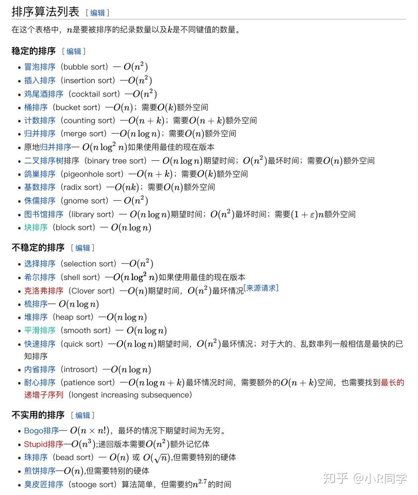
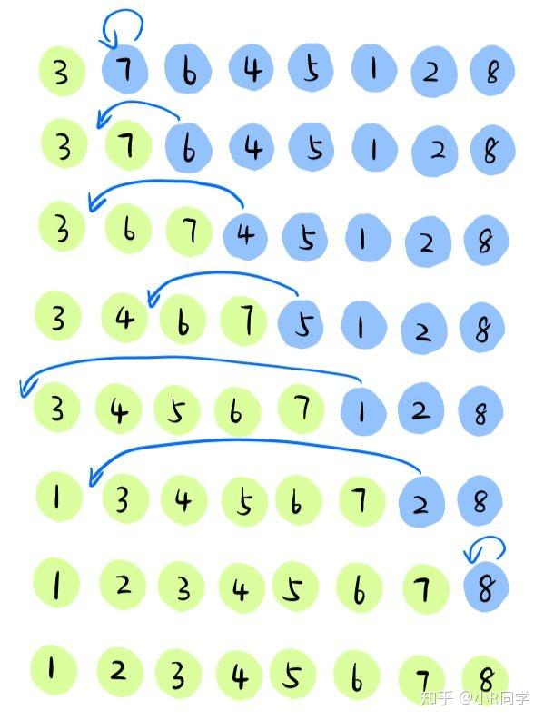
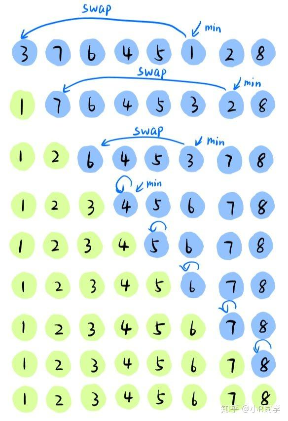
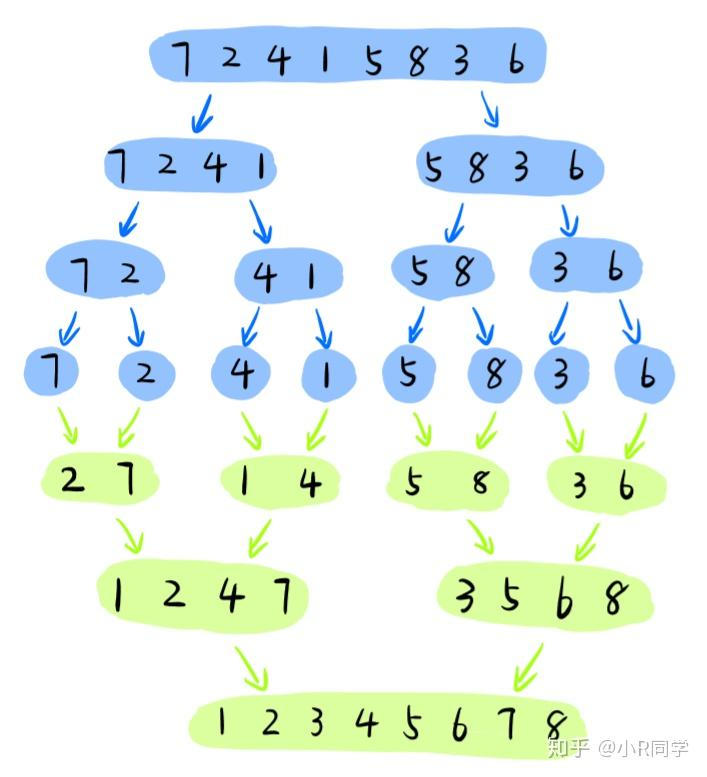

参考资料
- [最详细的排序算法讲解！一看就懂！](https://zhuanlan.zhihu.com/p/113529847)




## **请手写“插入排序”?**



### ✅ 插入排序核心思想

插入排序是一种**简单直观的排序算法**，它的基本思路是：

1. 将数组分为“已排序”和“未排序”两部分；
2. 每次从未排序部分取出一个元素，插入到已排序部分中的合适位置；
3. 类似于我们整理扑克牌的方式：一张一张地插入已有顺序中；

---

### 🧠 时间复杂度分析

| 情况 | 时间复杂度 |
|------|-------------|
| 最好情况（已排序） | O(n) |
| 平均情况 | O(n²) |
| 最坏情况（逆序） | O(n²) |

> [!WARNING] ⚠️
> 插入排序虽然效率不高，但它是一个 **稳定排序算法**，适合小规模数据集或近乎有序的数据。

---

### 📝 手写代码：JavaScript 实现（标准版）

```javascript:line-numbers {1,2,6,8,10,17,19,21,22,29,30,33,34}
function insertionSort(arr) {
    const n = arr.length; // 获取数组的长度，方便后续使用

    // 外层循环：从数组的第二个元素开始遍历 (索引 i = 1)
    // 因为我们默认第一个元素 (索引 0) 自身构成一个已排序的子数组
    for (let i = 1; i < n; i++) {
        // key: 当前需要被插入到已排序部分的元素
        const key = arr[i];
        // j: 指向已排序子数组的最后一个元素的索引
        let j = i - 1;

        // 内层循环：将 key 与已排序子数组中的元素从右向左进行比较
        // 循环条件：
        // 1. j >= 0: 确保我们还在已排序子数组的范围内，没有越界到数组头部之前
        // 2. arr[j] > key: 如果已排序子数组中的当前元素 arr[j] 大于我们要插入的 key
        //    这意味着 key 应该在 arr[j] 的左边，所以 arr[j] 需要向右移动一位给 key 腾出位置
        while (j >= 0 && arr[j] > key) {
            // 将比 key 大的元素向右移动一个位置
            arr[j + 1] = arr[j];
            // j 指针向左移动，继续与已排序子数组中的前一个元素比较
            j--;
        }

        // 循环结束后，j+1 就是 key 应该插入的正确位置
        // 为什么是 j+1 ?
        // - 如果 while 循环因为 arr[j] <= key 而终止，说明 key 应该放在 arr[j] 的右边，即 j+1 的位置。
        // - 如果 while 循环因为 j < 0 (即 j 变成了 -1) 而终止，说明 key 比已排序子数组中的所有元素都小，
        //   应该放在数组的最开始，即索引 0 的位置，此时 j+1 等于 0。
        arr[j + 1] = key;
    }

    // 返回排序后的数组
    return arr;
}

```
::: details 展开查看代码逻辑分解

**代码逻辑分解：**

1.  **初始化**：
    *   `const n = arr.length;`: 获取数组长度，用于确定循环的边界。

2.  **外层循环 (`for (let i = 1; i < n; i++)`)**：
    *   这个循环负责遍历数组中**未排序**的部分。
    *   `i` 从 `1` 开始，因为我们认为 `arr[0]`（数组的第一个元素）本身已经是一个有序的子数组。
    *   在每次 `i` 的迭代开始时，子数组 `arr[0...i-1]` 是**已排序**的。
    *   `arr[i]` 是当前要从未排序部分取出并插入到已排序部分的元素。

3.  **选择要插入的元素 (`const key = arr[i];`)**：
    *   我们将 `arr[i]` 的值保存在 `key` 变量中。这是因为在后续的移位操作中，`arr[i]` 的原始位置可能会被覆盖，所以我们需要一个临时变量来保存它的值。

4.  **初始化已排序部分的比较指针 (`let j = i - 1;`)**：
    *   `j` 指向已排序子数组 `arr[0...i-1]` 的最后一个元素。我们将从这个位置开始，向左比较 `key`。

5.  **内层循环 (`while (j >= 0 && arr[j] > key)`)**：
    *   这个循环的目的是为 `key` 在已排序子数组 `arr[0...j]`（在`j`递减的过程中）中找到正确的插入位置，并通过移动元素来腾出空间。
    *   **条件 1: `j >= 0`**：确保指针 `j` 没有越过数组的左边界（索引0）。
    *   **条件 2: `arr[j] > key`**：如果已排序部分中的元素 `arr[j]` 大于 `key`，那么 `arr[j]` 就不是 `key` 的最终位置的左邻居，它需要向右移动。
    *   **操作 1: `arr[j + 1] = arr[j];`**：将元素 `arr[j]` 向右移动一位到 `arr[j + 1]`。这为 `key` 可能的插入位置腾出了空间。
    *   **操作 2: `j--;`**：将指针 `j` 向左移动一位，以便在下一次循环中比较 `key` 和 `arr[j]`（即原 `arr[j-1]`）。

6.  **插入元素 (`arr[j + 1] = key;`)**：
    *   当 `while` 循环结束时，有两种可能：
        *   **`arr[j] <= key`**：找到了一个不大于 `key` 的元素 `arr[j]`（或者 `j` 已经 < 0）。这意味着 `key` 应该被插入到 `arr[j]` 的右边。由于 `j` 在最后一次满足 `arr[j] > key` 时被减了1，所以当前 `j` 指向的是 `key` 左侧第一个不大于 `key` 的元素，或者 `j` 是 `-1`。因此，`key` 的正确位置是 `j + 1`。
        *   **`j < 0` (即 `j` 变成了 `-1`)**：这表示 `key` 比已排序子数组中的所有元素都小，所以它应该被放在已排序子数组的最前面，即索引 `0` 的位置。此时，`j + 1` 正好是 `0`。
    *   所以，无论哪种情况，`arr[j + 1] = key;` 都会将 `key` 放置到其在已排序子数组中的正确位置。

7.  **返回数组 (`return arr;`)**：
    *   当外层循环完成所有迭代后，整个数组 `arr` 就变成有序的了，函数返回这个排序后的数组。

**总结一下插入排序的工作流程：**

1.  将数组视为两部分：左边的**已排序**部分和右边的**未排序**部分。
2.  初始时，已排序部分只包含数组的第一个元素。
3.  从第二个元素开始，逐个从未排序部分取出元素（称为 `key`）。
4.  将 `key` 与已排序部分的元素从右到左进行比较。
5.  如果已排序部分的元素大于 `key`，则将该元素向右移动一位。
6.  重复步骤 5，直到找到一个小于或等于 `key` 的元素，或者已到达已排序部分的开头。
7.  将 `key` 插入到空出的位置。
8.  重复步骤 3-7，直到所有未排序部分的元素都被插入到已排序部分。

:::

### 📌 示例调用

```js
const arr = [5, 3, 8, 4, 2];
console.log(insertionSort(arr)); // 输出: [2, 3, 4, 5, 8]
```

---

### 🔍 详细解释

#### 外层循环 `i`：

- 从第 2 个元素开始遍历；
- 当前要插入的元素为 `arr[i]`；

#### 内层循环 `j`：

- 从已排序部分末尾向前比较；
- 如果当前元素大于 `key`，就将它后移一位；
- 直到找到小于等于 `key` 的位置，或者到达数组开头；

#### 插入操作：

- 把 `key` 插入到正确的位置；

---

### 🧱 原地排序 vs 非原地排序

上面的是**原地排序版本（In-place Sort）**，不占用额外空间。如果你想保留原始数组不变，可以先复制一份再排序：

```js
function insertionSortImmutable(arr) {
  const copy = [...arr];

  for (let i = 1; i < copy.length; i++) {
    const key = copy[i];
    let j = i - 1;

    while (j >= 0 && copy[j] > key) {
      copy[j + 1] = copy[j];
      j--;
    }

    copy[j + 1] = key;
  }

  return copy;
}

// 使用示例
const original = [5, 3, 8, 4, 2];
const sorted = insertionSortImmutable(original);

console.log('原始数组:', original); // [5, 3, 8, 4, 2]
console.log('排序后:', sorted);     // [2, 3, 4, 5, 8]
```

---

### 💡 面试加分建议

如果你在面试中被问到这个问题，可以进一步补充：

> “插入排序虽然时间复杂度是 O(n²)，但它是稳定的，并且在数据已经接近有序时表现非常优秀。我通常会优先使用 JavaScript 内置的 `Array.sort()` 方法，但如果需要手动实现排序逻辑，我会选择插入排序来处理小规模数据集。”

---

### 📚 相关延伸问题（可能被追问）

1. **插入排序是原地排序吗？是否稳定？**
2. **插入排序与冒泡排序有什么区别？**
3. **插入排序有哪些实际应用场景？**
4. **如何对对象数组进行插入排序？**
5. **什么是二分插入排序？能否优化性能？**

---

### ✅ 总结口诀（便于记忆）

> [!TIP] 💡
> “逐个插入已排区，往前比较找位置。”

## **请手写“选择排序”?**



### ✅ 选择排序核心思想

选择排序是一种**简单直观的排序算法**，它的基本思路是：

1. 每一轮从未排序部分中选出最小（或最大）的元素；
2. 将其放到已排序部分的末尾；
3. 重复这个过程，直到整个数组有序；

---

### 🧠 时间复杂度分析

| 情况 | 时间复杂度 |
|------|-------------|
| 最好情况 | O(n²) |
| 平均情况 | O(n²) |
| 最坏情况 | O(n²) |

> [!WARNING] ⚠️
> 不论输入数据是否有序，它都需要完整的比较次数。但它是 **原地排序算法**，适合教学和理解基础排序原理。

---

### 📝 手写代码：JavaScript 实现（标准版）

```js
function selectionSort(arr) {
  const n = arr.length;

  for (let i = 0; i < n - 1; i++) {
    let minIndex = i;

    // 找到未排序部分中最小元素的索引
    for (let j = i + 1; j < n; j++) {
      if (arr[j] < arr[minIndex]) {
        minIndex = j;
      }
    }

    // 将最小值交换到当前位置
    if (minIndex !== i) {
      [arr[i], arr[minIndex]] = [arr[minIndex], arr[i]];
    }
  }

  return arr;
}
```

---

### 📌 示例调用

```js
const arr = [5, 3, 8, 4, 2];
console.log(selectionSort(arr)); // 输出: [2, 3, 4, 5, 8]
```

---

### 🔍 详细解释

#### 外层循环 `i`：

- 控制排序轮数；
- 每次将当前轮的最小值放在第 `i` 的位置；

#### 内层循环 `j`：

- 在 `[i+1, n)` 范围内寻找最小值；
- 如果发现更小的值，更新 `minIndex`；

#### 交换逻辑：

- 当前轮结束后，把找到的最小值与 `arr[i]` 交换；
- 如果 `minIndex === i`，则不需要交换；

---

### 🧱 原地排序 vs 非原地排序

上面的是**原地排序版本（In-place Sort）**，不占用额外空间。如果你想保留原始数组不变，可以先复制一份再排序：

```js
function selectionSortImmutable(arr) {
  const copy = [...arr];

  for (let i = 0; i < copy.length - 1; i++) {
    let minIndex = i;

    for (let j = i + 1; j < copy.length; j++) {
      if (copy[j] < copy[minIndex]) {
        minIndex = j;
      }
    }

    if (minIndex !== i) {
      [copy[i], copy[minIndex]] = [copy[minIndex], copy[i]];
    }
  }

  return copy;
}

// 使用示例
const original = [5, 3, 8, 4, 2];
const sorted = selectionSortImmutable(original);

console.log('原始数组:', original); // [5, 3, 8, 4, 2]
console.log('排序后:', sorted);     // [2, 3, 4, 5, 8]
```

---

### 💡 面试加分建议

如果你在面试中被问到这个问题，可以进一步补充：

> [!TIP] 💡
> “选择排序虽然性能不高，但它实现简单、逻辑清晰，非常适合教学和理解排序的基本思想。它的主要优点是只需要一次交换操作，因此对内存写入较少。
> 我在实际项目中不会直接使用它处理大规模数据，但在学习阶段我会用它来练习算法思维。”


### 📚 相关延伸问题（可能被追问）

1. **选择排序是原地排序吗？是否稳定？**
   > 是原地排序，但不是稳定排序。

2. **选择排序与冒泡排序有什么区别？**
   > 选择排序每次只做一次交换，而冒泡排序可能多次交换相邻元素。

3. **选择排序有哪些应用场景？**
   > 教学演示、嵌入式系统、内存受限环境等。

4. **如何对对象数组进行选择排序？**

```js
function selectionSortObjects(arr, compareFn) {
  const n = arr.length;

  for (let i = 0; i < n - 1; i++) {
    let minIndex = i;

    for (let j = i + 1; j < n; j++) {
      if (compareFn(arr[j], arr[minIndex]) < 0) {
        minIndex = j;
      }
    }

    if (minIndex !== i) {
      [arr[i], arr[minIndex]] = [arr[minIndex], arr[i]];
    }
  }

  return arr;
}

// 使用示例
const users = [
  { name: 'Alice', age: 30 },
  { name: 'Bob', age: 25 },
  { name: 'Charlie', age: 35 },
  { name: 'David', age: 28 }
];

selectionSortObjects(users, (a, b) => a.age - b.age);
console.log(users);
```
---

### ✅ 总结口诀（便于记忆）

> [!TIP] 💡
> “遍历找最小，交换放前面，逐步扩排区，整体就有序。”

## **请手写“冒泡排序”？**


### ✅ 冒泡排序核心思想

冒泡排序是一种**简单直观的比较排序算法**，它的基本思路是：

1. 从头开始，依次比较相邻两个元素；
2. 如果顺序错误就交换它们；
3. 每一轮遍历后，最大的元素会“冒”到最后；
4. 重复上述过程，直到所有元素有序。

---

### 🧠 时间复杂度分析

| 情况 | 时间复杂度 |
|------|-------------|
| 最好情况（已排序） | O(n) |
| 平均情况 | O(n²) |
| 最坏情况（逆序） | O(n²) |

> [!WARNING] ⚠️
> 虽然效率不高，但它是**稳定排序算法**，适合教学和理解排序基础。

---

### 📝 手写代码：JavaScript 实现（带优化）

```js:line-numbers {10-14}
function bubbleSort(arr) {
  const n = arr.length;

  // 外层循环控制轮数
  for (let i = 0; i < n - 1; i++) {
    let swapped = false;

    // 内层循环控制每一轮比较次数
    for (let j = 0; j < n - 1 - i; j++) {
      if (arr[j] > arr[j + 1]) {
        // 交换相邻元素
        [arr[j], arr[j + 1]] = [arr[j + 1], arr[j]];
        swapped = true;
      }
    }

    // 如果本轮没有发生交换，说明数组已经有序
    if (!swapped) break;
  }

  return arr;
}
```

---

### 📌 示例调用与输出

```js
const arr = [5, 3, 8, 4, 2];
console.log(bubbleSort(arr)); // 输出: [2, 3, 4, 5, 8]
```

---

### 🔍 详细解释

- **外层循环 `i`**：表示当前是第几轮冒泡，共需进行 `n-1` 轮；
- **内层循环 `j`**：每轮遍历未排序部分，将较大的值向后“冒泡”；
- **提前终止优化**：如果某一轮没有发生交换，说明数组已经有序，可提前退出；
- **时间复杂度优化**：通过减少不必要的比较次数（`n - 1 - i`）和提前终止机制提升性能；

---

### 🧱 原地排序 vs 非原地排序

冒泡排序是**原地排序（In-place Sort）**，不需要额外空间。如果你想保留原始数组不变，可以先复制一份再排序：

```js
function bubbleSortImmutable(arr) {
  const copy = [...arr];
  const n = copy.length;

  for (let i = 0; i < n - 1; i++) {
    let swapped = false;

    for (let j = 0; j < n - 1 - i; j++) {
      if (copy[j] > copy[j + 1]) {
        [copy[j], copy[j + 1]] = [copy[j + 1], copy[j]];
        swapped = true;
      }
    }

    if (!swapped) break;
  }

  return copy;
}

// 使用示例
const original = [5, 3, 8, 4, 2];
const sorted = bubbleSortImmutable(original);

console.log('原始数组:', original); // [5, 3, 8, 4, 2]
console.log('排序后:', sorted);     // [2, 3, 4, 5, 8]
```

---

### 💡 面试加分建议

如果你在面试中被问到这个问题，可以进一步补充：

> [!TIP] 💡
> “冒泡排序虽然性能一般，但它是一个稳定的排序算法，而且容易理解和实现。
> 我在项目中不会直接使用它来处理大规模数据，但在学习排序原理、调试小数据集时非常实用。
> 如果要提升性能，我会优先使用快速排序、归并排序或 JavaScript 的内置 `sort()` 方法。”

---

### 📚 相关延伸问题（可能被追问）

1. **冒泡排序是原地排序吗？是否稳定？**
2. **冒泡排序与选择排序有什么区别？**
3. **如何优化冒泡排序？**
4. **为什么冒泡排序的时间复杂度是 O(n²)？**
5. **什么是稳定排序？冒泡排序为什么是稳定的？**
6. **冒泡排序有哪些实际应用场景？**

---

### ✅ 总结口诀（便于记忆）

> [!TIP] 🧠
> “两层循环比相邻，大者下沉最底层，若无交换早退出，稳定排序它不差。”


## **请手写“快速排序”**

### ✅ 快速排序核心思想

快速排序是一种 **分治（Divide and Conquer）算法**。它的基本思想是：

1. 从数组中选择一个基准元素（`pivot`）
2. 将所有小于 `pivot` 的元素放在其左边，大于 `pivot` 的元素放在右边
3. 对左右两个子数组递归执行上述过程，直到子数组长度为 `1` 或 `0`

### 🧠 时间复杂度分析

| 情况 | 时间复杂度 |
|------|-------------|
| 最好情况（平衡划分） | O(n log n) |
| 平均情况 | O(n log n) |
| 最坏情况（已排序/逆序） | O(n²) |

> [!WARNING] ⚠️
> 
>  在实际应用中，可以通过随机选择 pivot 来避免最坏情况。


### 📝 手写代码：JavaScript 实现（简洁版）

```js
function quickSort(arr) {
  if (arr.length <= 1) return arr;

  const pivot = arr[arr.length - 1]; // 选取最后一个作为基准值
  const left = [];
  const right = [];

  for (let i = 0; i < arr.length - 1; i++) {
    if (arr[i] < pivot) {
      left.push(arr[i]);
    } else {
      right.push(arr[i]);
    }
  }

  return [...quickSort(left), pivot, ...quickSort(right)];
}

// 示例调用
const arr = [5, 3, 8, 4, 2];
console.log(quickSort(arr)); // [2, 3, 4, 5, 8]
```

---

### 🔍 详细解释

- `pivot` 是基准值，这里我们选择最后一个元素；
- 使用 `left` 和 `right` 数组分别存储比 `pivot` 小和大的元素；
- 递归地对 `left` 和 `right` 排序；
- 最后通过展开运算符合并结果。

---

### 🧱 原地排序版本（In-place Quick Sort）

上面的是“非原地”版本，会占用额外空间。下面是更节省内存的**原地排序实现**：

```js
function swap(arr, i, j) {
  [arr[i], arr[j]] = [arr[j], arr[i]]; // 使用ES6的解构赋值来交换元素，简洁明了
}
// 代码等价于：
// let temp = arr[i];
// arr[i] = arr[j];
// arr[j] = temp;


function partition(arr, left, right) {
  const pivot = arr[right]; // 1. 选择子数组的最后一个元素作为基准值 (pivot)
  let i = left - 1; // 2. 初始化一个指针 i，它表示“小于 pivot 的区域”的右边界。
    // 初始时，这个区域为空，所以 i 在 left 左边一个位置。
  // 3. 遍历子数组中除了 pivot 之外的元素 (从 left 到 right-1)
  for (let j = left; j < right; j++) {
    if (arr[j] < pivot) {
      i++;
      swap(arr, i, j);
    }
  }

  swap(arr, i + 1, right); // 把 pivot 放到正确位置
  return i + 1;
}

function quickSortInPlace(arr, left = 0, right = arr.length - 1) {
  if (left >= right) return;

  const pivotIndex = partition(arr, left, right);
  quickSortInPlace(arr, left, pivotIndex - 1);
  quickSortInPlace(arr, pivotIndex + 1, right);

  return arr;
}

// 示例调用
const arr = [5, 3, 8, 4, 2];
quickSortInPlace(arr);
console.log(arr); // [2, 3, 4, 5, 8]
```

::: details 展开查看代码解释

1.  **`swap(arr, i, j)` 函数**
    *   **功能**: 这个函数非常简单，它的作用是交换数组 `arr` 中索引为 `i` 和 `j` 的两个元素的位置。
    *   **实现**:
        ```javascript
        function swap(arr, i, j) {
          [arr[i], arr[j]] = [arr[j], arr[i]]; // 使用ES6的解构赋值来交换元素，简洁明了
        }
        ```
        
        这行代码等价于：
    
        ```javascript
        // let temp = arr[i];
        // arr[i] = arr[j];
        // arr[j] = temp;
        ```

2.  **`partition(arr, left, right)` 函数**
    *   **功能**: 这是快速排序的核心操作。它选取一个元素作为“基准值”(pivot)，然后重新排列数组（或子数组 `arr[left...right]`），使得所有小于基准值的元素都移动到基准值的左边，所有大于或等于基准值的元素都移动到基准值的右边。最后，基准值会被放到其最终排序后的正确位置。函数返回基准值最终所在的索引。
    *   **实现**:
        ```javascript
        function partition(arr, left, right) {
          const pivot = arr[right]; // 1. 选择子数组的最后一个元素作为基准值 (pivot)
          let i = left - 1;         // 2. 初始化一个指针 i，它表示“小于 pivot 的区域”的右边界。
                                    //    初始时，这个区域为空，所以 i 在 left 左边一个位置。

          // 3. 遍历子数组中除了 pivot 之外的元素 (从 left 到 right-1)
          for (let j = left; j < right; j++) {
            if (arr[j] < pivot) {   // 4. 如果当前元素 arr[j] 小于 pivot
              i++;                  //    扩展“小于 pivot 的区域”
              swap(arr, i, j);      //    将 arr[j] 交换到这个区域的末尾 (即 arr[i] 的位置)
            }
          }

          // 5. 循环结束后，arr[left...i] 都是小于 pivot 的元素。
          //    arr[i+1...j-1] (j 此时等于 right) 都是大于或等于 pivot 的元素。
          //    现在需要将 pivot (即 arr[right]) 放到正确的位置，这个位置是 i+1。
          swap(arr, i + 1, right);
          return i + 1;             // 6. 返回 pivot 最终所在的索引
        }
        ```
    *   **工作流程举例 (对于 `[5, 3, 8, 4, 2]`, `left=0`, `right=4`)**:
        *   `pivot = arr[4] = 2`
        *   `i = -1`
        *   `j = 0`: `arr[0] = 5`. `5 < 2` is false.
        *   `j = 1`: `arr[1] = 3`. `3 < 2` is false.
        *   `j = 2`: `arr[2] = 8`. `8 < 2` is false.
        *   `j = 3`: `arr[3] = 4`. `4 < 2` is false.
        *   循环结束。`i` 仍然是 `-1`。
        *   `swap(arr, i + 1, right)` 即 `swap(arr, 0, 4)`。数组变为 `[2, 3, 8, 4, 5]`。
        *   返回 `i + 1 = 0`。pivot `2` 现在在索引 `0` 的位置。

3.  **`quickSortInPlace(arr, left = 0, right = arr.length - 1)` 函数**
    *   **功能**: 这是实现快速排序的递归函数。它采用“分治”策略：
        1.  **分解 (Divide)**: 通过 `partition` 函数将数组（或子数组）划分为两部分，并确定基准值的最终位置。
        2.  **解决 (Conquer)**: 递归地对基准值左边的子数组和右边的子数组进行快速排序。
        3.  **合并 (Combine)**: 因为是原地排序，并且基准值已经在正确位置，所以不需要显式的合并步骤。当左右两个子数组都排序完毕后，整个数组也就排序完毕了。
    *   **实现**:
        ```javascript
        function quickSortInPlace(arr, left = 0, right = arr.length - 1) {
          // 1. 基本情况：如果子数组只有一个元素或没有元素 (left >= right)，则它已经是有序的，直接返回。
          if (left >= right) return;

          // 2. 分解：调用 partition 函数，将 arr[left...right] 分区，
          //    并获取基准值 pivot 最终的索引 pivotIndex。
          const pivotIndex = partition(arr, left, right);

          // 3. 解决：递归地对左右两个子数组进行排序
          //    左子数组: arr[left ... pivotIndex - 1]
          quickSortInPlace(arr, left, pivotIndex - 1);
          //    右子数组: arr[pivotIndex + 1 ... right]
          quickSortInPlace(arr, pivotIndex + 1, right);

          return arr; // 虽然是原地排序，但通常会返回排序后的数组引用
        }
        ```
    *   **参数默认值**: `left = 0` 和 `right = arr.length - 1` 使得首次调用 `quickSortInPlace(arr)` 时，默认对整个数组进行排序。

**示例调用和执行流程**:

```javascript
const arr = [5, 3, 8, 4, 2];
quickSortInPlace(arr); // 初始调用 quickSortInPlace(arr, 0, 4)
console.log(arr);      // [2, 3, 4, 5, 8]
```

1.  `quickSortInPlace([5, 3, 8, 4, 2], 0, 4)`
    *   `partition([5, 3, 8, 4, 2], 0, 4)`:
        *   `pivot = 2` (arr[4])
        *   `i = -1`
        *   `j` 遍历 `0` 到 `3`:
            *   `arr[0]=5` (5<2 F)
            *   `arr[1]=3` (3<2 F)
            *   `arr[2]=8` (8<2 F)
            *   `arr[3]=4` (4<2 F)
        *   `swap(arr, 0, 4)` -> `arr` 变为 `[2, 3, 8, 4, 5]`
        *   `pivotIndex = 0`
    *   `quickSortInPlace(arr, 0, -1)` (左半部分) -> `left >= right`, 返回。
    *   `quickSortInPlace(arr, 1, 4)` (右半部分，即对 `[3, 8, 4, 5]` 排序)
        *   `partition([2, 3, 8, 4, 5], 1, 4)` (注意，arr[0]已经是2，不再参与这次partition)
            *   `pivot = 5` (arr[4])
            *   `i = 0` (left - 1 = 1 - 1)
            *   `j` 遍历 `1` 到 `3`:
                *   `j=1, arr[1]=3` (3<5 T) -> `i=1`, `swap(arr, 1, 1)` (arr不变: `[2, 3, 8, 4, 5]`)
                *   `j=2, arr[2]=8` (8<5 F)
                *   `j=3, arr[3]=4` (4<5 T) -> `i=2`, `swap(arr, 2, 3)` (arr变为: `[2, 3, 4, 8, 5]`)
            *   `swap(arr, i + 1, right)` 即 `swap(arr, 3, 4)` -> `arr` 变为 `[2, 3, 4, 5, 8]`
            *   `pivotIndex = 3`
        *   `quickSortInPlace(arr, 1, 2)` (左半部分，即对 `[3, 4]` 排序)
            *   `partition([2, 3, 4, 5, 8], 1, 2)`
                *   `pivot = 4` (arr[2])
                *   `i = 0`
                *   `j=1, arr[1]=3` (3<4 T) -> `i=1`, `swap(arr, 1, 1)` (arr不变)
                *   `swap(arr, 2, 2)` (arr不变)
                *   `pivotIndex = 2`
            *   `quickSortInPlace(arr, 1, 1)` -> `left >= right`, 返回。
            *   `quickSortInPlace(arr, 3, 2)` -> `left >= right`, 返回。
        *   `quickSortInPlace(arr, 4, 4)` (右半部分，即对 `[8]` 排序) -> `left >= right`, 返回。

最终，所有递归调用返回，数组 `arr` 变为 `[2, 3, 4, 5, 8]`。

**总结**:
这段代码清晰地展示了快速排序算法的实现，特别是使用了 Lomuto 分区方案（选择最后一个元素作为基准）。它通过递归地将数组划分为更小的子问题来解决排序问题，并且由于是原地排序，所以空间复杂度相对较低（主要是递归栈的开销）。


:::


---

### 💡 面试加分建议

如果你在面试中被问到这个问题，可以进一步补充：

> [!TIP] 🧠
> 
> “快速排序是经典的分治算法，虽然它在最坏情况下时间复杂度为 O(n²)，但在平均情况下非常高效，且可以优化成原地排序，适合大规模数据集。
> 在 JavaScript 中，我通常会优先使用内置的 `Array.prototype.sort()`，但如果遇到需要自定义排序逻辑或理解底层原理的场景，我会手动实现快排。”

---

### 📚 相关延伸问题（可能被追问）

1. **快速排序与归并排序的区别是什么？**
2. **如何选择 pivot 可以提高性能？**
3. **什么是尾递归优化？如何优化快排的递归深度？**
4. **快速排序是稳定的排序吗？**
5. **如何实现一个降序的快速排序？**
6. **如何对对象数组进行快速排序？**


## **请手写“归并排序”？**



### ✅ 归并排序核心思想

归并排序是一种高效、稳定的排序算法，基本思路如下：

1. **分（Divide）**：将数组分成两半；
2. **治（Conquer）**：递归地对每一半进行归并排序；
3. **合（Merge）**：将两个有序子数组合并为一个有序数组；

它的时间复杂度始终为 **O(n log n)**，是处理大规模数据的理想选择。

---

### 🧠 时间复杂度分析

| 情况 | 时间复杂度 |
|------|-------------|
| 最好情况 | O(n log n) |
| 平均情况 | O(n log n) |
| 最坏情况 | O(n log n) |

> ✅ 它比快排更稳定，但空间复杂度为 O(n)，因为需要额外的空间来存储临时数组。

---

### 📝 手写代码：JavaScript 实现（递归版）

```js
function mergeSort(arr) {
  // 基线条件：如果数组长度小于等于 1，则已经有序
  if (arr.length <= 1) return arr;

  // 分割数组
  const mid = Math.floor(arr.length / 2);
  const left = mergeSort(arr.slice(0, mid));   // 排序左半部分
  const right = mergeSort(arr.slice(mid));    // 排序右半部分

  // 合并左右两部分
  return merge(left, right);
}

// 合并两个有序数组为一个有序数组
function merge(left, right) {
  const result = [];
  let i = 0;
  let j = 0;

  // 依次比较元素，小的先放入结果数组
  while (i < left.length && j < right.length) {
    if (left[i] < right[j]) {
      result.push(left[i++]);
    } else {
      result.push(right[j++]);
    }
  }

  // 添加剩余元素
  return result.concat(left.slice(i)).concat(right.slice(j));
}
```

---

### 📌 示例调用

```js
const arr = [5, 3, 8, 4, 2];
console.log(mergeSort(arr)); // 输出: [2, 3, 4, 5, 8]
```

---

### 🔍 详细解释

#### `mergeSort` 函数（分治阶段）

- 如果数组长度为 0 或 1，直接返回；
- 否则，将数组一分为二；
- 对左右两部分分别递归调用 `mergeSort`；
- 最后将两个有序数组合并成一个完整的有序数组；

#### `merge` 函数（合并阶段）

- 使用双指针法逐个比较左右数组中的元素；
- 将较小的元素添加到结果数组中；
- 最后将未遍历完的元素全部加入结果数组；

---

### 🧱 原地排序版本（In-place Merge Sort）

上面的是“非原地”版本，会占用额外空间。下面是更节省内存的**原地排序实现**（简化版）：

```js
function mergeInPlace(arr, left, mid, right) {
  const temp = [];

  let i = left;     // 左边起始位置
  let j = mid + 1;  // 右边起始位置

  // 复制进临时数组
  while (i <= mid && j <= right) {
    if (arr[i] < arr[j]) {
      temp.push(arr[i++]);
    } else {
      temp.push(arr[j++]);
    }
  }

  // 添加左边剩余部分
  while (i <= mid) {
    temp.push(arr[i++]);
  }

  // 添加右边剩余部分
  while (j <= right) {
    temp.push(arr[j++]);
  }

  // 将临时数组拷贝回原数组
  for (let k = 0; k < temp.length; k++) {
    arr[left + k] = temp[k];
  }
}

function mergeSortInPlace(arr, left = 0, right = arr.length - 1) {
  if (left >= right) return;

  const mid = Math.floor((left + right) / 2);

  mergeSortInPlace(arr, left, mid);       // 排序左半部分
  mergeSortInPlace(arr, mid + 1, right); // 排序右半部分
  mergeInPlace(arr, left, mid, right);   // 合并两个有序部分

  return arr;
}
```

##### 示例使用：

```js
const arr = [5, 3, 8, 4, 2];
mergeSortInPlace(arr);
console.log(arr); // [2, 3, 4, 5, 8]
```

---

### 💡 面试加分建议

如果你在面试中被问到这个问题，可以进一步补充：

> [!TIP] 💡
> “归并排序是一种典型的分治算法，适合处理大数据量下的排序任务。虽然它不是原地排序，但它具有良好的最坏时间复杂度（O(n log n)），
> 并且是**稳定排序算法**。我在项目中一般会优先使用语言内置的排序方法，但如果要手动实现排序逻辑，我通常会选择归并排序。”

---

### 📚 相关延伸问题（可能被追问）

1. **归并排序是原地排序吗？是否稳定？**
   > 不是原地排序，但它是稳定排序。

2. **归并排序与快速排序有什么区别？**
   > 快排平均性能更好，但归并排序稳定性更高，适合链表排序。

3. **如何优化归并排序的空间复杂度？**
   > 使用原地合并（in-place merge）策略，但会增加实现复杂度。

4. **什么是 Timsort？它和归并排序的关系是什么？**
   > Timsort 是 Python 和 Java 中默认的排序算法，结合了插入排序和归并排序的优点。

5. **归并排序能否用于链表排序？**
   > ✅ 可以，归并排序非常适合链表结构，因为不需要随机访问。

---

### ✅ 总结口诀（便于记忆）

> [!TIP] 🧠
> “一分为二再排序，合二为一成有序。”
