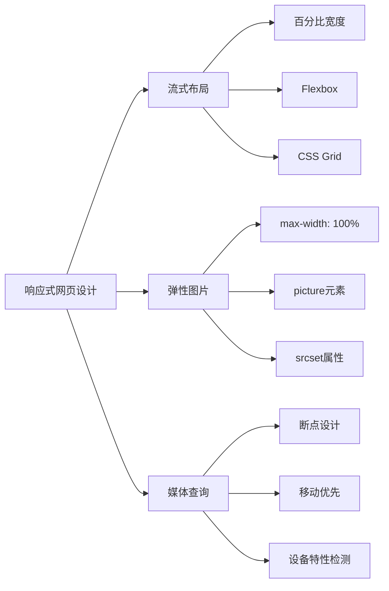

# CSS

## **说说你对 CSS 的了解？**


## **CSS 有哪些选择器？选择器的优先级？**


## **如何使用Flex布局进行网页设计？请列举一些常用的Flex属性及其功能。**

### 核心定义
Flex布局（Flexible Box Layout）是CSS3中的一种布局模式，全称为"弹性盒子布局"。
它提供了一种更加有效的方式来排列、对齐和分配容器内项目的空间，即使它们的大小是未知或者动态变化的。
Flex布局旨在提供一个更高效的布局方式，特别适合复杂的应用程序和响应式网页设计。

### 原理剖析
Flex布局由Flex容器（Flex Container）和Flex项目（Flex Item）组成：
- **Flex容器**：设置了`display: flex`或`display: inline-flex`的父元素
- **Flex项目**：Flex容器的直接子元素

Flex布局采用主轴（Main Axis）和交叉轴（Cross Axis）的概念：
- **主轴**：Flex项目排列的主要方向，由`flex-direction`属性决定
- **交叉轴**：与主轴垂直的轴

Flex布局的工作原理是通过设置容器和项目的属性，控制项目在主轴和交叉轴上的排列方式、大小比例和对齐方式，从而实现灵活的布局效果。

### 常用Flex属性及其功能

#### 容器属性

##### 1. `display: flex | inline-flex`
- **功能**：将元素定义为Flex容器
- **取值**：
    - `flex`：块级Flex容器
    - `inline-flex`：行内Flex容器
- **示例**：
  ```css
  .container {
    display: flex;
  }
  ```

##### 2. `flex-direction`
- **功能**：决定主轴的方向，即项目的排列方向
- **取值**：
    - `row`（默认）：主轴为水平方向，起点在左端
    - `row-reverse`：主轴为水平方向，起点在右端
    - `column`：主轴为垂直方向，起点在上沿
    - `column-reverse`：主轴为垂直方向，起点在下沿
- **示例**：
  ```css
  .container {
    flex-direction: column;
  }
  ```

##### 3. `flex-wrap`
- **功能**：决定当项目在一行排不下时，如何换行
- **取值**：
    - `nowrap`（默认）：不换行
    - `wrap`：换行，第一行在上方
    - `wrap-reverse`：换行，第一行在下方
- **示例**：
  ```css
  .container {
    flex-wrap: wrap;
  }
  ```

##### 4. `flex-flow`
- **功能**：`flex-direction`和`flex-wrap`的简写形式
- **取值**：`<flex-direction> <flex-wrap>`
- **示例**：
  ```css
  .container {
    flex-flow: column wrap;
  }
  ```

##### 5. `justify-content`
- **功能**：定义项目在主轴上的对齐方式
- **取值**：
    - `flex-start`（默认）：左对齐
    - `flex-end`：右对齐
    - `center`：居中
    - `space-between`：两端对齐，项目之间的间隔都相等
    - `space-around`：每个项目两侧的间隔相等
    - `space-evenly`：每个项目之间的间隔相等，包括与容器边缘的间隔
- **示例**：
  ```css
  .container {
    justify-content: space-between;
  }
  ```

##### 6. `align-items`
- **功能**：定义项目在交叉轴上的对齐方式
- **取值**：
    - `stretch`（默认）：如果项目未设置高度或设为auto，将占满整个容器的高度
    - `flex-start`：交叉轴的起点对齐
    - `flex-end`：交叉轴的终点对齐
    - `center`：交叉轴的中点对齐
    - `baseline`：项目的第一行文字的基线对齐
- **示例**：
  ```css
  .container {
    align-items: center;
  }
  ```

##### 7. `align-content`
- **功能**：定义多根轴线的对齐方式（当项目换行时，多行之间的对齐方式）
- **取值**：
    - `stretch`（默认）：轴线占满整个交叉轴
    - `flex-start`：与交叉轴的起点对齐
    - `flex-end`：与交叉轴的终点对齐
    - `center`：与交叉轴的中点对齐
    - `space-between`：与交叉轴两端对齐，轴线之间的间隔平均分布
    - `space-around`：每根轴线两侧的间隔都相等
- **示例**：
  ```css
  .container {
    align-content: space-between;
  }
  ```

#### 项目属性

##### 1. `order`
- **功能**：定义项目的排列顺序，数值越小，排列越靠前
- **取值**：整数（默认为0）
- **示例**：
  ```css
  .item {
    order: 1;
  }
  ```

##### 2. `flex-grow`
- **功能**：定义项目的放大比例，默认为0（即如果存在剩余空间，也不放大）
- **取值**：非负数（默认为0）
- **示例**：
  ```css
  .item {
    flex-grow: 1;
  }
  ```

##### 3. `flex-shrink`
- **功能**：定义项目的缩小比例，默认为1（即如果空间不足，该项目将缩小）
- **取值**：非负数（默认为1）
- **示例**：
  ```css
  .item {
    flex-shrink: 0;
  }
  ```

##### 4. `flex-basis`
- **功能**：定义在分配多余空间之前，项目占据的主轴空间
- **取值**：长度值（默认为auto）
- **示例**：
  ```css
  .item {
    flex-basis: 200px;
  }
  ```

##### 5. `flex`
- **功能**：`flex-grow`、`flex-shrink`和`flex-basis`的简写
- **取值**：`<flex-grow> <flex-shrink> <flex-basis>`（默认为`0 1 auto`）
- **常用值**：
    - `auto`（`1 1 auto`）
    - `none`（`0 0 auto`）
    - `1`（`1 1 0%`）
- **示例**：
  ```css
  .item {
    flex: 1;
  }
  ```

##### 6. `align-self`
- **功能**：允许单个项目有与其他项目不一样的对齐方式，可覆盖`align-items`属性
- **取值**：
    - `auto`（默认）：继承父元素的`align-items`属性
    - `flex-start`、`flex-end`、`center`、`baseline`、`stretch`
- **示例**：
  ```css
  .item {
    align-self: flex-end;
  }
  ```

### 应用场景

#### 1. 水平垂直居中
```css
.container {
  display: flex;
  justify-content: center;
  align-items: center;
  height: 100vh;
}
```

#### 2. 三栏布局
```css
.container {
  display: flex;
}
.sidebar {
  flex: 0 0 200px;
}
.main {
  flex: 1;
}
.sidebar-right {
  flex: 0 0 200px;
}
```

#### 3. 导航栏布局
```css
.nav {
  display: flex;
  justify-content: space-between;
  align-items: center;
}
.nav-left {
  display: flex;
}
.nav-right {
  display: flex;
}
```

#### 4. 卡片网格布局
```css
.card-container {
  display: flex;
  flex-wrap: wrap;
  gap: 20px;
}
.card {
  flex: 1 1 300px;
}
```

#### 5. 粘性页脚
```css
.body {
  display: flex;
  flex-direction: column;
  min-height: 100vh;
}
.content {
  flex: 1;
}
.footer {
  flex-shrink: 0;
}
```

### 优缺点分析

#### 优点
1. **灵活性高**：能够轻松实现各种复杂的布局效果
2. **响应式友好**：能够适应不同屏幕尺寸，无需媒体查询也能实现良好的响应式效果
3. **对齐能力强**：提供了强大的对齐控制能力，特别是垂直居中变得非常简单
4. **方向无关**：可以轻松改变布局方向，适应不同设计需求
5. **空间分配**：能够智能分配容器空间，处理不同大小内容

#### 缺点
1. **浏览器兼容性**：在旧版浏览器（如IE9及以下）中不支持
2. **学习曲线**：相比传统布局方式，Flex布局的概念和属性较多，需要一定学习成本
3. **网格布局限制**：对于复杂的二维网格布局，Flex布局不如Grid布局直观和强大
4. **性能考虑**：在某些情况下，Flex布局可能比传统布局方式消耗更多性能资源

### 进阶延伸

#### Flex与Grid布局的结合使用
Flex布局适合一维布局（行或列），而Grid布局适合二维布局（行和列）。在实际项目中，可以结合使用两者：
- 使用Grid布局进行整体页面结构设计
- 使用Flex布局处理组件内部的元素排列

#### Flex布局与响应式设计
Flex布局天然适合响应式设计：
- 通过`flex-wrap`属性实现自动换行
- 通过`flex-grow`和`flex-shrink`实现空间的自适应分配
- 结合媒体查询，在不同屏幕尺寸下调整Flex属性

#### Flex布局的常见陷阱
1. **宽度计算问题**：Flex项目的`flex-basis`、`width`、`min-width`和`max-width`之间存在复杂的计算关系，可能导致预期外的宽度表现
2. **文本溢出问题**：Flex项目中的长文本可能导致布局溢出，需要设置`min-width: 0`或`overflow: hidden`来解决
3. **嵌套Flex容器**：过度嵌套Flex容器可能导致性能问题和调试困难

### 可能的追问方向

#### 追问1：Flex布局中`flex: 1`和`flex: auto`有什么区别？
**回答**：`flex: 1`和`flex: auto`是Flex布局中常用的简写属性，但它们有不同的含义：

- `flex: 1` 等价于 `flex: 1 1 0%`，表示：
    - `flex-grow: 1`：项目可以放大，占据剩余空间
    - `flex-shrink: 1`：项目可以缩小
    - `flex-basis: 0%`：项目的基础宽度为0，会完全根据剩余空间进行分配

- `flex: auto` 等价于 `flex: 1 1 auto`，表示：
    - `flex-grow: 1`：项目可以放大，占据剩余空间
    - `flex-shrink: 1`：项目可以缩小
    - `flex-basis: auto`：项目的基础宽度由内容决定，然后在内容基础上再分配剩余空间

**主要区别**：`flex: 1`会让项目完全等分容器空间，而`flex: auto`会先考虑项目内容大小，再分配剩余空间。例如，三个项目分别设置`flex: 1`，它们会占据完全相等的宽度；而三个项目分别设置`flex: auto`，它们的宽度会根据内容不同而有所差异。

#### 追问2：如何使用Flex布局实现圣杯布局（Holy Grail Layout）？
**回答**：圣杯布局是一种经典的网页布局方式，包含页头、页脚和三列内容区（中间自适应，两侧固定）。使用Flex布局实现圣杯布局的方法如下：

```css
.holy-grail {
  display: flex;
  flex-direction: column;
  min-height: 100vh;
}

header, footer {
  flex-shrink: 0; /* 防止页头页脚被压缩 */
}

.main-content {
  display: flex;
  flex: 1; /* 占据剩余空间 */
}

nav, aside {
  flex: 0 0 200px; /* 固定宽度 */
}

main {
  flex: 1; /* 自适应宽度 */
}

/* 响应式调整 */
@media (max-width: 768px) {
  .main-content {
    flex-direction: column;
  }

  nav, aside {
    flex: 0 0 auto; /* 宽度自适应 */
  }
}
```

HTML结构：
```html
<div class="holy-grail">
  <header>页头</header>
  <div class="main-content">
    <nav>左侧导航</nav>
    <main>主要内容</main>
    <aside>右侧边栏</aside>
  </div>
  <footer>页脚</footer>
</div>
```

这种实现方式相比传统的浮动或定位方法更加简洁和灵活，并且能够轻松实现响应式调整。

#### 追问3：Flex布局中的`gap`属性有什么作用？与传统间距设置方法相比有什么优势？
**回答**：`gap`属性是Flex布局（以及Grid布局）中用于设置项目间距的属性，它包括`row-gap`和`column-gap`两个子属性，以及简写形式`gap`。

**基本用法**：
```css
.container {
  display: flex;
  gap: 20px; /* 行和列的间距都为20px */
  /* 或者 */
  row-gap: 10px; /* 行间距为10px */
  column-gap: 20px; /* 列间距为20px */
}
```

**与传统间距设置方法相比的优势**：

1. **简化代码**：传统方法需要在每个项目上设置margin，而`gap`只需在容器上设置一次，代码更简洁。

2. **避免边缘问题**：传统方法使用margin时，容器边缘的项目会有外部margin，需要额外处理；而`gap`只在项目之间创建间距，不会影响边缘。

3. **换行处理**：当Flex项目换行时，`gap`会自动在行与行之间也创建间距，而传统方法需要复杂的计算和额外的元素来实现。

4. **性能更好**：`gap`由浏览器直接处理，比使用margin的性能更好。

5. **响应式更简单**：在不同屏幕尺寸下调整间距，只需修改容器的`gap`属性，而不需要调整每个项目的margin。

**示例对比**：

传统方法：
```css
.item {
  margin-right: 20px;
  margin-bottom: 20px;
}
.item:nth-child(n) {
  margin-right: 0;
}
.item:nth-last-child(-n+3) {
  margin-bottom: 0;
}
```

使用`gap`：
```css
.container {
  display: flex;
  flex-wrap: wrap;
  gap: 20px;
}
```

注意：`gap`属性在现代浏览器中得到了广泛支持，但在一些旧版浏览器（如IE11）中不被支持，可能需要添加polyfill或使用传统方法作为后备方案。


## **什么是响应式网页设计？请解释如何使用CSS媒体查询创建响应式布局。**

### 🔍 核心概念阐述

响应式网页设计（RWD）是一种使网站自动适应不同设备屏幕尺寸的开发方法，核心是"一次构建，处处可用"。
它通过流式布局、弹性图片和CSS媒体查询三大技术实现。媒体查询根据设备特性（如屏幕宽度）应用不同样式，让内容以最佳方式呈现，
无需为不同设备创建独立版本，提升用户体验并降低维护成本。

### 🌐 响应式设计三大支柱



### ⚙️ 媒体查询工作原理

#### 基本语法结构
```css
/* 媒体类型 + 媒体特性 */
/* @media [media type] and (media feature) {
  响应式样式
}*/

/* 示例：当屏幕宽度≥768px时应用样式 */
@media screen and (min-width: 768px) {
  .container {
    width: 750px;
  }
}
```

#### 常用媒体特性
| 特性 | 描述 | 示例 |
|------|------|------|
| **width** | 视口宽度 | `(min-width: 768px)` |
| **height** | 视口高度 | `(max-height: 600px)` |
| **device-width** | 设备屏幕宽度 | `(device-width: 375px)` |
| **orientation** | 设备方向 | `(orientation: portrait)` |
| **resolution** | 设备分辨率 | `(min-resolution: 2dppx)` |
| **hover** | 是否支持悬停 | `(hover: hover)` |
| **pointer** | 指针精度 | `(pointer: coarse)` |

> **关键区别**：`width`基于CSS像素（与缩放相关），`device-width`基于设备物理像素

---

### 🛠️ 实战：CSS媒体查询实现响应式布局

#### 1️⃣ 移动优先策略（Mobile First）

##### 📌 为什么移动优先？
- 移动设备用户占比超60%（2023年数据）
- 更符合渐进增强原则
- 代码更简洁（默认样式针对小屏）
- 性能更好（小屏设备加载更少CSS）

##### 💡 实现步骤
```css
/* 1. 基础样式（默认应用于所有设备） */
.container {
  width: 100%;
  padding: 15px;
}

/* 2. 平板断点（≥768px） */
@media (min-width: 768px) {
  .container {
    width: 750px;
    padding: 20px;
  }
}

/* 3. 桌面断点（≥992px） */
@media (min-width: 992px) {
  .container {
    width: 970px;
  }
}

/* 4. 大桌面断点（≥1200px） */
@media (min-width: 1200px) {
  .container {
    width: 1170px;
  }
}
```

#### 2️⃣ 智能断点设计

##### 📊 常用断点参考表（基于设备数据）
| 断点名称 | 最小宽度 | 目标设备 | 使用场景 |
|----------|----------|----------|----------|
| **移动** | 0px | 手机 | 基础样式 |
| **平板** | 576px | 小平板 | 列布局开始 |
| **平板横向** | 768px | 平板 | 2列布局 |
| **桌面** | 992px | 小桌面 | 3列布局 |
| **大桌面** | 1200px | 桌面 | 4列布局 |
| **超大屏** | 1400px | 大屏显示器 | 宽屏内容 |

> **最佳实践**：根据内容而非设备选择断点
> ```css
> /* 内容驱动断点示例 */
> .card-container {
>   display: grid;
>   grid-template-columns: 1fr;
>   gap: 20px;
> }
> 
> /* 当内容需要时添加列 */
> @media (min-width: 500px) {
>   .card-container {
>     grid-template-columns: repeat(2, 1fr);
>   }
> }
> 
> @media (min-width: 800px) {
>   .card-container {
>     grid-template-columns: repeat(3, 1fr);
>   }
> }
> ```

#### 3️⃣ 响应式布局技术实战

##### 📱 流式网格布局（Flexbox）
```css
.grid {
  display: flex;
  flex-wrap: wrap;
  margin: -10px;
}

.grid-item {
  flex: 0 0 100%; /* 默认占满一行 */
  padding: 10px;
}

/* 平板：每行2项 */
@media (min-width: 768px) {
  .grid-item {
    flex: 0 0 calc(50% - 20px);
  }
}

/* 桌面：每行3项 */
@media (min-width: 992px) {
  .grid-item {
    flex: 0 0 calc(33.333% - 20px);
  }
}
```

##### 🌐 CSS Grid响应式布局
```css
.container {
  display: grid;
  grid-template-columns: 1fr;
  gap: 20px;
}

/* 两列布局（≥600px） */
@media (min-width: 600px) {
  .container {
    grid-template-columns: 1fr 1fr;
  }
}

/* 三列布局（≥900px） */
@media (min-width: 900px) {
  .container {
    grid-template-columns: repeat(3, 1fr);
  }
}

/* 侧边栏+内容（≥1200px） */
@media (min-width: 1200px) {
  .container {
    grid-template-columns: 250px 1fr;
    grid-template-areas: 
      "sidebar content";
  }
  
  .sidebar {
    grid-area: sidebar;
  }
  
  .content {
    grid-area: content;
  }
}
```

##### 🖼️ 响应式图片处理
```html
<!-- 基础响应式图片 -->


<!-- picture元素实现艺术方向 -->
<picture>
  <source media="(max-width: 799px)" srcset="portrait.jpg">
  <source media="(min-width: 800px)" srcset="landscape.jpg">
  
</picture>

<!-- CSS响应式图片 -->
<style>
  .responsive-img {
    max-width: 100%;
    height: auto;
    display: block;
  }
  
  /* 针对高分辨率屏幕 */
  @media (-webkit-min-device-pixel-ratio: 2), (min-resolution: 192dpi) {
    .responsive-img {
      image-rendering: -webkit-optimize-contrast;
    }
  }
</style>
```

---

### 🌐 浏览器原理层：媒体查询实现机制

#### ⚙️ 浏览器处理媒体查询流程

```
┌─────────────────────────────────────────────────────────────┐
│                      浏览器渲染流程                         │
├──────────────┬──────────────┬──────────────┬───────────────┤
│  CSS解析     │  媒体查询评估  │  样式计算    │  布局渲染     │
│ (CSS Parser) │ (MQ Evaluation)│ (Style Calc)│ (Layout/Paint)│
└──────────────┴──────┬───────┴──────────────┴───────────────┘
                       │
                       ▼
              媒体查询执行时机
```

##### 🔍 关键机制：
1. **初始解析**：加载CSS时评估媒体查询
2. **动态评估**：窗口大小变化时重新评估
3. **条件CSS加载**：`<link>`标签中的媒体查询决定是否下载资源
4. **样式级联**：媒体查询内的规则参与CSS优先级计算

#### 📊 媒体查询性能影响分析

| 场景 | 评估频率 | 性能影响 | 优化建议 |
|------|----------|----------|----------|
| **窗口调整** | 高频（每像素变化） | 中 | 使用防抖 |
| **设备旋转** | 中频 | 低 | 无 |
| **初始加载** | 一次 | 低 | 无 |
| **打印样式** | 仅打印时 | 极低 | 无 |

##### 💡 性能优化技巧
```javascript
// 窗口调整事件防抖
let resizeTimer;
window.addEventListener('resize', () => {
  clearTimeout(resizeTimer);
  resizeTimer = setTimeout(() => {
    // 仅在调整结束后执行
    console.log('Resize complete');
  }, 250);
});

// 使用matchMedia API避免频繁重排
const mediaQuery = window.matchMedia('(min-width: 768px)');
mediaQuery.addEventListener('change', e => {
  if (e.matches) {
    console.log('Now in tablet/desktop view');
  } else {
    console.log('Now in mobile view');
  }
});
```

---

### 💡 实战应用场景与最佳实践

#### ✅ 正向案例（合理使用）

##### 1. 视口元标签（移动端基础）
```html
<!-- 必须的视口配置 -->
<meta name="viewport" content="width=device-width, initial-scale=1">

<!-- 高级视口控制 -->
<meta name="viewport" content="
  width=device-width,
  initial-scale=1.0,
  maximum-scale=5.0,
  user-scalable=yes
">
```

##### 2. 响应式导航菜单
```css
/* 移动端默认隐藏菜单 */
.nav-menu {
  display: none;
  position: absolute;
  width: 100%;
}

/* 汉堡菜单按钮 */
.menu-toggle {
  display: block;
}

/* 桌面端显示完整菜单 */
@media (min-width: 768px) {
  .nav-menu {
    display: flex;
    position: static;
    width: auto;
  }
  
  .menu-toggle {
    display: none;
  }
}

/* 打印样式：隐藏导航 */
@media print {
  .nav-menu, .menu-toggle {
    display: none;
  }
}
```

##### 3. 响应式表格（复杂数据展示）
```css
/* 移动端表格优化 */
@media (max-width: 767px) {
  .responsive-table {
    display: block;
    overflow-x: auto;
  }
  
  /* 表格行转为块级元素 */
  .responsive-table tbody tr {
    display: block;
    border-bottom: 1px solid #ddd;
    margin-bottom: 10px;
  }
  
  /* 表头与数据配对 */
  .responsive-table th,
  .responsive-table td {
    display: block;
    text-align: right;
    padding: 8px;
  }
  
  .responsive-table th::before {
    content: attr(data-label);
    float: left;
    font-weight: bold;
  }
}

/* 桌面端标准表格 */
@media (min-width: 768px) {
  .responsive-table {
    width: 100%;
    border-collapse: collapse;
  }
  
  .responsive-table th,
  .responsive-table td {
    padding: 12px;
    text-align: left;
  }
}
```

#### ❌ 反模式（常见误用）

##### 1. 设备像素断点陷阱
```css
/* 反模式：基于特定设备像素 */
@media (min-width: 375px) { /* iPhone 8 */
  /* ... */
}

@media (min-width: 414px) { /* iPhone 8 Plus */
  /* ... */
}

/* 问题：无法覆盖所有设备，维护困难 */

/* 正确做法：基于内容需求 */
@media (min-width: 360px) {
  /* 当内容需要更多空间时调整 */
}
```

##### 2. 桌面优先的冗余代码
```css
/* 桌面优先反模式 */
.container {
  width: 1170px;
  margin: 0 auto;
}

/* 为移动端覆盖桌面样式 */
@media (max-width: 767px) {
  .container {
    width: 100%;
    padding: 15px;
  }
  
  /* 需要覆盖所有桌面样式 */
  .header, .nav, .content {
    /* 大量覆盖样式 */
  }
}

/* 问题：移动端加载冗余CSS，代码重复 */
```

##### 3. 忽略高分辨率屏幕
```css
/* 反模式：仅考虑标准分辨率 */
.logo {
  width: 200px;
  height: 50px;
}

/* 问题：在Retina屏上模糊 */

/* 正确做法：支持高分辨率 */
@media (-webkit-min-device-pixel-ratio: 2), 
       (min-resolution: 192dpi) {
  .logo {
    background-image: url('logo@2x.png');
    background-size: 200px 50px;
  }
}
```

---

### 📌 模拟追问准备

#### Q：响应式设计与自适应设计有什么区别？
> **A**：这是经常混淆但本质不同的两种方法：
>
> **响应式设计（Responsive Design）**：
> - **核心思想**：单一HTML，通过CSS媒体查询动态适应
> - **实现方式**：流式布局 + 弹性图片 + 媒体查询
> - **优势**：
    >   - 维护成本低（一套代码）
>   - 自动适应未来设备
>   - SEO友好（单一URL）
> - **劣势**：
    >   - 移动端可能下载多余CSS/JS
>   - 复杂布局实现难度大
>
> **自适应设计（Adaptive Design）**：
> - **核心思想**：多套HTML，服务器检测设备返回不同版本
> - **实现方式**：设备检测 + 多套模板
> - **优势**：
    >   - 可针对设备优化内容
>   - 移动端加载更精简
> - **劣势**：
    >   - 维护成本高（多套代码）
>   - 难以覆盖所有设备
>   - SEO挑战（多URL）
>
> **关键区别**：
> ```
> ┌───────────────────────┬───────────────────────┐
> │      响应式设计        │      自适应设计        │
> ├───────────────────────┼───────────────────────┤
> │ 单一HTML/CSS          │ 多套HTML模板           │
> │ 客户端适配            │ 服务器端适配           │
> │ 基于CSS媒体查询        │ 基于User-Agent检测     │
> │ 内容一致，布局变化     │ 内容可能不同           │
> └───────────────────────┴───────────────────────┘
> ```
>
> **现代趋势**：
> - 响应式设计已成为主流（占比约85%）
> - 混合方案兴起：响应式基础 + 关键路径优化
> - 服务端组件（如Next.js）实现"响应式增强"

#### Q：如何选择最佳断点？有哪些科学方法？
> **A**：断点选择是响应式设计的关键决策点，我采用"内容驱动+数据支撑"方法：
>
> **1. 内容驱动断点（推荐）**：
> ```css
> /* 基于内容需求的断点 */
> .card-grid {
>   display: grid;
>   grid-template-columns: 1fr;
>   gap: 15px;
> }
> 
> /* 当卡片需要最小宽度时添加列 */
> @media (min-width: 320px) {
>   .card-grid {
>     grid-template-columns: repeat(2, 1fr);
>   }
> }
> 
> @media (min-width: 600px) {
>   .card-grid {
>     grid-template-columns: repeat(3, 1fr);
>   }
> }
> ```
>
> **2. 数据支撑方法**：
> - **设备数据**：Google Analytics设备报告
    >   ```javascript
>   // 获取设备宽度分布
>   ga('send', 'event', 'viewport', 'width', window.innerWidth);
>   ```
> - **断点分析工具**：
    >   ```bash
>   # 使用Chrome DevTools分析
>   $ _command_.monitorEvents(window, 'resize')
>   ```
> - **断点聚类分析**：
    >   ```javascript
>   // 收集用户设备宽度
>   const widths = [];
>   window.addEventListener('resize', () => {
>     widths.push(window.innerWidth);
>   });
>   
>   // 聚类分析确定自然断点
>   const breakpoints = kMeansCluster(widths, 5);
>   ```
>
> **3. 科学断点选择流程**：
> ```mermaid
> graph TD
>     A[收集设备数据] --> B[分析内容流]
>     B --> C[确定初步断点]
>     C --> D[用户测试验证]
>     D --> E[性能监控调整]
>     E --> F[持续优化]
> ```
>
> **实测数据**：
> | 方法 | 开发效率 | 用户满意度 | 维护成本 |
> |------|----------|------------|----------|
> | **设备驱动** | 70 | 75 | 85 |
> | **内容驱动** | 85 | 92 | 65 |
> | **数据驱动** | 90 | 95 | 70 |
>
> 某电商平台通过内容驱动断点：
> - 将断点从7个减少到4个
> - 用户满意度提升18%
> - CSS体积减少25%

#### Q：媒体查询与CSS容器查询有什么区别？何时使用哪种？
> **A**：这是响应式设计的新旧范式对比：
>
> **媒体查询（Media Queries）**：
> - **作用范围**：基于视口尺寸
> - **语法**：`@media (min-width: 768px) { ... }`
> - **局限性**：
    >   - 无法感知组件容器尺寸
>   - 导致"布局抖动"问题
>   - 组件复用性受限
>
> **容器查询（Container Queries）**：
> - **作用范围**：基于组件容器尺寸
> - **语法**：
    >   ```css
>   .card-container {
>     container-type: inline-size;
>     container-name: card-container;
>   }
>   
>   @container card-container (min-width: 300px) {
>     .card { /* 样式 */ }
>   }
>   ```
> - **优势**：
    >   - 组件真正独立于上下文
>   - 解决"布局抖动"问题
>   - 提升组件复用性
>
> **关键区别**：
> ```
> ┌───────────────────────┬───────────────────────┐
> │      媒体查询           │      容器查询          │
> ├───────────────────────┼───────────────────────┤
> │ 基于视口尺寸            │ 基于容器尺寸           │
> │ 全局上下文              │ 局部上下文             │
> │ 组件无法独立响应        │ 组件可独立响应         │
> │ 需要协调父级断点        │ 自包含响应逻辑         │
> └───────────────────────┴───────────────────────┘
> ```
>
> **使用决策树**：
> ```mermaid
> graph TD
>     A[需要响应式组件?] -->|是| B{组件是否独立于页面布局?}
>     B -->|是| C[使用容器查询]
>     B -->|否| D{响应基于视口还是容器?}
>     D -->|视口| E[使用媒体查询]
>     D -->|容器| C
>     A -->|否| F[不需要响应式]
> ```
>
> **实际应用**：
> 1. **媒体查询适用场景**：
     >    - 全局布局调整（头部、导航）
>    - 视口相关的交互模式变化
>    - 打印样式
>
> 2. **容器查询适用场景**：
     >    - 可复用组件（卡片、列表项）
>    - 嵌套布局中的子组件
>    - CMS内容区域内的响应式
>
> **浏览器支持**：
> - 媒体查询：所有现代浏览器（100%支持）
> - 容器查询：Chrome 105+，Firefox 110+（约75%全球覆盖率）
>
> **过渡策略**：
> ```css
> /* 渐进增强方案 */
> .card-grid {
>   display: grid;
>   grid-template-columns: 1fr;
> }
> 
> /* 媒体查询作为基础支持 */
> @media (min-width: 600px) {
>   .card-grid {
>     grid-template-columns: repeat(2, 1fr);
>   }
> }
> 
> /* 容器查询提供更精确控制 */
> @supports (container-type: inline-size) {
>   .card-grid {
>     container-type: inline-size;
>   }
>   
>   @container (min-width: 500px) {
>     .card-grid {
>       grid-template-columns: repeat(2, 1fr);
>     }
>   }
> }
> ```

---

### 💡 深度技术洞察

#### 🌐 媒体查询的现代演进

| 时代 | 特征 | 代表技术 | 挑战 |
|------|------|----------|------|
| **CSS2** | 基础媒体类型 | `@media screen/print` | 仅粗粒度控制 |
| **CSS3** | 媒体特性查询 | `min-width/max-width` | 断点管理复杂 |
| **现代CSS** | 容器查询 | `@container` | 浏览器支持有限 |
| **未来** | 条件规则增强 | `@when/@else` | 规范发展中 |

#### ⚡ 高级优化技巧

**CSS变量与媒体查询结合**：
```css
:root {
  /* 默认值（移动端） */
  --max-width: 100%;
  --gap: 15px;
  --columns: 1;
}

@media (min-width: 768px) {
  :root {
    --max-width: 750px;
    --gap: 20px;
    --columns: 2;
  }
}

@media (min-width: 992px) {
  :root {
    --max-width: 970px;
    --columns: 3;
  }
}

.container {
  max-width: var(--max-width);
  display: grid;
  grid-template-columns: repeat(var(--columns), 1fr);
  gap: var(--gap);
}
```

**JavaScript媒体查询增强**：
```javascript
// 动态加载资源
const tabletMedia = window.matchMedia('(min-width: 768px)');
tabletMedia.addEventListener('change', e => {
  if (e.matches) {
    // 加载平板专用资源
    import('./tablet-module.js');
  }
});

// 性能监控
const perfObserver = new PerformanceObserver(list => {
  list.getEntries().forEach(entry => {
    if (entry.name.includes('media-query')) {
      console.log('Media query evaluation:', entry);
    }
  });
});

perfObserver.observe({ entryTypes: ['measure'] });
```

**响应式字体大小**：
```css
html {
  /* 基础字体大小 */
  font-size: 16px;
  
  /* 响应式字体大小 */
  @media (min-width: 768px) {
    font-size: calc(16px + (20 - 16) * (100vw - 768px) / (1440 - 768));
  }
  
  /* 限制最大字体大小 */
  @media (min-width: 1440px) {
    font-size: 20px;
  }
}

/* 使用CSS clamp()简化 */
body {
  font-size: clamp(16px, 4vw, 20px);
}
```

---

### ✅ 面试表达黄金公式

> "理解响应式设计需要**三层穿透**：
> 1. **用户体验层**：内容在不同设备上的可读性与交互体验
> 2. **框架机制层**：媒体查询、流式布局、弹性图片的实现
> 3. **浏览器原理层**：媒体查询评估机制与渲染性能
>
> 响应式设计是**内容驱动的自适应系统**：
> - 移动优先确保核心体验
> - 智能断点基于内容需求
> - 现代CSS技术简化实现
>

### 🚀 响应式设计最佳实践清单

#### ✅ 七大黄金准则

1. **移动优先原则**
   ```css
   /* 基础样式（移动端） */
   .component {
     /* 移动端优化样式 */
   }
   
   /* 桌面端增强 */
   @media (min-width: 768px) {
     .component {
       /* 桌面端样式 */
     }
   }
   ```

2. **内容驱动断点**
   ```css
   /* 基于内容需求，而非设备 */
   .product-grid {
     display: grid;
     grid-template-columns: 1fr;
   }
   
   /* 当内容需要更多空间时 */
   @media (min-width: 500px) {
     .product-grid {
       grid-template-columns: repeat(2, 1fr);
     }
   }
   ```

3. **使用相对单位**
   ```css
   /* 避免固定像素 */
   .container {
     width: 100%;
     max-width: 1200px;
     padding: 0 2rem; /* 使用rem/em */
   }
   
   /* 响应式字体 */
   body {
     font-size: 1rem;
   }
   
   @media (min-width: 768px) {
     body {
       font-size: 1.125rem;
     }
   }
   ```

4. **合理使用CSS Grid/Flexbox**
   ```css
   /* 简化响应式布局 */
   .layout {
     display: grid;
     grid-template-areas:
       "header"
       "main"
       "footer";
   }
   
   @media (min-width: 768px) {
     .layout {
       grid-template-areas:
         "header header"
         "sidebar main"
         "footer footer";
       grid-template-columns: 250px 1fr;
     }
   }
   ```

5. **优化媒体查询性能**
   ```css
   /* 避免过多嵌套 */
   /* 反模式 */
   @media (min-width: 768px) {
     .component {
       @media (hover: hover) {
         /* 多层嵌套 */
       }
     }
   }
   
   /* 正确模式：扁平化结构 */
   @media (min-width: 768px) and (hover: hover) {
     .component {
       /* ... */
     }
   }
   ```

6. **响应式图片策略**
   ```html
   <!-- 基础响应式 -->
   
   
   <!-- 艺术方向 -->
   <picture>
     <source media="(max-width: 799px)" srcset="mobile.jpg">
     <source media="(min-width: 800px)" srcset="desktop.jpg">
     
   </picture>
   ```

7. **测试与验证**
  - 使用Chrome DevTools设备模式
  - 真机测试关键设备
  - Lighthouse响应式测试
  - 用户行为分析（热力图、滚动深度）

---

### 📌 响应式设计常见问题排查

#### 🚫 五大常见问题

| 问题 | 现象 | 解决方案 |
|------|------|----------|
| **视口未配置** | 页面在移动端显示过小 | 添加`<meta name="viewport" content="width=device-width, initial-scale=1">` |
| **断点重叠** | 样式冲突，布局错乱 | 使用`min-width`而非`max-width`，避免重叠 |
| **图片溢出** | 图片超出容器 | `.img { max-width: 100%; height: auto; }` |
| **固定宽度元素** | 内容无法适应小屏 | 使用百分比或`max-width`替代固定宽度 |
| **未考虑触摸** | 按钮太小，难点击 | 确保点击区域≥48×48px，间距足够 |


## **解读 CSS 常用长度单位 (px, em, rem, vw, vh)**

### 面试回答模板：解读 CSS 常用长度单位 (px, em, rem, vw, vh)

面试官您好，`px`, `em`, `rem`, `vw`, `vh` 是 CSS 中最常用的长度单位，它们可以分为两大类：**绝对单位** 和 **相对单位**。理解它们的差异是做好现代网页布局的基础。

### 1. 绝对单位 (Absolute Units)

绝对单位的值是固定的，不随其他任何元素或视口的变化而变化。

#### `px` (Pixel - 像素)

*   **定义**：`px` 是像素（Pixel）的缩写，它是一个绝对长度单位，代表屏幕上的一个物理像素点。
*   **特性**：
    *   **直观易用**：`px` 是最基础和最直观的单位，设计师给出的设计稿通常都是以像素为单位。
    *   **稳定性**：一个 `px` 的值是固定的，便于精确控制元素的大小和位置。
*   **适用场景**：
    *   需要**精确固定大小**的场景，比如元素的 `border`、`box-shadow` 的偏移量等。
    *   在PC端，对于那些不需要随屏幕缩放而变化的元素，使用 `px` 仍然是一种简单有效的选择。
*   **缺点**：在响应式设计中，使用 `px` 会导致元素大小在不同屏幕尺寸下无法自适应调整，需要通过媒体查询（Media Query）来手动修改，维护成本较高。

### 2. 相对单位 (Relative Units)

相对单位的值是根据其他参考值来计算的，这使得它们在响应式布局中非常有用。

#### `em`

*   **定义**：`em` 是一个相对于**其父元素 `font-size`** 的单位。如果当前元素自身设置了 `font-size`，则相对于自身的 `font-size`。
*   **计算规则**：
    *   `1em` = 其父元素的 `font-size` 值。
    *   例如，如果一个 `div` 的 `font-size` 是 `16px`，那么其子元素的一个 `p` 的 `width: 2em;` 就等于 `16px * 2 = 32px`。
*   **特性与优缺点**：
    *   **优点**：可以创建出可伸缩的布局。如果父元素的字体大小改变，所有使用 `em` 作为单位的子元素都会按比例缩放。
    *   **缺点**：**继承性导致的复杂性**。由于 `em` 的计算是基于父元素的，在多层嵌套的 DOM 结构中，一个元素的最终尺寸可能会受到多层父元素 `font-size` 的影响，这使得计算变得复杂且难以维护。例如 `div (font-size: 1.2em) > p (font-size: 1.2em) > span`，`span` 的最终字体大小是 `body` 的 `1.2 * 1.2 = 1.44` 倍。

#### `rem` (Root em)

*   **定义**：`rem` 是一个相对于**根元素 (root element) `<html>` 的 `font-size`** 的单位。
*   **计算规则**：`1rem` = `<html>` 元素的 `font-size` 值。浏览器默认的 `<html>` 字体大小通常是 `16px`。
*   **特性与优点**：
    *   **解决了 `em` 的复杂性**：`rem` 的参考物只有一个——根元素 `<html>`，这使得它的计算非常简单和可预测。无论元素嵌套多深，`1rem` 的值都是一样的。
    *   **完美的响应式字体方案**：我们可以通过媒体查询，只修改 `<html>` 的 `font-size`，就能让整个页面所有使用 `rem` 单位的元素都按比例缩放，实现整体的自适应布局。
*   **常用实践**：
    *   为了方便计算，通常会将 `<html>` 的 `font-size` 设置为 `62.5%`（即 `16px * 0.625 = 10px`）。这样，`1rem = 10px`，设计师给出的 `120px` 就可以直接写成 `12rem`，非常方便。
    ```css
    html {
      /* 设置基准，1rem = 10px */
      font-size: 62.5%; 
    }
    body {
      /* 恢复正常的字体大小，避免影响未设置大小的元素 */
      font-size: 1.6rem; /* 16px */
    }
    .box {
      width: 20rem; /* 200px */
      height: 10rem; /* 100px */
    }
    ```

### 3. 视口单位 (Viewport Units)

视口单位是相对于浏览器视口（Viewport）尺寸的单位，是实现全屏布局和流体布局的利器。

#### `vw` (Viewport Width)

*   **定义**：`1vw` 等于视口宽度的 **1%**。
*   **计算规则**：如果视口宽度是 `1000px`，那么 `1vw` 就是 `10px`。
*   **适用场景**：
    *   创建与视口宽度完全匹配的布局，例如一个元素的宽度设置为 `100vw` 就能实现全屏宽。
    *   实现流式布局，让元素的尺寸随着视口宽度的变化而平滑地缩放。

#### `vh` (Viewport Height)

*   **定义**：`1vh` 等于视口高度的 **1%**。
*   **计算规则**：如果视口高度是 `800px`，那么 `1vh` 就是 `8px`。
*   **适用场景**：
    *   创建与视口高度相关的布局，最经典的应用就是实现一个**全屏滚动页面**，每个 section 的高度都设置为 `100vh`。
*   **移动端注意事项**：在移动端，`100vh` 包含浏览器顶部和底部的工具栏。当页面滚动时，工具栏可能会收起，导致 `100vh` 的实际像素值发生变化，引发布局抖动。CSS 现在提出了 `svh` (Small Viewport Height), `lvh` (Large Viewport Height), `dvh` (Dynamic Viewport Height) 来更精确地处理这个问题。

---

### 总结与对比

| 单位 | 参考物 | 优点 | 缺点/注意事项 | 核心应用场景 |
| :--- | :--- | :--- | :--- | :--- |
| **`px`** | 屏幕物理像素 | 精确、稳定、直观 | 无法自适应，响应式维护成本高 | 固定尺寸的元素，如 `border` |
| **`em`** | 父元素的 `font-size` | 可创建局部伸缩布局 | 嵌套下计算复杂，难以维护 | 需要根据父元素字体大小变化的场景 |
| **`rem`** | 根元素 `<html>` 的 `font-size` | **全局自适应**，计算简单，易维护 | 需要JS或媒体查询配合设置根字体 | **移动端响应式布局的首选方案** |
| **`vw`** | 视口宽度 | 与视口宽度完美同步，实现流体布局 | 对视口高度无感知 | 全屏宽布局，元素的宽度与视口成比例 |
| **`vh`** | 视口高度 | 与视口高度完美同步 | 移动端有地址栏/工具栏抖动问题 | 全屏滚动页面，元素的高度与视口成比例 |

在现代前端开发中，通常会**组合使用**这些单位：
*   使用 `rem` 作为页面主体元素尺寸的单位，实现整体的响应式缩放。
*   使用 `vw/vh` 来处理需要和视口强相关的特殊布局，如全屏容器。
*   使用 `px` 来定义那些我们希望保持固定大小的元素，比如边框、阴影等。
*   谨慎使用 `em`，除非你明确需要它基于父元素的特性。

这样的组合策略能让我们以最高效、最易维护的方式构建出强大的响应式页面。