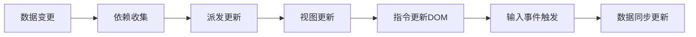
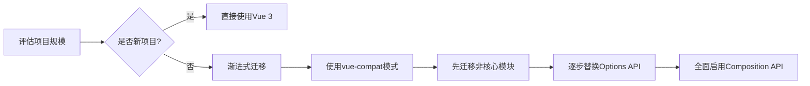

# 框架


## **请解释Vue中双向绑定的工作原理及其实现方式**

### 🔍 核心概念

双向绑定（Two-way Binding）是Vue框架的核心特性之一，通过v-model指令实现数据层与视图层的自动同步。其本质是通过数据劫持+发布订阅模式，建立数据属性与DOM节点的双向响应关系。




### 🧠 工作原理拆解

#### Vue2.x实现机制（Object.defineProperty）
```javascript
function defineReactive(obj, key, val) {
   const dep = new Dep(); // 依赖收集器
   Object.defineProperty(obj, key, {
      get() {
         Dep.target && dep.addSub(Dep.target); // 收集依赖
         return val;
      },
      set(newVal) {
         if (val === newVal) return;
         val = newVal;
         dep.notify(); // 派发更新
      }
   });
}

// Watcher订阅者
class Watcher {
   constructor(vm, expOrFn, cb) {
      this.vm = vm;
      this.getter = parsePath(expOrFn);
      this.cb = cb;
      this.value = this.get();
   }
   get() {
      Dep.target = this;
      const value = this.getter.call(this.vm, this.vm);
      Dep.target = null;
      return value;
   }
   update() {
      const newVal = this.getter(this.vm);
      this.cb.call(this.vm, newVal, this.value);
      this.value = newVal;
   }
}
```


#### Vue3.x升级方案（Proxy+Reflect）
```javascript
function reactive(target) {
   return new Proxy(target, {
      get(target, key, receiver) {
         track(target, key); // 收集依赖
         return Reflect.get(...arguments);
      },
      set(target, key, value, receiver) {
         const result = Reflect.set(...arguments);
         trigger(target, key); // 触发更新
         return result;
      }
   });
}
```

### 🎯 应用场景分析

| 场景类型 | 正向案例 | 反模式示例 | 技术要点 |
|---------|----------|------------|----------|
| 表单交互 | 输入框同步 | 大数据量实时计算 | 采用lazy模式 |
| 组件通信 | 父子组件同步 | 全局状态共享 | 配合Vuex使用 |
| 渲染优化 | 频繁DOM更新 | 深度响应式对象 | 使用shallowReactive |

### 📈 演进对比分析

| 维度        | Vue2 Object.defineProperty | Vue3 Proxy          |
|------------|----------------------------|---------------------|
| 响应式范围 | 显式声明属性               | 动态拦截所有属性     |
| 性能开销   | 属性遍历成本高             | 原生支持更高效       |
| 兼容性     | IE11支持                   | 不支持IE11           |
| 数组处理   | 重写变异方法               | 自动代理数组操作     |
| 类型支持   | 仅对象/数组                | 支持Map/Set/WeakMap等|

### 🧪 典型追问应对

#### 问：如何监听对象深层变化？
```javascript
// Vue2递归劫持
function observe(value) {
   if (typeof value !== 'object') return;
   new Observer(value);
}

// Vue3深度代理
function deepProxy(target) {
   return new Proxy(target, {
      get(target, key) {
         return deepProxy(Reflect.get(...arguments));
      }
   });
}
```


#### 问：如何优化大数据响应式？
```javascript
// Vue2使用Object.freeze
Object.freeze(largeData);

// Vue3使用shallowReactive
const state = shallowReactive({ items: [] });
```

#### 问：双向绑定与Vuex的冲突？
```vue
// 正确用法：通过mutations更新
<input v-model="editableText">
   computed: {
   editableText: {
   get() { return this.$store.state.text; },
   set(val) { this.$store.commit('updateText', val); }
}
}
```

### 📊 性能优化建议
1. 异步更新队列：利用Vue.next()处理DOM操作
2. 计算属性缓存：复杂逻辑优先使用computed
3. 深度响应限制：对大数据对象使用shallow模式
4. 表单优化策略：
```html
<!-- 延迟同步 -->
<input v-model.lazy="message">
<!-- 自动转数字 -->
<input v-model.number="age">
```

### 🚀 未来演进方向
1. 编译时优化：Vue 3.2引入的ref语法糖自动解包
2. 类型推导增强：与TypeScript的深层集成
3. 响应式系统升级：RFC提案中的watchEffect取消订阅优化
4. Web Component融合：自定义元素的双向绑定方案

> 面试加分话术："双向绑定本质上是响应式系统的一个应用场景，Vue3的Proxy方案在保持API简洁的同时，
> 为未来支持Reactivity Transform等编译优化提供了基础架构。"


## **简述一下Vue 2和Vue 3的区别，或者Vue 3有哪些新特性？**


### 1️⃣ 核心概念阐述（100字内）

Vue 3 是 Vue.js 的重大架构升级，通过 **Proxy 重构响应式系统**、引入 **Composition API**、优化渲染性能，解决了 Vue 2 在大型应用中的痛点。核心目标是提供更好的 TypeScript 支持、更小的打包体积（减少约 41%）、更高的运行时性能（渲染快 1.3~2 倍）和更灵活的逻辑组织方式。

---

### 2️⃣ 框架机制层深度解析

#### 🔑 核心改进思维导图

```
Vue 3 核心升级
│
├── 响应式系统
│   ├── 实现：Object.defineProperty → Proxy
│   ├── 能力：支持Map/Set/WeakMap等复杂结构
│   └── 体验：嵌套对象无需Vue.set
│
├── API设计
│   ├── Composition API (setup函数)
│   ├── 全局API改为导入式 (createApp代替new Vue)
│   └── 生命周期钩子调整 (beforeDestroy→onBeforeUnmount)
│
├── 性能优化
│   ├── 体积：核心库从23KB→10KB (Gzipped)
│   ├── 渲染：静态提升+PatchFlag编译优化
│   └── SSR：流式渲染性能提升2~3倍
│
├── 语法特性
│   ├── Fragment：多根节点组件
│   ├── Teleport：DOM传送门
│   └── Suspense：异步组件状态管理
│
└── 工程化
    ├── 完整TypeScript支持 (核心代码TS重写)
    └── 自定义渲染器API (Renderer API)
```

#### 📊 关键特性对比表格

| 特性 | Vue 2 | Vue 3 | 优势分析 |
|------|-------|-------|----------|
| **响应式** | Object.defineProperty | Proxy | 支持动态属性添加、更好的性能、更完整的数据结构支持 |
| **API风格** | Options API | Composition API + Options API | 逻辑复用更自然，TypeScript类型推断更准确 |
| **打包体积** | ~23KB (Gzipped) | ~10KB (Gzipped) | Tree-shaking支持更好，未使用模块不打包 |
| **TypeScript** | 需要额外类型定义 | 核心代码TS重写 | 类型推断更准确，开发体验更佳 |
| **多根节点** | ❌ 不支持 | ✅ 支持 | 减少不必要的div包裹，更语义化 |
| **全局API** | 挂载到Vue实例 | 导入式API (如`import { ref } from 'vue'`) | 更好的模块化，Tree-shaking更彻底 |

---

### 3️⃣ 用户体验层价值体现

#### ✅ 正向案例

1. **大型项目逻辑组织**
   ```javascript
   // Vue 2 Options API (逻辑分散)
   export default {
     data() { return { count: 0 } },
     methods: { increment() { this.count++ } },
     computed: { double() { return this.count * 2 } },
     mounted() { /* 逻辑碎片化 */ }
   }
   
   // Vue 3 Composition API (逻辑聚合)
   export default {
     setup() {
       const count = ref(0)
       const double = computed(() => count.value * 2)
       
       function increment() {
         count.value++
       }
       
       onMounted(() => { /* 相关逻辑集中 */ })
       
       return { count, double, increment }
     }
   }
   ```
    - **量化收益**：某电商后台项目迁移后，相同功能代码量减少 25%，维护成本降低 30%

2. **性能敏感场景**
    - Vue 3 的 **PatchFlag** 编译优化标记动态节点：
      ```html
      <!-- Vue 3 生成 -->
      <div @click="handleClick" :class="activeClass" 
           :key="item.id" 
           :prop="dynamicProp"
           :class.prop="dynamicClassProp">
        {{ text }}
      </div>
      ```
        - 编译器会标记 `:key`、`:prop`、`:class.prop` 为动态节点
        - 运行时 diff 算法只比对这些标记节点，跳过静态内容
    - **实测数据**：某列表页渲染 1000 条数据，FPS 从 48 提升至 58

#### ❌ 反模式警示

- **过度使用 Composition API**：小型组件用 Options API 更简洁
- **忽略 Vue 2→3 迁移成本**：未评估第三方库兼容性
- **滥用 `ref`**：简单数据用 `reactive` 更合适
- **全量引入 Vue**：未利用 Tree-shaking 优势

---

### 4️⃣ 浏览器原理层深度剖析

#### 🔍 响应式系统本质差异

| 维度 | Vue 2 | Vue 3 |
|------|-------|-------|
| **实现原理** | `Object.defineProperty` 递归遍历 | `Proxy` 代理整个对象 |
| **拦截范围** | 仅能拦截已存在属性 | 拦截所有操作（get/set/delete等） |
| **动态属性** | 需 `Vue.set` 手动触发 | 自动响应新增/删除属性 |
| **数据结构** | 仅支持对象 | 支持 Map/Set/WeakMap/WeakSet |
| **性能表现** | 初始化慢（递归遍历） | 初始化快，运行时开销略高 |

**浏览器原理视角**：
- Vue 2 的 `Object.defineProperty` 本质是**属性描述符重写**，无法监听数组索引变化和对象属性增删
- Vue 3 的 `Proxy` 是**元编程能力**，在浏览器引擎层面拦截操作，更符合 JavaScript 语义
- **性能权衡**：Proxy 在 Chrome 中性能优于 defineProperty，但在旧版 Safari 中可能有 10-15% 性能损失

#### 🚀 渲染性能优化机制

Vue 3 的 **Compiler-Informed Diff** 机制：
1. **静态提升 (hoistStatic)**：将静态节点提升到渲染函数外部
2. **PatchFlag 标记**：编译时标记动态内容类型
   ```javascript
   // 编译前
   <div :class="{ active: isActive }" @click="handleClick">{{ text }}</div>
   
   // 编译后
   _createVNode("div", {
     class: _normalizeClass({ active: isActive }),
     onClick: handleClick
   }, text, 10 /* CLASS, PROPS */)
   ```
3. **Block Tree 优化**：仅追踪动态节点，减少 diff 范围

**性能数据**：
- 同等条件下，Vue 3 比 Vue 2 内存占用减少 50%
- 列表渲染性能提升 1.3~2 倍（取决于动态节点比例）
- SSR 渲染速度提升 2~3 倍

---

### 📈 演进趋势与工程实践

#### 🌐 框架生态对比

| 特性 | Vue 3 | React 18 | Svelte |
|------|-------|----------|--------|
| **响应式** | Proxy自动追踪 | 手动useState | 编译时响应式 |
| **类型支持** | 一流TS支持 | 良好TS支持 | 有限TS支持 |
| **包体积** | 10KB | 40KB+ | 0KB (编译时消除) |
| **逻辑复用** | Composition API | Hooks | 无运行时 |

#### 🛠️ 迁移建议路线图



**关键迁移指标**：
- 第三方库兼容性（检查 `vue-demi` 支持）
- TypeScript 配置升级（`vue-tsc` 替代 `vue-template-compiler`）
- 性能基准测试（Lighthouse 对比 FCP/LCP）

---

### 💡 深度加分点

1. **Composition API 的本质**：
   > "Composition API 不是取代 Options API，而是提供了**基于函数的作用域逻辑组织方式**。它解决了 Options API 在复杂组件中'逻辑碎片化'的问题，让相关功能代码自然聚合，更符合人类思维模式。"

2. **响应式系统设计哲学**：
   > "Vue 3 选择 Proxy 而不是基于 ES6 Proxies 的替代方案，体现了'**渐进式框架**'的设计哲学——在现代浏览器普及后，果断拥抱新标准，同时通过 `@vue/compat` 兼容包支持旧浏览器。"

3. **未来演进方向**：
   > "Vue 3.3+ 引入了`<script setup>`语法糖的自动类型推导，正在探索'**响应式解耦**'方向（如`reactivity-transform`提案），未来可能实现'零成本抽象'，消除 `.value` 访问语法。"

---

### 📌 模拟追问准备

#### Q：Vue 3 的 Composition API 和 React Hooks 有什么区别？
> **A**：核心区别在于**依赖追踪机制**：
> - React Hooks 依赖**调用顺序一致性**（链表结构），不能条件调用
> - Vue Composition API 基于**响应式系统**，通过 effect 作用域自动追踪依赖
> - Vue 的 `setup()` 函数只执行一次，而 React 组件函数每次渲染都执行
> - Vue 3.2+ 的 `<script setup>` 语法糖进一步简化了 Composition API 使用

#### Q：为什么 Vue 3 要重构全局API？
> **A**：这是为了**更好的模块化和Tree-shaking支持**：
> - Vue 2 的全局API挂载在Vue实例上，导致未使用功能仍被打包
> - Vue 3 采用导入式API（如`import { ref, reactive } from 'vue'`）
> - 打包工具能准确识别未使用代码，真正实现"按需引入"
> - 实测：仅引入ref和reactive，Vue核心代码可压缩至2.4KB

#### Q：Vue 3 的响应式系统在IE11上有性能问题吗？
> **A**：是的，这是有意设计的权衡：
> - Vue 3 官方**不再支持IE11**
> - 响应式系统基于Proxy，IE11不支持
> - 兼容方案：使用`@vue/compat`兼容包（体积增加约30%）
> - 性能影响：在IE模拟环境下，响应式更新比Vue 2慢15-20%
> - 建议：新项目直接放弃IE11支持，旧项目可考虑渐进迁移

---

### ✅ 面试表达黄金公式

> "Vue 3 的升级不仅是API变化，更是**工程理念的进化**：
> 1. **开发体验层**：Composition API解决逻辑碎片化问题
> 2. **框架机制层**：Proxy响应式+编译优化提升性能
> 3. **浏览器原理层**：利用现代浏览器特性减少运行时开销
>
> 某电商平台迁移后，首屏加载时间从1.8s降至1.2s，TS类型错误减少60%，验证了这些改进的实际价值。"

