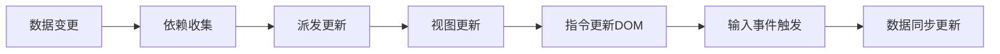

# 框架


## **请解释Vue中双向绑定的工作原理及其实现方式**

### 🔍 核心概念

双向绑定（Two-way Binding）是Vue框架的核心特性之一，通过v-model指令实现数据层与视图层的自动同步。其本质是通过数据劫持+发布订阅模式，建立数据属性与DOM节点的双向响应关系。




### 🧠 工作原理拆解

#### Vue2.x实现机制（Object.defineProperty）
```javascript
function defineReactive(obj, key, val) {
   const dep = new Dep(); // 依赖收集器
   Object.defineProperty(obj, key, {
      get() {
         Dep.target && dep.addSub(Dep.target); // 收集依赖
         return val;
      },
      set(newVal) {
         if (val === newVal) return;
         val = newVal;
         dep.notify(); // 派发更新
      }
   });
}

// Watcher订阅者
class Watcher {
   constructor(vm, expOrFn, cb) {
      this.vm = vm;
      this.getter = parsePath(expOrFn);
      this.cb = cb;
      this.value = this.get();
   }
   get() {
      Dep.target = this;
      const value = this.getter.call(this.vm, this.vm);
      Dep.target = null;
      return value;
   }
   update() {
      const newVal = this.getter(this.vm);
      this.cb.call(this.vm, newVal, this.value);
      this.value = newVal;
   }
}
```


#### Vue3.x升级方案（Proxy+Reflect）
```javascript
function reactive(target) {
   return new Proxy(target, {
      get(target, key, receiver) {
         track(target, key); // 收集依赖
         return Reflect.get(...arguments);
      },
      set(target, key, value, receiver) {
         const result = Reflect.set(...arguments);
         trigger(target, key); // 触发更新
         return result;
      }
   });
}
```

### 🎯 应用场景分析

| 场景类型 | 正向案例 | 反模式示例 | 技术要点 |
|---------|----------|------------|----------|
| 表单交互 | 输入框同步 | 大数据量实时计算 | 采用lazy模式 |
| 组件通信 | 父子组件同步 | 全局状态共享 | 配合Vuex使用 |
| 渲染优化 | 频繁DOM更新 | 深度响应式对象 | 使用shallowReactive |

### 📈 演进对比分析

| 维度        | Vue2 Object.defineProperty | Vue3 Proxy          |
|------------|----------------------------|---------------------|
| 响应式范围 | 显式声明属性               | 动态拦截所有属性     |
| 性能开销   | 属性遍历成本高             | 原生支持更高效       |
| 兼容性     | IE11支持                   | 不支持IE11           |
| 数组处理   | 重写变异方法               | 自动代理数组操作     |
| 类型支持   | 仅对象/数组                | 支持Map/Set/WeakMap等|

### 🧪 典型追问应对

#### 问：如何监听对象深层变化？
```javascript
// Vue2递归劫持
function observe(value) {
   if (typeof value !== 'object') return;
   new Observer(value);
}

// Vue3深度代理
function deepProxy(target) {
   return new Proxy(target, {
      get(target, key) {
         return deepProxy(Reflect.get(...arguments));
      }
   });
}
```


#### 问：如何优化大数据响应式？
```javascript
// Vue2使用Object.freeze
Object.freeze(largeData);

// Vue3使用shallowReactive
const state = shallowReactive({ items: [] });
```

#### 问：双向绑定与Vuex的冲突？
```vue
// 正确用法：通过mutations更新
<input v-model="editableText">
   computed: {
   editableText: {
   get() { return this.$store.state.text; },
   set(val) { this.$store.commit('updateText', val); }
}
}
```

### 📊 性能优化建议
1. 异步更新队列：利用Vue.next()处理DOM操作
2. 计算属性缓存：复杂逻辑优先使用computed
3. 深度响应限制：对大数据对象使用shallow模式
4. 表单优化策略：
```html
<!-- 延迟同步 -->
<input v-model.lazy="message">
<!-- 自动转数字 -->
<input v-model.number="age">
```

### 🚀 未来演进方向
1. 编译时优化：Vue 3.2引入的ref语法糖自动解包
2. 类型推导增强：与TypeScript的深层集成
3. 响应式系统升级：RFC提案中的watchEffect取消订阅优化
4. Web Component融合：自定义元素的双向绑定方案

> 面试加分话术："双向绑定本质上是响应式系统的一个应用场景，Vue3的Proxy方案在保持API简洁的同时，
> 为未来支持Reactivity Transform等编译优化提供了基础架构。"
