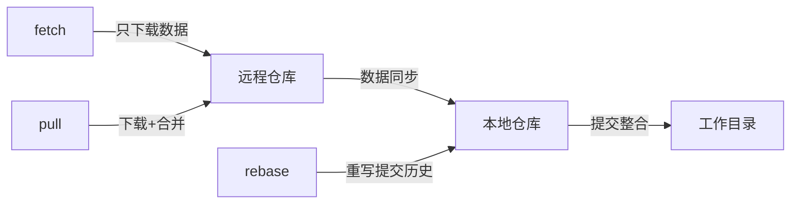

# Git 操作


## **`git pull`、`git fetch`和`git rebase`的区别**


### 一句话概括三者的核心区别：
> fetch 是「只下载不合并」，pull = fetch + merge，rebase 是「改写提交历史的合并方式」

---

### 🧩 一图流理解关系（程序员秒懂）

<style>
.blue{color:#1E90FF;stroke:#1E90FF}
.green{color:#32CD32;stroke:#32CD32}
.red{color:#FF4500;stroke:#FF4500}
</style>

---

### 🔍 分步解析（附场景）

#### 1. git fetch：安全侦探
作用：只查看远程最新状态，不修改本地文件
场景：想看看同事提交了什么，但不想影响自己的代码
```bash
git fetch origin  # 下载远程仓库所有最新数据
git log origin/main --oneline  # 查看远程分支提交记录
```
👉 结果：本地代码纹丝不动，但能看到远程最新状态（藏宝图已更新）

---

#### 2. git pull：自动合并工人
本质 = git fetch + git merge（两步合成一步）
场景：想立刻获取同事最新代码并合并到自己的分支
```bash
git pull origin main  
# 等价于：
#   git fetch origin   → 侦探
#   git merge origin/main → 合并
```
✅ 优势：省事快捷
⚠️ 风险：自动合并可能产生冲突（需手动解决）

---

#### 3. git rebase：历史重构大师
作用：把当前分支的修改“挪到”目标分支最新提交之后，重写提交历史
场景：个人分支开发半个月后，准备合并回主分支前整理提交记录
```bash
git checkout feature
git rebase main   # 将 feature 的修改“嫁接”到 main 最新提交后
```

魔法效果：
```diff
! 原始历史（分叉难看）：
  A--B--C (main)
      \
       D--E (feature)

! rebase 后（直线清爽）：
  A--B--C--D'--E' (feature)
              ↑
             main 最新提交后

```

⚠️ 黄金法则：仅用于未推送的本地提交（改写公共历史是大忌！）

---

### 🆚 三剑客对比表

| 操作         | 是否改本地文件 | 是否改写历史 | 是否联网 | 典型场景                     |
|--------------|----------------|--------------|----------|------------------------------|
| git fetch  | ❌             | ❌            | ✅        | 只想看看远程发生了什么        |
| git pull   | ✅             | ❌            | ✅        | 快速获取最新代码并直接合并    |
| git rebase | ✅             | ✅            | ❌        | 合并前整理提交记录更清晰      |

---

### 🔧 高阶组合技
#### 更安全的更新方式（避免合并提交污染历史）
bash # 替代 git pull 的默认合并 git fetch git rebase origin/main   # 用变基代替合并
👉 效果：获得直线提交历史，避免出现"Merge branch..."这种无用提交

---

### 💡 终极口诀
```bash
想看不变动 → fetch
想快省力气 → pull
要美要干净 → rebase
```

🚨 血泪教训：已经推送到远程的提交绝对不要 rebase（除非你知道在做什么）


## 
