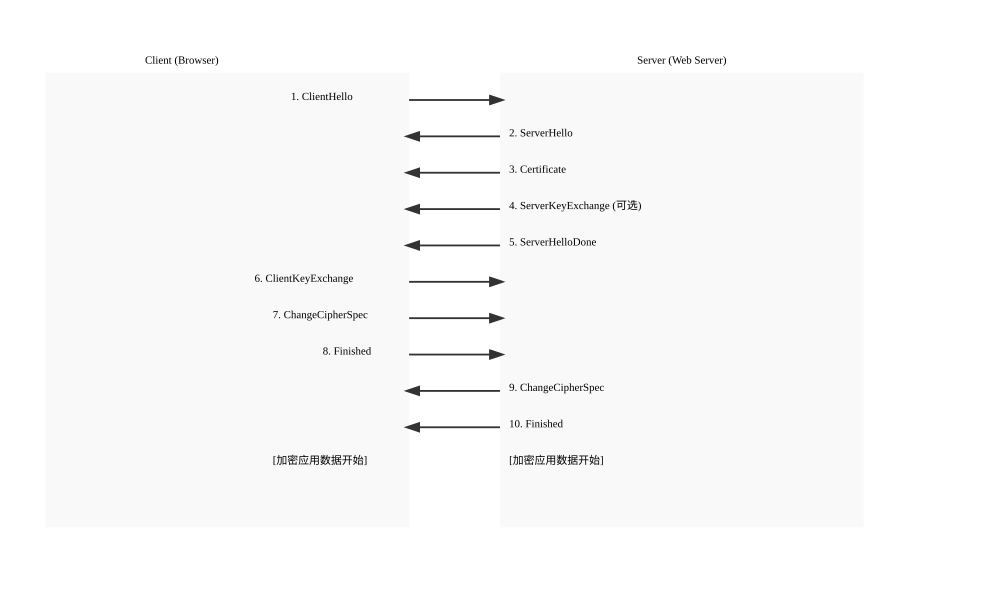

# 计算机网络


## **HTTPS 为什么是安全的？**


### ✅ 简洁回答（适合面试）

> [!TIP] 🧠
> HTTPS 是安全的，因为它结合了 **HTTP 协议 + SSL/TLS 加密传输层**，通过以下机制确保通信过程中的：
>
> - **加密性（Encryption）**：数据经过加密，防止被窃听；
> - **完整性（Integrity）**：数据无法被篡改而不被发现；
> - **身份认证（Authentication）**：客户端可以验证服务端身份，防止连接到假冒网站。
>
> 这些能力使 HTTPS 成为现代 Web 通信的标准协议。

::: details 展开查看详细解析

### 🧠 深入解析：HTTPS 安全性的三大支柱

HTTPS 的安全性建立在以下三根“支柱”之上：

#### 1. **加密性（Encryption）**

##### 原理：

- 使用 **非对称加密（RSA/ECC）** 实现密钥交换
- 使用 **对称加密（AES）** 对数据进行加密传输

##### 示例流程：

1. 客户端发送 `ClientHello` 请求，包含支持的加密算法和随机数；
2. 服务端响应 `ServerHello`，选择加密算法并返回证书、公钥；
3. 客户端生成一个随机的 “预主密钥”，用服务端公钥加密后发送；
4. 双方使用预主密钥+随机数生成最终的对称加密密钥；
5. 后续通信都使用该密钥进行加密/解密（如 AES-GCM）；

✅ 保证数据即使被截获也无法被解读。

---

#### 2. **完整性（Data Integrity）**

##### 原理：

- 使用 **消息认证码（MAC / HMAC）** 来验证数据是否被篡改
- 在加密前，会生成一个哈希值，并随数据一起传输

##### 示例：

每次发送一段加密数据时，都会附带：

```plaintext
HMAC(data + secret)
```

接收方收到后重新计算 HMAC，如果与发送的一致，则说明数据未被修改。

✅ 防止中间人篡改数据内容。

---

#### 3. **身份认证（Authentication）**

##### 原理：

- 服务端向客户端提供由 **可信 CA（证书颁发机构）签发的数字证书**
- 客户端浏览器内置信任链，可验证证书合法性
- 证书中包含了域名、服务器公钥等信息

##### 认证流程：

1. 浏览器访问 `https://example.com`
2. 服务器返回其证书（含域名、公钥、CA签名等）
3. 浏览器验证：
    - 是否由信任的 CA 签发
    - 是否在有效期内
    - 证书上的域名是否匹配当前请求的域名
4. 如果验证失败，显示“证书错误”警告

✅ 避免连接到假冒网站，防止中间人攻击（MITM）

---

### 🔒 HTTPS 的完整握手流程（TLS 握手）

| 步骤 | 内容 |
|------|------|
| 1️⃣ ClientHello | 客户端发起连接，支持的加密套件、协议版本、随机数 |
| 2️⃣ ServerHello | 服务端回应，选择加密方式、协议版本、随机数 |
| 3️⃣ 服务端证书 | 发送证书（含公钥、域名、CA签名） |
| 4️⃣ 服务端密钥交换（可选） | 如需 Diffie-Hellman 密钥交换 |
| 5️⃣ 客户端密钥交换 | 客户端生成预主密钥，用服务端公钥加密后发送 |
| 6️⃣ Change Cipher Spec | 双方切换为加密通信模式 |
| 7️⃣ Finished | 双方向对方发送加密完成确认 |

握手完成后，所有通信都将基于对称加密进行。

---

### ⚠️ HTTP 不安全的原因（对比）

| 特性 | HTTP | HTTPS |
|------|------|--------|
| 数据传输 | 明文 | 加密 |
| 数据完整性 | ❌ | ✅ |
| 身份认证 | ❌ | ✅（证书机制） |
| 中间人攻击防护 | ❌ | ✅ |
| SEO | 较差 | 更好（Google 推荐） |
| 性能影响 | 无 | 微小延迟（握手开销） |

---

### 💡 面试加分建议

如果你遇到这个问题，可以进一步补充：

> [!TIP] 🧠
> “HTTPS 并不是绝对‘不可破解’的，但它的加密强度和认证机制极大提高了攻击门槛。例如，要破解 AES-256 加密，即使是全球最强的超级计算机也需要数十亿年时间。因此，HTTPS 目前仍是保障 Web 安全最可靠的方式。”

---

### 📚 相关延伸问题（可能被追问）

1. **什么是 TLS？它和 SSL 有什么区别？**
2. **什么是中间人攻击（MITM）？HTTPS 如何防御？**
3. **HTTPS 握手阶段用了对称加密还是非对称加密？**
4. **什么是证书链？CA 根证书的作用是什么？**
5. **HTTPS 会不会影响性能？如何优化？**
6. **什么是 HSTS？它的作用是什么？**

:::

## **HTTPS 握手流程图解**

✅ **文字版图解（结构清晰，适合面试讲解）**  
::: details 展开查看

```
Client (浏览器)                         Server (服务器)
       |                                      |
       |---------- ClientHello -------------->|
       |         - 支持的加密套件           |
       |         - 协议版本 (TLS 1.2/1.3)     |
       |         - 客户端随机数               |
       |                                      |
       |<--------- ServerHello ----------------|
       |         - 选择的加密算法             |
       |         - 协议版本                   |
       |         - 服务端随机数               |
       |                                      |
       |<-------- Certificate -----------------|
       |         - 服务器证书（含公钥、域名等）|
       |         - CA 签名信息                |
       |                                      |
       |<------ ServerKeyExchange (可选) ------|
       |         - 如使用 DH/ECDH 密钥交换    |
       |                                      |
       |<------- ServerHelloDone -------------|
       |                                      |
       |-------- ClientKeyExchange -----------|
       |         - 使用服务端公钥加密        |
       |           预主密钥（Pre-Master-Secret）|
       |                                      |
       |-------- ChangeCipherSpec ------------|
       |         - 切换为加密通信模式         |
       |                                      |
       |-------- Finished -------------------->|
       |         - 加密的握手完成确认         |
       |                                      |
       |<------- ChangeCipherSpec -------------|
       |         - 切换为加密通信模式         |
       |                                      |
       |<------- Finished ---------------------|
       |         - 加密的握手完成确认         |
       |                                      |
       |---------- 应用数据传输（加密）-------->|
       |         - 所有后续通信都加密         |
       |         - 使用对称密钥 AES 加密      |
       V                                      V
```
:::

---

✅ **SVG 图表示例（可复制到 HTML 中查看）**

::: details 展开查看


::: details 展开查看`https-handshake.html`
```html
<!DOCTYPE html>
<html lang="en">
<head>
    <meta charset="UTF-8" />
    <title>HTTPS Handshake Flow</title>
    <style>
        body { font-family: sans-serif; background: #f9f9f9; }
        svg text { font-size: 14px; fill: #333; }
        svg line, svg rect { stroke: #333; fill: none; }
    </style>
</head>
<body>
<h2>HTTPS/TLS 握手流程图示</h2>
<svg width="1000" height="600">
    <!-- Client & Server 框线 -->
    <rect x="50" y="50" width="400" height="500" />
    <rect x="550" y="50" width="400" height="500" />

    <text x="200" y="40" text-anchor="middle">Client (Browser)</text>
    <text x="750" y="40" text-anchor="middle">Server (Web Server)</text>

    <!-- 步骤 -->
    <text x="60" y="80">1. ClientHello</text>
    <line x1="450" y1="80" x2="550" y2="80" marker-end="url(#arrow)" />

    <text x="560" y="120">2. ServerHello</text>
    <line x1="550" y1="120" x2="450" y2="120" marker-end="url(#arrow)" />

    <text x="560" y="160">3. Certificate</text>
    <line x1="550" y1="160" x2="450" y2="160" marker-end="url(#arrow)" />

    <text x="560" y="200">4. ServerKeyExchange (可选)</text>
    <line x1="550" y1="200" x2="450" y2="200" marker-end="url(#arrow)" />

    <text x="560" y="240">5. ServerHelloDone</text>
    <line x1="550" y1="240" x2="450" y2="240" marker-end="url(#arrow)" />

    <text x="60" y="280">6. ClientKeyExchange</text>
    <line x1="450" y1="280" x2="550" y2="280" marker-end="url(#arrow)" />

    <text x="60" y="320">7. ChangeCipherSpec</text>
    <line x1="450" y1="320" x2="550" y2="320" marker-end="url(#arrow)" />

    <text x="60" y="360">8. Finished</text>
    <line x1="450" y1="360" x2="550" y2="360" marker-end="url(#arrow)" />

    <text x="560" y="400">9. ChangeCipherSpec</text>
    <line x1="550" y1="400" x2="450" y2="400" marker-end="url(#arrow)" />

    <text x="560" y="440">10. Finished</text>
    <line x1="550" y1="440" x2="450" y2="440" marker-end="url(#arrow)" />

    <text x="60" y="480">[加密应用数据开始]</text>
    <text x="560" y="480">[加密应用数据开始]</text>

    <!-- 箭头定义 -->
    <defs>
        <marker id="arrow" markerWidth="10" markerHeight="10" refX="6" refY="3" orient="auto" markerUnits="strokeWidth">
            <path d="M0,0 L0,6 L9,3 z" fill="#333" />
        </marker>
    </defs>
</svg>
</body>
</html>

```

:::


### 💡 面试加分建议

如果你遇到这个问题，可以进一步补充：

> [!TIP] 🧠
> “HTTPS 的握手过程看似复杂，但它确保了三个关键点：加密通信、数据完整性和身份认证。现代浏览器和服务器已经将这一过程高度优化，
> 使得用户几乎感知不到延迟。而且随着 TLS 1.3 的普及，握手步骤进一步减少，性能更优。”

---

### 📚 相关延伸问题（可能被追问）

1. **什么是非对称加密？它和对称加密有什么区别？**
2. **RSA 和 ECC 哪个更好？**
3. **什么是数字证书？CA 的作用是什么？**
4. **什么是前向保密（Forward Secrecy）？**
5. **HTTP/2 是基于 HTTPS 的吗？为什么？**
6. **HTTPS 握手阶段用了哪些哈希算法？**


### 拓展知识
[HTTPS 安全机制总结文档](./https-security.md)


## **什么是数字证书？CA 的作用是什么？**


### ✅ 简洁回答（适合面试）

> [!TIP] 🧠
> **数字证书（SSL/TLS 证书）** 是由可信机构签发的电子文件，用于证明网站的身份和公钥的合法性。
>
> **CA（Certificate Authority，证书颁发机构）** 是负责签发和管理数字证书的第三方权威机构。
>
> 它们共同保障了 HTTPS 的“身份认证”能力，防止用户访问到假冒网站。

::: details 展开查看详细解析

### 🧠 深入解析

#### 1. **什么是数字证书？**

数字证书是 HTTPS 协议中的核心组成部分之一，它包含以下信息：

| 字段 | 内容 |
|------|------|
| 域名（Common Name 或 SAN） | 证书绑定的域名（如 `example.com`） |
| 公钥（Public Key） | 用于加密通信的服务器公钥 |
| 颁发者（Issuer） | 签发该证书的 CA 名称 |
| 有效期（Valid From / To） | 证书有效时间范围 |
| 数字签名（Signature） | 由 CA 使用私钥对证书内容进行签名 |
| 扩展信息（可选） | 支持多个域名（SAN）、用途限制等 |

##### 示例证书内容（简化）：

```json
{
  "subject": "CN=www.example.com",
  "issuer": "CN=Let's Encrypt R3,O=Let's Encrypt,C=US",
  "publicKey": "-----BEGIN PUBLIC KEY-----...",
  "validFrom": "2024-01-01T00:00:00Z",
  "validTo": "2024-04-01T00:00:00Z",
  "signatureAlgorithm": "sha256WithRSAEncryption"
}
```

---

#### 2. **数字证书的作用**

| 功能 | 描述 |
|------|------|
| 身份验证 | 浏览器通过验证证书确认当前连接的是真实服务器 |
| 公钥分发 | 证书中包含服务器的公钥，用于非对称加密 |
| 数据完整性 | 证书本身使用 CA 私钥签名，防止被篡改 |
| 多域名支持（SAN） | 一张证书可以支持多个域名 |
| 安全信任链 | 证书可构建信任链（根证书 → 中间证书 → 服务器证书） |

---

#### 3. **什么是 CA（Certificate Authority）？**

CA 是 **证书颁发机构（Certificate Authority）**，是一个受信任的第三方组织，其主要职责包括：

##### 🔐 核心职责：

- **签发证书**：审核申请者的身份后，为域名签发数字证书；
- **验证身份**：确保申请者拥有目标域名的控制权；
- **维护吊销列表（CRL）**：记录被撤销的证书编号，供浏览器检查；
- **OCSP 查询服务**：提供实时证书状态查询接口；
- **建立信任链**：签发中间证书，最终链接到根证书（Root Certificate），构成完整的证书信任链；

##### 📦 常见 CA 机构：

| 类型 | 实例 |
|------|------|
| 免费 CA | Let's Encrypt |
| 商业 CA | DigiCert、Sectigo、GoDaddy、GlobalSign |
| 浏览器内置根证书 | Google、Mozilla、Apple、Microsoft 自维护 |

---

#### 4. **CA 如何保证证书的安全性？**

| 措施 | 说明 |
|------|------|
| **严格审核流程** | 申请者必须证明对域名的控制权（HTTP 文件验证、DNS 记录验证） |
| **数字签名技术** | 所有证书都由 CA 使用私钥签名，防止伪造 |
| **证书吊销机制（CRL/OCSP）** | 当证书泄露或不再可用时，可将其加入黑名单 |
| **信任链机制** | 从服务器证书 → 中间证书 → 根证书，层层验证 |
| **定期更新证书** | 强制证书短期有效（Let's Encrypt 为 90 天），降低风险 |

---

#### 5. **HTTPS 中证书如何工作？（流程简述）**

1. 用户访问 `https://example.com`
2. 服务器返回其证书（含域名、公钥、CA签名）
3. 浏览器：
   - 检查证书是否由信任的 CA 签发
   - 检查证书是否在有效期内
   - 检查证书上的域名是否匹配当前请求的域名
4. 如果验证失败，显示“证书错误”
5. 如果验证成功，继续 TLS 握手并建立加密通道

---

### 🛡️ 举个例子：当你访问 `https://github.com`

1. GitHub 服务器返回它的证书（由 DigiCert 签发）
2. 浏览器查找本地信任的 CA 列表，发现 DigiCert 是可信的
3. 浏览器验证证书的签名、域名、有效期
4. 验证通过，TLS 握手开始，后续数据加密传输

---

### 📌 常见证书类型

| 类型 | 说明 | 适用场景 |
|------|------|----------|
| DV（Domain Validation） | 仅验证域名所有权 | 普通网站、个人博客 |
| OV（Organization Validation） | 验证域名 + 企业信息 | 企业官网、电商平台 |
| EV（Extended Validation） | 最严格的验证，显示绿色地址栏 | 银行、金融类网站 |
| Wildcard 证书 | 支持泛域名（如 `*.example.com`） | 子域名较多的企业 |
| Multi-Domain（SAN）证书 | 一张证书支持多个域名 | 多个站点共用一个证书 |

---

### 💡 面试加分建议

如果你遇到这个问题，可以进一步补充：

> [!TIP] 🧠
> “数字证书就像是网站的‘身份证’，而 CA 就是那个颁发身份证的‘公安局’。没有证书，HTTPS 就无法完成身份认证，也就无法防止中间人攻击。
> 现代浏览器会自动识别不可信的证书，并提醒用户潜在风险。”

---

### 📚 相关延伸问题（可能被追问）

1. **HTTPS 握手阶段用了哪些加密算法？**
2. **什么是中间人攻击（MITM）？HTTPS 如何防御？**
3. **什么是证书链？CA 根证书的作用是什么？**
4. **什么是 OCSP？它的作用是什么？**
5. **什么是自签名证书？为什么浏览器不信任它？**
6. **Let's Encrypt 是如何工作的？它是免费的吗？**

:::

## **数字证书可视化图解**

### 📄 文字版：数字证书结构详解

::: details 展开查看
```
数字证书结构示意图
┌──────────────────────────────────────────────┐
│           X.509 数字证书                     │
├──────────────────────────────────────────────┤
│ 版本号 (Version)        → v3                 │
│ 序列号 (Serial Number)  → 1234567890ABCDEF   │
│ 签名算法 (Signature Algorithm)               │
│         → sha256WithRSAEncryption            │
│ 颁发者 (Issuer)                              │
│         → CN=Let's Encrypt R3                │
│                                              │
│ 有效期 (Validity)                            │
│         → Not Before: 2024-01-01             │
│         → Not After:  2024-04-01             │
│                                              │
│ 主体信息 (Subject)                           │
│         → CN=www.example.com                 │
│                                              │
│ 公钥信息 (Public Key Info)                   │
│         → RSA 2048 bits                      │
│                                              │
│ 扩展信息 (Extensions)                        │
│         → SAN: www.example.com, example.com  │
│         → Key Usage: Digital Signature       │
│         → Authority Key Identifier           │
│         → Subject Key Identifier             │
│                                              │
│ 签名值 (Signature Value)                     │
│         → 由 CA 使用私钥对上述内容签名       │
└──────────────────────────────────────────────┘
```

---

### 🧱 数字证书的关键组成部分说明

| 字段 | 含义 |
|------|------|
| **版本号（Version）** | 表示证书格式版本（如 v3） |
| **序列号（Serial Number）** | CA 唯一签发编号 |
| **签名算法（Signature Algorithm）** | 使用的加密算法（如 `sha256WithRSAEncryption`） |
| **颁发者（Issuer）** | 签发该证书的 CA 名称 |
| **有效期（Validity）** | 证书的有效起止时间 |
| **主体（Subject）** | 持有该证书的实体信息（如域名） |
| **公钥信息（Public Key Info）** | 包括密钥类型（RSA/ECC）、长度等 |
| **扩展信息（Extensions）** | 可选扩展，如 SAN（支持多个域名）、Key Usage（用途限制） |
| **签名值（Signature Value）** | CA 对整个证书内容使用其私钥进行签名 |

---

### 🔗 证书信任链结构图解（文字版）

```
浏览器内置根证书
      ↑
   [根证书]            ← 由自身签名（自签名）
     |
   [中间证书]          ← 由根证书签名
     |
   [服务器证书]        ← 由中间证书签名
     ↓
https://www.example.com
```

### 说明：

- **根证书（Root Certificate）**：
   - 由 CA 自己签名
   - 浏览器/操作系统预装信任的根证书列表

- **中间证书（Intermediate Certificate）**：
   - 由根证书签名
   - 用于签发服务器证书（避免频繁使用根证书）

- **服务器证书（End-entity Certificate）**：
   - 由中间证书签发
   - 绑定到具体域名（如 `example.com`）

> ✅ 浏览器验证证书时，会从服务器证书一直往上验证到根证书，形成一个“信任链”。

:::

### 🖼️ SVG 图表示例

::: details 展开查看
  <style>
    body { font-family: sans-serif; background: #f9f9f9; }
    .box { border: 1px solid #333; padding: 10px; margin: 10px 0; width: 500px; }
    .title { font-weight: bold; margin-bottom: 5px; }
  </style>
  <h2>数字证书结构图解</h2>

  <div class="box">
    <div class="title">X.509 证书主体</div>
    <p><strong>版本号:</strong> v3</p>
    <p><strong>序列号:</strong> 1234567890ABCDEF</p>
    <p><strong>签名算法:</strong> SHA-256 + RSA</p>
    <p><strong>颁发者:</strong> Let's Encrypt R3</p>
    <p><strong>有效期:</strong> 2024-01-01 ~ 2024-04-01</p>
    <p><strong>主体:</strong> www.example.com</p>
    <p><strong>公钥:</strong> RSA 2048 位</p>
    <p><strong>扩展:</strong> SAN、OCSP、CRL 分发点</p>
    <p><strong>签名值:</strong> [CA 使用私钥加密]</p>
  </div>

  <h3>证书信任链</h3>

  <div style="margin-left: 20px;">
    <p>✅ 根证书（Root CA）<br/>
      　→ 由自身签名<br/>
      　→ 内置于浏览器/系统</p>
    <p>✅ 中间证书（Intermediate CA）<br/>
      　→ 由根证书签名<br/>
      　→ 用于签发终端证书</p>
    <p>✅ 服务器证书（Server Certificate）<br/>
      　→ 由中间证书签名<br/>
      　→ 绑定域名（SAN）</p>
  </div>
  <p>
      <strong>验证流程：</strong>浏览器从服务器证书开始，一路向上验证签名是否有效，直到找到信任的根证书。
  </p>
---


### 📚 常见证书文件格式说明

| 格式 | 描述 |
|------|------|
| `.crt`, `.pem` | Base64 编码的证书文件 |
| `.key` | 私钥文件（必须保密） |
| `.csr` | 证书签名请求（提交给 CA 签名） |
| `.p7b`, `.pkip7` | PKCS#7 格式，包含多个证书但不含私钥 |
| `.pfx`, `.p12` | PKCS#12 格式，含证书和私钥（通常需要密码保护） |

:::

### 💡 面试加分建议

如果你遇到这个问题，可以进一步补充：

> [!TIP] 🧠
> “数字证书本质上是一个结构化的电子文档，它通过 CA 的签名来保证不可伪造性。浏览器内置的根证书就像‘身份证识别器’，
> 能自动识别网站证书是否合法，从而防止用户访问钓鱼网站。”

## **如何在 Nginx / Node.js / Apache 上部署 HTTPS？**


### ✅ 简洁回答（适合面试）

> [!TIP] 🧠
> 在 Nginx / Node.js / Apache 上部署 HTTPS 的核心步骤包括：
>
> 1. 获取 SSL/TLS 证书（如 Let's Encrypt）
> 2. 配置 Web 服务器监听 443 端口
> 3. 指定证书路径（`.crt` 和 `.key` 文件）
> 4. 设置强制 HTTPS 跳转（可选）
>
> 各平台配置略有不同，但本质一致：绑定证书 + 启用 SSL 模块。

::: details 展开查看详细解析

### 🔐 一、通用准备步骤（适用于所有平台）

#### 1. 获取证书（以 Let's Encrypt 为例）

```bash
# 安装 Certbot
sudo apt install certbot -y

# 申请证书（假设你使用 Nginx 或 Apache）
sudo certbot --nginx -d yourdomain.com -d www.yourdomain.com
```

证书默认保存路径：

```
/etc/letsencrypt/live/yourdomain.com/
├── fullchain.pem   # 证书文件（含中间证书）
├── privkey.pem     # 私钥文件
```

---

### 🛠️ 二、Nginx 配置 HTTPS

#### 1. 修改 Nginx 配置文件（如 `/etc/nginx/sites-available/default`）

```nginx
server {
    listen 443 ssl;
    server_name yourdomain.com www.yourdomain.com;

    ssl_certificate /etc/letsencrypt/live/yourdomain.com/fullchain.pem;
    ssl_certificate_key /etc/letsencrypt/live/yourdomain.com/privkey.pem;

    ssl_protocols TLSv1.2 TLSv1.3;
    ssl_ciphers HIGH:!aNULL:!MD5;

    location / {
        root /var/www/html;
        index index.html;
        try_files $uri $uri/ =404;
    }
}
```

#### 2. 强制 HTTP 跳转 HTTPS（可选）

```nginx
server {
    listen 80;
    server_name yourdomain.com www.yourdomain.com;
    return 301 https://$host$request_uri;
}
```

#### 3. 重启 Nginx 生效

```bash
sudo nginx -t          # 检查配置是否正确
sudo systemctl reload nginx
```

---

### 💻 三、Node.js 部署 HTTPS（Express 示例）

#### 1. 准备证书文件（可从 Let's Encrypt 导出）

```bash
cp /etc/letsencrypt/live/yourdomain.com/fullchain.pem server.crt
cp /etc/letsencrypt/live/yourdomain.com/privkey.pem server.key
```

#### 2. 使用 `https` 模块创建 HTTPS 服务

```js
const fs = require('fs');
const https = require('https');
const express = require('express');

const app = express();

app.get('/', (req, res) => {
  res.send('Hello HTTPS!');
});

const options = {
  key: fs.readFileSync('server.key'),
  cert: fs.readFileSync('server.crt')
};

https.createServer(options, app).listen(443, () => {
  console.log('HTTPS server running on port 443');
});
```

#### 3. 运行你的服务

```bash
node app.js
```

> ⚠️ 注意：Node.js 默认不处理 80 端口跳转，建议配合 Nginx 做反向代理并实现 HTTP → HTTPS 跳转。

---

### 🏗️ 四、Apache 部署 HTTPS

#### 1. 启用 SSL 模块

```bash
sudo a2enmod ssl
sudo systemctl restart apache2
```

#### 2. 创建 SSL 配置文件（如 `/etc/apache2/sites-available/yourdomain-ssl.conf`）

```apache
<VirtualHost *:443>
    ServerAdmin admin@yourdomain.com
    ServerName yourdomain.com
    ServerAlias www.yourdomain.com
    DocumentRoot /var/www/html

    SSLEngine on
    SSLCertificateFile "/etc/letsencrypt/live/yourdomain.com/fullchain.pem"
    SSLCertificateKeyFile "/etc/letsencrypt/live/yourdomain.com/privkey.pem"

    <Directory /var/www/html>
        Options Indexes FollowSymLinks
        AllowOverride All
        Require all granted
    </Directory>
</VirtualHost>
```

#### 3. 启用站点并重启 Apache

```bash
sudo a2ensite yourdomain-ssl.conf
sudo systemctl restart apache2
```

#### 4. 强制 HTTP 跳转 HTTPS（可选）

编辑 `.htaccess` 文件或在 Apache 主配置中添加：

```apache
<VirtualHost *:80>
    ServerName yourdomain.com
    Redirect permanent / https://yourdomain.com/
</VirtualHost>
```

---

### 🔒 五、HTTPS 相关安全建议

| 措施 | 描述 |
|------|------|
| **启用 HTTP/2** | 提升性能，需配合 TLS 1.2+ |
| **启用 OCSP Stapling** | 加快证书验证速度 |
| **设置 HSTS** | 强制浏览器只使用 HTTPS 访问 |
| **定期更新证书** | Let's Encrypt 每 90 天需 renew |
| **禁用弱加密套件** | 如 SSLv3、TLS 1.0 |

---

### 🧰 六、Let's Encrypt 自动续期（推荐）

Let's Encrypt 证书有效期为 90 天，建议设置自动续期：

```bash
sudo certbot renew --dry-run
```

设置定时任务（Cron）：

```bash
crontab -e
```

添加如下内容：

```cron
0 0 */60 * * sudo certbot renew --quiet
```

---

### 📦 七、证书文件说明

| 文件 | 内容 |
|------|------|
| `fullchain.pem` | 服务器证书 + 中间证书 |
| `privkey.pem` | 私钥（必须保密） |
| `cert.pem` | 仅服务器证书 |
| `chain.pem` | 仅中间证书 |
| `root.pem` | 根证书（通常不需要） |

---

### 📌 八、浏览器访问测试

打开浏览器访问：

```
https://yourdomain.com
```

查看地址栏是否有绿色锁🔒，点击可以查看证书详情。

:::


## **简单描述从输入网址到页面显示的过程**

### ✅ 简洁回答（适合面试）

> [!TIP] 🧠
> 从输入网址到页面显示的过程主要包括以下几个步骤：
>
> 1. **输入 URL 并解析**
> 2. **DNS 解析获取 IP 地址**
> 3. **建立 TCP 连接（如使用 HTTPS，还需 TLS 握手）**
> 4. **发送 HTTP 请求**
> 5. **服务器处理请求并返回响应**
> 6. **浏览器解析 HTML、加载资源、构建 DOM 树和渲染树**
> 7. **执行 JavaScript，完成最终渲染**

::: details 展开查看分步详解

### 🧠 分步详解

#### 1️⃣ 输入 URL 并解析

用户在浏览器地址栏输入网址，例如：

```
https://www.example.com/
```

浏览器会解析该 URL，得到协议类型、域名、端口、路径等信息。

---

#### 2️⃣ DNS 解析，获取服务器 IP 地址

- 浏览器检查本地缓存是否有 `www.example.com` 的 IP；
- 如果没有，向操作系统发起 DNS 查询；
- 操作系统依次查询：本地 hosts 文件 → 本地 DNS 缓存 → 递归 DNS 服务器 → 权威 DNS 服务器；
- 最终获取目标服务器的 IP 地址。

---

#### 3️⃣ 建立 TCP 连接（三次握手）

为了传输数据，客户端与服务器之间需要建立 TCP 连接，过程如下：

1. 客户端 → 服务端：`SYN=1, seq=x`
2. 服务端 → 客户端：`SYN=1, ACK=1, seq=y, ack=x+1`
3. 客户端 → 服务端：`ACK=1, ack=y+1`

✅ 连接建立完成，可以开始通信。

---

#### 4️⃣ （可选）TLS/SSL 握手（如果使用 HTTPS）

HTTPS 需要进行加密握手，流程包括：

- 客户端发送支持的加密算法
- 服务端选择加密方式，并返回证书（含公钥）
- 客户端验证证书合法性
- 双方协商生成对称密钥
- 后续通信使用该密钥加密传输

---

#### 5️⃣ 发送 HTTP 请求

浏览器通过 TCP/TLS 连接发送 HTTP(S) 请求，例如：

```http
GET /index.html HTTP/1.1
Host: www.example.com
User-Agent: Mozilla/5.0 ...
```

---

#### 6️⃣ 服务器接收请求并返回响应

服务器收到请求后，可能涉及以下操作：

- 根据路径路由调用后端程序（如 PHP、Node.js、Java）
- 查询数据库或其他服务
- 构造响应内容（HTML、JSON 等）

返回响应示例：

```http
HTTP/1.1 200 OK
Content-Type: text/html
Content-Length: 1234

<!DOCTYPE html>
<html>
<head><title>Hello</title></head>
<body>...</body>
</html>
```

---

#### 7️⃣ 浏览器解析 HTML 并渲染页面

##### 步骤包括：

1. **解析 HTML，构建 DOM 树**
2. **解析 CSS，构建 CSSOM**
3. **结合 DOM 和 CSSOM 构建渲染树**
4. **计算布局（Layout）**
5. **绘制页面（Paint）**
6. **合成图层（Composite）**

在此过程中，遇到 `<script>` 会暂停 HTML 解析，直到脚本执行完毕。

---

#### 8️⃣ 执行 JavaScript，动态更新页面

- JS 脚本可能会修改 DOM 或 CSSOM
- 触发重新布局和重绘
- 页面最终呈现给用户

---

### 🚀 总结流程图解（文字版）

```
输入 URL
     ↓
DNS 解析 → 获取服务器 IP
     ↓
TCP 三次握手
     ↓
TLS 握手（HTTPS）
     ↓
发送 HTTP 请求
     ↓
服务器处理请求并返回响应
     ↓
浏览器解析 HTML、CSS、JS
     ↓
构建 DOM、CSSOM、渲染树
     ↓
布局 → 绘制 → 合成
     ↓
执行 JS，完成交互
     ↓
页面完全展示
```

---

### 🧠 每个步骤的作用简述

| 步骤 | 说明 |
|------|------|
| 输入 URL | 用户在地址栏输入网址，浏览器开始解析协议、域名、路径等 |
| DNS 解析 | 将域名转换为 IP 地址，用于定位服务器 |
| TCP 三次握手 | 建立可靠的传输通道 |
| TLS 握手（HTTPS） | 进行加密通信前的身份验证和密钥协商 |
| 发送 HTTP 请求 | 客户端向服务器发送资源请求 |
| 服务器处理请求 | 服务器接收到请求并做相应逻辑处理 |
| 返回 HTTP 响应 | 服务器返回 HTML、JSON 或其他数据 |
| 浏览器解析 HTML | 构建 DOM 树、加载外部资源（CSS/JS） |
| 构建渲染树 | 合并 DOM 和 CSSOM，准备布局绘制 |
| 页面渲染与 JS 执行 | 最终合成页面，执行 JS 实现交互 |

---

### 💡 面试加分建议

如果你遇到这个问题，可以进一步补充：

> [!TIP] 🧠
> “这个过程看似简单，但背后涉及网络、安全、浏览器渲染等多个环节。作为一名前端工程师，我通常会关注关键渲染路径优化、
> 减少阻塞、加快首屏加载速度等方面，以提升用户体验。”

---

### 📚 相关延伸问题（可能被追问）

1. **什么是 DNS？DNS 解析过程是怎样的？**
2. **TCP 三次握手的作用是什么？为什么不是两次或四次？**
3. **HTTPS 握手阶段用了哪些加密算法？**
4. **什么是关键渲染路径？如何优化？**
5. **DOMContentLoaded 和 load 事件有什么区别？**
6. **什么是回流（Reflow）和重绘（Repaint）？**
7. **如何提升首屏加载速度？**

:::

## **webSocket 有哪些安全问题，应该如何应对？**


### ✅ 简洁回答（适合面试）

> [!TIP] 🧠
> WebSocket 是一种全双工通信协议，但其本身不包含加密机制，因此存在以下安全隐患：
>
> - **未加密传输导致数据泄露**
> - **跨站 WebSocket 劫持（CSWSH）**
> - **拒绝服务（DoS）攻击**
> - **消息注入或篡改**
>
> 为防止这些问题，应采取如下措施：
>
> - 使用 `wss://` 协议（WebSocket Secure），即基于 TLS 加密；
> - 在建立连接前进行身份验证（如 Token 验证）；
> - 设置 Origin 白名单，防止跨站连接；
> - 限制连接频率和并发数，防止滥用；
> - 对发送和接收的数据进行校验与过滤。

::: details 展开查看深入解析

### 🧠 深入解析：WebSocket 安全问题详解

#### 1️⃣ 未加密传输 → 数据泄露

##### 问题描述：

- WebSocket 默认使用 `ws://` 协议，没有加密；
- 中间人可以窃听甚至篡改通信内容；
- 尤其在公共 Wi-Fi 或代理网络下风险极高。

##### 解决方案：

✅ 始终使用加密版本：`wss://`（WebSocket over TLS），等同于 HTTPS。

```js
const socket = new WebSocket('wss://example.com/socket');
```

---

#### 2️⃣ 跨站 WebSocket 劫持（Cross-Site WebSocket Hijacking, CSWSH）

##### 问题描述：

- 如果服务器没有校验 `Origin`，攻击者可以通过 `<script>` 或恶意页面发起 WebSocket 请求；
- 用户在登录状态下的会话可能被劫持；
- 攻击者可伪装成用户发送任意命令。

##### 示例攻击流程：

1. 用户登录了 `https://chat.example.com`
2. 攻击者诱导用户访问 `http://malicious.com`
3. 页面中嵌入：

```html
<script>
  const ws = new WebSocket('wss://chat.example.com/chat');
  ws.onopen = () => {
    ws.send('steal_token'); // 冒充用户操作
  };
</script>
```

4. 若服务器不做 Origin 校验，则 WebSocket 成功连接，并继承用户的认证信息。

##### 解决方案：

✅ 严格校验 `Origin` 头部，在握手阶段判断是否允许该来源；  
✅ 要求客户端携带 token 进行鉴权（如 JWT、自定义 header）；  
✅ 使用一次性令牌（Token）或短期有效的凭证，避免长期暴露。

---

#### 3️⃣ 拒绝服务攻击（Denial of Service, DoS）

##### 问题描述：

- 攻击者通过大量 WebSocket 连接耗尽服务器资源（内存、连接数）；
- 导致正常用户无法连接；
- 特别是无身份验证的服务端点更容易被攻击。

##### 解决方案：

✅ 对连接请求做限流（Rate Limiting）；  
✅ 限制最大连接数和空闲超时时间；  
✅ 强制身份验证后再升级协议；  
✅ 使用 WAF（Web Application Firewall）拦截异常连接。

---

#### 4️⃣ 消息注入或篡改

##### 问题描述：

- 客户端发送恶意数据（如 SQL 注入、XSS 脚本）；
- 若服务器未做处理，可能导致数据库注入、页面脚本执行等问题。

##### 解决方案：

✅ 对所有来自客户端的消息进行验证与过滤；
✅ 使用白名单机制处理消息类型；
✅ 对输出内容进行转义（防 XSS）；
✅ 使用协议规范（如 JSON-RPC、Protobuf）提升结构稳定性。

---

### 🔐 WebSocket 安全性最佳实践

| 安全措施 | 实现方式 |
|----------|-----------|
| 使用 `wss://` 加密连接 | 类似 HTTPS，保证通信安全 |
| 校验 Origin | 握手阶段检查 HTTP 头中的 `Origin` |
| 身份验证机制 | 使用 Token / Cookie + Auth Header |
| 限制连接频率 | 防止暴力攻击和 DoS |
| 消息格式校验 | 使用 JSON Schema / 自定义校验逻辑 |
| 防御 XSS / 注入攻击 | 不信任任何客户端输入 |
| 启用日志审计 | 记录连接 IP、用户 ID、消息内容 |

---

### 📌 推荐配置示例（Node.js + ws）

```js
const WebSocket = require('ws');
const server = new WebSocket.Server({ noServer: true });

server.on('connection', (socket, request) => {
  // 1. 校验 Origin
  const origin = request.headers.origin;
  if (!isValidOrigin(origin)) {
    socket.close(4000, 'Invalid Origin');
    return;
  }

  // 2. 校验 Token（例如从 query 参数获取）
  const token = parseToken(request.url);
  if (!isValidToken(token)) {
    socket.close(4001, 'Unauthorized');
    return;
  }

  // 3. 监听消息并校验
  socket.on('message', (message) => {
    try {
      const data = JSON.parse(message);
      if (!isValidMessageType(data.type)) {
        socket.send(JSON.stringify({ error: 'Invalid message type' }));
        return;
      }
      handleWebSocketMessage(socket, data);
    } catch (e) {
      socket.send(JSON.stringify({ error: 'Invalid message format' }));
    }
  });
});

function isValidOrigin(origin) {
  const allowedOrigins = ['https://yourdomain.com', 'https://app.yourdomain.com'];
  return allowedOrigins.includes(origin);
}

function isValidToken(token) {
  // 验证 JWT、SessionID 等
  return verifyJWT(token);
}
```

---

### 💡 面试加分建议

如果你遇到这个问题，可以进一步补充：

> [!TIP] 🧠
> “虽然 WebSocket 提供了高效的双向通信能力，但它本身并不自带身份验证和加密机制。我们在实际开发中必须手动实现身份验证、
> 权限控制和加密传输，否则容易成为安全漏洞的入口。”

---

### 📚 相关延伸问题（可能被追问）

1. **WebSocket 和 HTTP 长轮询有什么区别？**
2. **什么是 Socket.IO？它比原生 WebSocket 更安全吗？**
3. **如何防止 WebSocket 被用于 DDoS 攻击？**
4. **WebSocket 如何配合 JWT 进行身份验证？**
5. **WebSocket 是否支持 CORS？为什么需要自己校验 Origin？**
6. **有哪些适用于 WebSocket 的安全测试工具？**

:::
